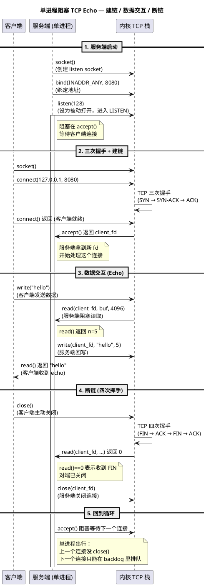

# Day 1: TCP Echo 服务从零编码 (Write Echo Server from Scratch)

> 所属阶段：阶段 1 — 从零写出 Echo 服务 | **状态：已完成**
> 更新时间：2026-08-17（新增阶段小结章节）

## 今日目标

用 C 语言从零写出一个 TCP Echo 服务端和客户端。不做任何优化，只要能跑。

> **今日三个核心要点**
>
> 1. **TCP 服务端七步拳**：`socket()` → `bind()` → `listen()` → `accept()` → `read()` → `write()` → `close()`，这是后续所有优化的骨架
> 2. **`read()` 返回量不可预测**：TCP 是字节流协议，不保留消息边界；`read()` 一次读多少取决于内核缓冲区里当前有多少，而非发送端写了多少
> 3. **正确模式是循环读取**：`while((n = read(...)) > 0)` 直到对端关闭（`n == 0` 表示收到 FIN），不要假设一次 `read()` 拿到完整"消息"

## 前置状态

- 一台腾讯云轻量应用服务器（Lighthouse），只装了 `gcc` 和 `make`
- ulimit -n = 1024（默认值，**不调**）
- 所有 TCP 内核参数 = 默认值
- 网卡单队列

## 要做什么

### 1. 服务端 `server.c`

```bash
socket() → bind() → listen() → 循环 accept() → read() → write() → close()
```

先写**单进程阻塞版**，保证逻辑正确：

```c
int listen_fd = socket(AF_INET, SOCK_STREAM, 0);
bind(listen_fd, ...);
listen(listen_fd, 128);
while (1) {
    int client_fd = accept(listen_fd, ...);
    char buf[4096];
    int n = read(client_fd, buf, sizeof(buf));
    write(client_fd, buf, n);
    close(client_fd);
}
```

### 2. 客户端 `client.c`

```bash
socket() → connect() → write() → read() → close()
```

### 3. 编译测试

```bash
make          # 编译 server 和 client
make clean    # 清理

# 终端1
make run-server

# 终端2
make run-client
# 预期输出：hello echo
```

> **代码要点**：服务端用 `while(1)` + `accept()` 串行处理每个连接，read/write 之间没有任何并发、缓冲、超时、错误重试——故意保留全部局限性，作为后续优化的"起点"。

## 服务端架构图



### 架构要点

| 组件 | 说明 |
|------|------|
| 单进程 | 只有一个进程，阻塞在 `accept()`，无法并发 |
| 阻塞 I/O | `read()`/`write()` 会阻塞等待，无超时机制 |
| 短连接 | 每次 echo 完就 `close()`，不保持连接 |
| backlog=10 | 内核允许最多 10 个等待队列中的半连接 |

> **架构要点**：当前是单进程 + 阻塞 I/O + 短连接——一个客户端占用整个进程直到 `close()`，其他客户端只能在 `backlog` 队列排队。这个架构连 10 个并发都扛不住，后续 Day 2-10 的演进目标就是逐一解开这些瓶颈。

---

## 深入原理

Day 1 涉及的四个内核主题篇幅较长（原 deep-dive.md 108KB），已拆分为 4 篇独立原理文档：

| 主题 | 链接 | 核心内容 |
|------|------|---------|
| `socket()`/`bind()`/`listen()` 内核实现 | [深入论述一](theory-syscalls.md) | 五层数据结构骨架、backlog 两个队列、端口冲突检查 |
| `sk_buff` 设计与组织 | [深入论述二](theory-sk-buff.md) | 四指针窗口、三队列链表、linear vs paged |
| MSS/MTU / Nagle / cwnd | [深入论述三](theory-mss-nagle-cwnd.md) | 分段 vs 分片、Nagle+Delayed ACK 死锁、拥塞窗口四阶段 |
| 为什么 `read()` 返回量不可预测 | [深入论述四](theory-read-semantics.md) | 协议/内核/网络/系统调用四层分析 |

> 读完实践指南后，建议按顺序通读四篇原理文档（[索引](deep-dive.md)）——它从 `task_struct` 一路讲到 `tcp_sock`，把"echo 七步拳"背后的内核机制完整展开。

---

## 阶段小结：Day 1 是整个系列的"地基"与"最差对照"

> 更新时间：2026-08-17

Day 1 的目标不是"快"，而是"先让它能跑"。单进程阻塞 Echo 虽然只能同时服务 1 个连接，但它把 TCP 服务端的完整骨架（`socket → bind → listen → accept → read → write → close`）跑通了——后续所有优化都是在替换这条链上的环节，而不是推翻它。

### 本 Day 做了什么

| 产出 | 说明 |
|------|------|
| `server.c` | 单进程阻塞服务端：`while(1)` + `accept()` 串行处理 |
| `client.c` | 客户端：`socket → connect → write → read → close` |
| 三个核心要点 | TCP 七步拳 / `read()` 返回量不可预测 / 循环读取模式 |
| 性能基线 | QPS ~1K，10 个并发都扛不住 |

> 本 Day 没有优化任何东西——代码刻意保留全部局限性（无并发、无缓冲、无超时、无重试），为后续实验提供"最差对照"。**基线价值**：Day 2 的 QPS 提升 10-23 倍、Day 3 的 P50 减半（-56%）、Day 4 拆机的 4 线程 9.6×，全部以 Day 1 的 ~1K 为分母计算——没有这个起点，后续倍数无从谈起。

### 核心结论

| 结论 | 证据 |
|------|------|
| TCP 是字节流，不保留消息边界 | `read()` 一次读多少取决于内核缓冲，而非发送端写了多少 |
| 正确读法是循环读取到 `n==0` | `n==0` 表示收到 FIN、对端关闭，是唯一可靠的消息结束信号 |
| 单进程阻塞 = 一个连接占死整个进程 | 其他客户端只能在 backlog 队列排队 |

> 三条结论对应三层认知：**协议层**（字节流无边界）、**编程层**（循环读取是唯一正确模式）、**架构层**（阻塞串行无法并发）。前两条是编码基本功，第三条直接定义了 Day 2 的改造目标——用一个事件循环替代"一人一连接占死进程"。

### 承上启下：Day 1 的局限 → 后续 Day 的解法

| Day 1 的局限 | 后续的解法 | 出现在 |
|------|------|------|
| 阻塞 read/write 占死进程 | epoll 非阻塞 I/O + 三态状态机 | [Day 2](/demos/echo/day-02/) |
| 单进程单核，无法并行 | SO_REUSEPORT 多进程 / thread-per-core 多线程 | [Day 2](/demos/echo/day-02/) / [Day 4](/demos/echo/day-04/split-experiment-v1.md) |
| 每次 echo 完就 close（短连接） | Keep-Alive 长连接复用 | [Day 3](/demos/echo/day-03/) |
| backlog 排队 = 半连接溢出风险 | 连接数扫描 + SYN 队列治理 | 阶段 2（Day 4-6）|

> **一句话总结**：Day 1 用不到百行代码讲清了"TCP 服务端是什么"，代价是它是整个系列里唯一"只能服务一个用户"的版本——但正是这个极简版本，让后续每一次优化都有了精确的对比基准（~1K QPS）。

