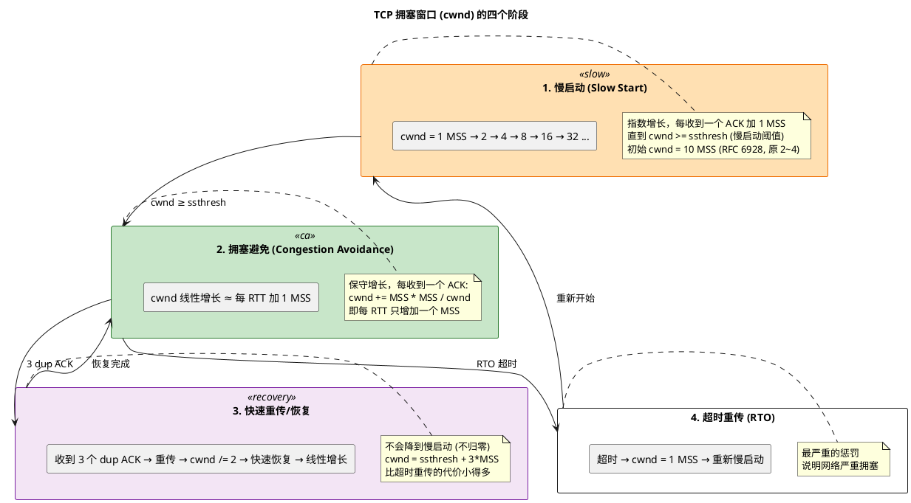

# 深入论述三（5/6）：cwnd 的四个阶段与拥塞控制算法清单

> 所属 Day：[Day 1 从零编码](/demos/echo/day-01/) · 更新时间：2026-08-21（从 theory-mss-nagle-cwnd.md 拆分，内容零丢失）
> 本系列：[深入论述三索引](/demos/echo/day-01/theory-mss-nagle-cwnd.md)
> 上一篇：[4/6 两种窗口本质区别与 rwnd 生成](/demos/echo/day-01/theory-cwnd-rwnd-details.md)
> 下一篇：[6/6 双窗口协同场景与工程速查](/demos/echo/day-01/theory-window-engineering.md)

---

## 一、cwnd 的四个阶段（慢启动 → 拥塞避免 → 快速恢复 → 超时）

前文序列图展示了 cwnd 在正常情况下的增长轨迹（慢启动阶段）。但在实际网络中，cwnd 不是只涨不跌的——它随时可能因为丢包或超时而大幅回撤。TCP 将 cwnd 的生命周期划分为四个阶段，通过阶段之间的切换来适应网络状态的变化。

下图展示了这四个阶段以及它们之间的切换边界。理解这个状态机是理解 TCP 吞吐量波动的关键——任何一次丢包都可能触发阶段跳变，cwnd 可能从几百 KB 瞬间缩到 1 MSS，吞吐量也随之跳水。



**四个阶段的切换边界**：

| 阶段 | 增长率 | 触发条件 | 退出条件 | 典型 cwnd 范围 |
|------|--------|---------|---------|-------------|
| 慢启动 | 指数：每 ACK +1 MSS | 连接建立 / RTO 超时后 | cwnd ≥ ssthresh 或丢包 | 10 MSS → ssthresh |
| 拥塞避免 | 线性：每 RTT +1 MSS | cwnd ≥ ssthresh | 丢包（3 dup ACK 或 RTO） | ssthresh → BDP |
| 快速恢复 | cwnd = ssthresh + 3 | 3 dup ACK | 该丢包的 ACK 到达 | ssthresh 附近 |
| 超时重传 | cwnd = 1 MSS | RTO 到期 | 慢启动重新开始 | 1 MSS |

**拥塞窗口里有"指数退避"吗？——没有，指数退避在 RTO 定时器上。**

这个区分很重要，因为"指数退避"和"cwnd 回退"作用在不同层面，容易混淆：

```bash
RTO = 指数退避（定时器层面）
├─ 第一次超时：RTO = 1s，重传，cwnd = 1
├─ 又超时：    RTO = 2s   ← 翻倍！
├─ 又超时：    RTO = 4s   ← 再翻倍！
├─ 又超时：    RTO = 8s
├─ ...
└─ 上限通常为 120s（Linux tcp_retries2 控制）
    → 这之所以叫"退避"，是因为连续失败时等待越来越久，给网络更多恢复时间

cwnd = 硬重置（拥塞控制层面）
├─ 无论第几次超时，cwnd 都直接归 1 MSS
├─ 不是说"第一次归 1，第二次归 0.5，第三次归 0.25..."
└─ cwnd 不做指数退避，它只做一刀切的重置
```

两个层面合在一起的效果是：连续丢包时，TCP **发得越来越少（cwnd=1）**，而且**等得越来越久（RTO 翻倍）**——双层惩罚叠加，给拥塞网络最大的恢复空间。但"指数退避"这个词严格属于 RTO 定时器行为，不属于 cwnd。

> **一句话**：拥塞窗口没有指数退避——超时后 cwnd 直接归 1，不会逐次递减。指数退避发生在 RTO 定时器上（1s→2s→4s→8s...），两者的共同作用让 TCP 在持续丢包时"发得少 + 等得久"。

## 二、主流拥塞控制算法清单与对比

前面在讲"cwnd 怎么涨、怎么跌"——但**涨跌的具体规则取决于你用的是哪个拥塞控制算法**。不同的算法对丢包、RTT 变化的反应完全不同，选错算法的后果是：相同的网络条件下，吞吐量可以差出 10 倍。

**算法分类与对比**：

| 算法 | 年代 | 类型 | cwnd 增长方式 | 丢包反应 | 适合场景 | 不适合场景 |
|------|------|------|-------------|---------|---------|-----------|
| **Reno** | 1990 | 基于丢包 | 慢启动+拥塞避免(AIMD) | cwnd /= 2 | 低丢包率网络 | 高带宽、高延迟、有损网络 |
| **New Reno** | 1996 | 基于丢包 | 同 Reno + 快速恢复改进 | cwnd /= 2（改进了部分窗口多个丢包） | 低丢包率，单个窗口少量丢包 | 同上 |
| **CUBIC** | 2008 | 基于丢包 | 三次函数增长（非 AIMD 线性） | cwnd × 0.8 | **Linux 默认**，通用场景，长肥管道比 Reno 快 | 高丢包率（>1%）性能急剧下降 |
| **Vegas** | 1994 | 基于延迟 | 通过 RTT 变化预测拥塞，提前降速 | 检测到 RTT 增大即降速 | 希望避免丢包（低延迟敏感场景） | 与丢包类算法竞争带宽时不公平 |
| **BBR** | 2016 | 基于 BDP | 周期性探测 BDP 和 RTT，不盲目涨 cwnd | 不依赖丢包信号 | **高丢包/长肥管道最优**（YouTube/Google 内部使用） | 会抢占 Reno/CUBIC 的带宽（不公平） |
| **BBRv2** | 2019 | 基于 BDP+丢包 | 同 BBR + 丢包作为辅助信号 | 丢包时也减速（比 BBR v1 更公平） | BBR 场景 + 需要与丢包类算法共存 | 实现较新，旧内核不支持 |

**算法的核心分歧——用什么信号判断拥塞？**

```bash
基于丢包（Loss-based）：Reno, New Reno, CUBIC
├─ 逻辑："丢包 = 拥塞"
├─ 行为：一直加速直到丢包，丢包后再减速
├─ 问题：在有损链路（WiFi/移动网络）上，随机丢包被误判为拥塞
│        → 明明网络不堵，但因为丢包率1%，cwnd被反复砍半
└─ 本质：需要"先撞墙"才知道墙在哪

基于延迟/带宽（Delay/BW-based）：Vegas, BBR
├─ 逻辑："RTT 增大 = 缓冲区开始堆积 = 即将拥塞"
├─ 行为：在丢包发生之前就检测到拥塞信号，主动降速
├─ 优势：不需要用丢包来"试探"网络容量
└─ 问题：与丢包类算法共存时，主动让出带宽 → 被 CUBIC 挤占
```

> **一句话选型**：内网低丢包 → CUBIC 就行；跨公网/丢包率 >0.5% → BBR；WiFi/移动网络 → BBR 优势巨大。

**应用层如何控制和选择？**

拥塞控制算法有**三层控制粒度**，从粗到细：

```bash
第一层：系统级默认算法（重启后仍生效）
# 查看当前默认算法
$ sysctl net.ipv4.tcp_congestion_control
net.ipv4.tcp_congestion_control = cubic

# 查看内核支持哪些算法
$ sysctl net.ipv4.tcp_available_congestion_control
net.ipv4.tcp_available_congestion_control = reno cubic bbr

# 修改系统默认
# sysctl -w net.ipv4.tcp_congestion_control=bbr

# 如果没有 bbr，先加载模块
# modprobe tcp_bbr

第二层：per-socket 设置（应用层代码控制，最灵活）
int fd = socket(AF_INET, SOCK_STREAM, 0);

// 在 connect() 之前或之后都可以设置
const char *algo = "bbr";
socklen_t len = strlen(algo);
setsockopt(fd, IPPROTO_TCP, TCP_CONGESTION, algo, len);

// 读取当前连接使用的算法
char current[16];
socklen_t optlen = sizeof(current);
getsockopt(fd, IPPROTO_TCP, TCP_CONGESTION, current, &optlen);
printf("current cc: %s\n", current);  // "bbr"

第三层：不同的连接用不同的算法
// 举例：一个服务同时维护两种连接
// - 文件下载连接 → BBR（大块传输，需要带宽）
// - 实时控制连接 → CDG 或 Vegas（延迟敏感，避免排队）
// 每个 accept() 得到的 fd 可以独立 setsockopt
```

> **工程实践要点**：
>
> 1. `TCP_CONGESTION` 可以在连接建立后、数据传输过程中动态切换——内核会平滑过渡 cwnd。但不要在每次 `read()`/`write()` 之后都切，切换本身有一定开销。
> 2. 用 `ss -ti` 确认当前连接的算法和 cwnd 值：`ss -ti | grep -E 'cubic|bbr|cwnd'`
> 3. BBR 需要内核 ≥ 4.9，BBRv2 需要内核 ≥ 5.x。容器环境中注意宿主机内核版本。
> 4. 混合部署 CUBIC 和 BBR 时，BBR 可能会抢占 CUBIC 的带宽——如果公平性重要，统一算法或都上 BBRv2。

> **一句话总结**：cwnd 生命周期有四个阶段（慢启动指数增长 → 拥塞避免线性增长 → 快速恢复砍半 → 超时归 1 重来），阶段切换由丢包/超时触发；而"涨跌规则"由拥塞控制算法决定——丢包类（CUBIC/Reno）用"撞墙"探测容量，延迟/BDP 类（BBR/Vegas）在丢包前就降速，选择上"内网 CUBIC、公网有损 BBR"。
