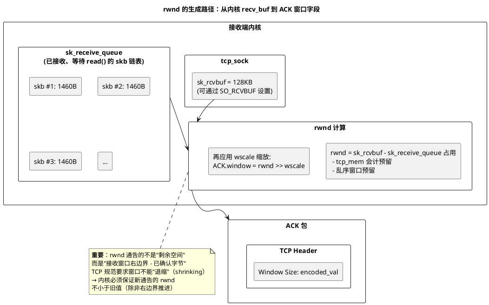

# 深入论述三（4/6）：两种窗口的本质区别与 rwnd 生成机制

> 所属 Day：[Day 1 从零编码](/demos/echo/day-01/) · 更新时间：2026-08-21（从 theory-mss-nagle-cwnd.md 拆分，内容零丢失）
> 本系列：[深入论述三索引](/demos/echo/day-01/theory-mss-nagle-cwnd.md)
> 上一篇：[3/6 双窗口递进序列图](/demos/echo/day-01/theory-cwnd-rwnd-sequences.md)
> 下一篇：[5/6 cwnd 四阶段与拥塞控制算法](/demos/echo/day-01/theory-congestion-control.md)

---

## 一、两种窗口的本质区别

cwnd 和 rwnd 虽然都叫"窗口"，但创建者、控制逻辑、和目的完全不同：

| 维度 | cwnd（拥塞窗口） | rwnd（接收窗口） |
|------|-----------------|-----------------|
| **谁维护** | 发送端（内部变量，不对端不可见） | 接收端（通过 ACK 的 Window 字段告知对端） |
| **目的** | 防止发送端注入过多数据 → 网络拥塞 | 防止接收端缓冲区溢出 → 数据丢失 |
| **初始值** | 10 MSS (RFC 6928) | 接收缓冲区大小（受 `sk_rcvbuf` 控制） |
| **变化触发** | 收到 ACK（增长） / 丢包（缩减） | 缓冲区空间变化（数据到达减少，`read()` 释放增加） |
| **增长方式** | 慢启动：指数；拥塞避免：线性 | 随 `read()` 释放空间即时恢复 |
| **缩减方式** | 丢包 → cwnd /= 2（超时 → cwnd = 1） | 数据到达 → rwnd 减少（等 `read()` 释放再恢复） |
| **最坏情况** | cwnd = 1 MSS（超时重传后重新开始） | rwnd = 0（零窗口，发送端完全停止） |
| **对端可见？** | 否（发送端私有） | 是（每个 ACK 都携带） |
| **内核参数** | `tcp_init_cwnd`, `tcp_congestion_control` | `net.core.rmem_default/max`, `net.ipv4.tcp_rmem` |

> **关键区别**：cwnd 是发送端**单方面**做的"自律"——它在没有外部指令的情况下，自己决定"我不发那么快，怕网络受不了"。rwnd 是接收端**主动通告**的"指令"——"我这里只有这么多空位了，你别发了"。两者合在一起：发送端自己能发多少自己说了算（cwnd），但对面说停就得停（rwnd）。

## 二、rwnd 的生成机制：从内核缓冲区到 ACK 窗口字段

rwnd 不是凭空出现的数字，它来源于接收端内核中 `tcp_sock` 维护的接收缓冲区：



**rwnd 的三个决定因素**：

| 因素 | 内核参数 | 说明 |
|------|---------|------|
| 总缓冲区大小 | `net.ipv4.tcp_rmem[2]`（default 默认值，max 最大值），`SO_RCVBUF`（per-socket） | 决定了 rwnd 的上限 |
| 已占用空间 | `sk_receive_queue` 中所有 skb 的 `truesize` 总和 | 已到达但未被 `read()` 取走的数据 |
| 窗口缩放因子 | 三次握手协商的 `wscale`（0~14） | rwnd_actual = ACK.window × 2^wscale |

**rwnd 的动态变化节奏**：

```bash
数据到达 → recv_buf 占用增加 → rwnd 减小
                              ↑ 通告给发送端（下一个 ACK）
应用 read() → recv_buf 释放 → rwnd 增大
                              ↑ 通告给发送端（窗口更新）
```

**零窗口（rwnd=0）的处理**：当接收缓冲区满时，接收端通告 rwnd=0。发送端进入"零窗口探针"模式——每隔一段时间发一个 1 字节的探测段（window probe），检查接收端是否恢复了空间。这个机制防止了"接收端 read() 后通告了窗口更新但该 ACK 丢包 → 死锁"的情况。

> **一句话总结**：cwnd 是发送端防网络拥塞的"自律"（对端不可见、丢包砍半、超时归 1），rwnd 是接收端防缓冲区溢出的"通告"（每个 ACK 携带、随 read() 释放恢复、满了归零）；rwnd 实际值 = `tcp_rmem` 上限 − 接收队列占用 − 预留给开销，再经 wscale 缩放后写入 ACK。
