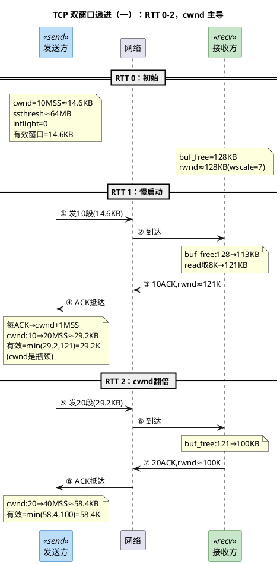
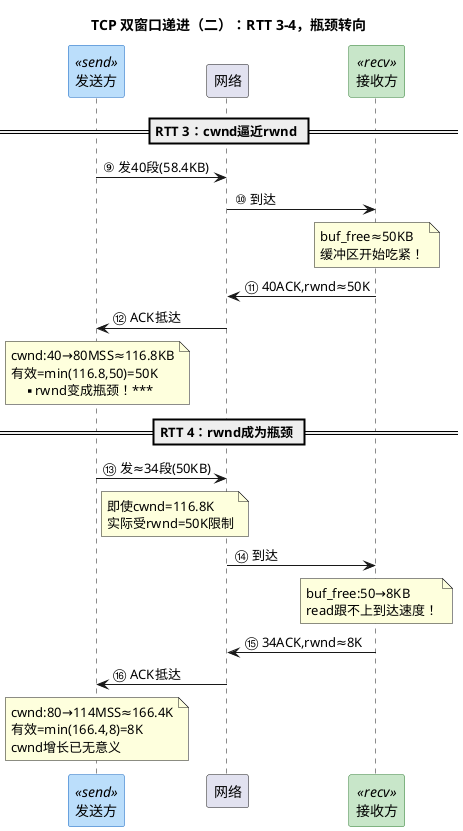
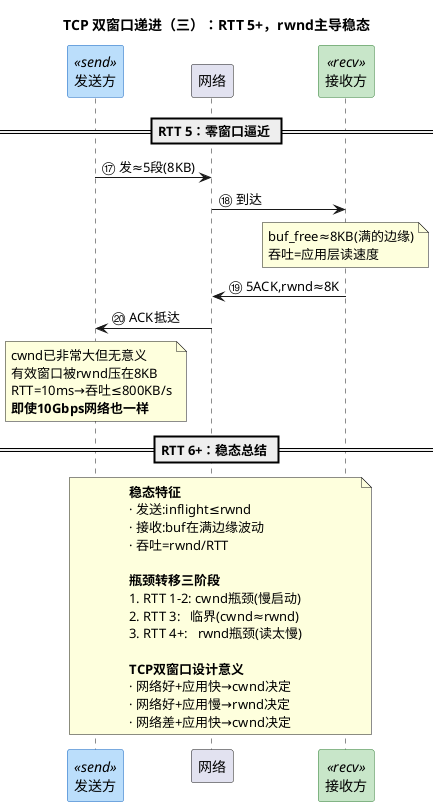

# 深入论述三（3/6）：双窗口递进序列图 —— cwnd 与 rwnd 的多轮协同

> 所属 Day：[Day 1 从零编码](/demos/echo/day-01/) · 更新时间：2026-08-21（从 theory-mss-nagle-cwnd.md 拆分，内容零丢失）
> 本系列：[深入论述三索引](/demos/echo/day-01/theory-mss-nagle-cwnd.md)
> 上一篇：[2/6 Nagle 算法](/demos/echo/day-01/theory-nagle.md)
> 下一篇：[4/6 两种窗口本质区别与 rwnd 生成](/demos/echo/day-01/theory-cwnd-rwnd-details.md)

---

下面这个序列图是本节最重要的一张图。它从冷启动（TCP 连接刚建立）开始，跟踪**六轮 RTT** 中发送端的 cwnd 增长、接收端 rwnd 的通告变化，以及两者如何共同决定"每轮实际能发多少数据"。

**假设条件**：RTT=10ms，MSS=1460 字节，初始 cwnd=10 MSS（RFC 6928），接收缓冲区=128KB，窗口缩放因子 wscale=7（即窗口值需左移 7 位），应用层每 RTT 调用一次 `read(fd, buf, 8192)`。

## 图一：RTT 0-2，cwnd 主导



**图一解读——cwnd 主导阶段（RTT 0-2）**：

这是连接建立后的前两轮往返周期。阅读时关注三个关键变化：

1. **发送端的 cwnd 指数增长**：每收到一个 ACK，cwnd+1 MSS。RTT 1 结束后 cwnd 从 10→20 MSS，RTT 2 结束后 20→40 MSS。这是慢启动的经典行为——窗口每个 RTT 翻倍。
2. **接收端 rwnd 缓缓下降**：每轮到达的数据（14.6KB → 29.2KB）开始蚕食 128KB 的接收缓冲区，虽然 `read()` 每轮取走 8KB，但到达速度更快→缓冲区净减少。
3. **cwnd 是瓶颈**：此时 `min(cwnd, rwnd)` 的结果是 cwnd。接收端说"我可以收 121KB"，但发送端因为慢启动的限制只敢发 14.6KB→29.2KB。**发送端的保守发送恰恰让接收端很从容。**

> **关键认知**：RTT 1-2 里 cwnd 远小于 rwnd 是正常状态——TCP 设计上就是让连接的初始阶段由发送端的"自律"来控制节奏。这个阶段吞吐量增长飞快（翻倍），但没有超过接收端的处理能力。

**一个经典误解——"慢启动"到底慢在哪里？**

指数增长，每轮 RTT 翻倍——这看起来一点也不慢，为什么叫"慢启动"？这个问题困惑了很多开发者，答案需要从两个层次理解：

**层次一：慢的不是增长率，是起点。**

```bash
对比：如果 TCP 一上来就"敞开发"
├─ 假设：BDP = 10MB（带宽 1Gbps × RTT 80ms）
├─ 如果 TCP 没有慢启动，连接一建立就发 10MB
│  └─ 路由器缓冲区瞬间爆满 → 大量丢包 → 全局 TCP 同步震荡
│
├─ 有了慢启动：
│  RTT 0:  cwnd = 10 MSS = 14.6KB    ← 起点极小
│  RTT 1:  cwnd = 20 MSS = 29.2KB
│  RTT 2:  cwnd = 40 MSS = 58.4KB
│  RTT 3:  cwnd = 80 MSS = 116.8KB
│  ...
│  要经过 log₂(BDP/init_cwnd) = log₂(10MB/14.6KB) ≈ 9.5 个 RTT 才能填满管道
│  └─ 从"一根头发丝"开始，逐轮翻倍，这叫"慢"
```

"慢"是相对于**管道容量**而言的：TCP 花了好几轮 RTT 才把 cwnd 从一根头发丝涨到能填满管道。对于小文件传输（HTTP 请求只需要 1-2 个 RTT 就传完了），慢启动可能整个传输过程中 cwnd 都没涨到 BDP——这就是为什么短连接的吞吐量利用率远低于长连接。

**层次二：不慢的话，互联网早就崩了。**

1986 年，Van Jacobson 观察到互联网第一次"拥塞崩溃"（congestion collapse）：吞吐量从 32Kbps 跌到 40bps，下降了 1000 倍。原因是 TCP 没有拥塞控制——连接一建立就全力发，路由器丢包后重传、再丢包再重传，网络被重传流量填满，有效数据几乎为零。

慢启动（Slow Start, 1988）就是为了解决这个问题：**连接刚建立时，发送端不知道网络容量是多少**，所以从最小值开始探测，指数增长快速逼近真实容量。注意 Jacobson 的命名逻辑——"slow"是相对于之前的"一股脑全发"而言的，而不是说算法增长慢。实际上指数增长是 TCP 能找到的最快探测方式了。

> **一句话**：慢启动的"慢"是相对于 BDP 管道的绝对容量而言的——从 14.6KB 起步，每个 RTT 翻倍，要翻 10 轮才能填满 10MB 的管道。但对于刚建立的连接而言，这是在不炸掉网络的前提下**最快的**容量探测方式。没有慢启动，1986 年的互联网崩溃就是代价。

## 图二：RTT 3-4，瓶颈转向



**图二解读——临界点与瓶颈转移（RTT 3-4）**：

这两轮是整个故事的转折点，注意两个质变：

1. **RTT 3：cwnd 历史上第一次超过了 rwnd**。cwnd 翻到 80 MSS（116.8KB），但接收端通告的 rwnd 只有 50KB。`min(116.8, 50)` = 50KB——**发送端第一次不是因为自己"不敢发"，而是因为接收端说"只能收这么多"**。这个瞬间标志着控制权从发送端向接收端转移。
2. **RTT 4：rwnd 崩溃式缩小**。RTT 3 只发了 50KB，RTT 4 中接收端缓冲区从 50KB 跌到 8KB。原因很简单——`read()` 每轮只取 8KB，但每轮到达 50KB+。净流失 42KB/轮。接收端已经撑不住了，通告 rwnd=8KB。
3. **cwnd 的尴尬**：RTT 4 结束后 cwnd=114 MSS（166.4KB）——很漂亮，但毫无意义。实际能发的只有 `min(166.4, 8)` = 8KB。cwnd 的数字正在变成摆设。

> **关键认知**：从 RTT 3 开始，问题已经不是"网络能不能承载更多数据"，而是"接收端能不能消化它已有的数据"。这是 Day 1 单进程 Echo 的核心瓶颈——一个 `read()` 卡住，所有数据堵在接收缓冲区里，rwnd 归零，发送端停摆。

## 图三：RTT 5+，rwnd 主导稳态



**序列图核心要点**：

| RTT | cwnd (KB) | rwnd 通告 (KB) | 有效窗口 (KB) | 瓶颈在谁？ | 关键事件 |
|:---:|:---:|:---:|:---:|:---:|------|
| 1 | 14.6 → 29.2 | 121 | 29.2 | cwnd | 慢启动，窗口翻倍 |
| 2 | 29.2 → 58.4 | 100 | 58.4 | cwnd | 慢启动继续 |
| 3 | 58.4 → 116.8 | 50 | 50 | **rwnd 开始成为瓶颈** | **临界点！** cwnd > rwnd |
| 4 | 116.8 → 166.4 | 8 | 8 | rwnd | rwnd 严重不足 |
| 5 | 166.4+ | 8 | 8 | rwnd（锁定） | 吞吐被应用层读速度锁死 |
| 6+ | 持续增长 | ~8 | ~8 | rwnd | 稳态：rwnd / RTT |

> **核心洞察**：前两轮 RTT 中，cwnd 决定了吞吐量（慢启动阶段，窗口尚小）。但从 RTT 3 开始，rwnd 反超成为瓶颈——不是因为网络拥塞，而是因为**应用层 `read()` 速度跟不上数据到达的速度**。TCP 的双窗口模型保证了一条腿断了另一条腿还能撑住——但撑住的上限由那条更短的腿决定。

> **一句话总结**：六轮 RTT 讲完 TCP 双窗口的"权力交接"——慢启动阶段 cwnd 翻倍增长成为瓶颈，RTT 3 起 cwnd 超过 rwnd，控制权交给接收端；应用层 `read()` 慢是 rwnd 崩溃的根本原因，稳态吞吐 = rwnd / RTT，网络带宽再高也没用。
