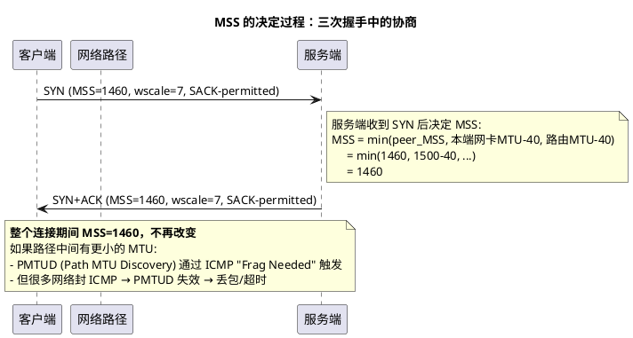

# 深入论述三（1/6）：MSS 与 MTU —— 为什么"不要自己拼大包"

> 所属 Day：[Day 1 从零编码](/demos/echo/day-01/) · 更新时间：2026-08-21（从 theory-mss-nagle-cwnd.md 拆分，内容零丢失）
> 本系列：[深入论述三索引](/demos/echo/day-01/theory-mss-nagle-cwnd.md)
> 上一篇：[深入论述三：MSS/MTU、Nagle、cwnd（索引）](/demos/echo/day-01/theory-mss-nagle-cwnd.md)
> 下一篇：[2/6 Nagle 算法](/demos/echo/day-01/theory-nagle.md)

---

MSS 决定了 TCP 单段能装多少有效载荷，MTU 决定了 IP 层单帧能承载多少字节。两者之间差了一个固定开销（IP 头 20 + TCP 头 20 = 40 字节）。MSS 在三次握手中协商确定，**一旦确定，整个连接期间不再改变**——这意味着如果路径中间存在 MTU 更小的链路，就需要 PMTUD 来自动发现，否则会产生 IP 分片。

下面这张时序图展示了 MSS 如何在 SYN/SYN+ACK 中完成协商：

**MSS 的六个决定因素**：

| 序号 | 因素 | 说明 |
|:---:|------|------|
| 1 | 对端通告的 MSS | 三次握手中 SYN 包的 MSS 选项 |
| 2 | 本端网卡 MTU | `MTU - 40`（IP 头 20 + TCP 头 20） |
| 3 | 路径 MTU (PMTU) | PMTUD 发现的最小中间链路 MTU |
| 4 | `net.ipv4.tcp_base_mss` | 内核的默认值，当没有 MSS 选项时使用（通常 512） |
| 5 | `advmss`（路由表） | `ip route` 可设置每条路由的 MSS 上限 |
| 6 | TCP 选项占用 | 时间戳选项（12 字节）、SACK 选项等会挤占有效载荷 |

**为什么 MSS 很重要？——分片的代价**

| 分片情况 | 发生位置 | 对端收到 | 代价 |
|---------|---------|---------|------|
| IP 分片 | IP 层 | 两个 IP fragment（需重组） | **丢任意一片 = 整个包重传** |
| TCP 分段 | TCP 层 | 两个独立 TCP 段 | 丢了只重传丢的那个 |

> **核心原则**：永远让 TCP 自己去分段（基于 MSS），不要让 IP 层做分片。IP 分片没有重传机制——丢一片整个 IP 包作废。

> **一句话总结**：MSS 由三次握手协商并在连接期间固定不变（默认 1460 = 1500 MTU − 40），MSS 的意义在于让 TCP 在层内分段而非让 IP 层分片——IP 分片丢一片整个包作废，TCP 分段丢一段只重传该段。
