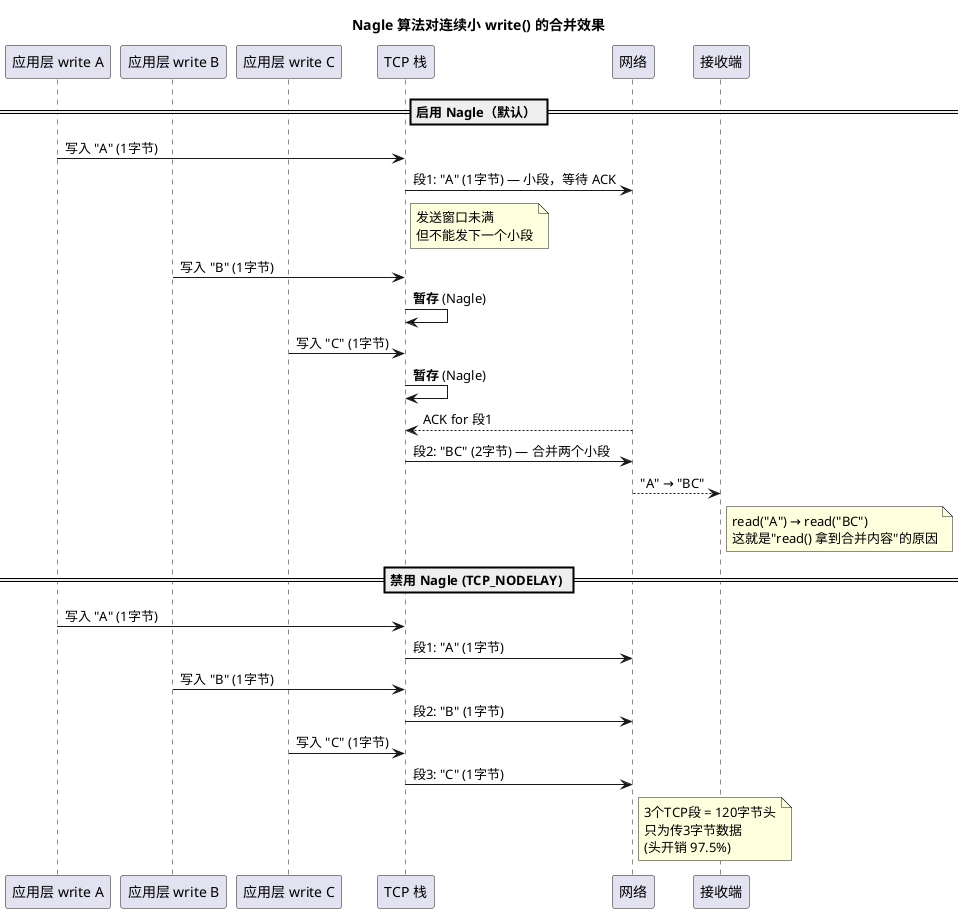

# 深入论述三（2/6）：Nagle 算法 —— 减少小包但引入延迟

> 所属 Day：[Day 1 从零编码](/demos/echo/day-01/) · 更新时间：2026-08-21（从 theory-mss-nagle-cwnd.md 拆分，内容零丢失）
> 本系列：[深入论述三索引](/demos/echo/day-01/theory-mss-nagle-cwnd.md)
> 上一篇：[1/6 MSS 与 MTU](/demos/echo/day-01/theory-mss-mtu.md)
> 下一篇：[3/6 双窗口递进序列图](/demos/echo/day-01/theory-cwnd-rwnd-sequences.md)

---

**算法定义**（RFC 896，John Nagle 1984）：

```bash
在一条 TCP 连接上，任何时刻最多只能有一个未确认的小段（< MSS）。
如果这个小段还没有被确认，就不能发下一个。
```

下面这张序列图对比了**启用 Nagle**（默认）和**禁用 Nagle**（`TCP_NODELAY`）两种情况下，连续三次 1 字节 `write()` 的发送效果——注意合并行为如何影响接收端 `read()` 拿到的内容：



**Nagle 的适用性判断**：

| 场景 | Nagle 是否合适 | 原因 |
|------|:---:|------|
| 大块数据传输（文件下载） | ✅ 保持开启 | 数据块接近 MSS，Nagle 几乎不触发 |
| 交互式 SSH/Telnet | ❌ 通常关掉 | 每次按键 1 字节，Nagle 引入 40ms 延迟（等 ACK） |
| HTTP 请求-响应 | ✅ 通常 OK | 写完整个请求后等响应，不连续写 |
| WebSocket / 游戏协议 | ❌ 关掉 | 频繁小消息，Nagle 延迟不可接受 |
| **当前 Day 1 Echo** | ⚠️ 影响不大 | 一次 read + 一次 write，不等 ACK 就 close() |

> **Nagle 与 Delayed ACK 的灾难性交互**：Delayed ACK（延迟 40ms 等数据合并 ACK） + Nagle（等 ACK 才能发下一个小段）= 死锁等待 40ms。这是为什么很多低延迟应用同时设置 `TCP_NODELAY` + `TCP_QUICKACK`。

> **一句话总结**：Nagle 把"未确认小段"合并成一个大段发送，用最多一个 RTT 的等待换 97.5% 的头部开销节省；它适合大块传输，但对交互式小消息（SSH/WebSocket/游戏）是灾难，且与 Delayed ACK 叠加会产生 40ms 死锁等待。
