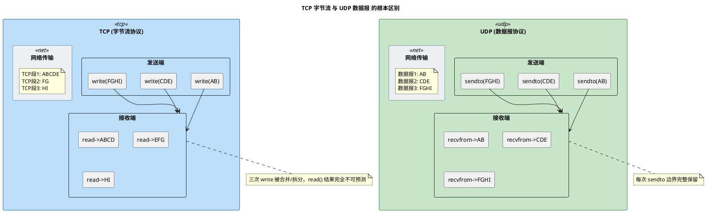
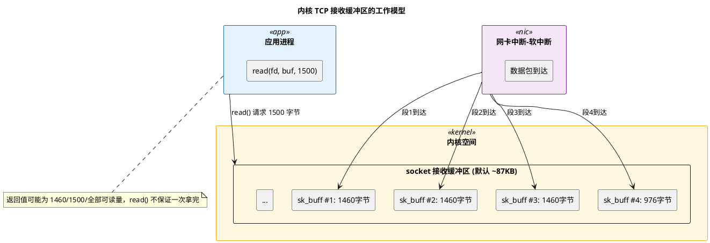
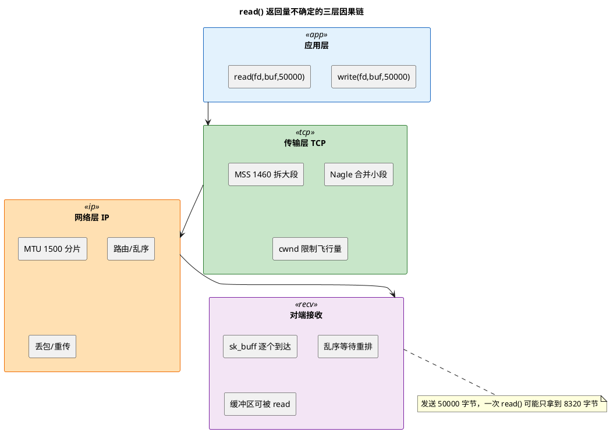

# 深入论述四：为什么 read() 返回量不可预测

> 所属 Day：[Day 1 从零编码](/demos/echo/day-01/) · 更新时间：2026-08-20（重构：从原 deep-dive.md 108KB 拆分为 4 篇独立原理文档，本文内容零丢失）

> 上一篇：[6/6 双窗口协同场景与工程速查](/demos/echo/day-01/theory-window-engineering.md)
> 下一篇：无（读完 4 篇后回到 [deep-dive 要点总结](/demos/echo/day-01/deep-dive.md)）

---

## 一、协议设计层面的根本原因

TCP 被设计为**字节流（Byte Stream）**协议，这个"流"字是理解一切的关键。

### 1. TCP 字节流 vs UDP 数据报



核心结论：**TCP 没有"消息"的概念**。无论应用层调用多少次 `write()`，TCP 只看到一条连续的字节流。接收端调用的 `read()` 从这条流里取数据，**取多少取决于当前缓冲区里有多少**，而非发送端当初"装了多少个包裹"。

### 2. OSI 模型视角

| 协议层 | TCP 做的事 | 对 read() 的影响 |
|--------|-----------|-----------------|
| 应用层（L7） | 调用 `write(fd, buf, 8192)` | 一次写入 8192 字节 |
| 传输层（L4/TCP） | 将字节流拆分成 TCP 段（每段 ≤ MSS），加 TCP 头 | 8192 → 约 6 个 TCP 段 |
| 网络层（L3/IP） | 每个 TCP 段再拆分为 IP 分片（≤ MTU） | 可能进一步拆分 |
| 链路层（L2） | 封装为以太网帧，逐个发送 | 逐个帧到达对端网卡 |

**TCP 向应用层承诺的是"字节的可靠有序交付"，而不是"消息的可靠有序交付"。** 消息边界是应用层协议（如 HTTP 的 `\r\n`、自定义长度头）自己维护的事情。

> **协议层要点**：TCP 是字节流，不是消息队列。发送端调了多少次 `write()`、每次写了多少字节，接收端的 `read()` 完全感知不到——它只从连续的字节流里取当前可读的部分。UDP 则是数据报模型，每次 `sendto()` 对应一个完整数据报，接收端一次 `recvfrom()` 拿一个完整包。

## 二、内核实现层面的原因

### 1. 套接字接收缓冲区（sk_buff 链表）



Linux 内核中，TCP 接收到的数据以 `sk_buff`（Socket Buffer）结构组织成链表。每个 `sk_buff` 通常携带一个 TCP 段的有效载荷（Payload），大小受 MSS（Maximum Segment Size，最大段大小）限制，典型值为 1460 字节（以太网 MTU 1500 - IP 头 20 - TCP 头 20）。

当应用调用 `read(fd, buf, 1500)` 时：

1. 内核遍历 sk_buff 链表，从链表头开始拷贝数据到用户缓冲区
2. 内核**不会等待所有数据到达后才返回**——有数据就立刻返回
3. 返回值是**实际拷贝的字节数**，可能 ≤ 请求的字节数

**这就是"有时比发送的少"的最初起点——应用层的 `read()` 和内核的 sk_buff 粒度之间天然存在不匹配。**

### 2. 为什么内核不等数据齐了再返回？

如果内核等所有数据到齐，会引入两个严重问题：

- **延迟不可控**：如果发送端只发了 100 字节然后停止了（去处理别的事情），接收端将永远阻塞在 `read()` 上
- **与 TCP 流模型矛盾**：TCP 本身就没有"完整消息"的定义，内核无从判断"数据是否到齐"

因此 POSIX 标准规定 `read()` 的行为是：**尽可能多地返回当前可读的数据，但允许少于请求量**。

> **内核层要点**：数据以 `sk_buff` 为单位逐个到达内核缓冲区，`read()` 从缓冲区链表头拷贝数据，有就返回，不等。内核没法判断"消息有没有到齐"——TCP 本身就没有消息的概念。POSIX 标准明确允许 `read()` 返回少于请求量。

## 三、网络传输层面的因素

> 本节侧重说明这些因素对 `read()` 返回值的影响。MSS/MTU、Nagle、cwnd 的完整内核实现详见 → [深入论述三：MSS/MTU、Nagle 算法、cwnd 拥塞窗口](#深入论述三mssmtunagle-算法cwnd-拥塞窗口)。

### 1. MSS/MTU 分段

TCP 段的最大大小由 MSS 限制，而 MSS 又受制于路径 MTU（Maximum Transmission Unit，最大传输单元）。以太网默认 MTU = 1500 字节：

```bash
MTU 1500 = IP头(20) + TCP头(20) + TCP Payload(1460)
                                 ↑ 这就是 MSS
```

如果用户调用 `write(fd, buf, 8192)`，TCP 协议栈会：
1. 将 8192 字节拆分成多个 TCP 段（每段 ≤ 1460 字节）
2. 逐个段发出
3. 接收端可能在不同时间收到这些段

接收端一次 `read()` 可能刚好跨在某个段边界上。

### 2. Nagle 算法（合并发送）

Nagle 算法的核心逻辑是：**在一个 TCP 连接上，最多只能有一个未被确认的小段**（小于 MSS 的段）。

如果发送端连续、快速地调用多次小 `write()`：
1. 第一次 `write("AB", 2)` → TCP 发出段（只有这个段未被确认）
2. 第二次 `write("CD", 2)` → TCP **暂存不发送**，等待第一次的 ACK 或缓冲区凑满 MSS
3. 第三次 `write("EF", 2)` → 继续暂存
4. 第一次的 ACK 到达 → 内核将暂存的 "CDEF" 合并为一个段发出

接收端一次 `read()` 就收到了 "AB"+"CDEF" 的混合内容。

> **Nagle 是粘包的核心原因吗？——不是。**
>
> Nagle 确实会在**发送端**把小写合并成一个段——这是粘包的一种形式（发送端主动合并）。但即使关掉 Nagle（`TCP_NODELAY`），粘包照样发生：
>
> ```
> TCP_NODELAY 开启、Nagle 关闭的情况：
> 发送端: write("AB") → 立即发出段1 (seq=1, len=2)
> 发送端: write("CD") → 立即发出段2 (seq=3, len=2)
>
> 接收端: 段1 和段2 几乎同时到达 sk_receive_queue
> 接收端: read(fd, buf, 4096) → 返回 "ABCD"
>          ↑ 照样粘包！Nagle 明明是关着的
> ```
>
> **粘包的根源只有一个：TCP 是字节流，不保留消息边界。** Nagle、MSS 分段、cwnd 限制、RTT 波动——这些只是影响"数据以什么形态到达接收端"的因素，增加或减少了粘包的概率，但不是根因。根因是 TCP 协议本身就没有"这条消息到此结束"的概念。只要 `read()` 时接收队列里有数据，它就会全取出来——不管这些数据是发送端写了 1 次还是 10 次。
>
> 解决粘包的唯一正确方式：**在应用层自己维护消息边界**（长度前缀、分隔符、定长消息等），不要指望 TCP 替你分包。

### 3. TCP 拥塞控制窗口（cwnd）

如果发送端有大量数据要发送（如 1MB 文件），但网络拥塞导致 cwnd = 10 × MSS：

- 发送端只能发出 10 个段（约 14.6KB），然后等待 ACK
- 接收端第一次 `read()` 只拿到 14.6KB，而实际还有 985KB 在路上

**拥塞控制让数据不是一次性全部到达，进一步加剧了 read() 返回量的不确定性。**

### 4. 三层因素的叠加效应



> **网络层要点**：MSS/MTU 把大数据拆开，Nagle 把小数据合并，cwnd 限制飞行量——三层叠加，接收端 `read()` 拿到多少 = 这些因素的综合结果。不是某个参数调了就能"一次拿到全部"。

## 四、read() 系统调用的语义

### 1. 与 recv() 的返回值对比

| 系统调用 | 协议 | 边界语义 |
|---------|------|---------|
| `read()` / `recv()` | TCP (SOCK_STREAM) | 无边界，返回当前可读的数据 |
| `recvfrom()` / `recvmsg()` | UDP (SOCK_DGRAM) | **保留边界**，一次接收一个完整数据报 |
| `read()` on pipe | 管道 | 无边界，但受 PIPE_BUF 原子写入限制 |

UDP 之所以能保持边界，是因为每个 UDP 数据报在内核中是一个独立的 `sk_buff`，`recvfrom()` 一次只取一个。

### 2. read() 返回 0 的特殊含义

```bash
read() > 0  → 读到了 N 字节数据
read() = 0  → 对端已关闭连接（FIN），不是"没数据"
read() < 0  → 错误（EAGAIN/EINTR/ECONNRESET 等）
```

**read() 返回 0 是 TCP 连接关闭的唯一信号，不是"本次没数据读"。** 这就是为什么循环终止条件是 `n <= 0`。

> **系统调用要点**：`read() > 0` 是数据，`read() == 0` 是对端关了（FIN），`read() < 0` 是错误。不要混淆"返回 0"和"没数据"——TCP 中没数据会阻塞等，不会返回 0。对应的 `write()` 也有同样的"不保证一次写完"特性。

## 五、对本项目的工程影响

### 1. 正确的处理模式

```c
/* 模式一：循环读取直到对端关闭（当前 echo server 使用） */
while ((n = read(conn_fd, buf, sizeof(buf))) > 0) {
    write(conn_fd, buf, n);
}

/* 模式二：读固定长度的消息（应用层协议需要） */
size_t read_exact(int fd, void *buf, size_t len) {
    size_t total = 0;
    while (total < len) {
        ssize_t n = read(fd, (char*)buf + total, len - total);
        if (n <= 0) return total;  // 连接关闭或出错
        total += n;
    }
    return total;
}
```

当前 echo server 用模式一就够了——因为我们不关心消息边界，只是原样返回所有收到的字节，直到客户端关闭。

### 2. 反面案例：假设一次读完整条"消息"会怎样？

```c
/* 错误的写法——假设一次 read 就能拿完整条消息 */
char buf[4096];
int n = read(fd, buf, sizeof(buf));     // 假设拿到完整的 HTTP 请求
char *method = strtok(buf, " ");         // 解析 GET
char *path   = strtok(NULL, " ");        // 解析 /index.html
// ↑ 如果 read() 只拿到了 "GET /ind"，path 就是 "ex.html" —— 完全错误！
```

这就是著名的 **TCP 粘包/拆包** 问题的根源——**根因是 TCP 字节流无消息边界**，Nagle / MSS 分段 / cwnd / RTT 只是放大器，不是根因。在本项目 Day 29（流式分包 Echo）中将专门处理这个问题。

### 3. 另一个坑：write() 也并不保证一次写完

和 read() 对称，write() 的返回值也可能小于请求写入的字节数。只不过对于小数据量 + 本地测试通常不触发，等后面压测加负载后才容易观察到。

> **工程要点**：当前 echo 只需循环读写即可。但一旦需要解析消息（如 Day 29 流式分包），就必须用 `read_exact()` 模式自己维护消息边界。记住反面案例：一次 `read()` 就拿到的假设是 TCP 粘包/拆包 bugs 的万恶之源。

## 六、小结

| 层次 | 原因 | 影响 |
|------|------|------|
| 协议设计 | TCP 是字节流，不保留消息边界 | `read()` 返回值与 `write()` 大小无关 |
| 内核实现 | sk_buff 链表粒度、缓冲区水线 | `read()` 取到的是缓冲区当前可读量 |
| 网络传输 | MSS/MTU 分段、Nagle 合并、cwnd 限制 | 数据分批到达，进一步增加不确定性 |
| 系统调用 | POSIX 语义允许返回少于请求量 | 应用层必须循环读取 |

> **一句话总结**：TCP 的"流"模型从根本上决定了 `read()` 返回量不可预测——它不是缺陷，而是协议特征。正确的做法是循环读取直到对端关闭（当前 echo server），或设计应用层协议自己维护消息边界（Day 29 的流式 echo）。

---
