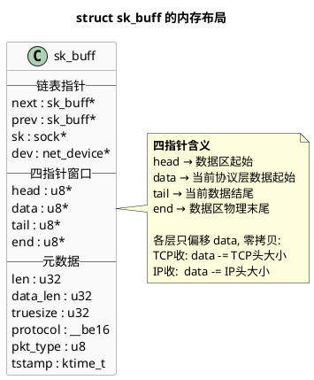
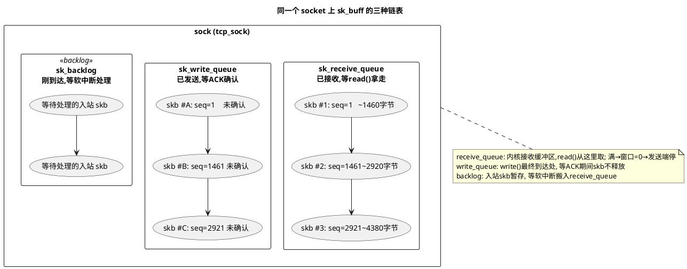
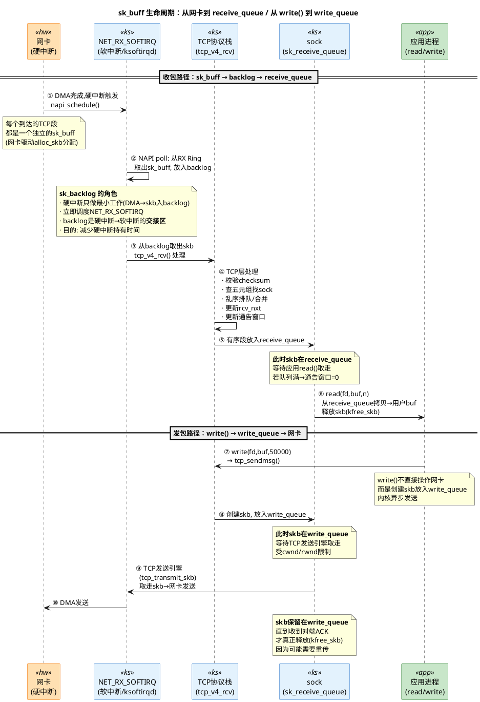
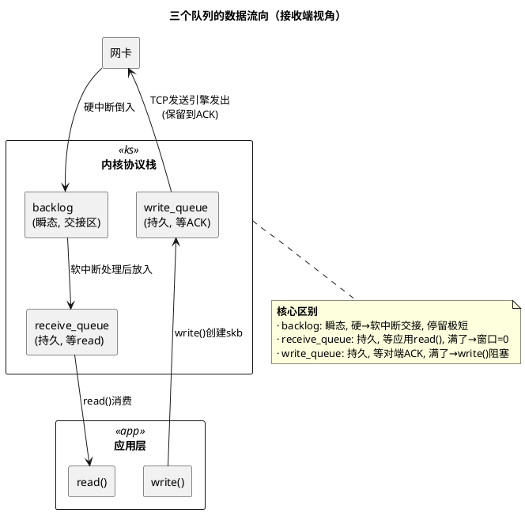
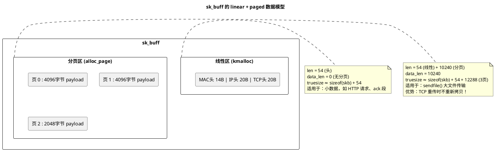

# 深入论述二：sk_buff 的设计与组织

> 所属 Day：[Day 1 从零编码](/demos/echo/day-01/) · 更新时间：2026-08-20（重构：从原 deep-dive.md 108KB 拆分为 4 篇独立原理文档，本文内容零丢失）

> 上一篇：[5/5 accept() 从 Accept 队列取走连接](/demos/echo/day-01/theory-syscalls-accept.md)
> 下一篇：[深入论述三：MSS/MTU、Nagle、cwnd](/demos/echo/day-01/theory-mss-nagle-cwnd.md)

---

`sk_buff`（Socket Buffer，内核常称 `skb`）是 Linux 网络栈贯穿所有层级的**唯一数据结构**。一个以太网帧从网卡 DMA 进内存、到 IP 层拆头、到 TCP 层排序重组、到 socket 层等待 `read()`——**全程都是同一个 `sk_buff`**（或其克隆），只是各级指针偏移量不同。

## 一、`struct sk_buff` 核心字段



**四大指针（`head` / `data` / `tail` / `end`）的工作模型**

这是 `sk_buff` 最精妙的设计——各层协议只偏移 `data` 指针，不拷贝数据：

```bash
head ─────────────────────────────────────────────────────── end
      │ MAC头 │ IP头 │ TCP头 │        Payload        │ 预留 │
              ↑              ↑                        ↑
            data(IP层)    data(TCP层)               tail
```

| 操作 | `data` 变动 | 示例 |
|------|------------|------|
| 网卡收包 | `data = head`（整个帧） | 刚 DMA 完毕 |
| IP 层处理 | `data += MAC 头长度`（14 字节） | IP 层只看 IP 头+载荷 |
| TCP 层处理 | `data += IP 头长度`（20 字节） | TCP 层只看 TCP 段 |
| socket 层 `read()` | 从 `data` 位置拷贝到用户缓冲区 | 只拷贝 TCP payload |
| 逐层发包 | 反过来：先设 `data` 到 TCP payload，逐层 `data -= 头长度` | — |

**关键字段对照表**：

| 字段 | 类型 | 含义 |
|------|------|------|
| `next` / `prev` | `struct sk_buff *` | 将 skb 组织成双向链表（socket 接收队列、发送队列都是这样的链表） |
| `sk` | `struct sock *` | 指向所属的 socket 控制块，`read()` 时用于唤醒等待进程 |
| `head` | `unsigned char *` | 数据区的物理起始地址（`kmalloc` 返回的值） |
| `data` | `unsigned char *` | 当前协议层关心的数据起始位置 |
| `tail` | `unsigned char *` | 当前协议层数据的结尾位置 |
| `end` | `unsigned char *` | 数据区的物理末尾 |
| `len` | `unsigned int` | 线性数据区 + 分页数据区的总长度（`= tail - data + data_len`） |
| `data_len` | `unsigned int` | 分页（non-linear / paged）数据区的长度 |
| `truesize` | `unsigned int` | 此 skb 实际消耗的总内存（`struct sk_buff` + 数据区 + 分页） |
| `protocol` | `__be16` | L3 协议类型（`ETH_P_IP` / `ETH_P_IPV6` / `ETH_P_ARP`） |
| `tstamp` | `ktime_t` | 收包时间戳（SO_TIMESTAMP 控制是否记录） |

## 二、sk_buff 链表组织形式



| 队列名 | 用途 | `read()`影响 | 满的行为 |
|--------|------|------------|----------|
| `sk_receive_queue` | 已重组好的数据，等 `read()` | `read()` 从此队列拷贝，用完释放 skb | 通告窗口=0（零窗口），发送端停止发送 |
| `sk_write_queue` | 已发送但未确认的段 | 无关 | 发送阻塞，或返回 `EAGAIN`（非阻塞） |
| `sk_backlog` | 新进入的段，等待软中断处理 | 无关 | 可能丢包或关闭连接 |

> **关键工程含义**：`read()` 慢 → `sk_receive_queue` 满 → 窗口=0 → 发送端暂停 → **整个连接被接收端阻塞**。这是 Day 1 单进程 Echo 最致命的瓶颈——`accept()` 阻塞意味着前面连接的 `read()` 没处理完，新连接的数据堆积在接收队列里，唯一处理线程却在 `accept()` 上被唤醒。

### 2.1 全生命周期：一个 sk_buff 如何经过这三个队列

上面那张图是一个**静态快照**——某个时刻三个队列里各有什么。但 sk_buff 不会凭空出现在队列里。下面用序列图展示一个 TCP 段从网卡到 `receive_queue` 的完整路径，以及应用 `write()` 后 sk_buff 如何进入 `write_queue`。



**每个 TCP 段都是独立的 `sk_buff`**：

网卡每收到一个以太网帧，驱动就分配一个 `sk_buff`（通过 `alloc_skb`），DMA 把数据写入其线性区。即使同一个 `write()` 调用写了 50KB，TCP 层也会按 MSS 拆成 ~35 个段，**每个段是独立的 `sk_buff`**，各自有自己的 `seq` 号，各自走完上述生命周期。

### 2.2 `sk_backlog` 是什么？—— 硬中断与软中断之间的"交接区"

NIC 硬中断的黄金法则是**越快越好**——中断持有期间其他中断被屏蔽。所以硬中断处理函数只做三件事：

1. 确认中断（写 NIC 寄存器）
2. 把 RX Ring 里的 `sk_buff` 搬到 `sk_backlog`
3. 调度 `NET_RX_SOFTIRQ`，然后立即返回

之后由软中断（`ksoftirqd` 内核线程或 `softirq` 上下文）从 backlog 里取出 skb，调用 `tcp_v4_rcv()` 做真正的 TCP 协议处理（校验、排序、更新窗口、放入 `receive_queue`）。

> **那为什么不直接在硬中断里把 skb 放进 `receive_queue`？**
>
> 把 skb 放进 receive_queue 本身只是一个链表操作——确实不重。**但放之前你必须先知道它属于哪个 socket 的 receive_queue**，而要确定归属，必须执行 TCP 协议栈处理：
>
> ```
> 收到一个 TCP 段后，要放入 receive_queue 必须经历的步骤：
> ① 校验 TCP checksum          → 不校验？垃圾数据也会入库
> ② 查五元组哈希表找 sock       → 否则不知道往哪个 socket 的 receive_queue 放
> ③ 检查 seq 号是否在窗口内     → 窗口外的直接丢
> ④ 乱序检测（SACK/重排队列）    → 不是每段都能直接放入，可能需要暂存等待前序段
> ⑤ 更新 rcv_nxt、通告窗口      → 放进去后要告知对端新窗口大小
> ```
>
> 这就是 `tcp_v4_rcv()` 的工作——**不是"放"的动作重，是"决定往哪放、能不能放"这串判断重**（几十 μs，涉及多次 spinlock 获取）。而在硬中断上下文中，当前 IRQ 线被屏蔽，**所有其他中断都在排队等**——如果你在硬中断里跑 30μs 的 TCP 协议处理，时钟中断、磁盘中断全部被阻塞。
>
> 所以 backlog 本质上是一个**上下文切换点**，不是 performance hack，而是硬中断不可延迟/不可抢占的约束下，唯一的正确做法。NIC 驱动把 skb 从 DMA Ring 捞出来往 backlog 一塞就返回（<1μs），后面的事交给可被抢占的软中断去慢慢做。

```bash
收包中断处理的分工：
┌─────────────── 硬中断上下文 (top half) ───────────────┐
│  ① 确认中断   ② skb → sk_backlog   ③ 调度软中断       │
│  耗时: < 1μs                                         │
└──────────────────────┬───────────────────────────────┘
                       ↓
┌────────────── 软中断上下文 (bottom half) ──────────────┐
│  从 backlog 取 skb → TCP 协议处理 → 放入 receive_queue │
│  耗时: 可达几十 μs                                     │
└──────────────────────────────────────────────────────┘
```

> **一句话**：`backlog` 是一个**瞬态**队列——skb 在这里停留的时间极短（从硬中断结束到软中断开始处理），正常情况下你很难观察到 backlog 里有积压。只有当软中断处理不过来（如 CPU 被其他软中断占满），backlog 才会堆积。

### 2.3 三个队列的关系总结



| 队列 | 生命周期 | 谁写入 | 谁取出 | 最大长度 | 满了怎么办 |
|------|---------|--------|--------|---------|-----------|
| `backlog` | 瞬态（μs级） | 硬中断 | 软中断(NET_RX_SOFTIRQ) | `netdev_max_backlog`(默认1000) | 丢包 |
| `receive_queue` | 持久（ms~s级） | 软中断(TCP处理后) | 应用 `read()` | `tcp_rmem[2]`(默认~6MB) | 通告窗口=0 |
| `write_queue` | 持久（ms~s级） | 应用 `write()` | TCP发送引擎(发后等ACK) | `tcp_wmem[2]`(默认~64KB) | `write()`阻塞/EAGAIN |

### 2.4 `ss -tlp` 看到的 Recv-Q / Send-Q 是不是这两个链表？

**是的，但有区分**——`ss` 展示的值取决于 socket 是 LISTEN 还是 ESTABLISHED：

| socket 状态 | Recv-Q 含义 | Send-Q 含义 |
|-------------|------------|------------|
| **LISTEN** | Accept 队列当前长度（已 EST 但未 accept 的数量） | backlog 值（Accept 队列最大容量） |
| **ESTABLISHED** | `receive_queue` 中尚未 `read()` 的字节数 | `write_queue` 中尚未 ACK 的字节数 |

```bash
# 示例输出解读
$ ss -tlnp | grep 8080
LISTEN  0  128  0.0.0.0:8080
        ↑   ↑
       Recv-Q=0            Send-Q=128 (backlog)
       (Accept队列空)       (最多128个已完成连接排队)

$ ss -tnp | grep ESTAB
ESTAB  8192  0  192.168.1.5:8080  192.168.1.8:54321
        ↑    ↑
     Recv-Q=8192           Send-Q=0
     (有8KB数据在           (所有发送数据已ACK)
      receive_queue等read)
```

> **关键认知**：`ss` 对 LISTEN socket 展示的是**连接个数**（Accept 队列），对 ESTABLISHED socket 展示的是**字节数**（receive_queue / write_queue）。两者用的是同一个内核字段 `sk->sk_ack_backlog` / `sk->sk_wmem_queued` 等，但语义完全不同。

**排查技巧**：

| 现象 | 含义 | 排查方向 |
|------|------|---------|
| LISTEN 的 Recv-Q 接近 Send-Q | Accept 队列即将满，应用 `accept()` 太慢 | 加大 backlog / 优化 accept 速度 / 上多进程 |
| ESTAB 的 Recv-Q 持续增长 | 应用 `read()` 太慢，数据堆积在 receive_queue | 优化业务逻辑 / 上 epoll / 加大 `tcp_rmem` |
| ESTAB 的 Send-Q 持续增长 | 对端 ACK 太慢（网络或对端问题），write_queue 堆积 | 查 RTT / 丢包率 / 对端 `read()` 是否慢 |
| Recv-Q 和 Send-Q 都高 | 双向拥塞——两端都可能有问题 | `ss -ti` 看 `cwnd`/`rwnd`/`rtt` 定位 |

## 三、sk_buff 的内存管理：线性区 vs 分页区

`sk_buff` 的数据存储分两层：

```bash
sk_buff
├── 线性数据区 (linear data): head ~ end
│    用 kmalloc 分配，适用于小数据（≤ 一个页面）
│    包的头信息（MAC / IP / TCP）肯定在线性区
│    data / tail 指针描述的"窗口"在线性区内
│
└── 分页数据区 (paged / non-linear data):
     用 page 结构分配（alloc_page）
     适用于大数据（> MTU），如 sendfile() 零拷贝
     frags[] 数组描述每个分页
```



**分页区的工程意义**：

1. **零拷贝发送（`sendfile()`）**：文件页直接挂到 skb 的 `frags[]`，不经过用户态缓冲区。这是 Nginx 高性能的基石之一
2. **TCP 重传无需重读磁盘**：分页引用的是 page cache 中的页，重传时直接重发
3. **`truesize` 与实际负载的关系**：内核用 `truesize` 做内存会计（决定是否收缩窗口），不是看 `len`

---
