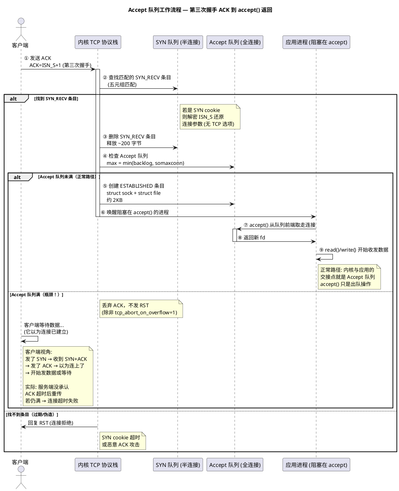
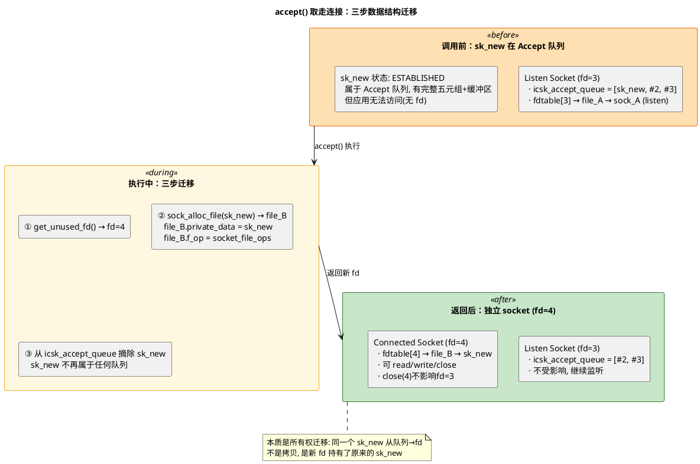

# 深入论述一（5/5）：`accept()` —— 从 Accept 队列取走已完成的连接

> 所属 Day：[Day 1 从零编码](/demos/echo/day-01/) · 更新时间：2026-08-21（从 theory-syscalls.md 拆分，内容零丢失）
> 本系列：[深入论述一索引](/demos/echo/day-01/theory-syscalls.md)
> 上一篇：[4/5 listen() backlog 机制](/demos/echo/day-01/theory-syscalls-listen.md)
> 下一篇：[深入论述二：sk_buff 的设计与组织](/demos/echo/day-01/theory-sk-buff.md)

---

如果说 `listen()` 是"打开店门"，`accept()` 就是"从等候区领走一位客人"。`accept()` 本身**不参与三次握手**——它只是从 Accept 队列里取走内核已经建好的连接。

**Accept 队列（全连接队列，accept_queue）**

当客户端回复 ACK（第三次握手完成）时，连接从 SYN 队列转移到 Accept 队列，状态变为 `ESTABLISHED`，并唤醒阻塞在 `accept()` 上的应用进程。**此时内核层面连接已经建好，但应用还没取走**。

Accept 队列的大小由两个参数的最小值决定：

```bash
max_accept_queue = min(backlog, somaxconn)
```

每个条目是一个完整的 `struct sock` + 关联的 `struct file`（返回给 `accept()` 的 fd），约 2KB。

**这是"连不上"最常见的瓶颈**：Accept 队列满时，内核会**丢弃**新到的第三次握手 ACK。客户端以为连接已建立（它发的 SYN+ACK 收到了 ACK），但实际上服务端没有承认。客户端重传 ACK，如果在限定次数内服务端 Accept 队列有了空位，连接成功；否则客户端超时。

## 一、Accept 队列的完整时序

下面的时序图展示了"第三次握手 ACK 到 `accept()` 返回 fd"的完整流程。重点关注 Accept 队列满时的分支——内核**不发 RST**，直接丢弃 ACK，客户端在无知中白白等待。



**时序图要点**：整个流程中最反直觉的是 Accept 队列满时的行为——**内核丢弃 ACK 但不发 RST**（默认 `tcp_abort_on_overflow=0`）。设计意图是：应用可能只是短暂繁忙（GC、突发流量），丢弃 ACK 让客户端重传，给应用腾出队列空间的机会。但这造成了诊断困难——客户端 `connect()` 已成功返回（它认为连接已经建立），服务端 `ss -lnt` 才能看到 `Recv-Q > Send-Q` 的异常。打开 `tcp_abort_on_overflow` 会让内核直接发 RST 拒绝，客户端立即收到 `ECONNRESET`，问题更早暴露，但代价是一点重试机会都不给。

## 二、`accept()` 的阻塞 vs 非阻塞

`accept()` 的默认行为由监听 socket 的**文件描述符标志**决定：

| 模式 | 设置方式 | Accept 队列空时的行为 | 使用场景 |
|------|---------|---------------------|---------|
| **阻塞**（默认） | `listen(fd, backlog)` | 进程睡眠，直到有连接到达 | 简单 echo 服务器（当前 Day 1） |
| **非阻塞** | `fcntl(fd, F_SETFL, O_NONBLOCK)` | 立即返回 -1，`errno=EAGAIN` | epoll/select/poll 事件循环 |

> **O_NONBLOCK 对 accept() 至关重要**：如果监听 socket 是非阻塞模式，当 Accept 队列为空时 `accept()` 不会睡眠。这是 epoll `EPOLLIN` 事件驱动的必要条件——epoll 通知 fd 可读 → 非阻塞 `accept()` 取走连接 → 继续事件循环。Day 2 的 epoll 版 echo 服务器就是基于这个语义。

## 三、`accept()` 的返回值语义

| 返回值 | 含义 | 处理方式 |
|--------|------|---------|
| `> 0` | 新连接的 fd | 正常使用：`read()`/`write()`/`close()` |
| `-1` + `errno=EAGAIN/EWOULDBLOCK` | 非阻塞模式下无可用连接 | 返回事件循环，等待下一次 epoll 通知 |
| `-1` + `errno=EINTR` | 被信号中断 | 重试 `accept()` |
| `-1` + `errno=ECONNABORTED` | 连接在队列里就已中止（极罕见） | 忽略，继续下一次 `accept()` |
| `-1` + `errno=EMFILE` | 进程 fd 数量达到上限 | **严重问题**：需要增加 `ulimit -n` |
| `-1` + `errno=ENFILE` | 系统 fd 数量达到上限 | 系统级瓶颈，调 `/proc/sys/fs/file-max` |

**关键**：`accept()` 即使返回错误，监听 socket 仍然有效——不需要重新 `listen()`。最常见的坑是 `EMFILE` 时空转：Accept 队列里堆积了连接，但每次 `accept()` 都失败，导致**既不消费队列、也不报 fatal error**，最终 Accept 队列爆满。

## 四、两个队列的协作流程

回顾 `listen()` 和 `accept()` 各自创建的机制，整体流程是：

1. **`listen()` 阶段**：创建 SYN 队列 + Accept 队列，socket 进入 `TCP_LISTEN` 状态，开始接收 SYN
2. **收到 SYN**：内核放入 SYN 队列 → 回复 SYN+ACK（客户端视角第一次握手完成）
3. **收到 ACK**（第三次握手）→ 从 SYN 队列删除 → 放入 Accept 队列 → 唤醒 `accept()`
4. **`accept()` 阶段**：从 Accept 队列取走 → 返回新 fd 给应用程序

**`listen()` 创建机制，`accept()` 只做消费**——这是理解"listen backlog 到底控制了什么"的关键。`backlog` 参数在 `listen()` 时设置，但它同时影响 SYN 队列和 Accept 队列（两个公式都依赖 `backlog`），而实际运行时，两队列的满/空行为完全不同。

## 五、"取走"到底意味着什么？—— `accept()` 返回 fd 的完整内部过程

前面说 `accept()` "从 Accept 队列取走连接"，但这句话省略了太多细节。一个已完成的 TCP 连接从 Accept 队列到变成应用手里可用的 fd，内核实际上做了一套**数据结构迁移**——不是简单的"拿出来"。

**一句话说结论**：`accept()` 把一个内核已建好的 `struct sock`（Accept 队列中的条目）从 listen socket 的 Accept 队列里摘下来，用一个新的 `struct file` + 新 fd 把它包装成独立 socket，返回给应用。**这之后，新 socket 与 listen socket 再无关系。**



**第一步：分配新文件描述符**

```c
// fs/file.c
int newfd = get_unused_fd_flags(0);  // 从当前进程的 fdtable 里找一个空闲位置
```

这个操作与 `socket()` 调用中的 fd 分配一样——在 `current->files->fdtab[]` 里找一个空闲槽位。此时这个 fd 还是"空的"，只是占了一个位置。

**第二步：创建新的 `struct file` 和 `struct socket`，挂到新 fd 上**

```c
// net/socket.c: sock_alloc_file()
struct file *newfile = sock_alloc_file(sk_new, O_RDWR, NULL);
// sock_alloc_file 内部做了三件事：
//   1. 创建一个新的 struct socket，sock->sk = sk_new
//   2. 创建一个新的 struct file，file->private_data = socket
//   3. file->f_op = &socket_file_ops（让 read/write/close 能用于这个 fd）

fd_install(newfd, newfile);  // fdtable[newfd] = newfile
```

**这是最关键的一步**：`sk_new` 是 Accept 队列中的条目——它在第三次握手完成时已经是一个完整的 `struct sock`（状态 `ESTABLISHED`，包含五元组、接收/发送缓冲区、序列号等全部 TCP 状态）。`sock_alloc_file()` 把它包了一层 `struct socket` + `struct file`，让应用程序能通过 fd 操作它。

**第三步：从 listen socket 的 Accept 队列中摘除**

```c
// net/ipv4/inet_connection_sock.c: inet_csk_accept()
struct sock *sk_new = reqsk_queue_get_child(&icsk->icsk_accept_queue, sk);
// 从 icsk_accept_queue 链表中摘除 sk_new
// 此时 sk_new 完全独立——它不属于任何队列
```

摘除之后，`sk_new` 与 listen socket 之间不再有任何数据结构上的关联。**它们唯一共享的是同一个本地端口号**——仅此而已。

**`accept()` 完成后的关键事实**：

| 维度 | listen socket (fd=3) | connected socket (fd=4) |
|------|---------------------|------------------------|
| `sk->sk_state` | `TCP_LISTEN` | `TCP_ESTABLISHED` |
| 能 `read()` / `write()` 吗？ | 不能（只能 `accept()`） | 能 |
| 有自己的接收/发送缓冲区？ | 无（不传输数据） | 有（独立的 `sk_receive_queue` / `sk_write_queue`） |
| 有自己的 cwnd / rwnd？ | 无 | 有 |
| `close()` 后影响对方？ | 停止接收新连接，不影响已有连接 | 关闭这一条 TCP 连接 |
| 五元组 | `(IP, Port, *, *)` — 不完整 | `(SRC_IP, SRC_PORT, DST_IP, DST_PORT, TCP)` — 完整 |

**"取走"的本质是所有权转移**：

```bash
Accept 队列中的 sk_new：
  - 由 listen socket 的 icsk_accept_queue 持有
  - 应用程序无法访问（没有 fd）
  - 占用 Accept 队列的一个槽位

         ↓ accept() 执行

独立的新 socket：
  - 由新 fd 持有（fdtable[newfd] → file → socket → sk_new）
  - 应用程序通过 read/write/close 自由操作
  - Accept 队列槽位释放，可以容纳下一个连接
```

> **核心认知**：`accept()` 不是一个"拷贝"操作——`sk_new` 这个内核对象只有一个实例，它在 `accept()` 之前属于 Accept 队列，在 `accept()` 之后属于新 fd。所谓"取走"，本质是**所有权从队列迁移到文件描述符**。这就是为什么 `close(fd)` 会释放整个 TCP 连接——因为 `close()` 触发 `file→socket→sk` 的析构链，最终销毁 `sk_new`。

## 六、队列满的三种行为（历史演变）

Linux 内核在两个队列满时的行为经历过一次重要变更：

| 时期 | SYN 队列满 | Accept 队列满 |
|------|-----------|-------------|
| Linux < 2.2 | 丢弃 SYN，客户端触发超时重传 | 丢弃 SYN（客户端无感知，以为丢包） |
| Linux ≥ 2.2 (默认) | **SYN cookies 绕过队列** | 丢弃新到的 ACK（第三次握手），但保留 SYN 队列中的记录 |
| 开启 `tcp_abort_on_overflow=1` | SYN cookies | 直接发 RST（客户端收到 "Connection reset"） |

**`tcp_abort_on_overflow` 的利弊**：

| 设置 | 行为 | 优点 | 缺点 |
|------|------|------|------|
| `=0`（默认） | 丢弃 ACK，不重传 SYN+ACK | 客户端自动重试，可能最终成功 | 客户端卡在 connect() 上不知道原因 |
| `=1` | 发 RST 立即断开 | 客户端立刻知道连接失败 | 正当的短时突发也被拒绝 |

> **backlog 经验值**：高并发场景 `somaxconn=65535` + `listen(fd, 65535)` + `tcp_max_syn_backlog=65535`。常规服务 `somaxconn=2048` + `listen(fd, 2048)` 即可。

> **一句话总结**：`accept()` 从 Accept 队列取走内核已建好的连接并返回 fd——它本身不参与三次握手，慢 `accept()` 导致的 Accept 队列满是"连不上"的主因。配合 epoll 非阻塞 `accept()` 可以避免单连接阻塞后续连接的处理。
