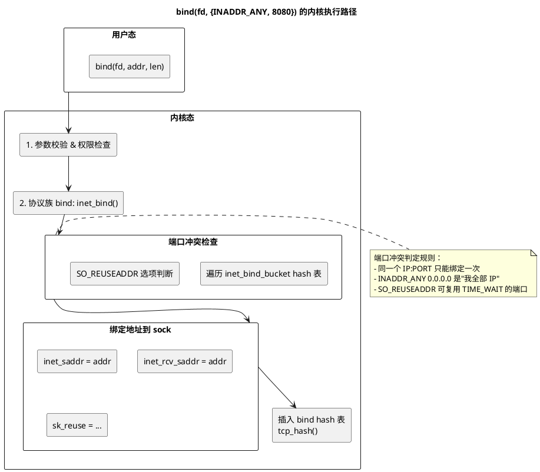

# 深入论述一（3/5）：`bind()` —— 内核做了两件事

> 所属 Day：[Day 1 从零编码](/demos/echo/day-01/) · 更新时间：2026-08-21（从 theory-syscalls.md 拆分，内容零丢失）
> 本系列：[深入论述一索引](/demos/echo/day-01/theory-syscalls.md)
> 上一篇：[2/5 socket() 内核做了三件事](/demos/echo/day-01/theory-syscalls-socket.md)
> 下一篇：[3.1 附录 SO_REUSEADDR vs SO_REUSEPORT](/demos/echo/day-01/theory-syscalls-reuse.md)

---



**第一步：端口冲突检查 —— 遍历 inet_bind_hashbucket**

内核维护一个全局 hash 表 `tcp_hashinfo.bhash[]`，以 `(端口号, 网络命名空间)` 为键。`inet_csk_find_open_port()` 遍历对应 bucket 的冲突链：

```c
// net/ipv4/inet_connection_sock.c
int inet_csk_get_port(struct sock *sk, unsigned short snum) {
    // 在 bhash[port % bhash_size] 链上检查：
    //   - 同一 IP:PORT 是否已被占用
    //   - SO_REUSEADDR 是否允许复用
    //   - 端口号是否为 0（内核自动分配）
    tb_found = &head->chain;
    inet_bind_bucket_for_each(tb, &head->chain) {
        if (net_eq(ib_net(tb), net) && tb->port == snum)
            goto tb_found;  // 找到冲突
    }
}
```

三种典型结果：

| 场景 | 结果 |
|------|------|
| 端口未被占用 | 新建 `inet_bind_bucket`，插入 hash 表 |
| 端口被占用 + 相同 IP | 返回 `-EADDRNOTAVAIL` |
| 端口被占用 + 不同 IP | 允许（只要 IP 不冲突） |
| 端口被占用 + `SO_REUSEADDR` | 允许（即使相同 IP，常用于快速重启） |

**第二步：绑定地址 → 插入 bind hash 表**

```c
// net/ipv4/af_inet.c: inet_bind()
inet->inet_rcv_saddr = inet->inet_saddr = addr->sin_addr.s_addr;
// inet_saddr = 发送源地址, inet_rcv_saddr = 接收目标地址
// bind() 两个同时设；connect() 只设 inet_saddr

// 将 sock 挂到 bind hash 表的冲突链上
inet_bind_hash(sk, tb, port);  // sk 加入 tb->owners 链表
```

`inet_bind_hashbucket` 是后续多连接场景的关键数据结构——同一端口的所有连接共用同一个 bucket。

> **一句话总结**：`bind()` 在内核做两件事——先遍历 `bhash[]` 哈希表检查 `(IP, PORT)` 冲突（`SO_REUSEADDR` 可豁免 TIME-WAIT 残留），再把地址写进 `inet_sock` 并把自己挂到对应端口桶的冲突链上；`connect()` 只设发送源地址，而 `bind()` 同时设收发两个地址。
