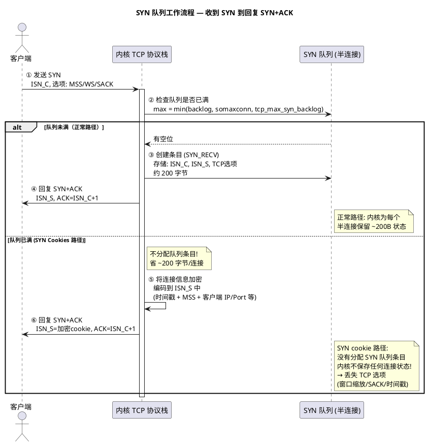
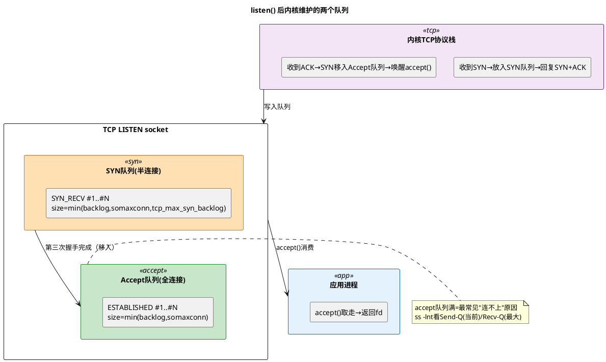

# 深入论述一（4/5）：`listen()` —— 内核做了两件事 + backlog 机制展开

> 所属 Day：[Day 1 从零编码](/demos/echo/day-01/) · 更新时间：2026-08-21（从 theory-syscalls.md 拆分，内容零丢失）
> 本系列：[深入论述一索引](/demos/echo/day-01/theory-syscalls.md)
> 上一篇：[3.1 SO_REUSEADDR vs SO_REUSEPORT](/demos/echo/day-01/theory-syscalls-reuse.md)
> 下一篇：[5/5 accept() 从 Accept 队列取走连接](/demos/echo/day-01/theory-syscalls-accept.md)

---

`listen()` 是 TCP 状态机从 `CLOSED` / `SS_UNCONNECTED` 进入 `LISTEN` 状态的关键步骤：

```c
// net/ipv4/inet_connection_sock.c
int inet_csk_listen_start(struct sock *sk, int backlog) {
    // 步骤 1：初始化 accept 队列 (icsk_accept_queue)
    reqsk_queue_alloc(&icsk->icsk_accept_queue);
    
    // 步骤 2：设置 backlog（**限于 /proc/sys/net/core/somaxconn 上限**）
    sk->sk_max_ack_backlog = min(backlog, net->core.sysctl_somaxconn);
    //    ↑ 这是关键：应用程序传 128，但内核 sysctl_somaxconn=128 时有效值=128
    //              应用程序传 1024，但 somaxconn=128 时有效值=128（被截断！）
    
    // 步骤 3：状态机转换
    inet_sk_state_store(sk, TCP_LISTEN);  // sk->sk_state = TCP_LISTEN
    
    // 步骤 4：检查是否有连接在 SYN_RECV 等待完成
    // （fastopen 或 listen() 之前就有 SYN 到达的情况）
    if (!skb_queue_empty(&icsk->icsk_accept_queue.rskq_accept_head))
        inet_csk_wait_for_connect(sk, ...);  // 唤醒等待的 accept()
}
```

## 一、内核中的两个队列（真正的 backlog 机制）

`listen()` 在内核中创建了**两个独立队列**，分别对应 TCP 三次握手的不同阶段。`backlog` 参数影响的是 Accept 队列的大小，而 SYN 队列的大小另有独立参数控制。理解这两个队列是排查"连接超时但服务端 CPU 空闲"这类诡异问题的关键。

**SYN 队列（半连接队列，syn_queue）**

当服务器收到客户端发来的第一个 SYN 包时，内核在 SYN 队列中创建一个条目，状态标记为 `SYN_RECV`，并回复 `SYN+ACK`。此时连接尚未建立——**三次握手只完成了一次半**。

SYN 队列的大小由三个参数的最小值决定：

```bash
max_syn_queue = min(backlog, somaxconn, tcp_max_syn_backlog)
```

- `backlog`：`listen()` 传入的参数
- `somaxconn`：`/proc/sys/net/core/somaxconn`，系统级限制
- `tcp_max_syn_backlog`：`/proc/sys/net/ipv4/tcp_max_syn_backlog`，专用于 SYN 队列的额外限制

每个条目存储客户端 ISN（初始序列号）、本端 ISN、客户端通告的 MSS/窗口缩放/时间戳等 TCP 选项，约占用 200 字节。

**SYN 队列的特殊性——SYN Cookies**：当 SYN 队列满时，Linux ≥ 2.2 默认启用 SYN cookies 机制。内核不再分配 SYN 队列条目，而是把连接信息加密编码到回复的 `SYN+ACK` 的 ISN 中，收到客户端 ACK 时再解密还原。**这意味着 SYN 队列满并不一定导致新连接失败**——但代价是丢失 TCP 选项（窗口缩放、SACK 等），连接性能会变差。

**SYN 队列的完整时序**：

下面的时序图展示了"收到第一个 SYN 到回复 SYN+ACK"的两条分支路径——正常分配条目 vs SYN cookie 绕行。关键点：SYN cookie 路径**不分配内存**，两次握手之间内核不保存任何连接状态。



**时序图要点**：正常路径下，内核为每个 SYN 分配约 200 字节的 `request_sock`；SYN cookie 路径下**完全不分配内存**，把连接信息（时间戳、MSS、五元组哈希）加密编码到 32 位的 ISN 中。收到客户端 ACK 时，内核通过解密 ISN 还原连接参数。代价是 ISN 只有 32 位，能编码的信息极其有限——TCP 窗口缩放、选择性确认（SACK）、TCP 时间戳等高级选项全部丢失，连接建立后的性能会明显下降（没有窗口缩放意味着接收窗口最大只有 64KB）。

## 二、`listen()` 创建的数据结构全景

调用 `listen()` 之后，内核在 `inet_connection_sock` 中初始化了**两个队列的数据结构**，此后所有客户端 SYN 和连接都由内核 TCP 协议栈自动管理——应用程序不需要、也无法干预三次握手的细节。



## 三、`listen()` 调用后的 socket 状态

**`listen()` 调用本身是非阻塞的**——它立即返回 0（成功）或 -1（失败），不会等待任何客户端连接。真正的"等待"发生在后续的 `accept()` 调用中。

`listen()` 完成后 socket 发生的实质变化：

| 维度 | `listen()` 之前 | `listen()` 之后 |
|------|----------------|----------------|
| `sk->sk_state` | `TCP_CLOSE` | `TCP_LISTEN` |
| 能否接收 SYN | 否（SYN 包被丢弃或回 RST） | 是（内核协议栈自动处理三次握手） |
| `icsk_accept_queue` | 未初始化 | 已分配（空队列） |
| `sk_max_ack_backlog` | 0 | `min(backlog, somaxconn)` |
| `sk->sk_prot->hash` | 无绑定 | 绑定到监听哈希表 (`tcp_hashinfo.listening_hash`) |
| 应用程序可对 socket 做什么 | 只能 `bind()` / `listen()` | 可以 `accept()` / `epoll_ctl(EPOLLIN)` |

**关键认知**：`listen()` 返回之后，内核已经**悄悄开始接收 SYN 包并执行三次握手**——即便应用程序还没调用 `accept()`。三次握手完全由内核 TCP 协议栈自动化完成，应用程序唯一要做的是通过 `accept()` 把"成品连接"从队列里取走。

> **"listen socket" 与 "connected socket" 的区别**：`listen()` 创建的 fd 是**监听 socket**，它只用于 `accept()`，不能用来 `read()`/`write()`。每次 `accept()` 返回的是一个**新的 connected socket fd**，两者是不同的 `struct file`，共享同一个 `struct sock` 的监听端口号。

## 四、backlog 为什么不是越大越好？

| 维度 | 解释 |
|------|------|
| **内存** | 每个 SYN 队列条目 ~200 字节（含 TCP 选项），Accept 队列条目 ~2KB（含整个 `struct sock`）。`backlog=65535` 且队列全满时，SYN 队列 ~13MB，Accept 队列 ~130MB |
| **syn flood 防御** | 队列大 = 攻击者用更少的包就能撑满队列。SYN cookies 绕过了这个问题（不占 SYN 队列），但会丢失 TCP 选项（窗口缩放、时间戳等） |
| **延迟** | 队列越长，新连接在队列中等待越久。应用处理不过来时，TCP 保活可能在队列里就已超时 |
| **应用处理能力** | 如果应用是单进程阻塞，backlog 再大也没用——`accept()` 每秒只能取几个连接。**瓶颈在应用处理速度，不在 backlog** |

> **backlog 经验值**：高并发场景 `somaxconn=65535` + `listen(fd, 65535)` + `tcp_max_syn_backlog=65535`。常规服务 `somaxconn=2048` + `listen(fd, 2048)` 即可。

> **一句话总结**：`listen()` 创建了 SYN 队列和 Accept 队列，并将 socket 转入 `TCP_LISTEN` 状态——此后内核自动处理三次握手，应用程序只需靠 `accept()` 从 Accept 队列取成品连接。
