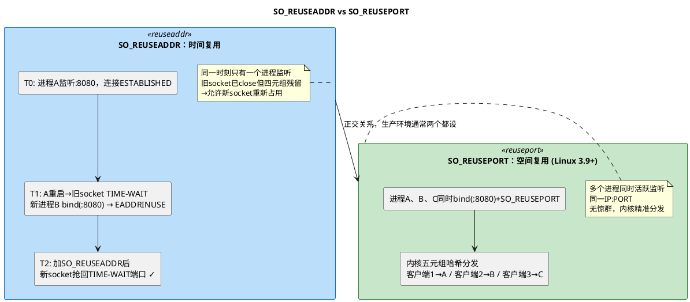

# 深入论述一（3.1）：`SO_REUSEADDR` vs `SO_REUSEPORT` —— 名字相似，解决完全不同的问题

> 所属 Day：[Day 1 从零编码](/demos/echo/day-01/) · 更新时间：2026-08-21（从 theory-syscalls.md 拆分，内容零丢失）
> 本系列：[深入论述一索引](/demos/echo/day-01/theory-syscalls.md)
> 上一篇：[3/5 bind() 端口冲突与绑定](/demos/echo/day-01/theory-syscalls-bind.md)
> 下一篇：[4/5 listen() backlog 机制](/demos/echo/day-01/theory-syscalls-listen.md)

---

`SO_REUSEADDR` 和 `SO_REUSEPORT` 是两个极易混淆的 socket 选项。只差一个词，但本质上解决的是两个**正交维度**的问题。

**一句话先说结论**：

| 选项 | 解决的问题 | 同时 bind 同一 IP:PORT？ | 典型用例 |
|------|-----------|:---:|---------|
| `SO_REUSEADDR`（地址重用） | **时间维度**：服务端重启后 TIME-WAIT 期间端口仍被旧连接占用 | **不能**——同一时刻只有一个 listener | 服务端快速重启 |
| `SO_REUSEPORT`（端口重用） | **空间维度**：多个进程/线程同时监听同一端口做负载分担 | **能**——多个活跃 socket 同时监听同一 IP:PORT | 多进程 echo/web 服务器 |



**`SO_REUSEADDR` 的工作细节**：

`SO_REUSEADDR` 在端口冲突检查时生效，允许新的 `bind()` 成功即使旧 socket 的相同四元组仍处于 `TIME-WAIT` 状态。但它**不允许**两个活跃的 socket 同时绑定相同的 IP:PORT。

```c
// 典型使用场景：服务端重启
// 1. 老进程退出，listen socket 上的连接进入 TIME-WAIT（持续 60s）
// 2. 新进程立即启动，bind(8080) 失败 → EADDRINUSE
// 3. 加上 SO_REUSEADDR 后，bind(8080) 成功

int fd = socket(AF_INET, SOCK_STREAM, 0);
int opt = 1;
setsockopt(fd, SOL_SOCKET, SO_REUSEADDR, &opt, sizeof(opt));
bind(fd, (struct sockaddr*)&addr, sizeof(addr));  // 即使 TIME-WAIT 也能成功
```

**`SO_REUSEPORT` 的工作细节**（Linux 3.9+）：

`SO_REUSEPORT` 允许多个 socket **同时** `bind()` 到完全相同的 IP:PORT 上，内核会自动将新连接分发给这些 socket。分发算法基于连接五元组（源 IP、源端口、目标 IP、目标端口、协议）的哈希值，同一个五元组的连接总是路由到同一个 socket。

```c
// 每个进程都这样做：
int fd = socket(AF_INET, SOCK_STREAM, 0);
int opt = 1;
setsockopt(fd, SOL_SOCKET, SO_REUSEPORT, &opt, sizeof(opt));
bind(fd, (struct sockaddr*)&addr, sizeof(addr));
listen(fd, SOMAXCONN);

// 内核自动将 accept 分发到不同进程
while (1) {
    int cfd = accept(fd, NULL, NULL);
    // 每个进程只处理自己分到的连接
}
```

**两个选项的本质区别总结**：

| 维度 | `SO_REUSEADDR` | `SO_REUSEPORT` |
|------|---------------|----------------|
| **复用维度** | 时间复用（先后占用） | 空间复用（同时占用） |
| **触发条件** | 旧 socket 已 close 但仍在 TIME-WAIT | 多个 socket **同时活跃监听** |
| **能同时 bind 同一 IP:PORT？** | 不能——同一时刻只有一个 listener | 能——多个 listener 共享同一 IP:PORT |
| **内核分发** | 不涉及（只有一个 socket） | 五元组哈希分发到不同 socket |
| **可用场景** | 服务端 + 客户端 | 仅服务端有意义 |
| **Linux 版本** | 所有版本 | Linux 3.9+ |
| **setsockopt 时机** | `bind()` 之前 | `bind()` 之前 |
| **多进程安全** | 不支持（需要外部协调） | 内置支持（内核提供负载均衡） |
| **惊群效应** | 有（多进程 epoll 同一 fd 时） | 无（每个进程独立 socket，内核精准分发） |

**工程上的典型组合用法**：

```c
// 生产环境多进程服务端的标准配置：
int opt = 1;
setsockopt(fd, SOL_SOCKET, SO_REUSEADDR, &opt, sizeof(opt));  // 防 TIME-WAIT
setsockopt(fd, SOL_SOCKET, SO_REUSEPORT, &opt, sizeof(opt));  // 多进程负载均衡
bind(fd, ...);
listen(fd, backlog);
```

> **为什么两个都要设？** `SO_REUSEADDR` 解决"重启时端口还被占用"的问题，`SO_REUSEPORT` 解决"多个进程怎么共享一个端口"的问题。它们是正交的——一个管时间维度，一个管空间维度。Nginx 从 1.9.1 开始默认同时开启两个选项。

**Day 1 的代码为什么没设任何 reuse 选项？**

day-01 的 echo server 故意从**最简形式**开始——一个单进程阻塞 `accept()` 的 echo 服务器，不设任何 socket 选项。这么做有两个教学目的：

1. **先暴露问题**：没有 `SO_REUSEADDR` 时，服务端 Ctrl-C 后再启动会碰到 `bind: Address already in use`（因为旧连接的 TIME-WAIT 还没消失）。这是初学者最容易遇到的第一道网络编程坑。
2. **day-02 再给解药**：day-02 的多进程版（`echo-server-mp`）会同时引入 `SO_REUSEPORT`（多进程共享端口）和 `SO_REUSEADDR`（防 TIME-WAIT），对比 day-01 的痛点一目了然。

> **一句话总结**：`SO_REUSEADDR` 解决"时间维度"（重启时抢回 TIME-WAIT 端口，同一时刻仍只有一个 listener），`SO_REUSEPORT` 解决"空间维度"（多进程同时监听同一端口、内核五元组哈希分发、无惊群）；两者正交，生产环境通常同时开启。
