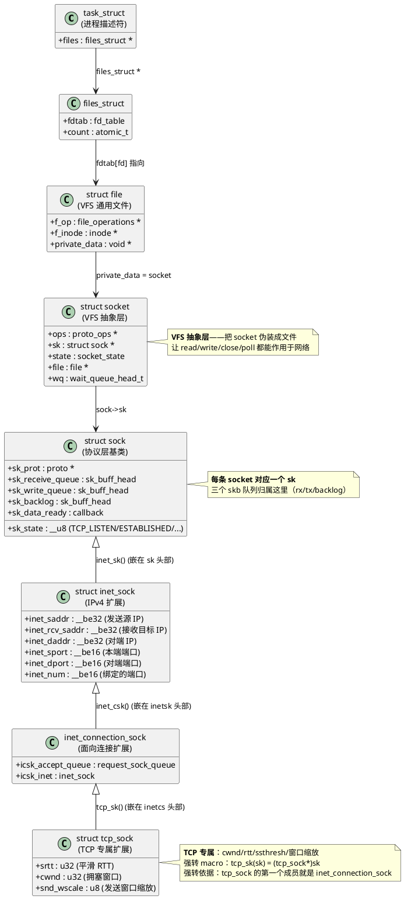

# 深入论述一（1/5）：五层数据结构骨架与挂载关系

> 所属 Day：[Day 1 从零编码](/demos/echo/day-01/) · 更新时间：2026-08-21（从 theory-syscalls.md 拆分，内容零丢失）
> 本系列：[深入论述一索引](/demos/echo/day-01/theory-syscalls.md)
> 上一篇：[深入论述一：四个系统调用的内核实现（索引）](/demos/echo/day-01/theory-syscalls.md)
> 下一篇：[2/5 socket() 内核做了三件事](/demos/echo/day-01/theory-syscalls-socket.md)

---

理解 `socket()`/`bind()`/`listen()` 之前，先把内核里的**一组嵌套结构体**看清——它们层层指针挂载，构成网络栈的骨架。后续每一节都会引用这张"挂载图"。



**5 个嵌套层级 + 4 次指针挂载**（每行就是一次箭头）：

| 层级 | 数据结构 | 挂载字段 | 内核访问宏 | 在调用链中的角色 |
|:---:|----------|---------|-----------|----------------|
| L1 | `task_struct` | `files` | `current->files` | 进程的根描述符 |
| L2 | `files_struct` / `fdtable` | `fdtab[fd]` | `fdget(fd)` | `fd` → `file` 的查表 |
| L3 | `struct file` | `private_data` | `file->private_data` | 把 socket 暴露为文件 |
| L4 | `struct socket` | `sk` | `sock->sk` | VFS 层抽象（一次 `socket()` 完成） |
| L5a | `struct sock` | （基类，嵌在 inetcs 头部） | `sock_i_ino()` 等 | 协议层基类，三队列 |
| L5b | `struct inet_sock` | 嵌在 `inetcs` 头部 | `inet_sk(sk)` | IPv4 地址/端口 |
| L5c | `inet_connection_sock` | 嵌在 `tcp_sock` 头部 | `inet_csk(sk)` | accept 队列管理 |
| L5d | `struct tcp_sock` | （最外层，TCP 全状态） | `tcp_sk(sk)` | cwnd/rtt/ssthresh |

> **`tcp_sk(sk)` 强制转换的依据**：`tcp_sock` 的**第一个成员**就是 `inet_connection_sock`，`inet_connection_sock` 的第一个成员又是 `inet_sock`，`inet_sock` 的第一个成员还是 `sock_common`，`sock_common` 里再嵌 `sock`。这条链路下来，`(tcp_sock *)sk` 可以合法地把任意一个层级指针当成另一个层级指针用。`container_of` 宏实现"已知子结构体指针求父结构体指针"，是理解所有 Linux 内核嵌套结构的关键。

**`read(fd, ...)` 的一次完整调用链**（走到 `tcp_recvmsg()` 为止）：

```c
// 用户态
n = read(fd, buf, len);
//        ↑
//   内核态:
//   1. fdget(fd)
//      → current->files->fdtab[fd]  返回 struct file *file
//   2. file->f_op->read(file, buf, len)
//      → file->f_op 在 socket_alloc_file() 时被设为 socket_file_ops
//      → 进入 sock_read()
//   3. sock_read(file, buf, len, off)
//      → sock = file->private_data         (取回 struct socket)
//      → sock->ops->recvmsg(sock, msg, len, flags)
//        = inet_stream_ops.recvmsg
//        = inet_recvmsg()
//   4. inet_recvmsg() → sk = sock->sk     (再下一层)
//   5. sk->sk_prot->recvmsg(sk, msg, size, flags, ...)
//      = tcp_prot.recvmsg
//      = tcp_recvmsg()                      ← TCP 真正从这里开始
```

> **每一跳都在这张"挂载图"上**：L1→L2（fdget）、L2→L3（fdtab[fd]）、L3→L4（private_data）、L4→L5（sock->sk）。后续章节所有 perf/strace/ss 观察到的现象，本质上都是这次调用链上某一跳出了问题。

> **一句话总结**：网络栈的骨架是"进程 → fd 表 → VFS file → socket → sock（逐层强转扩展）"的五层指针挂载链，`socket()`/`bind()`/`listen()`/`accept()` 的所有行为都在这个骨架上的某一跳发生，`tcp_sk()` 强转合法性的根源是"每层结构体的第一个成员就是上一层"。
