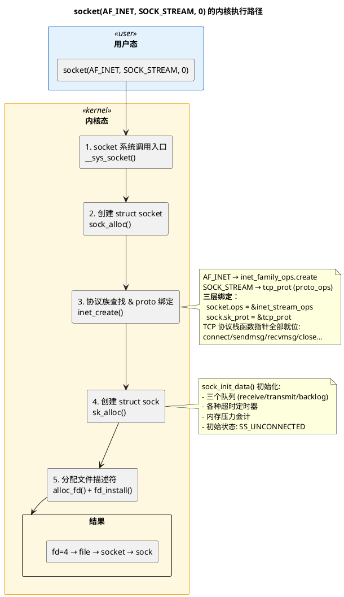

# 深入论述一（2/5）：`socket()` —— 内核做了三件事

> 所属 Day：[Day 1 从零编码](/demos/echo/day-01/) · 更新时间：2026-08-21（从 theory-syscalls.md 拆分，内容零丢失）
> 本系列：[深入论述一索引](/demos/echo/day-01/theory-syscalls.md)
> 上一篇：[1/5 五层数据结构骨架](/demos/echo/day-01/theory-syscalls-skeleton.md)
> 下一篇：[3/5 bind() 端口冲突与绑定](/demos/echo/day-01/theory-syscalls-bind.md)

---



**第一步：分配 `struct socket`（VFS 层的"通用套接字"）**

```c
// net/socket.c: sock_alloc()
struct socket *sock = sock_alloc();  // 从 sock_inode_cache slab 分配
sock->type = SOCK_STREAM;           // 流式
sock->state = SS_UNCONNECTED;      // 初始状态：未连接
```

`struct socket` 是 VFS 层的抽象——它把套接字伪装成一个文件，让 `read()`/`write()`/`close()` 能作用于套接字。核心字段：

| 字段 | 类型 | 作用 |
|------|------|------|
| `state` | `socket_state` | 套接字高层状态（`SS_UNCONNECTED` / `SS_CONNECTED` / `SS_DISCONNECTING`） |
| `ops` | `struct proto_ops *` | **操作函数表指针**，`SOCK_STREAM` → `inet_stream_ops` |
| `file` | `struct file *` | 反向指回 VFS file 结构 |
| `sk` | `struct sock *` | 指向协议族私有结构（TCP 的 `tcp_sock`） |
| `wq` | `wait_queue_head_t` | 等待队列，`accept()` 等阻塞操作在此睡眠 |

**第二步：协议族查找 → 创建 `struct sock`（协议层的"TCP 控制块"）**

```c
// net/ipv4/af_inet.c: inet_create()
struct sock *sk = sk_alloc(net, PF_INET, GFP_KERNEL, answer_prot, 1);
// answer_prot = &tcp_prot  (当 type=SOCK_STREAM 时)

// 绑定操作函数表
sock->ops = &inet_stream_ops;       // socket 层：read/write/poll/ioctl 等
                                    // 最终都会调到下面 sk->sk_prot 的具体实现

// sk->sk_prot = &tcp_prot          // 协议层：connect/sendmsg/recvmsg/close 等
```

**这是最关键的一步**——内核根据 `AF_INET` + `SOCK_STREAM` 确定了两张函数表：

```bash
应用层 write(fd, buf, len)
  → VFS: file->f_op->write()
    → socket 层: sock->ops->sendmsg()   = inet_sendmsg()    ← 统一入口
      → 协议层: sk->sk_prot->sendmsg()  = tcp_sendmsg()     ← TCP 真正逻辑
```

- `sock->ops`（`inet_stream_ops`）：面向 VFS 的通用接口，让套接字能像文件一样操作
- `sk->sk_prot`（`tcp_prot`）：TCP 协议的具体实现，拥塞控制、重传、分段都在这里

**第三步：分配文件描述符，建立  fd → file → socket → sock  四层链**

```c
// fs/file.c
int fd = get_unused_fd_flags(0);       // 从 fdtable 里找一个空闲的 fd 号
struct file *file = sock_alloc_file(sock, ...);  // 把 socket 包装成 file
fd_install(fd, file);                   // fdtable[fd] = file
```

`current->files->fdtab[fd]` 指向 `struct file`，`file->private_data` 指向 `struct socket`，`socket->sk` 指向 `struct sock`（TCP 下即 `tcp_sock`）。当用户调用 `read(fd, ...)` 时，内核走这条链找到 `tcp_recvmsg()`。

> 这个四层链 (`fd → file → socket → sock`) 是 Linux 网络栈"一切皆文件"哲学的基石，也解释了为什么能用 shell 的 `>/dev/tcp/IP/PORT` 发数据、用 `ss -p` 反向查 fd。

> **一句话总结**：`socket()` 在内核做三件事——分配 VFS 层 `struct socket`、按协议族创建协议层 `struct sock`（绑定 `inet_stream_ops` 与 `tcp_prot` 两张函数表）、分配 fd 并建立 `fd → file → socket → sock` 四层链；此后应用的一切读写都沿着这条链找到 `tcp_recvmsg()`/`tcp_sendmsg()`。
