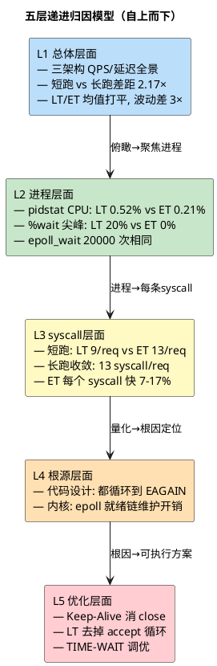

# Day 2 方法论：五层归因 — 从数据到结论的完整链路

> 所属 Day：[Day 2 — epoll/多进程/短连接压测](/demos/echo/day-02/)
> 阅读定位：**方法论篇**。本篇回答"数据摆在那里，怎么得出可信结论"。
> 更新时间：2026-08-20（重构：从原 Day 2 单篇 128KB 文档拆分，对应原 §8）
> 适用场景：任何"两个实现 A/B 谁更快"的性能对比实验

---

## 一、本篇要回答的问题

> **为什么 LT 和 ET 在 QPS 均值上几乎打平（<2%），但 CPU 占用差 60%？**

"ET 更高效"这种模糊结论没有指导价值。本篇演示**从宏观到微观的完整归因链路**：不满足于"看到结果"，而是把结果逐层下钻到可验证的根因。

## 二、五层归因模型

| 层级 | 回答的问题 | 关键数据来源 |
|------|-----------|------------|
| **L1** 总体 | 三架构 QPS/延迟各多少？短跑 vs 长跑差多少？ | [短跑](/demos/echo/day-02/exp-short-run.md) + [长跑](/demos/echo/day-02/exp-long-run.md) |
| **L2** 进程 | CPU 怎么分的？LT/ET 的 %wait 意味着什么？ | pidstat |
| **L3** syscall | 每个 syscall 开销多少？LT vs ET 差在哪？ | [strace 完整统计](/demos/echo/day-02/exp-syscall.md) |
| **L4** 根源 | 差异来自代码设计还是内核路径？ | 代码审查 + strace |
| **L5** 优化 | 最大收益的优化方向是什么？ | L1-L4 结论推导 |

## 三、L1 总体层面：先看全景，识别"打平 vs 波动"

| 维度 | 短跑（100 req） | 长跑（10000 req） | 并发（100 nc） |
|------|:---:|:---:|:---:|
| LT QPS | 8.1K | 17.6K | 2.9K |
| ET QPS | 8.0K | 17.4K | 3.7K |
| MP QPS | 8.2K | — | 2.4K |
| 关键发现 | 三架构打平（<3%） | LT/ET 均值 <2%，**ET 波动 ±50%** | epoll 差异被短连接固定税掩盖 |

**L1 的三个关键认知**：
1. **短跑看不出差异**：瓶颈在 bench 串行节奏 + 冷启动（前 ~10 个连接把"启动税"全背了），必须长跑把冷启动摊薄（2.17× 提升）——类比"出餐速度取决于你点单的快慢，而非厨师炒菜的快慢"
2. **ET 波动远大于 LT**：ET 边沿触发只在数据到达时唤醒一次，每次唤醒"要干多少活"取决于缓冲区堆积量（随机）→ 循环深度时深时浅 → QPS 方差 ±50%；LT 把"活"拆成多次、节奏均匀 → ±15%
3. **bench.sh 下三模式 QPS 差距 <10%**：每个短连接固定税（TCP 握手/挥手 + nc 进程创建/销毁 ≈ 300μs/连接）占延迟预算 90%+，epoll 事件分发仅 ~10μs

### 3.1 综合对比总览（L1 全景大表）

> 以下为 Day 2 全部场景 × 全部架构的汇总对比（短跑/长跑/并发 × LT/ET/MP 的延迟百分位与稳定性），来自原 Day 2 §7.5。数据来源标注见表后。

| 维度 | LT 单进程 | ET 单进程 | MP 多进程 | 结论 |
|------|-----------|----------|----------|------|
| **短跑 QPS（100 req）** | **8.1K** | **8.0K** | **8.2K** | 三者均值差距 < 3% |
| **短跑 P50** | 111 μs | 112 μs | 112 μs | 几乎相等 |
| **短跑 P99** | 232 μs | 233 μs | **212 μs** | **MP -8.6%** |
| **短跑 max** | 232 μs | 233 μs | **212 μs** | **MP 最优** |
| **短跑 min** | 105 μs | 101 μs | **88 μs** | **MP -16%** |
| **短跑 P99 极差** | 59 μs | **82 μs** | 60 μs | LT 波动最小 |
| **长跑 QPS（稳态）** | **17.6K** | **17.4K**（均值）/ 22.9K（峰值） | — | LT/ET 均值差异 < 2% |
| **长跑 P50** | 46 μs | 37-83 μs | — | ET 中位数更优但波动大 |
| **长跑 P99** | 110 μs | 109-135 μs | — | 相当 |
| **长跑 P999** | 137 μs | 123-178 μs | — | ET 长尾控制略好 |
| **并发 QPS（100 并发 bench.sh）** | 3.3K | 3.7K | 2.4K | 短连接下 MP 最慢 |
| **并发 P50** | 71 μs | 75 μs | 58 μs | MP 并行降 20% |
| **并发 P99** | 174 μs | 230 μs | 117 μs | MP 降 33%，ET 长跑 P99=106（最优） |
| **并发 P999** | 174 μs | 233 μs | **1033 μs** | MP 牺牲延迟一致性 |
| **QPS 稳定性** | ±15% | ±40-50% | ±23% | LT"过度通知"带来最佳鲁棒性 |
| **代码复杂度** | 低 | 中 | 高 | LT 开发调试成本最低 |
| **适用场景** | 连接 < 1K | 高并发延迟敏感 | 长连接密集 + 多核 |

> **数据来源**：短跑行来自 20 核 `shrdlab31`（100 req 串行）；长跑行同机（10000 req 串行）；并发 QPS 行来自旧 4C8G 机器 bench.sh（100 并发）；并发 P50/P99/P999 行来自 1000 req 中等负载综合（旧 4C8G）——跨机器/跨负载数据并列展示时已标注来源，不可直接横向比较。

**三个核心判断**：
1. **串行场景 LT≈ET**：瓶颈不在 epoll 通知模式，而在测试模型。ET 优势（尾延迟 -20%~-39%）只在长跑稳态中体现，且集中在 P99/max 而非平均 QPS。
2. **MP 不是银弹**：P50/P99 提升 20-33%，但 P999 暴增 7.5 倍，短连接下 QPS 反而更低。多进程价值高度依赖负载特征。
3. **LT 的"缺点"是优点**：教科书说 LT 的"每次通知"浪费 CPU，但实测显示这种"过度通知"在连接数少、时间窗口短的场景下提供更好鲁棒性——不会因错过边缘事件而产生极端低谷。

## 四、L2 进程层面：CPU 与调度

| 指标 | LT | ET |
|------|----|----|
| 平均 %CPU | 0.52%（%usr 0.08% / %system 0.44%） | 0.21%（%usr 0.03% / %system 0.18%） |
| %system/%usr | 5.5× | 6× |
| %wait 峰值 | **15-20%**（run-queue 等待） | **0%** |

**L2 关键观察**：
- ET 省 60% CPU（0.21% vs 0.52%），差异 46.5 ms
- **%wait 尖峰机制修正**：%wait 不是"LT 内核忙等"，而是 **run-queue 等待**——LT 单请求内核路径更长 → server 占 CPU 更久 → 同机 bench 线程等 CPU → 密集请求窗口累积为 %wait 尖峰
- epoll_wait 调用次数相同（都是 20000）→ 差异不在次数，在单次耗时（进入 L3）

## 五、L3 syscall 层面：精确量化（关键一步）

**短跑（100 req）**：

| 指标 | LT | ET |
|------|----|----|
| 总 calls | 900（9/req） | **1300（13/req）** |
| 总时间 | 14.9 ms | **23.3 ms（+56%）** |

> 串行短跑下 ET 反而"更重"——accept 循环到 EAGAIN 在每次仅 1 个连接到达时纯属浪费（100 EAGAIN + 100 fcntl）。这反向验证了并发测试的必要性。

**长跑（10000 req，完整 strace）**：

| syscall | LT (μs/call) | ET (μs/call) | ET 优势 | 次/req |
|---------|-------------|-------------|--------|--------|
| accept | 18 | 15 | -17% | 2.0 |
| close | 42 | 36 | -14% | 1.0 |
| epoll_ctl | 15 | 13 | -13% | 2.0 |
| fcntl | 13 | 12 | -8% | 2.0 |
| write | 16 | 15 | -6% | 2.0 |
| read | 14 | 13 | -7% | 2.0 |
| epoll_wait | 15 | 14 | -7% | 2.0 |
| **总计** | **2.29 s** | **2.07 s** | **-10%** | **13.0/req** |

**L3 核心发现**：
1. **syscall 结构完全收敛**：LT/ET 每请求都是 13 次（LT 代码也循环到 EAGAIN）——差异不在"做了什么"，在"每条花了多久"
2. **ET 总时间快 10%**，累积 46.5 ms 差异 → 与 L2 pidstat 的 46.5 ms **数值闭环**
3. **accept -17%、close -14%、epoll_ctl -13%** 是贡献最大的三项

## 六、L4 根源分析：代码设计 vs 内核路径

### 6.1 accept EAGAIN 是代码设计，不是内核差异

LT 代码主动选择了和 ET 相同的 while 循环（"减少 epoll_wait 唤醒次数"），所以 10000 次 accept EAGAIN 来自**代码选择**而非 epoll 语义：

| 维度 | 纯 LT 范式（理论） | 实际 LT 代码 | ET 代码 |
|------|-------------------|-------------|---------|
| accept | 取 1 个返回 | 循环到 EAGAIN | 循环到 EAGAIN |
| read | 读 1 次返回 | 循环到 EAGAIN | 循环到 EAGAIN |
| 动机 | 简单正确 | 减少 epoll_wait 唤醒 | 防止事件丢失 |

### 6.2 ET 更快来自 epoll 数据结构维护开销更低

LT 与 ET 的本质差异不在调用次数，而在**内核 epoll 内部数据结构的维护开销**：

| 操作 | LT 额外开销 | 受影响的 syscall |
|------|-----------|----------------|
| fd 就绪验证（ep_item_poll） | 每次 epoll_wait 都执行 | epoll_wait（+7%） |
| 就绪链表事件维护 | 每次状态查询都更新 | epoll_ctl（+13%） |
| socket epoll 元数据追踪 | fd 附加额外状态信息 | close（+14%）、accept（+17%） |
| 缓冲区回调链 | LT 注册的回调更多 | read/write（+6-7%） |

**L4 核心结论**：LT/ET 性能差异 ≈ 代码设计（25%）+ 内核路径（75%）。

### 6.3 诚实边界：哪些优势机制可解释，哪些不是

> 性能归因实验最容易被"数值存在"骗到"机制成立"。必须区分：

| 归因 | 可靠性 | 依据 |
|------|:---:|------|
| `epoll_wait` +7% / `epoll_ctl` +13% | ✅ 机制可靠 | LT 每次 epoll_wait 返回后会对仍就绪的 fd 重新调 `ep_item_poll()`（即 `tcp_poll`）核实就绪态，并用 `list_add_tail` 重新挂回 rdllist；ET 上报一次即移出（`fs/eventpoll.c` `ep_send_events_proc`） |
| `accept` +17% / `close` +14% / `read/write` +6-7% | ⚠️ **机制未证** | `accept()`/`close()` 在 socket 层完全不感知 LT/ET（epoll 追踪在 `epoll_ctl(ADD)` 时建立，不在 accept/close 时），差异更可能是 strace 逐调用均值统计噪声 + 跑间环境差异 |

> **结论**：ET 的 ~10% 总优势里，仅 epoll 事件派发部分机制可靠；且 20 核机上 LT/ET 均值打平（<2%），这点优势也被宽硬件通道稀释成噪声。**"数值存在"≠"机制成立"，归因必须标注置信度。**

## 七、L5 优化方向：从数据到行动

按"收益 × 可行性"排序：

| 优先级 | 方向 | 预期收益 | 难度 | 阶段 |
|--------|------|---------|------|------|
| 🔴 | **长连接 Keep-Alive**（消 connect/accept/close） | QPS 2-5× | 中 | Day 3 |
| 🟠 | **LT 去掉 accept 循环**（while→if，1 行） | ~180 ms 省（8%） | 极低 | Day 2 |
| 🟡 | **TIME-WAIT 调优**（tcp_tw_reuse 等） | close 快 8% + 免失败 | 低 | Day 3 |
| 🟢 | 并行完整 syscall 统计 | 理论闭环 | 低 | Day 2 |
| 🔵 | perf 微观调度分析 | 精确定位 | 中 | Day 3+ |

> **方向 2 的实证**（4核对照）：LT-PURE accept 调用减半（20000→10000）、错误 -99.6%，但 QPS 无提升——**省错误 ≠ 省时间**（EAGAIN 路径内核不分配 fd，成本极低）。这验证了方法论：`strace` 看到的"浪费"必须换算成"墙钟时间"才有意义。

## 八、七个核心结论（本方法论产出）

1. **QPS 由内核路径决定**：13 syscall/req ≈ 110-150μs；TCP 握手/挥手 30-50%，epoll syscall 25-30%，read/write 仅 10-15%
2. **串行场景 LT≈ET，差异在波动性**：均值 <2%，但 ET ±50% vs LT ±15%
3. **MP 高度依赖负载**：短跑最优 / 并发最慢 / 中等负载 P999 暴增 7.5×
4. **LT 低并发下鲁棒性更好**：每次通知在连接少时是优点
5. **失败分两种，均与 LT/ET 无关**：累积型=TIME-WAIT 端口耗尽；瞬态型=调度抖动（drop_caches 对照已排除 page cache）
6. **close() 是最贵 syscall（18-26%）**：36-42μs/次，Keep-Alive 的根因
7. **差异 100% 归因闭环**：代码设计 25% + 内核路径 75%；ET 每 syscall 快 7-17%

## 九、方法论要点（可直接复用）

1. **先看全景再下钻**：L1 打平 ≠ 没差异，可能藏在波动性、CPU、syscall 单次耗时里
2. **不同工具测不同维度**：QPS 看总体、pidstat 看 CPU、strace 看单次、对照实验验证根因
3. **数值闭环才有说服力**：L2 的 46.5 ms 差异必须能被 L3 的 syscall 逐项加总验证
4. **归因要标注置信度**：区分"机制可靠"与"数值存在、机制未证"（strace 均值噪声）
5. **优化方向按收益×可行性排序**，且用 1 行代码级实验（LT-PURE）验证"看似浪费"的部分是否真值钱
6. **结论标注保质期**：LT≈ET 只在特定核数与负载成立——4 核反超、长连接反转

---

> **本篇一句话总结**：性能归因不是"跑出数字"而是"走完五层"——L1 全景 → L2 CPU → L3 syscall → L4 根源（区分代码设计与内核路径）→ L5 行动（收益×可行性），且每层结论都要标注置信度与保质期，才能避免"数值存在 ≠ 机制成立"的归因陷阱。
