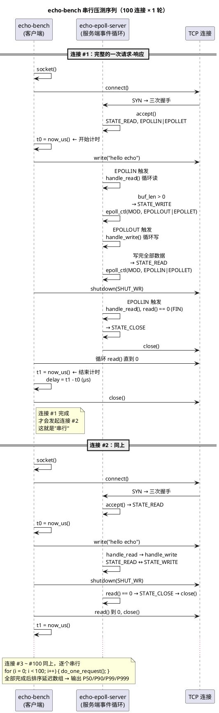

# Day 2 知识篇：两把压测尺子 — 怎么压测才可信

> 所属 Day：[Day 2 — epoll/多进程/短连接压测](/demos/echo/day-02/)
> 阅读定位：**知识篇**。本篇回答"为什么需要两把尺子、P99 为什么比平均值重要"。
> 更新时间：2026-08-20（重构：从原 Day 2 单篇 128KB 文档拆分）
> 前置阅读：[epoll 非阻塞服务的结构](/demos/echo/day-02/design-io-model.md)

---

## 一、本篇要回答的问题

> **压测为什么需要两把尺子？P50/P99/P999 各代表什么？**

## 二、两把尺子：串行延迟 vs 并发容量

### 2.1 echo-bench.c：串行延迟测量（微秒级）

```bash
用法: ./bin/echo-bench 127.0.0.1 9988 100 1
      → 100 个连接，每连接 1 轮 → 100 次请求串行执行
```

**内部流程**（每次 `do_one_request`）：



**关键设计决策**：

| 设计点 | 做法 | 原因 |
|--------|------|------|
| `shutdown(SHUT_WR)` | write 后立即半关闭写端 | 告诉服务端"我不会再写数据了"→服务端 `read()==0`→触发 `STATE_CLOSE`→连接正常终结 |
| 串行连接 | for 循环逐连接 | 避免并发建连的竞争噪声，测的是**单流延迟上限** |
| 不校验 echo 内容 | 只测延迟不验正确性 | 功能正确性由 bench.sh 验证，bench.c 只管性能 |
| `gettimeofday` 微秒精度 | 不是 `clock_gettime` | 精度够用（localhost 延迟几十到几百微秒），且兼容 macOS |

**局限性**：串行连接意味着 QPS 反映的是单流吞吐（`1 / avg_latency`），不是并发容量。100 个串行连接在 30K QPS 下需要 3ms，而 100 个真正的并发连接可以在 100μs 内完成。

### 2.2 bench.sh：并发容量测试（100 个 nc 同时发起）

**关键差异**：`&` 后台符使 100 个 `nc` **同时**向服务端发起连接——这是真正的并发。与服务端视角对比：

| 维度 | echo-bench.c | bench.sh |
|------|-------------|----------|
| 并发模型 | 串行（1 连接完成才发起下一个） | 100 连接同时发起 |
| 测量内容 | 延迟分布（min/P50/P90/P99/P999/max） | 总耗时 + 近似 QPS |
| 精度 | 微秒级（单次 connect→close） | 毫秒级（含 shell fork 开销） |
| 测的是 | **单流能做到多快** | **并发时系统能否兜住** |
| 适用场景 | 延迟敏感应用（交易、游戏服务器） | 吞吐敏感应用、连接风暴测试 |

**两者互补**：bench.sh 测出"100 并发能过"，echo-bench 测出"过的时候每连接的延迟分布是什么样的"。

### 2.3 并发 ≠ 并行：4 核跑 100 进程的真实情况

bench.sh 的 `&` 让 100 个 `nc` "同时开跑"，但测试机只有 4 个核——物理上不可能 100 个进程同时执行。拆解"并发"的三个层面：

| 层面 | 含义 | 真实情况 |
|------|------|---------|
| **连接并发** | 100 个 `nc` 的 `connect()` 几乎同时发出 | **真并发**：服务端 `epoll_wait` 一次性看到 N 个新连接 |
| **执行并发** | 4 核不能同时跑 100 个进程 | 内核按时间片（1~10ms）轮流调度，频繁上下文切换 |
| **服务端视角** | epoll 单线程事件循环不创建新进程/线程 | **I/O 并发是真并发**：100 个 fd 读写在同一线程顺序完成，无额外切换 |

```bash
一个 nc 进程的"等待时间"分析：
nc 进程创建 → 进 runqueue 等待 → 被调度到某个核 →
执行 connect/write/shutdown（几十微秒）→ 阻塞在 read() →
进程 sleep → 服务端回包 → nc 被唤醒 →
再次排队 → 被调度 → 读回数据 → 退出
真正"执行"只有几十微秒，其余时间都在排队或阻塞
```

> **一句话**：`&` 是"同时发起"，不是"同时执行"。真正的并发在 I/O 层面（epoll 多路复用），不在 CPU 层面（时间片轮转）。这也解释了 bench.sh 的 P999 为什么比 echo-bench 差很多——客户端被调度的排队延迟是主要变量。

## 三、延迟百分位语义：为什么 P99 比平均值重要

百分位是延迟测量的核心指标——只看平均值会掩盖长尾问题。假想 100 次请求的延迟从小到大排序：

```bash
请求编号： #1   #2   ...  #50  ...  #90  ...  #99  #100
延迟(μs)： 45   50   ...   71  ...   104  ...  174   228
          ↑                 ↑            ↑       ↑     ↑
         min               P50          P90     P99   max
```

| 指标 | 含义 | 你实际感受到的 | 为什么重要 |
|------|------|-------------|-----------|
| **P50**（中位数） | 50% 的请求延迟 ≤ 这个值 | 一半用户的体验 | 代表"典型"延迟，不受极端值干扰 |
| **P90** | 90% 的请求延迟 ≤ 这个值 | 九成用户的体验 | 过滤掉零星长尾，比 P50 更能暴露瓶颈 |
| **P99** | 99% 的请求延迟 ≤ 这个值 | 只有 1% 的用户更慢 | **生产环境核心指标**：100 个请求中只有 1 个超过它 |
| **P999** | 99.9% 的请求延迟 ≤ 这个值 | 只有 0.1% 的用户更慢 | 极端长尾：排查调度抖动/GC 的利器 |
| **max** | 最慢的那一次 | 运气最差的那个用户 | 不具统计意义但能暴露系统"能烂到什么程度" |

**为什么不用平均值？** 假设 100 次请求中 99 次 50μs，1 次 10000μs（内核调度抖动）。平均值 ≈ 150μs——看起来还行，但那个 10000μs 的用户已经骂人了。P99 = 10000μs 直接暴露了长尾——**P99 才代表"你承诺给用户的上限"**。

**P50/P99/P999 的工程诊断意义**：

```bash
P50 好 → 系统在"平稳运行"时表现不错
P99 差 → 系统偶尔卡顿，有不稳定因素（锁竞争、缓存 miss）
P999 差 → 系统有间歇性"冻住"（调度抖动、内存回收、中断风暴）
P50/P99 都好但 P999 差 → 典型的多进程/多线程调度问题
    → 本系列 MP 版正是这个情况：P50 降 20%，P999 暴增 7.5 倍
```

> **一句话**：P99 才是你在 SLA 里承诺给用户的东西。平均值是给自己看的，P99 是给用户看的。

---

> **本篇一句话总结**：压测要两把尺子——echo-bench 测"单流延迟上限"（质量），bench.sh 测"并发容量下限"（容量）；读数看百分位不看平均值，P99 才是承诺给用户的上限。
