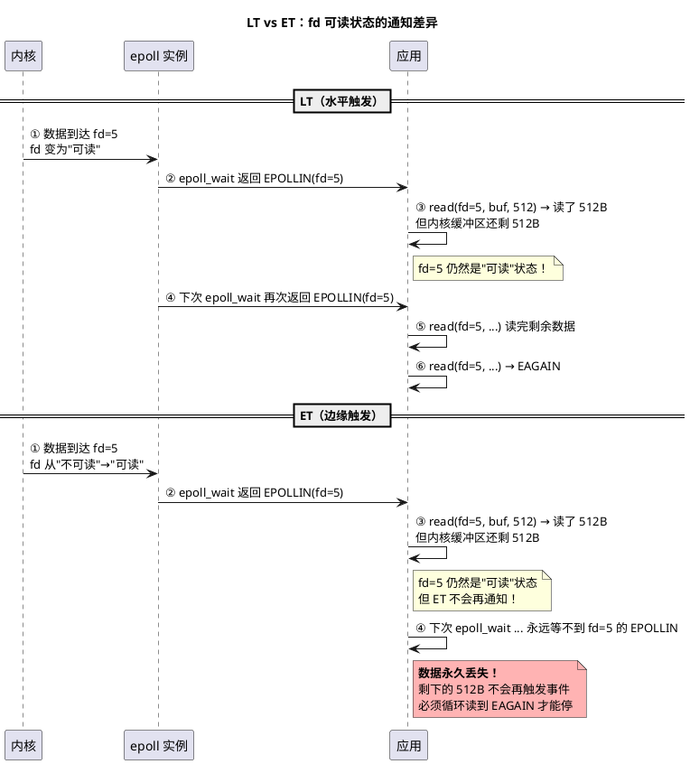

# LT vs ET 编程范式对比（一）：本质区别与三个关键操作

> 本文是 [Day 2 深入论述](/demos/echo/day-02/deep-dive.md) 的第一篇子文档，配合 [实践指南](/demos/echo/day-02/) 阅读。
> 内容：LT（水平触发）与 ET（边缘触发）的本质区别，以及 accept/read/write 三个关键操作的代码范式差异。
> 阅读顺序：本文（区别与代码）→ [事件注册策略](/demos/echo/day-02/deep-dive-lt-et-register.md) → [性能实测与理论分析](/demos/echo/day-02/deep-dive-lt-et-perf.md) → [死锁 Bug 案例](/demos/echo/day-02/deep-dive-lt-et-deadlock.md)。
> 上一篇：无（回到 [Day 2 深入论述索引](/demos/echo/day-02/deep-dive.md)）
> 下一篇：[事件注册策略差异（二）](/demos/echo/day-02/deep-dive-lt-et-register.md)

---

## 一、本质区别：谁在追踪"fd 是否就绪"

> 这是本节最核心的内容。ET 版不能只是"把 EPOLLET 标志加上就完事了"——它要求**整个编程范式**改变。

```bash
LT（水平触发）：内核帮你追踪
  → 只要 fd 仍然可读/可写，每次 epoll_wait() 都返回该事件
  → "你读不读是你的事，我每次都提醒你"

ET（边缘触发）：你自己追踪
  → fd 从不可读→可读时通知一次，之后不再通知
  → "我告诉你一次了，后面你自己看着办"
```



## 二、三个关键操作的 LT vs ET 代码对比

**① accept() 循环**

| | LT 版 | ET 版 |
|------|------|------|
| 必须循环？ | 否（不循环也能工作） | **是**（不循环 = 丢连接） |
| 建议 | 循环（减少 `epoll_wait` 次数） | 必须循环到 EAGAIN |
| 不循环后果 | 下次 `epoll_wait` 还通知，连接不丢 | 剩余连接永久丢失 |

```c
/* LT 版 accept：可以不循环，但循环更高效 */
// 只 accept 一个也行——LT 下次还会通知
int fd = accept(listen_fd, NULL, NULL);
if (fd >= 0) { /* 注册到 epoll */ }

/* ET 版 accept：必须循环 */
while (1) {
    int fd = accept(listen_fd, NULL, NULL);
    if (fd < 0) {
        if (errno == EAGAIN) break;  // 必须到这里才停
        perror("accept"); break;
    }
    /* 注册到 epoll */
}
```

**② read() 循环**

| | LT 版 | ET 版 |
|------|------|------|
| 必须循环？ | 否（不循环也不会丢数据） | **是**（不循环 = 丢数据） |
| 建议 | 循环（减少 `epoll_wait` 次数） | 必须循环到 EAGAIN |
| 不循环后果 | 多一次 `epoll_wait` 唤醒，数据不丢 | 剩余数据永久丢失 |

```c
/* LT 版 read：可以不循环 */
// 读一次就返回也行——LT 下次还会通知
ssize_t n = read(fd, buf, sizeof(buf));
if (n > 0) { /* 处理数据 */ }
// 没读完的数据下次 epoll_wait 还会触发 EPOLLIN

/* ET 版 read：必须循环 */
while (1) {
    ssize_t n = read(fd, buf + buf_len, sizeof(buf) - buf_len);
    if (n > 0) { buf_len += n; continue; }
    if (n == 0) { /* FIN */ break; }
    if (errno == EAGAIN) break;  // 必须到这里才停
    /* 错误处理 */
}
```

**③ write() 循环**

| | LT 版 | ET 版 |
|------|------|------|
| 必须循环？ | 否（但不循环会导致 EPOLLOUT 空转） | 需要手动管理 EPOLLOUT 注册 |
| 建议 | 循环写到 EAGAIN | 循环写到 EAGAIN，然后切回 EPOLLIN |
| LT 特有陷阱 | 对端接收窗口大时，内核缓冲区始终可写 → LT 持续返回 EPOLLOUT → **CPU 空转** | 无此问题（ET 只通知一次） |

```c
/* LT 版 write：可以不循环，但循环避免了 EPOLLOUT 空转 */
while (buf_sent < buf_len) {
    ssize_t n = write(fd, buf + buf_sent, buf_len - buf_sent);
    if (n > 0) { buf_sent += n; continue; }
    if (errno == EAGAIN) break;
    /* 错误 */
}

/* ET 版 write：必须循环 + 必须手动切换事件 */
while (buf_sent < buf_len) {
    ssize_t n = write(fd, buf + buf_sent, buf_len - buf_sent);
    if (n > 0) { buf_sent += n; continue; }
    if (errno == EAGAIN) break;  // 写满了，等 EPOLLOUT
}
// 全部写完 → 必须 epoll_ctl(MOD, EPOLLIN|EPOLLET) 切回读
```

---

> **一句话总结**：LT 的"持续通知"让你可以不循环读写（数据不丢），ET 的"只通知一次"要求 accept/read/write 全部循环到 EAGAIN——这是 ET 编程范式的最基本要求，也是它复杂度的第一来源。
