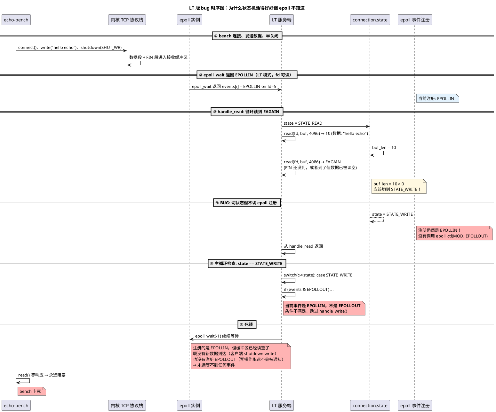

# LT vs ET 编程范式对比（四）：LT 状态机死锁 Bug 案例

> 本文是 [Day 2 深入论述](/demos/echo/day-02/deep-dive.md) 的第四篇子文档，配合 [实践指南](/demos/echo/day-02/) 阅读。
> 内容：一个真实 bug——`echo-epoll-lt-server` 在压测时卡死不动。根因是**状态机状态与 epoll 事件注册脱节**：`c->state` 切到了写状态，但 epoll 注册仍是 EPOLLIN。
> 阅读顺序：[本质区别与代码对比](/demos/echo/day-02/deep-dive-lt-et-basics.md) → [事件注册策略](/demos/echo/day-02/deep-dive-lt-et-register.md) → [性能实测与理论分析](/demos/echo/day-02/deep-dive-lt-et-perf.md) → 本文。
> 上一篇：[性能实测与理论分析（三）](/demos/echo/day-02/deep-dive-lt-et-perf.md)
> 下一篇：无（读完 4 篇后回到 [Day 2 深入论述索引](/demos/echo/day-02/deep-dive.md)）

---

## 一、现象描述

以下是一个真实 bug：`echo-epoll-lt-server` 在处理 `echo-bench` 的压测请求时卡死不动，服务端永远发不出响应。

> 该 bug 已在代码中修复，本节做详细的根因分析，作为教学案例。

**服务端日志**（截取）：

```bash
Epoll echo server (single-process, LT/Level-Triggered) listening on port 9988 ...
new connection fd=5 (LT mode)    ← accept 了第一个连接
new connection fd=5 (LT mode)    ← 又 accept，fd 编号相同说明前一次已经被 close 了
...（重复多次后）
new connection fd=5 (LT mode)    ← 最后一条，之后没有 closed
                                  （服务端卡住，不再输出）
```

**bench 端**：

```bash
Bench: 127.0.0.1:9988, 100 connections x 1 rounds = 100 requests ...
（卡住，没有任何输出）
```

**解读**：
- 服务端一直在 accept → close → accept 循环，每次 fd 都是 5（因为上一个被 close 后立即被复用）
- 但最后一个连接 accept 后服务端不再 close，bench 端也卡在 `read()` 等待响应
- 说明服务端 accept 并收到了客户端的请求数据，**但从未写回响应**，客户端永远等不到数据

## 二、根因定位：状态机切换了状态，但 epoll 不知道

**修复前的 LT 版代码**（关键位置）：

```c
/* handle_read() 中，读到 EAGAIN 且有数据待写 */
if (errno == EAGAIN || errno == EWOULDBLOCK) {
    if (c->buf_len > 0) {
        c->buf_sent = 0;
        c->state = STATE_WRITE;   // ① 状态切了
        // ② 但没有调用 epoll_ctl(MOD, EPOLLOUT)！
    }
    return;
}
```

```c
/* handle_write() 中，全部写完后 */
c->buf_len  = 0;
c->buf_sent = 0;
c->state    = STATE_READ;         // ③ 状态切了
// ④ 但没有调用 epoll_ctl(MOD, EPOLLIN)！
```

**对比：修复前的 ET 版**（正常工作）：

```c
/* handle_read() */
if (errno == EAGAIN || errno == EWOULDBLOCK) {
    if (c->buf_len > 0) {
        c->buf_sent = 0;
        c->state = STATE_WRITE;
        struct epoll_event ev;
        ev.events   = EPOLLOUT | EPOLLET;
        ev.data.ptr = c;
        epoll_ctl(epoll_fd, EPOLL_CTL_MOD, c->fd, &ev);  // ← 有这行！
    }
    return;
}
```

```c
/* handle_write() 全部写完后 */
c->buf_len  = 0;
c->buf_sent = 0;
c->state    = STATE_READ;
struct epoll_event ev;
ev.events   = EPOLLIN | EPOLLET;
ev.data.ptr = c;
epoll_ctl(epoll_fd, EPOLL_CTL_MOD, c->fd, &ev);           // ← 有这行！
```

## 三、完整的死锁因果链

以下按时间轴还原 LT 版 bug 的触发过程：



步骤 ④ 到 ⑥ 是核心死锁路径：

1. `handle_read` 成功读到了 `"hello echo"`（10 字节），然后 `read()` 返回 `EAGAIN`
2. LT 版代码将 `state` 设置为 `STATE_WRITE`，但**未调用 `epoll_ctl(MOD, EPOLLOUT)`**
3. 回到主事件循环后，`switch(c->state)` 走到 `case STATE_WRITE`，但此时 `events[i].events` 是 `EPOLLIN`（epoll 通知的是"fd 可读"事件），`EPOLLOUT` 条件不满足，`handle_write()` 被跳过
4. 下一轮 `epoll_wait()` 等待时，fd 的 epoll 注册仍然是 `EPOLLIN`，但内核缓冲区已被读空——客户端已经 `shutdown(SHUT_WR)`，不会再发数据
5. `epoll_wait` 永远收不到 `EPOLLOUT`（因为没有注册），服务端永远写不出响应
6. bench 端 `read()` 等响应，也永远等不到 → **双方死锁**

## 四、为什么直觉上的"LT 会自动通知"是错的

写 LT 版代码时，直觉是这样的：

> "LT 会持续通知 fd 的当前状态。如果 fd 可写，`epoll_wait` 就会返回 `EPOLLOUT`。那我只要把 `state` 设为 `STATE_WRITE`，下次 `epoll_wait` 自然就会带着 `EPOLLOUT` 回来。"

这个直觉的问题在于混淆了 **"内核在追踪什么"** 和 **"向 epoll 注册了什么"**。

**内核追踪的是**：fd 当前是否可读、是否可写、是否有错误。这是内核 TCP 协议栈维护的状态。

**epoll 通知的是**：你注册了哪些事件类型。如果你只注册了 `EPOLLIN`，epoll 就**只**在你注册的 `EPOLLIN` 就绪时通知你。`EPOLLOUT` 就绪了也不会告诉你的——因为你没说要。

LT vs ET 的正确理解：

| | 你都注册了 `EPOLLIN \| EPOLLOUT` | 你只注册了 `EPOLLIN` |
|---|---|---|
| **LT 模式** | fd 一直可读/可写 → 每次 `epoll_wait` 都返回两个事件 | fd 可写 → **不通知**（你没注册） |
| **ET 模式** | fd 刚变得可读/可写 → 通知一次 | fd 变得可写 → **不通知**（同上） |

所以 **LT 的"持续通知"只覆盖你注册了的事件类型**。如果你不注册 `EPOLLOUT`，LT 再持续也不会通知你"fd 可写"。

## 五、修复方案

两处修改，与 ET 版保持一致：

```c
/* 修复 1: handle_read 中，读到 EAGAIN 且 buf_len > 0 时，注册 EPOLLOUT */
if (errno == EAGAIN || errno == EWOULDBLOCK) {
    if (c->buf_len > 0) {
        c->buf_sent = 0;
        c->state = STATE_WRITE;
        struct epoll_event ev;
        ev.events   = EPOLLOUT;          // ← 新增：注册 EPOLLOUT
        ev.data.ptr = c;
        epoll_ctl(epoll_fd, EPOLL_CTL_MOD, c->fd, &ev);  // ← 新增
    }
    return;
}

/* 修复 2: handle_write 中，全部写完数据后，注册 EPOLLIN */
c->buf_len  = 0;
c->buf_sent = 0;
c->state    = STATE_READ;
struct epoll_event ev;
ev.events   = EPOLLIN;                  // ← 新增：切回 EPOLLIN
ev.data.ptr = c;
epoll_ctl(epoll_fd, EPOLL_CTL_MOD, c->fd, &ev);           // ← 新增
```

**修复 2 还附带避免了另一个潜在问题**：如果 `handle_write` 写完后不把注册切回 `EPOLLIN`，而 `EPOLLOUT` 仍在注册状态，那么在内核发送缓冲区一直可写（localhost 回环下这是常态）时，LT 模式下 `epoll_wait` 会**持续返回 `EPOLLOUT`**，导致 CPU 空转——这就是前面提到的 "EPOLLOUT 空转陷阱"。

## 六、教训总结

1. **LT 不意味着"不需要 `epoll_ctl`"**。LT 帮你解决了"读一半会不会丢数据"的焦虑（答案：不会），但**不解决"事件类型切换"**的问题。状态机从读切到写时，必须告诉 epoll 现在关心的是 `EPOLLOUT` 而不是 `EPOLLIN`。
2. **状态机状态 `c->state` 和 epoll 事件注册是两个独立的维度**。改了 `c->state` 不改 epoll 注册，epoll 并不知道你的状态机已经切换到写状态。两者必须同步。
3. **bug 的隐蔽性在于它是时序敏感的**。如果是本地大消息（`write` 后 `shutdown` 间隙较大），服务端可能在 FIN 到达前就读空数据并正常切到 `EPOLLOUT`……但 benchmark 的 `write → shutdown` 非常快，数据段和 FIN 段几乎同时到达，暴露了这个 bug。
4. **LT vs ET 真正的简化在于"可以不循环读"，而不是"不用管理事件注册"**。在这个状态机架构下，LT 和 ET 都需要在状态切换时 `epoll_ctl(MOD)`。区别在于，LT 读到 `EAGAIN` 之后如果 `buf_len == 0`（没读到数据），可以直接 return 而不担心丢数据；ET 下则必须确保循环到了 `EAGAIN`。

## 七、修复验证

修复后 LT 版服务端连续 3 次 `echo-bench` 测试均 100/100 成功（修复前会卡死），bug 已根治。完整的 LT/ET/MP 三版性能数据和 bench.sh 并发对比见 [§7.1 短跑基线](README.md#71-短跑基线100-请求串行测试)。

---

> **一句话总结**：`c->state` 状态机与 epoll 事件注册是两个独立维度，改了状态却不 `epoll_ctl(MOD)` 切换注册，LT 下表现为 CPU 空转或连接死锁——这个 bug 证明了"LT 可以不循环读"绝不等于"LT 不用管理事件注册"。
