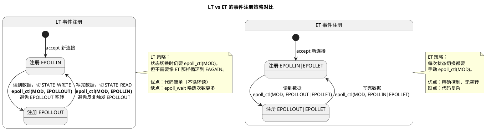
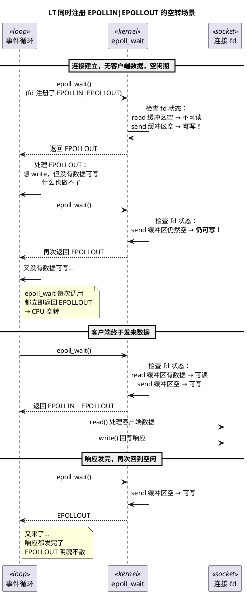
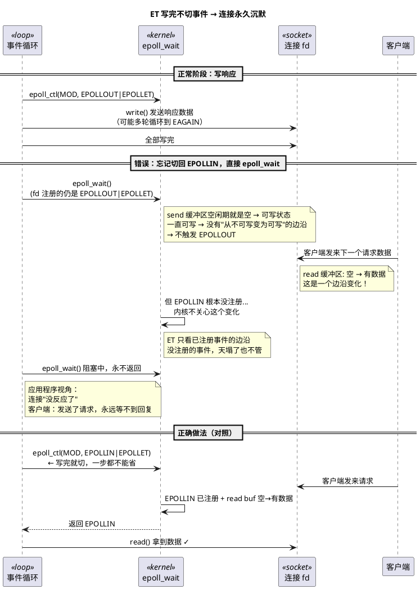

# LT vs ET 编程范式对比（二）：事件注册策略差异

> 本文是 [Day 2 深入论述](/demos/echo/day-02/deep-dive.md) 的第二篇子文档，配合 [实践指南](/demos/echo/day-02/) 阅读。
> 内容：LT 与 ET 在"何时、为何手动 `epoll_ctl(MOD)` 切换事件"上的根本差异——LT 切换是为"避免噪音"，ET 切换是为"收到通知"。
> 阅读顺序：[本质区别与代码对比](/demos/echo/day-02/deep-dive-lt-et-basics.md) → 本文 → [性能实测与理论分析](/demos/echo/day-02/deep-dive-lt-et-perf.md) → [死锁 Bug 案例](/demos/echo/day-02/deep-dive-lt-et-deadlock.md)。
> 上一篇：[本质区别与代码对比（一）](/demos/echo/day-02/deep-dive-lt-et-basics.md)
> 下一篇：[性能实测与理论分析（三）](/demos/echo/day-02/deep-dive-lt-et-perf.md)

---

## 一、LT vs ET 事件注册策略的总览



上图展示了 LT 和 ET 在事件注册策略上的根本差异，下面从三个角度展开论述。

## 二、为什么 LT 下必须手动切事件？——EPOLLOUT 空转问题

LT 的语义是"当前可读/可写就通知"。假设连接一开始注册的是 `EPOLLIN | EPOLLOUT`：



**空转的根本原因——LT 不关心"你有没有数据要发"**

LT 只看一个事实：TCP 发送缓冲区有没有空闲空间？有空间 → `EPOLLOUT`。它不会（也无法）判断应用程序是否真的有数据要写。只要缓冲区不满，每次 `epoll_wait` 都会返回 `EPOLLOUT`。

这与读端不同：读端闲时缓冲区是空的 → 不可读 → `EPOLLIN` 不会触发。但写端闲时缓冲区也是空的 → **可写**（有大量空间） → `EPOLLOUT` 必然触发。

**EPOLLIN 能拯救空转吗？——不能，两者不在同一个维度上竞争。**

这是最容易被误解的地方。有人会想："客户端的请求数据总会来的呀，到时候 `EPOLLIN` 不就触发了吗？" 这个思路的问题在于：

```bash
EPOLLOUT 空转的伤害不在"有请求时"，而在"没请求时"：

单连接视角：
  空闲期（99%的时间）：epoll_wait 每调必返 EPOLLOUT
  活跃期（1%的时间）：EPOLLIN|EPOLLOUT 一起返回，处理完后继续空转

多连接视角（这才是致命的）：
  1000 个空闲连接，全部注册了 EPOLLIN|EPOLLOUT
  → 每次 epoll_wait 返回 1000 个 EPOLLOUT 事件
  → 必须遍历 1000 次，检查每个 fd"要不要写"
  → 1000 次检查中 0 次真正有数据要写
  → 而真正的 EPOLLIN 事件被淹没在这 1000 个噪音里
```

EPOLLIN 确实会来，但它和 EPOLLOUT 不是相互替代的关系——EPOLLOUT 的噪音在 EPOLIN 到来之前、之中、之后一直都在。这不是"有 POLLIN 就不怕空转"的问题，而是"POLLOUT 的噪音淹没了 POLLIN 的信号"。

解决方法就是**按需注册**：连接在"读状态"时只注册 `EPOLLIN`，等收到数据、准备写回时再 `epoll_ctl(MOD, EPOLLOUT)` 切到写状态；写完后再切回 `EPOLLIN`。这样空闲连接只会在真正有数据可读时才唤醒。

注意，LT 下不切事件的后果是**空转浪费 CPU**，数据本身不会丢——这是 LT 安全性的代价：保守通知换取不丢数据，代价是多余的唤醒。

## 三、ET 下也必须手动切事件，但原因完全不同

ET 的语义是"状态刚从不可用变为可用时才通知"。如果写完数据后不 `epoll_ctl(MOD, EPOLLIN)`：



ET 下不切事件的后果是**连接永久挂死**，不是空转问题。ET 的"精确"是一把双刃剑——你得到的唤醒更少，但你的注册管理必须绝对正确。

## 四、LT 和 ET 在事件切换上的本质差异

```bash
LT：epoll_ctl(MOD) 是为了"避免噪音"
├─ 不切 → EPOLLOUT 反复触发，CPU 空转，但数据不丢
├─ 切了 → 只收到自己关心的事件，干净
└─ 本质：epoll_ctl(MOD) 是性能优化，非正确性要求

ET：epoll_ctl(MOD) 是为了"收到通知"
├─ 不切 → 不会再收到任何通知，连接永久挂死
├─ 切了 → 状态变化时重新获得通知
└─ 本质：epoll_ctl(MOD) 是正确性要求，非可选
```

这就是为什么很多人说"ET 更难写"——不是因为循环到 EAGAIN 复杂，而是因为**事件注册变成了正确性的一部分**。LT 下你忘了切事件，压测会暴露 CPU 飙高；ET 下你忘了切事件，连接就消失了，而且很难排查。

> **一句话**：LT 手动切事件是为了"别吵我"（避免噪音），ET 手动切事件是为了"叫我一声"（获取通知）。前者是性能优化，后者生死攸关。

---

> **一句话总结**：LT 与 ET 在事件切换上都要手动 `epoll_ctl(MOD)`，但动机相反——LT 是"避免 EPOLLOUT 空转的噪音"（性能优化），ET 是"获得下一个状态变化的通知"（正确性要求）；忘切事件在 LT 下是 CPU 飙高，在 ET 下是连接永久挂死。
