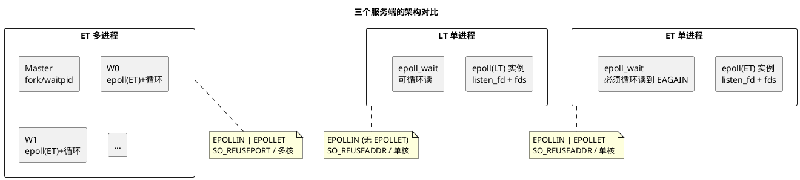
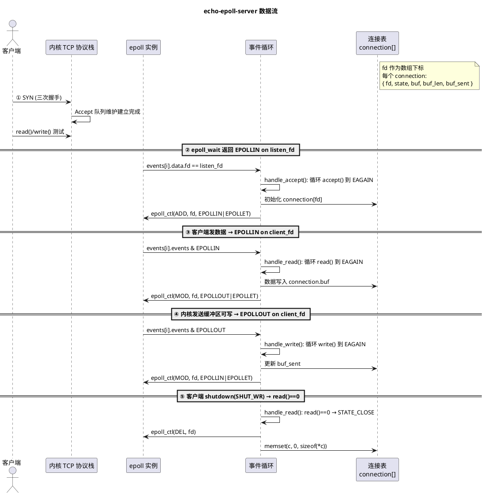
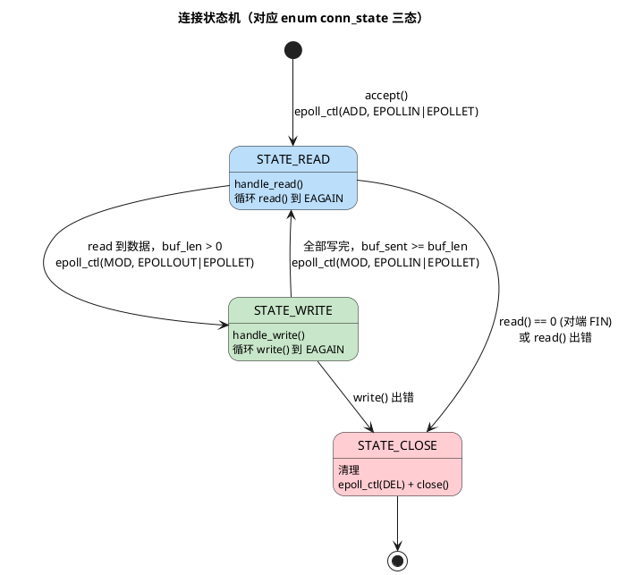

# Day 2 知识篇：epoll 非阻塞服务的结构 — 架构 / IO 模型 / 状态机

> 所属 Day：[Day 2 — epoll/多进程/短连接压测](/demos/echo/day-02/)
> 阅读定位：**知识篇**（先看懂设计再跑实验）。本篇回答"echo 服务端是怎么设计出来的"。
> 更新时间：2026-08-20（重构：从原 Day 2 单篇 128KB 文档拆分）
> 后续阅读：[LT vs ET 编程范式](/demos/echo/day-02/design-lt-et.md) · [SO_REUSEPORT 多进程](/demos/echo/day-02/design-so-reuseport.md) · [压测工具](/demos/echo/day-02/bench-tools.md)

---

## 一、本篇要回答的问题

> **echo 服务端用什么结构才能同时服务数千连接？**

Day 1 的阻塞模型一次只能服务一个连接；Day 2 的三态状态机 + epoll 事件驱动把并发能力提升到数千。本篇讲清楚**整体架构、进程/线程/IO 模型、数据流、连接状态机**四件事。

## 二、整体架构：三个服务端 + 两个压测工具

Day 2 构建了"三个服务端 + 两个压测工具"的矩阵：

```
压测尺子                    服务端
─────────                  ──────
echo-bench.c (串行)  ───▶  echo-epoll-lt-server  (LT  单进程)
bench.sh   (并发)   ───▶  echo-epoll-server     (ET  单进程)
                          echo-mp-server        (ET  4 worker)
```

两个压测工具**不是冗余**——它们测不同维度：

| 维度 | `echo-bench.c` | `bench.sh` |
|------|---------------|------------|
| 连接模式 | 串行（逐连接 connect→write→read→close） | 100 个 `nc &` 同时启动，真正并发 |
| 测量精度 | 微秒级延迟、QPS、百分位 | 毫秒级总耗时、近似 QPS |
| 延迟百分位 | P50/P90/P99/P999 | 无（只测首轮失败率） |
| 测什么 | **单流延迟上限**（无排队干扰时延迟能多低） | **并发容量下限**（100 连接同时涌入能接住多少） |
| 局限性 | 不是并发，QPS 接近单流吞吐 | 无延迟分布，QPS 受 shell 开销污染 |

> 两者互补：echo-bench 回答"延迟能多低"（质量），bench.sh 回答"并发来了会不会崩"（容量）。只看其一都会得出片面结论。

## 三、进程 / 线程 / IO 模型：三个服务端的递进关系

三个服务端形成递进关系：LT 版和 ET 版差异仅在**触发模式**（进程模型和 IO 模型相同），ET 单进程版和 ET 多进程版差异在**进程模型和连接分发**：



**详细的模型对比**：

| 维度 | echo-epoll-lt-server | echo-epoll-server | echo-mp-server |
|------|---------------------|-------------------|----------------|
| **进程模型** | 单进程 | 单进程 | master + N workers（默认 4） |
| **线程模型** | 单线程 | 单线程 | 每 worker 单线程 |
| **IO 模型** | 非阻塞 I/O | 非阻塞 I/O | 非阻塞 I/O（每个 worker 完全相同） |
| **事件驱动** | epoll LT（默认） | epoll EPOLLET | epoll EPOLLET（每 worker 独立 epoll 实例） |
| **read 必须循环？** | 可以不循环（下次还通知） | **必须循环到 EAGAIN** | **必须循环到 EAGAIN** |
| **accept 必须循环？** | 可以不循环 | **必须循环到 EAGAIN** | **必须循环到 EAGAIN** |
| **epoll_wait 唤醒频率** | 高（持续通知就绪 fd） | 低（只通知状态变化） | 低 |
| **连接分发** | 内核→单个 Accept 队列→单 epoll | 内核→单个 Accept 队列→单 epoll | 内核→SO_REUSEPORT 哈希→各 worker Accept 队列 |
| **listen socket** | 1 个（SO_REUSEADDR） | 1 个（SO_REUSEADDR） | N 个（SO_REUSEPORT） |
| **连接表** | 1 个全局 `connection[65536]` | 1 个全局 `connection[65536]` | N 个独立 `connection[65536]` |
| **CPU 利用** | 单核 | 单核 | 多核 |
| **隔离性** | 无 | 无 | 有 |
| **Master 职责** | 无 | 无 | fork children、waitpid 收尸、信号传播 |

> **关键认知**：LT 版和 ET 版是**同一个 IO 模型（epoll 非阻塞）在两种触发模式下的实现**——区别在于"谁来追踪 fd 的就绪状态"。LT 让内核帮你追踪（每次 `epoll_wait` 都提醒），ET 让你自己追踪（只提醒一次，你必须记住状态）。echo-mp-server 的每个 worker 是 echo-epoll-server 的独立副本加上 fork 管理和 SO_REUSEPORT。

## 四、数据流路径：连接从 SYN 到 close 的全过程

以单进程 epoll 版为例（LT/ET 数据流完全相同，仅循环与否有差异）：



**数据流要点**：
- 每个连接在 `STATE_READ` 和 `STATE_WRITE` 之间交替，epoll 事件注册随之切换
- `fd` 直接作为 `connection[]` 数组下标——O(1) 定位连接上下文，无哈希查找
- 读写都是"循环到 EAGAIN"（ET 模式），一次事件处理完缓冲区积压

## 五、连接状态机：为什么只有 3 个状态？

每个连接只有 **3 个状态**（见源码 `enum conn_state`）：读、写、关闭。没有内部子状态——等待事件和循环处理都在同一个 `handle_xxx()` 函数中完成：



> **STATE_WRITE 的隐式自环**：`handle_write()` 中如果 `write()` 返回 EAGAIN（发送缓冲区满，部分写），函数直接 `return`——不切换状态。下次 `epoll_wait` 返回同一 fd 的 `EPOLLOUT` 时，继续从 `buf_sent` 位置写剩余数据。这在状态机中表现为 STATE_WRITE 停留，不是独立子状态。

### 5.1 状态 = epoll 事件 + 处理函数的一一对应

每个状态对应一组确定的 epoll 事件和一个处理函数，没有例外：

| 状态 | epoll 事件 | 处理函数 | 状态停留期间做什么 |
|------|-----------|---------|------------------|
| `STATE_READ` | `EPOLLIN\|EPOLLET` | `handle_read()` | 循环 read 到 EAGAIN，读完决定下一步 |
| `STATE_WRITE` | `EPOLLOUT\|EPOLLET` | `handle_write()` | 循环 write 到 EAGAIN，写完决定下一步 |
| `STATE_CLOSE` | 无（已从 epoll 删除） | `conn_close()` | 直接 close(fd)，释放资源 |

**核心收益**：事件循环**不需要判断"当前连接是什么状态"**——直接根据 fd 上触发的事件类型，就知道该调哪个函数。`epoll_wait` 返回 `EPOLLIN` → 调 `handle_read`；返回 `EPOLLOUT` → 调 `handle_write`。连接在 STATE_READ 时只会注册 EPOLLIN，所以只会收到 EPOLLIN——状态不对时根本不会收到不匹配的事件，**防御性由设计保证，不靠运行时判断**。

### 5.2 为什么 STATE_WRITE 写完要切回 STATE_READ？

写完数据后必须 `epoll_ctl(MOD, EPOLLIN)` 切回读状态，不能留在写状态继续等 EPOLLOUT。原因：

1. **缓冲区为空时 EPOLLOUT 会空转**：写完后的空闲期，send buffer 是空的 → ET 下"空→空"无边沿 → EPOLLOUT 不触发；但万一来了新 EPOLLOUT 边沿，程序没有数据可写，白忙一场。
2. **echo 是请求-响应模型**：服务端写完回包后，下一件事一定是等客户端的下一个请求——天然就是 STATE_READ。READ→WRITE→READ 循环恰好是"收→发→收→发"节奏的精确映射。

> 如果业务变成"服务端可随时推送"（如 WebSocket），状态机就需要重新设计——READ 和 WRITE 并行注册而不是互斥切换。

> **一句话**：三态状态机不是"偷懒"，而是 echo 服务"收→发→收"的精确抽象。每个状态 = 一个 epoll 事件 + 一个处理函数——这为 Day 4 拆机（多线程化）提供了清晰的切分边界：每个连接的处理是自包含的，天然可分。

---

> **本篇一句话总结**：echo 服务端 = "epoll 事件驱动 + 三态连接状态机（fd 即数组下标）"，单进程单线程即可服务数千连接——这为后续的 LT/ET 选择（design-lt-et.md）、多进程扩展（design-so-reuseport.md）和压测（bench-tools.md）提供了统一的架构底座。
