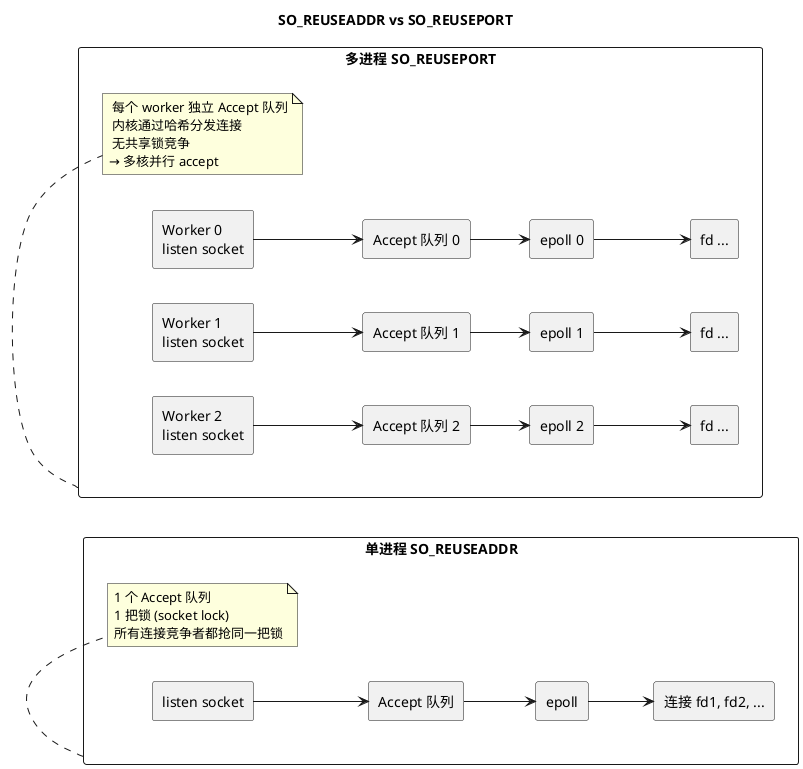

# Day 2 知识篇：SO_REUSEPORT — 多进程并行 accept

> 所属 Day：[Day 2 — epoll/多进程/短连接压测](/demos/echo/day-02/)
> 阅读定位：**知识篇**。本篇回答"多进程版是怎么做到多核并行的"。
> 更新时间：2026-08-20（重构：从原 Day 2 单篇 128KB 文档拆分）
> 前置阅读：[epoll 非阻塞服务的结构](/demos/echo/day-02/design-io-model.md)

---

## 一、本篇要回答的问题

> **单进程 epoll 用不满多核 CPU，多进程版靠什么机制把连接分发到各进程？**

## 二、SO_REUSEPORT vs SO_REUSEADDR 的本质区别



**核心差异一句话**：

| | SO_REUSEADDR | SO_REUSEPORT |
|---|:---|:---|
| 允许多个 listen socket 同端口 | ❌ 仅用于 TIME_WAIT 复用 | ✅ 多个进程可 bind 同端口 |
| Accept 队列 | 1 个（全局） | 每 worker 1 个 |
| 锁竞争 | 单队列全局锁 | **无共享锁**（各自队列） |
| 连接分发 | 单队列先进先出 | **内核哈希**（按四元组哈希，同连接落到同 worker） |
| 多核并行 | 否 | ✅ |

## 三、多进程版的核心流程

```c
// 主进程 fork N 个 worker
for (int i = 0; i < num_workers; i++) {
    if (fork() == 0) {
        // 子进程：独立完成 socket/bind/listen
        listen_fd = socket(AF_INET, SOCK_STREAM, 0);
        setsockopt(listen_fd, SOL_SOCKET, SO_REUSEPORT, &optval, sizeof(optval));
        bind(listen_fd, ...);
        listen(listen_fd, LISTEN_BACKLOG);
        worker_loop(i);  // 进入自己的 epoll 事件循环
    }
}
```

关键点：**每个 worker 在 fork 后自己创建 socket 并 bind**——不是继承父进程的 listen_fd。只有这样才能让内核把连接按哈希分发到每个 worker 自己的 Accept 队列。

## 四、架构对比总结（Day 1 → Day 2）

| 特性 | Day 1 单进程阻塞 | Day 2 epoll 单进程 | Day 2 多进程 SO_REUSEPORT |
|------|-----------------|-------------------|--------------------------|
| IO 模型 | 阻塞 read/write | epoll EPOLLET + 非阻塞 | 每进程独立 epoll EPOLLET |
| 并发能力 | 1 连接/时刻 | 数千连接（受限于单核） | 数千 × worker 数 |
| 进程隔离 | 无 | 无 | 有（一进程崩溃不影响其他） |
| CPU 利用 | 单核 | 单核（epoll 事件循环） | 多核（每个 worker 占一核） |
| Accept 队列锁 | 无竞争（单进程） | 无竞争（单进程） | **无竞争**（每 worker 独立队列） |
| 代码复杂度 | 70 行 | ~290 行 | ~277 行 + fork 管理 |

## 五、结论与回答

> **SO_REUSEPORT 让每个 worker 拥有独立的 listen socket + Accept 队列**，内核按四元组哈希把新连接分发到各 worker——accept 从"单队列抢锁"变成"多队列并行"，这才是多进程版用满多核的机制基础。

> **但注意**（Day 2 实测教训）：MP 不是银弹——短连接场景下多进程优势被 connect/close 开销淹没，甚至出现并发最慢、P999 暴增 7.5× 的反效果（见 [4核对照实验](/demos/echo/day-02/exp-multi-core.md)）。**SO_REUSEPORT 的真正价值要等长连接（Day 3）+ 多核（Day 4）同时具备才显现**。

> **一句话总结**：SO_REUSEPORT = 内核级连接分发器——每个 worker 一个 Accept 队列，无锁并行 accept；但它解决的是"并行 accept"，不是"消除协议开销"，后者要等长连接。
