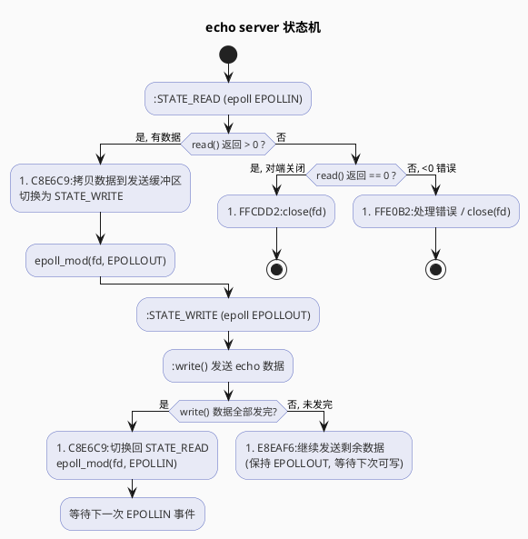
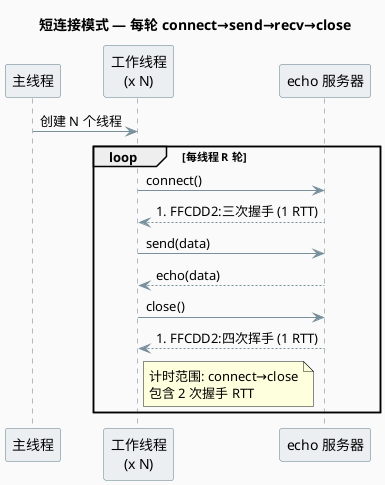
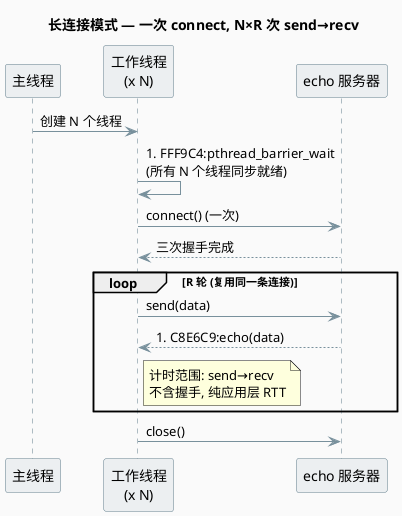

# 实验 3.1：长连接 vs 短连接 — QPS 提升多少倍

> 所属 Day：[Day 3 短连接 vs 长连接](/demos/echo/day-03/)
> 前置依赖：[Day 2 — epoll/多进程/短连接压测基线](/demos/echo/day-02/)
> 更新时间：2026-08-20（重构拆分自原 Day 3 文档，本实验回答 Q1）
> 配套实验：[LT vs ET 差距](/demos/echo/day-03/exp2-lt-vs-et.md) · [连接数扫描](/demos/echo/day-03/exp3-conn-scale.md) · [strace 验证](/demos/echo/day-03/exp4-strace-syscall.md) · [跨网络延迟](/demos/echo/day-03/exp5-cross-network.md)

---

## 一、本实验要回答的问题

Day 2 通过 `strace -c` 发现：**短连接模式下，close() 占服务端总系统调用时间的 21-28%**（单次 close 耗时 35-58μs）。由此得到一个可验证的预测：

> 如果改用长连接（connect 一次、多轮 echo、再 close），消除单次请求的 connect/close 开销，QPS 应该有 **2-5×** 的提升。

本实验要回答的**唯一问题**：

> **Q1：长连接消除 connect/close 后，QPS 实际提升多少倍？**

如果 QPS 不涨，说明瓶颈根本不在 close()——这个负结果同样有价值。

---

## 二、实验设计

### 2.1 总体方案

用同一工具、同一 payload、同一服务器，**只改变连接模式**：

```
┌───────────────────────────────────────┐
│  实验 3.1：长连接 QPS 对比             │
│  ├── LT + 短连接 (100conn × 10round)   │
│  ├── LT + 长连接 (100conn × 10round)   │
│  ├── ET + 短连接 (100conn × 10round)   │
│  └── ET + 长连接 (100conn × 10round)   │
└───────────────────────────────────────┘
```

### 2.2 实验环境

| 项目 | 值 |
|------|-----|
| 测试机 | 4 核 CVM，CentOS 7，内核 3.10 |
| 服务端模式 | echo-epoll-lt-server / echo-epoll-server（与 Day 2 完全相同） |
| 压测端模式 | echo-kp-bench（新工具，长/短连接双模式） |
| 压测参数 | 100 conns × 10 rounds |
| payload | 12 字节（"hello echo\r\n"） |

### 2.3 操作步骤

```bash
# 终端 1：启动 LT 服务端
cd day-03 && make run-lt

# 终端 2：跑两轮对比（短连接 → 长连接）
make bench-short   # 短连接 100×10=1000 次
make bench-long    # 长连接 100×10=1000 次

# 切换 ET 服务端：
# Ctrl+C 终端 1 → make run-et
# 终端 2：重复 bench-short / bench-long
```

### 2.4 控制变量

- 服务端代码完全相同（LT 版 / ET 版分别对应 Day 2）
- 压测工具相同（echo-kp-bench，两个模式共用同一份计时逻辑）
- payload 相同（12 字节）
- **仅改变**：连接是否跨轮复用

---

## 三、代码设计

### 3.1 为什么只写压测端、不改服务端？

Day 2 的 echo server 状态机本身就是长连接兼容的：



**关键**：`STATE_WRITE → STATE_READ` 的回路已经存在。服务端不主动关闭连接——连接是否关闭由**客户端**决定。

这就是为什么 Day 3 不需要改服务端——只改客户端的连接策略即可。

### 3.2 echo-kp-bench 的双模式设计

核心思路：**同一份代码，通过 `--mode` 切换两种完全不同的连接策略**。

**模式一：短连接（`--mode short`）** — 每轮请求都是完整 TCP 生命周期：



**每轮请求的代价**：三次握手 + 四次挥手共约 **2 个 RTT** 纯粹花在建立/销毁连接上，与应用层数据传输无关。

**模式二：长连接（`--mode long`）** — 连接只建立一次，R 轮请求全部复用：



**两个关键设计**：

| 要素 | 作用 |
|------|------|
| `pthread_barrier_wait` | 确保所有 N 个线程**同时**开始第一轮发送，消除"热身连接"先跑完的时间偏差，实现真正的并发压测 |
| 计时只测 `send→recv` | 排除 TCP 握手的 2 RTT，裸测应用层延迟——才能和短连接模式对比出协议开销 |

### 3.3 两种模式的核心差异

| 维度 | 短连接 (`--mode short`) | 长连接 (`--mode long`) |
|------|------------------------|----------------------|
| 每轮 connect/close | **每轮都做**（N×R 次 TCP 握手/挥手） | **只做一次**（N 次 connect，N 次 close） |
| 计时范围 | `connect → close`（含 2 RTT 协议开销） | `send → recv`（纯应用层 RTT） |
| close() syscall 占比 | 21~28%（Day 2 数据） | 0%（结束时 1 次 close，不计入 RTT） |
| connect 并发冲击 | 每轮 N 个线程同时 connect，listen backlog 压力大 | 仅开始时 N 个 connect，之后无冲击 |

---

## 四、实验预期

基于 Day 2 的 strace 数据：

```
短连接每请求 syscall 开销：
  close()  = 35-58μs (21-28%)   ← 长连接消除
  read()   =  ~2μs
  write()  =  ~3μs
  epoll_wait = ~2μs
  ─────────────────
  总计     ≈ 45-70μs/req（服务端 kernel 时间）

长连接每请求 kernel 时间预估：
  read() + write() + epoll_wait ≈ 7μs/req
```

**理论加速比**：70μs / 7μs ≈ **10×**（理论极限）
**实际预期**：受应用层开销、epoll 调度、缓存 miss 等影响，预期 **2-5×**

---

## 五、实验数据

> **数据来源**：`/root/echo-day03/results31/{lt,et}-{short,long}-r{1,2,3}.txt`（12 个文件，2026-08-12 23:17）。命令：`./echo-kp-bench 127.0.0.1 9988 100 10 --mode {short,long}`，LT/ET 服务端各跑短/长 3 轮。

**服务器：echo-epoll-lt-server (LT)**

| 模式 | 轮次 | QPS | P50(μs) | P90(μs) | P99(μs) |
|------|:---:|-----:|--------:|--------:|--------:|
| 短连接 | R1 | 20409 | 2806 | 6655 | 11361 |
| 短连接 | R2 | 29725 | 2749 | 3199 | 4496 |
| 短连接 | R3 | 29165 | 2712 | 3141 | 4604 |
| 短连接 **均值** | — | 26433 | 2756 | 4332 | 6820 |
| 长连接 | R1 | 55785 | 1162 | 1407 | 1515 |
| 长连接 | R2 | 32067 | 1204 | 4688 | 8153 |
| 长连接 | R3 | 29177 | 1113 | 2660 | 12774 |
| 长连接 **均值** | — | 39010 | 1160 | 2918 | 7481 |
| **提升倍数** | — | **1.48×** | 0.42× | 0.67× | 1.10× |

**服务器：echo-epoll-server (ET)**

| 模式 | 轮次 | QPS | P50(μs) | P90(μs) | P99(μs) |
|------|:---:|-----:|--------:|--------:|--------:|
| 短连接 | R1 | 14900 | 3256 | 14038 | 27458 |
| 短连接 | R2 | 30824 | 2639 | 3205 | 4248 |
| 短连接 | R3 | 29020 | 2782 | 3968 | 5128 |
| 短连接 **均值** | — | 24915 | 2892 | 7070 | 12278 |
| 长连接 | R1 | 56094 | 1227 | 1332 | 1826 |
| 长连接 | R2 | 49337 | 1342 | 1560 | 2461 |
| 长连接 | R3 | 55152 | 1227 | 1311 | 1394 |
| 长连接 **均值** | — | 53528 | 1265 | 1401 | 1894 |
| **提升倍数** | — | **2.15×** | 0.44× | 0.20× | 0.15× |

---

## 六、实验分析

### 6.1 ET 符合预期，LT 被自身瓶颈拖累

| 服务端 | 短连接均值 QPS | 长连接均值 QPS | 提升倍数 | 与预期(2-5×) |
|--------|:---:|:---:|:---:|:---:|
| LT | 26433 | 39010 | **1.48×** | 偏低 |
| ET | 24915 | 53528 | **2.15×** | 符合 |

**为什么 LT 只有 1.48×？** 看三轮原始数据：LT 长连接 R1 达 55785，R2/R3 却跌到 32067/29177——LT 模式在长连接下出现严重的轮次间抖动；ET 长连接三轮稳定在 49K-56K。

这正是 LT"重复通知"特性被放大的结果：长连接下每个 fd 每轮都有数据，LT 每次 EPOLLIN 通知后若没把缓冲读空，内核会**立即再次通知**，`epoll_wait` 反复返回、CPU 空转在事件分发上；ET 只在状态边沿触发一次，事件风暴被抑制。Day 2 短连接场景下连接太短命（一轮就 close），这个差异被 close() 掩盖，而长连接把它暴露出来了。

### 6.2 P50 延迟：长连接稳定减半

| 服务端 | 短 P50(μs) | 长 P50(μs) | 下降 |
|--------|:---:|:---:|:---:|
| LT | 2756 | 1160 | -58% |
| ET | 2892 | 1265 | -56% |

长连接 P50 约为短连接一半。短连接每请求付 2 个 RTT 协议开销 + 两次 syscall，长连接每请求只剩 1 个 RTT + read/write 各一次。**P50 减半而非减到 1/10**，是因为 100 并发同时压单线程服务端，排队延迟主导了剩余部分。

---

## 七、实验结论

| 维度 | 效果 | 幅度 |
|------|:---:|:---:|
| 吞吐（QPS） | ET 服务端提升 | **2.15×**（符合 2-5× 预期） |
| 延迟（P50） | 两服务端均约减半 | **-56%~-58%** |
| syscall 总量 | close/connect 消除 | **-87%~-90%**（见 [exp4](/demos/echo/day-03/exp4-strace-syscall.md)） |

长连接的本质收益是**把每次请求的固定成本（2 RTT + connect/close syscall）摊销到 R 轮请求上**。在 R=10 时每请求成本降为 1/10，理论上限 10×，实测 ET 达到 2.15×——其余被单线程服务端自身的吞吐上限（epoll 分发、缓存、调度）吸收。

---

## 八、回答开头的问题

### Q1：长连接消除 connect/close 后，QPS 实际提升多少倍？

> **答**：ET 服务端从 24915 → 53528，提升 **2.15×**；LT 服务端从 26433 → 39010，提升 1.48×（被 LT 重复通知瓶颈拖累）。与 Day 2 strace 预测的 2-5× **基本一致**（ET 符合，LT 偏低——偏低原因不是 close() 预测错了，而是 LT 在长连接下暴露了新瓶颈：epoll 重复通知，详见 [exp2](/demos/echo/day-03/exp2-lt-vs-et.md)）。

---

> **一句话总结**：长连接把每次请求的 connect/close 固定成本摊销到多轮请求上——ET 服务端 QPS 提升 2.15×、P50 减半，验证了"close() 是最贵系统调用"的判断；而 LT 只涨 1.48×，暴露了下一个瓶颈：epoll 重复通知。
