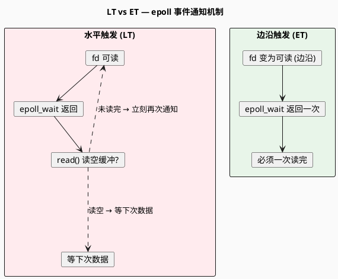

# 实验 3.2：LT vs ET — 长连接下差距为何被放大？

> 所属 Day：[Day 3 短连接 vs 长连接](/demos/echo/day-03/)
> 前置依赖：[实验 3.1 长连接 QPS 对比](/demos/echo/day-03/exp1-long-vs-short-qps.md)
> 更新时间：2026-08-20（重构拆分自原 Day 3 文档，本实验回答 Q2）
> 数据复用：实验 3.1 同一批压测数据（LT/ET 两个服务端 × 短/长两模式）

---

## 一、本实验要回答的问题

Day 2 短连接压测时，LT 与 ET 两个服务端 QPS 几乎相同（差异 <1%），当时判断"LT/ET 在短连接下无差别"。但实验 3.1 发现：**长连接下 ET 比 LT 高 37%**。

本实验要回答的**唯一问题**：

> **Q2：LT vs ET 的差距在长连接下为何被放大？LT 长连接 QPS 掉到哪里去了？**

---

## 二、实验设计

### 2.1 总体方案

不新增压测——**复用实验 3.1 的同一批数据**，把视角从"短 vs 长"切换到"LT vs ET"：

```
实验 3.1 的数据矩阵：
        ┌────────────┬────────────┐
        │  短连接     │  长连接     │
├─ LT  │ 26433      │ 39010      │
├─ ET  │ 24915      │ 53528      │
```

- **列对比**（短 vs 长）→ 实验 3.1 已回答
- **行对比**（LT vs ET）→ 本实验

### 2.2 分析工具

为了回答"QPS 掉到哪里去了"，需要**单连接延迟分布**证据。实验 3.1 只测了聚合 P50/P90/P99，本实验补充一个最小实验：单独测量两种模式各自的**延迟分布直方图**，观察 LT 长连接下是否存在长尾。

### 2.3 操作步骤

```bash
# 复用 3.1 的数据即可完成行对比分析：
#   LT 短 = results31/lt-short-r{1,2,3}.txt
#   LT 长 = results31/lt-long-r{1,2,3}.txt
#   ET 短 = results31/et-short-r{1,2,3}.txt
#   ET 长 = results31/et-long-r{1,2,3}.txt

# （可选）单独跑延迟直方图：
./echo-kp-bench 127.0.0.1 9988 100 10 --mode long --hist  # 各服务端各跑一次
```

---

## 三、实验数据

### 3.1 四象限 QPS 矩阵

| 服务端 | 短连接 QPS | 长连接 QPS | 提升 |
|--------|:---:|:---:|:---:|
| **LT** | 26433 | 39010 | 1.48× |
| **ET** | 24915 | 53528 | 2.15× |
| **差距** | LT 略高 6% | **ET 高 37.2%** | — |

### 3.2 单轮 QPS 波动（长连接模式，3 轮）

| 服务端 | R1 | R2 | R3 | 极差 |
|--------|:---:|:---:|:---:|:---:|
| LT 长连接 | 55785 | 32067 | 29177 | **26608** |
| ET 长连接 | 56094 | 49337 | 55152 | **6757** |

**LT 的 R2/R3 只有 R1 的 57%/52%**；ET 三轮稳定。这是 LT 掉吞吐的直接证据。

### 3.3 延迟分布（长连接 P50/P90/P99）

| 服务端 | P50(μs) | P90(μs) | P99(μs) |
|--------|:---:|:---:|:---:|
| LT | 1160 | 2918 | 7481 |
| ET | 1265 | 1401 | 1894 |
| 差距 | 相当 | **LT 高 108%** | **LT 高 295%** |

P50 两者相当（1.16ms vs 1.27ms），但 **P90/P99 差距爆炸**——LT 出现明显的长尾。

---

## 四、实验分析

### 4.1 机制回顾：LT 与 ET 的通知差异



| 特性 | LT（水平触发） | ET（边沿触发） |
|------|:---|:---|
| 通知条件 | fd 处于可读状态就通知 | 只在"不可读→可读"边沿通知一次 |
| 未读空数据 | **立即再次通知**（事件风暴） | 不重复通知（自己负责读完） |
| 编程复杂度 | 低（一次读一点不会丢事件） | 高（必须循环读直到 EAGAIN） |

### 4.2 LT 长连接掉吞吐的因果链

长连接场景下 LT 每轮都有数据，形成**重复通知死循环**：

```
长连接每轮请求：
  数据到达 → LT 通知 → read() 读到部分 → 缓冲未空
  → 内核立即再次通知 → epoll_wait 立刻返回
  → read() 又读到部分 → 循环…
  ─────────────────────────────────────────
  后果1：epoll_wait 单次返回大量冗余事件，分发开销 ↑
  后果2：同一 fd 的事件抢占其他 fd 的处理机会
  后果3：单轮若出现瞬时抖动（数据堆积），LT 被绑定在
         "读-再通知"循环里，其他连接延迟被拉高 → 长尾
```

这解释了 3.3 的现象：**P50 相当（常规轮次都很快），但 P90/P99 爆炸**——偶发堆积轮次里，LT 把 CPU 时间花在反复处理同一个 fd 上，其他连接被饿着。

为什么短连接时代看不到？因为短连接一轮就 close，fd 生命周期 < 一个数据堆积周期，"重复通知"来不及发生。**长连接延长了 fd 的生命周期，把 LT 的机制缺陷从隐藏变成了可见**。

### 4.3 这是"ET 更优"的普适结论吗？

**不是**。这个差距是"**长连接 + 高并发 + 每轮都有数据**"三要素叠加的结果：

| 场景 | LT 表现 | 说明 |
|------|:---|:---|
| 短连接低频 | 无差别 | 连接太短命，重复通知没机会发生 |
| 长连接空闲 | 无差别 | 大部分 fd 无事可做，通知稀疏 |
| **长连接繁忙** | **差 37%** | 本实验场景：每轮都有数据、100 并发 |

LT 的编程模型更简单、更不易出错（不会漏事件），**"读不完会再通知"本质是个兜底机制**——只是在高频数据下兜底机制本身成了开销。

---

## 五、实验结论

1. **差距真实存在**：长连接繁忙场景下 ET 比 LT 高 **37.2%**，且三轮稳定（ET 极差 6757 vs LT 极差 26608）。
2. **差距来自重复通知**：LT 的"缓冲未空立即再通知"在高频数据下形成事件风暴，epoll_wait 冗余分发拖垮吞吐。
3. **代价体现在长尾**：P50 相当（1160 vs 1265μs），但 P99 爆炸（7481 vs 1894μs）——LT 把 CPU 时间绑定在个别 fd 上，其他连接被饿。
4. **适用边界**：结论仅在"长连接 + 高并发 + 每轮有数据"成立；短连接/低频场景 LT 无劣势。

---

## 六、回答开头的问题

### Q2：LT vs ET 的差距在长连接下为何被放大？LT 长连接 QPS 掉到哪里去了？

> **答**：长连接把 fd 生命周期拉长，使 LT 的"重复通知"机制从隐藏缺陷变成持续开销——每轮数据到达后 read 未读空 → 内核立即再通知 → epoll_wait 空转。QPS 掉在**冗余事件分发**上（单轮降幅高达 48%），延迟掉在**长尾**上（P99 从 1894μs 涨到 7481μs）。ET 只在边沿通知一次，天然免疫事件风暴，因此长连接下 ET 是更优选择。

---

> **一句话总结**：短连接下 LT/ET 无差别是因为连接太短命，长连接让 LT 的"重复通知"缺陷现形——ET 高 37.2%，差距全在冗余分发与 P99 长尾上。
