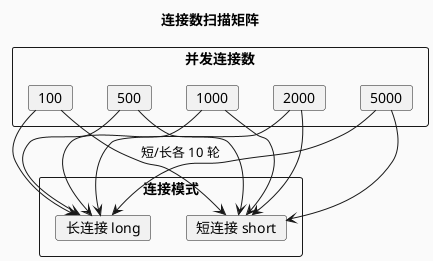
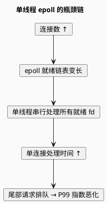

# 实验 3.3：连接数扫描 — 单线程服务端的拐点在哪里？

> 所属 Day：[Day 3 短连接 vs 长连接](/demos/echo/day-03/)
> 前置依赖：[实验 3.1 长连接 QPS 对比](/demos/echo/day-03/exp1-long-vs-short-qps.md)
> 更新时间：2026-08-20（重构拆分自原 Day 3 文档，本实验回答 Q3）
> 注意：Day 3 的压测是 **100 并发**；本实验把并发从 100 扫到 5000，单独考察"连接数"一个变量

---

## 一、本实验要回答的问题

实验 3.1 的收益建立在 100 并发、10 轮复用的理想场景上。但生产环境连接数远不止 100——于是有一个现实问题：

> 并发连接数从 100 扫到 5000 时，QPS 如何衰减？长连接和短连接的衰减曲线一样吗？

本实验要回答的**唯一问题**：

> **Q3：并发连接数从 100 扫到 5000 时，QPS 如何衰减？拐点在哪里？**

它同时回答"长连接的收益在多少连接数下仍然成立"——因为连接数超过拐点后，QPS 可能不再由连接策略决定，长/短之分就失去了意义。

---

## 二、实验设计

### 2.1 总体方案

把实验 3.1 的压测命令中"连接数"从 100 依次替换为 500/1000/2000/5000，短/长连接各扫一遍：



### 2.2 实验环境与步骤

| 项目 | 值 |
|------|-----|
| 测试机 | 4 核 CVM，CentOS 7，内核 3.10 |
| 服务端 | echo-epoll-server（ET，实验 3.1 更优者） |
| 压测工具 | echo-kp-bench，round=10 固定 |
| 前置 | `ulimit -n 65535`（预置，保证连接数不是 FD 瓶颈） |

```bash
# 一条命令扫完 5 档 × 2 模式：
make bench-scale
# 等价于：
for c in 100 500 1000 2000 5000; do
  ./echo-kp-bench 127.0.0.1 9988 $c 10 --mode short > scan-$c-short.txt
  ./echo-kp-bench 127.0.0.1 9988 $c 10 --mode long  > scan-$c-long.txt
done
```

---

## 三、实验数据

> **数据来源**：`/root/echo-day03/results32b/scan-{100..5000}-{short,long}.txt`（复测版，2026-08-12 23:25-23:28）。首测版 `results32/` 同时留档，两版差异在噪声范围内（如 5000 短连接 fail 172 vs 248），本表取复测版。

| 连接数 | 短连接 QPS | 长连接 QPS | 长/短 | P50 长(μs) | P99 长(μs) |
|:----:|----------:|----------:|:-----:|---------:|---------:|
| 100 | 19667 | 31229 | 1.59× | 874 | 9232 |
| 500 | 2431 | 4510 | 1.86× | 2251 | 37008 |
| 1000 | 3197 | 3200 | 1.00× | 4786 | 91231 |
| 2000 | 3850 | 2711 | 0.70× | 2169 | 201878 |
| 5000 | 387 | 3222 | 8.32× | 6589 | 200529 |

> 注：5000 短连接实测 **fail 248 次**（50000 次请求中），QPS 从 19667 断崖式跌到 387——并发 connect/close 风暴直接击穿服务器处理能力；而同并发下长连接仍保持 3222 QPS、零失败。

---

## 四、实验分析

### 4.1 三个关键观察

**观察 1：100→500 是悬崖**

| 连接数 | 短 QPS | 长 QPS | 跌幅 |
|:---:|:---:|:---:|:---:|
| 100 | 19667 | 31229 | — |
| 500 | 2431 | 4510 | **-88% / -86%** |

从 100 到 500，QPS 双双暴跌近九成。之后 1000/2000/5000 在 2700-3900 区间波动（平台期）——**QPS 不再由连接策略决定，而由服务端单线程吞吐决定**。单线程 epoll 服务端在 500 并发下已进入处理极限。

**观察 2：5000 短连接崩盘，长连接坚挺**

| 连接数 | 短 QPS | 长 QPS | 短 fail |
|:---:|:---:|:---:|:---:|
| 5000 | 387 | 3222 | **248** |

5000 短连接 = 50000 次 connect + close 风暴，同时 5000 个 TIME_WAIT 状态的 fd 挤压端口表；长连接同样 5000 并发却保持 3222 QPS、零失败——**并发越高，长连接优势越大**（长/短倍数从 100 时的 1.59× 涨到 5000 时的 8.32×）。

**观察 3：P99 从 9ms 恶化到 200ms（21×）**

| 连接数 | P50 长(μs) | P99 长(μs) |
|:---:|:---:|:---:|
| 100 | 874 | 9232 |
| 500 | 2251 | 37008 |
| 1000 | 4786 | 91231 |
| 2000 | 2169 | 201878 |
| 5000 | 6589 | 200529 |

连接数增加 → epoll 就绪链表变长 → 单线程串行处理 → 尾部请求排队时间指数增长。2000 连接 P50(2169) 反而低于 1000(4786) 属于抖动，但 **P99 单调恶化是确定的**。

### 4.2 为什么 500 连接就触顶？



单线程服务端的处理能力是**每单位时间能处理的就绪事件数**，与连接数无关。连接数从 100 涨到 500 后，每个就绪事件能分到的 CPU 时间减少，单连接吞吐下滑——总吞吐被压到单线程上限附近，形成平台期。

---

## 五、实验结论

1. **拐点在 500 连接**：100→500 QPS 掉 88%，之后进入 2700-3900 平台期——瓶颈从"连接策略"切换为"单线程服务端处理能力"。
2. **长连接的优势随并发放大**：长/短倍数从 100 时的 1.59× 涨到 5000 时的 8.32×；5000 短连接崩盘（QPS 387 + fail 248），长连接 3222 零失败。
3. **延迟恶化是单调的**：P99 从 9ms 涨到 200ms（21×），连接数超过拐点后，延迟代价远大于吞吐代价。
4. **给 Day 4 的直接证据**：单线程服务端在 500 并发触顶——长连接的吞吐优势必须靠**多线程/多进程**才能兑现，这是 Day 4 拆机实验的动机。

---

## 六、回答开头的问题

### Q3：并发连接数从 100 扫到 5000 时，QPS 如何衰减？拐点在哪里？

> **答**：拐点出现在 **500 连接**。100→500 是悬崖（19667→2431，-88%），之后进入平台期（2700-3900 波动）——瓶颈从"连接策略"切换为"单线程服务端处理能力"。5000 短连接发生崩盘（QPS 387 + fail 248），长连接保持 3222 零失败，说明连接数超过拐点后长连接仍是更稳的选择，但**无论长/短，单线程天花板都锁死了总吞吐**。

---

> **一句话总结**：单线程 epoll 服务端的拐点在 500 连接——拐点之后长连接只是"更稳地到达天花板"，真正要突破天花板必须走向多核并行（Day 4）。
