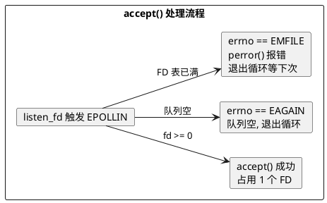
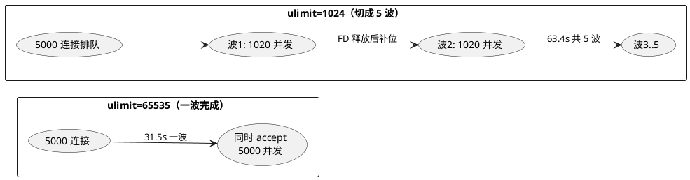
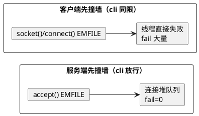

# FD 墙实测：ulimit 如何限死并发连接（Day 4 延伸）

> 所属阶段：阶段 2 — 多线程扩展与 FD 上限
> 定位：Day 4 的**并行支线（FD 线）**——与拆机实验 v2/v3（拆机线）都从 [v1](/demos/echo/day-04/split-experiment-v1.md) 的同机环境出发，但验证不同瓶颈：拆机线验证 CPU 竞争，本文验证 FD 上限；本文产出交给 [Day 5](/demos/echo/day-05/) / [Day 6](/demos/echo/day-06/)
> 前置依赖：[Day 3 Keep-Alive 长连接](/demos/echo/day-03/) → [拆机实验 v1](/demos/echo/day-04/split-experiment-v1.md)
> 更新时间：2026-08-17
> 一句话总结：FD 是硬墙——ulimit=1024 时服务端 FD 精确卡死在 1024，撞墙的代价不是请求失败，而是并发度被切成约 1/5、吞吐减半、P999 尾部延迟爆炸。

---

## 一、本实验要回答的问题

| # | 问题 | 为什么重要 |
|---|------|-----------|
| Q1 | `ulimit -n` 真的是"硬墙"吗？撞墙时服务端 FD 精确卡死在哪？ | 阶段 2 因环境预置 `ulimit -n 65535`，从未实测过 EMFILE（见 [02-phase2 总纲](/demos/echo/docs/02-phase2-fd-bottleneck.md)）；本文把"假设的 EMFILE 诊断路径"变成实测 |
| Q2 | 撞墙的代价是什么？是请求失败，还是别的劣化？ | 区分"连接失败"与"吞吐/延迟劣化"两种代价——决定排障时是查 FD 还是查别的 |
| Q3 | 客户端与服务端**都**限 1024 时，谁先撞墙？`fail` 从哪冒出来？ | 理解 EMFILE 的传播方向：客户端 `socket()` 失败 vs 服务端 `accept()` 失败，现象完全不同 |
| Q4 | 为什么 8192-5000 组出现 13450 个 `fail`？是 FD 还是端口？ | TIME_WAIT 端口污染会**制造假 failure**，做连接数实验必须先控制这个变量 |

---

## 二、实验设计

### 2.1 背景

阶段 2 的 FD 上限从未触发（[总纲](/demos/echo/docs/02-phase2-fd-bottleneck.md)），因为环境从 Day 4 起就预置了 `ulimit -n 65535`。但"把默认值 1024 放回来会怎样"始终是个未验证的假设。本实验把 **`ulimit -n` 当自变量**，主动把服务端/客户端 FD 上限降档，撞一次这堵墙，并把撞墙前后的观测项（FD 峰值、队列、EMFILE、QPS、延迟）全部记录下来。

### 2.2 复用 Day 3 的同一把尺子

为避免引入新变量，服务端与客户端**原样复用 Day 3 的基准程序**：

| 角色 | 程序 | 说明 |
|------|------|------|
| 服务端 | `echo-epoll-lt-server.c` | 单进程、单线程、LT 水平触发，固定监听 9988，无业务逻辑 |
| 客户端 | `echo-kp-bench.c` | 长连接模式（Keep-Alive）：每线程一条连接，50 rounds，每轮 12 字节 echo |

> 关键代码行为（决定结果解读）：客户端长连接线程 `read()` 是**无限阻塞**的（`echo-kp-bench.c` 的 `worker_long`），服务端 `accept()` 失败时 `perror("accept")` 一次并退出循环（`echo-epoll-lt-server.c` 的 `handle_accept`）。

### 2.3 实验矩阵

主矩阵 = 服务端 ulimit 3 档 × 连接数 5 档；R3 对照 = 客户端同限 2 组；共 19 组（rounds=50，即每组 100K~250K 请求）：

| 组别 | 服务端 ulimit | 客户端 ulimit | 连接数 | 目的 |
|------|:---:|:---:|------|------|
| A（主矩阵） | 1024 / 8192 / 65535 | 65535（放行） | 100 / 500 / 1000 / 2000 / 5000 | 扫出服务端撞墙点 |
| B（R3 对照） | 1024 | **1024** | 2000 / 5000 | 客户端同限：谁先撞墙 |
| C（R3 对照） | 8192 | **8192** | 2000 / 5000 | 客户端同限（大档） |

### 2.4 观测项（脚本每 0.2s 采样一次）

| 观测 | 手段 | 目的 |
|------|------|------|
| 客户端 `fail` / QPS / 延迟分位 | bench 输出 | 撞墙的宏观代价 |
| 服务端 FD 峰值 | `ls /proc/<pid>/fd \| wc -l` 轮询 | FD 是否精确卡死在 ulimit |
| ESTAB / SYN-RECV / TIME_WAIT 计数 | `ss -s` 轮询 | 连接堆在哪条队列 |
| EMFILE 次数 | 服务端日志 `grep -c 'Too many open files'` | 撞墙频度 |

### 2.5 控制变量：TIME_WAIT 端口污染

同一台机上**短连接/反复建连会累积 TIME_WAIT**，消耗客户端可用源端口（本机 32768~60999，约 28K 个）。前 9 组实验累积的 TW 直接污染了第 10 组（详见 5.5）。因此 5000 连接档在 `tcp_tw_reuse=1` 下**重跑**作为干净基准，并与首跑对照。

---

## 三、代码设计（fd-scan.sh）

脚本 [fd-scan.sh](/demos/echo/day-04/fd-scan.sh) 把每组实验封装成一个函数，保证档位切换干净：

```bash
run_one() {   # $1=srv_ul  $2=conns  $3=rounds  $4=cli_ul
  kill_srv; kill_bench          # 1. 清场：杀掉上一组残留进程
  (ulimit -n "$1"; ./echo-epoll-lt-server > srv.log 2>&1) &   # 2. 服务端在降档 ulimit 下启动
  wait_listen;                  # 3. 轮询 9988 端口确认已监听
  (ulimit -n "$4"; ./echo-kp-bench ... --mode long > bench.txt 2>&1) &  # 4. 客户端同法降档
  {
    while kill -0 $SRV 2>/dev/null; do
      echo "$(date +%s.%N) srvfd=$(ls /proc/$SRV/fd|wc -l) est=$(...) syn=$(...) tw=$(...)"
      sleep 0.2
    done
  } > sample.log               # 5. 0.2s 采样 FD/队列
  kill_srv;                    # 6. 结束，解析 fail/QPS/emfile/峰值
}
```

设计要点：

1. **客户端/服务端 ulimit 分开设置**——各自在子 shell 里 `ulimit -n` 后再启动，互不干扰（这是 R3 对照的前提）；
2. **服务端 FD 用 `/proc/<pid>/fd` 数**，比 `lsof` 更轻量，0.2s 一轮足够看到"卡墙"形态；
3. **`ss -s` 提取 est/syn/tw** 全局计数，观察连接堆积在哪条队列；
4. **`nohup` 后台跑全矩阵**，防 SSH 断连丢数据；每组结果独立落盘（`bench-*`/`srv-*`/`sample-*`），最后汇总到 `SUMMARY.txt`。

---

## 四、实验预期

| # | 预期 | 依据 |
|---|------|------|
| P1 | `srvfd` 峰值 = min(连接数 + 3, ulimit)，1024 档 2000+ 连接时**精确卡死 1024** | FD 是进程级硬上限，accept 一个连接占用一个 FD |
| P2 | 撞墙后服务端日志出现 `accept: Too many open files`，`fail` 仍为 0 | 客户端 connect 在队列完成，长连接客户端阻塞 read 不超时 |
| P3 | 撞墙组吞吐下降、P999 尾部延迟上升（连接排队等待被 accept） | 并发度被 FD 墙砍掉，请求在队列里等 |
| P4 | 客户端同限 1024 时，客户端先撞墙：`socket()` 失败 → `fail` 大量 | 客户端建连也要 FD，1024 扣掉标准三件套只剩 ~1021 个可用 |

---

## 五、实验数据

### 5.1 5000 连接：三档 ulimit 干净基准（tcp_tw_reuse=1 重跑）

| 指标 | srv=1024（撞墙） | srv=8192（够用） | srv=65535（够用） |
|------|:---:|:---:|:---:|
| QPS | **3942.8** | 7935.1 | 7928.6 |
| fail | 0 | 0 | 0 |
| elapsed | 63.4 s | 31.5 s | 31.5 s |
| P50 | 13.3 ms | 11.6 ms | 14.3 ms |
| P99 | 19.0 ms | 48.0 ms | 92.1 ms |
| **P999** | **588 ms** | **224 ms** | **232 ms** |
| max | 809 ms | 422 ms | 298 ms |
| 服务端 accept 数 | 4998 / 5000 | 5000 / 5000 | 5000 / 5000 |
| EMFILE 次数 | 1305 | 0 | 0 |
| FD 峰值 | **1024** | 1088 | 2453 |
| ESTAB 峰值 | 2382 | 2171 | 5022 |

> 撞墙组吞吐 **-50%**、P999 **+2.6 倍**（588ms vs 224ms），但 `fail=0`——这是 5.2/6.3 要拆的核心。

### 5.2 全矩阵：连接数扫描（首跑，≤2000 连接不受 TW 影响）

| 连接数 | srv=1024 QPS | EMFILE | FD 峰值 | srv=8192 QPS | EMFILE | FD 峰值 | srv=65535 QPS | EMFILE | FD 峰值 |
|:---:|:---:|:---:|:---:|:---:|:---:|:---:|:---:|:---:|:---:|
| 100 | 45642 | 0 | 5 | 52577 | 0 | 5 | 49722 | 0 | 5 |
| 500 | 20062 | 0 | 242 | 23429 | 0 | 450 | 23991 | 0 | 503 |
| 1000 | 42947 | 0 | 851 | 37892 | 0 | 605 | 38436 | 0 | 705 |
| 2000 | 31265 | **25588** | **1024** | 31189 | 0 | 1542 | 13651 | 0 | 1043 |
| 5000 | 7895* | **132186** | **1024** | 1857† | 0 | 1032 | 15872 | 0 | 2453 |

\* 1024-5000 首跑（无 tw_reuse），干净重跑值为 3942.8（见 5.1）。
† 8192-5000 首跑受 TW 端口污染（Q4 主题，见 5.5），干净重跑值为 7935.1。

**撞墙点在连接数 2000 时出现**：FD 峰值精确停在 1024，EMFILE 首次刷屏（25588 次），且 `srv_ok=1961/2000`——39 个连接没有被 accept（堆在队列）。

### 5.3 采样曲线：FD 撞墙形态（srv=1024, 5000 连接, 干净重跑）

```
srvfd=5    est=5      ← 刚启动，还没连
srvfd=1024 est=2310   ← 撞墙！FD 卡死 1024，2300+ 连接堆在队列
srvfd=1024 est=2310
srvfd=1024 est=2048
srvfd=5    est=14     ← 一波连接被 accept 完（FD 释放到 5），队列清空
srvfd=345  est=1436   ← 下一波建连开始，再次堆积
srvfd=1024 est=2382   ← 再次撞墙
srvfd=1024 est=2382
srvfd=133  est=88
srvfd=5    est=6      ← 又一波完成，队列清空
```

形态：**srvfd 在 5 ↔ 1024 之间震荡，est（全连接队列+连接数）峰值 2382 远超 FD 上限**——连接在排队，FD 一释放立即补位。

### 5.4 R3 对照：客户端同限（首跑）

| 组别 | 客户端 fail | QPS | 服务端 accept 数 | 客户端实际建连 |
|------|:---:|:---:|:---:|:---:|
| 2000 / srv1024 / **cli1024** | **48950** | 15841 | 1021 | ~1020 |
| 5000 / srv1024 / **cli1024** | **198950** | 7103 | 1017 | ~1020 |
| 2000 / srv8192 / **cli8192** | 0 | 13898 | 1995 | ~2000 |
| 5000 / srv8192 / **cli8192** | 0 | 7971 | 4982 | ~5000 |

> cli1024 组 fail=48950 ≈ 979 个连接 × 50 rounds——客户端自己只能建 ~1020 个 socket（1024 − 标准三件套 − 其他），**其余线程 `socket()`/`connect()` 直接失败**，每失败一个线程 `failures=rounds`。

### 5.5 TW 端口污染对照（Q4 证据）

8192-5000 组两次测量，唯一区别是 `net.ipv4.tcp_tw_reuse`：

| 测量 | tcp_tw_reuse | fail | elapsed | QPS | tw 峰值 | 结论 |
|------|:---:|:---:|:---:|:---:|:---:|------|
| 首跑（第 10 组） | 0 | **13450** | **127 s** | 1856.7 | 12735 | 前 9 组累积 TW 占满客户端源端口，connect 失败 |
| 重跑（干净） | 1 | **0** | 31.5 s | 7935.1 | 4770 | 端口复用消除污染，fail 消失 |

> 首跑时客户端源端口池 32768~60999（约 28K）被累积 TW（峰值 12735）+ 5000 个活动连接逼近占满，剩余 connect 拿不到端口 → `fail=13450`。这**不是 FD 墙**，是端口墙——做连接数实验必须先控制它。

---

## 六、实验分析

### 6.1 FD 是精确的硬墙

所有撞墙组（srv=1024, 连接数 ≥2000）的服务端 FD 峰值都**精确等于 1024**，不多一分；`/proc/<pid>/fd` 采样的震荡形态（5.3）证明：FD 撞满后，即使 accept 队列里有连接，`accept()` 也只会返回 `-1/EMFILE`，直到某个连接关闭释放 FD。



> 关键细节：`accept()` 返回 EMFILE 是**瞬间判定**，不受 accept 队列是否为空影响——FD 表满了就是满。这也是为什么 FD 墙"精确"。

### 6.2 撞墙的机制：并发度被切成"波次"

5000 连接撞墙组（elapsed 63.4s）与不撞墙组（31.5s）的时间差，不是简单的"慢 2 倍"，而是**处理方式的质变**：

- **不撞墙（8192/65535）**：5000 连接全部 `accept()` 成功，5000 路并发跑 50 rounds，一波完成；
- **撞墙（1024）**：FD 表只能容纳 ~1020 个连接（1024 − 标准三件套 − listen_fd），服务端先 accept 满 1020 个，剩余 ~3980 个**排队**；前一波 1020 个连接跑完 50 rounds 被客户端关闭、FD 释放，队列里的下一批补位——**5000 连接被切成约 5 波串行**。



> 每波 50 rounds 的延迟体验 = P999 588ms 的来源：排队越深的连接，等待 FD 释放的时间越长，尾部延迟越爆炸。

### 6.3 为什么 fail=0：队列吸收 + 阻塞 read

撞墙组 `fail=0`（250000 请求全 ok）看起来"无感知"，其实是客户端设计掩盖了墙的存在：

1. 客户端 connect 在**内核队列**完成（SYN 队列 + accept 队列），不占用服务端 FD → connect 成功；
2. 客户端 `write()` 进 socket 缓冲区立即成功（TCP 语义）→ write 不报错；
3. 客户端 `read()` **无限阻塞**等待 echo → 不报错，只是干等。

所以长连接客户端视角：连接建立成功、请求发出成功、回复只是"慢"。**fail=0 不等于没撞墙**——吞吐减半和 P999 爆炸才是墙的痕迹。若换成有超时的客户端，排队连接会以"超时失败"的形式暴露出来。

### 6.4 客户端先撞墙：fail 大量（R3）

客户端 ulimit=1024 时，**客户端自己先撞墙**：`socket()` 需要 FD，但客户端进程可用 FD 只有 ~1021 个（1024 − stdin/stdout/stderr − 其他），5000 个线程抢 1021 个 FD，约 3980 个线程 `socket()`/`connect()` 失败 → 每个失败线程 `failures=50` → `fail=198950`（5.4）。服务端那边只 accept 到 1017 个（客户端能建成的连接数）。



> 教学点：**EMFILE 先出现在"谁先需要更多 FD"的那一侧**。客户端同限时是客户端（建连方）先爆；服务端同限时是服务端（accept 方）先爆——但两侧的现象完全不同：客户端爆是"失败"，服务端爆是"排队"。

### 6.5 TW 端口污染：另一个"墙"

5.5 证明连接数实验里存在第二堵"看不见的墙"：TIME_WAIT 占满客户端源端口。它的症状（connect 失败、fail 大量、elapsed 异常拉长）与 FD 墙**表面上几乎一样**，但根因、参数、修法都不同：

| 维度 | FD 墙 | 端口墙 |
|------|------|--------|
| 报错点 | `accept()` 或 `socket()` | `connect()` |
| 关键参数 | `ulimit -n`（进程） | `ip_local_port_range`（系统） |
| 症状 | 吞吐/延迟劣化，或建连失败 | 建连失败，elapsed 拉长 |
| 修法 | 提 ulimit | `tcp_tw_reuse` / 提端口池 / 减少短连接 |

---

## 七、实验结论

1. **`ulimit -n` 是精确的进程级硬墙**：服务端 FD 峰值在撞墙时精确等于 ulimit 值（1024），`/proc/<pid>/fd` 呈现"撞满→释放→再撞"的震荡形态；撞墙点在**连接数 2000**（1000 时峰值 851 未撞）。
2. **撞墙的代价是"劣化"不是"失败"**：5000 连接时吞吐 -50%（3943 vs 7935 QPS）、P999 从 224ms 膨胀到 588ms，但 `fail=0`——连接被内核队列吸收，长连接客户端的阻塞 `read()` 掩盖了墙的存在。
3. **撞墙机制是并发度降级**：FD 上限把 5000 并发切成约 5 波串行（每波 ~1020 连接），总时间 = 不撞墙的 2 倍。
4. **客户端同限时客户端先撞墙**：`socket()` 失败产生大量 `fail`（48950 / 198950），服务端只能 accept 到客户端能建成的连接数——EMFILE 总是先出现在"先需要更多 FD"的那一侧。
5. **连接数实验必须先控制 TIME_WAIT 端口污染**：8192-5000 首跑 `fail=13450`/127s 是端口墙而非 FD 墙，`tcp_tw_reuse=1` 后恢复 `fail=0`/31.5s。

---

## 八、回到问题

| # | 问题 | 答案 |
|---|------|------|
| Q1 | ulimit 是硬墙吗？FD 卡死在哪？ | 是。撞墙时服务端 FD 精确卡死在 1024（=ulimit 值），撞墙点连接数 2000 |
| Q2 | 撞墙的代价？ | 吞吐 -50% + P999 尾部延迟 +2.6 倍（588ms），`fail=0`；并发被切成 ~1/5 波次串行 |
| Q3 | 客户端同限谁先撞墙？ | 客户端先撞（`socket()` 失败 → fail 大量）；服务端后撞（连接排队，fail=0） |
| Q4 | 8192-5000 的 fail 是什么？ | TIME_WAIT 端口污染（端口墙），非 FD；`tcp_tw_reuse=1` 后 fail 归零 |

---

## 附录：复现

```bash
# 1. 上传并编译（测试机：CentOS 7.6 / 内核 3.10 / 4 核 EPYC）
gcc -O2 -g -std=gnu99 -o echo-epoll-lt-server echo-epoll-lt-server.c
gcc -O2 -g -std=gnu99 -o echo-kp-bench echo-kp-bench.c -lpthread

# 2. 控制端口污染（连接数实验必备）
sudo sysctl -w net.ipv4.tcp_tw_reuse=1

# 3. 单组：服务端 ulimit=1024, 5000 连接, 客户端放行
bash fd-scan.sh one 1024 5000 50 65535

# 4. 全矩阵（nohup 防断连）
nohup bash fd-scan.sh all 50 > results/run.log 2>&1 &
```

原始数据：`results/SUMMARY.txt`（汇总）、`results/bench-*.txt`（QPS/延迟）、`results/sample-*.log`（FD/队列采样）、`results/srv-*.log`（EMFILE 计数）。
