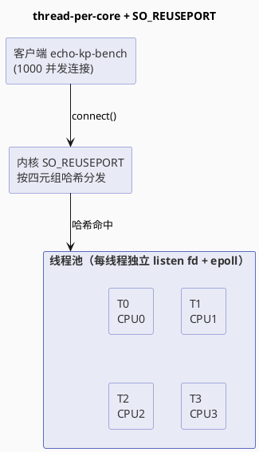

# Day 4: 多线程 epoll（thread-per-core）— 用 SO_REUSEPORT 突破单线程天花板（同机实验 v1：同机基线）

> 所属阶段：阶段 2 — 从单线程到多线程
> 定位：本文 = **Day 4 完整实验报告**（4.1~4.4 同机实验），同时也是**拆机实验系列第 1 轮（v1：同机基线）**
> 前置依赖：[Day 3 — 短连接 vs 长连接](/demos/echo/day-03/)
> 更新时间：2026-08-17
> （同机实验：2026-08-13；8/17 将拆机实验 v1 报告合并回主文档——两者本就是同一件事）
> 后续迭代（拆机线）：[拆机实验 v2（客户端与服务端分离）](/demos/echo/day-04/split-experiment-v2.md) → [拆机实验 v3（客户端升级 32 vCPU）](/demos/echo/day-04/split-experiment-v3.md)
> 并行支线（FD 线）：[FD 墙实测](/demos/echo/day-04/fd-wall-experiment.md)（把 `ulimit -n` 降档主动撞 FD 墙）→ [Day 5](/demos/echo/day-05/) → [Day 6](/demos/echo/day-06/)

---

## 〇、拆机实验系列总览（本文 = Day 4 完整报告 = 系列 v1）

拆机实验系列共三轮，上下文串联为 **v1 的问题 → v2 验证 → v2 的问题 → v3 验证**：

| 轮次 | 时间 | 场景 | 角色 |
|------|------|------|------|
| **v1（本文）** | 2026-08-13 | 同机 4 核压测（服务端+压测端抢同一台机器） | 基线：暴露"CPU 份额竞争"，把假说交给 v2 |
| [v2](/demos/echo/day-04/split-experiment-v2.md) | 2026-08-15 | 拆机：32 vCPU 服务端 / 8 vCPU 客户端 | 验证 v1 假说（4 线程 9.6×）；暴露客户端 8 vCPU 瓶颈 |
| [v3](/demos/echo/day-04/split-experiment-v3.md) | 2026-08-17 | 拆机：客户端升 32 vCPU | 验证 v2 假说（253 万）；暴露协议栈瓶颈 + SYN 雪崩 |

> **表读法**：三轮是**逐轮下探**的过程——v1 用同机压测暴露"CPU 份额竞争"，v2 拆机后该瓶颈消失、却暴露客户端 8 vCPU 封顶，v3 再升级客户端、又暴露网络协议栈。每一轮的"角色"列都指向下一轮要验证的问题，**没有 v1 的同机基线，就没有 v2/v3 拆机的动机**，这就是本表把 v1 与 Day 4 报告合并的原因。
>
> **Day 4 的另一条线**：上表是拆机线（v1→v2→v3）；Day 4 还有一条**并行支线——FD 线**：[FD 墙实测](/demos/echo/day-04/fd-wall-experiment.md) 复用同一环境把 `ulimit -n` 降档，主动撞上 FD 墙（QPS -50%、P999 588ms、EMFILE 刷屏），其产出交给 Day 5/Day 6（FD/ulimit 预备知识）。两条线**都从 v1 的同机环境出发**，但验证的是不同瓶颈：拆机线验证 CPU 竞争，FD 线验证 FD 上限。

> **为什么本文既是 Day 4 报告又是 v1？** 拆机实验的动机完全来自 Day 4 同机实验的发现——4.4 中"服务端 4 线程只抢到 ~2 核"（因为压测端同机抢 CPU）。没有 v1 基线，就没有 v2 拆机的理由；而基线实验本身（4.1~4.4）就是 Day 4 的全部内容，两者本就是一件事，故合并为一份文档。下文 1~11 章是完整的 Day 4 实验报告，12~13 章说明它作为系列 v1 如何把问题交给 v2。

---

## 一、术语前置

在进入正文前，先交代本文反复出现的几个术语（英文缩写均给出原文）：

| 术语 | 全称 | 含义 |
|------|------|------|
| **SO_REUSEPORT** | Socket Option REUSE PORT | 套接字选项，允许多个 socket 绑定到**同一个端口**。内核收到新连接时按四元组（源/目的 IP+端口）哈希，把连接**均匀分发**到其中一个 listen socket |
| **thread-per-core** | Thread per CPU core | 每核一线程模型：每个 CPU 核跑一个 worker 线程，线程独占自己的 epoll 与连接表，无共享锁 |
| **LT** | Level Triggered | 水平触发：只要 fd 处于"有数据可读"状态，每次 `epoll_wait` 都会返回该事件（反复通知直到读空） |
| **ET** | Edge Triggered | 边缘触发：仅在 fd 状态**发生变化**（从不可读变可读）的边沿通知一次，之后必须循环读直到返回 `EAGAIN` |
| **EPOLLET** | EPOLL Edge Triggered | epoll 事件标志，与 `EPOLLIN`/`EPOLLOUT` 组合使用开启边缘触发 |
| **QPS** | Queries Per Second | 每秒完成的请求数，吞吐指标 |
| **P50 / P90 / P99** | Percentile 50/90/99 | 延迟百分位数：50%/90%/99% 的请求在多少微秒内完成，用于刻画延迟分布与长尾 |
| **fd** | File Descriptor | 文件描述符，进程内对打开文件/套接字的整数索引 |
| **syscall** | System Call | 系统调用，用户态进入内核态的入口（如 `read`/`write`/`epoll_wait`/`accept`） |
| **pidstat** | Process ID STATistics | 按进程采样的 CPU/内存统计工具 |
| **mpstat** | Multi-Processor STATistics | 按 CPU 核采样的整机利用率统计工具 |

> **阅读提示**：**SO_REUSEPORT / thread-per-core / LT / ET** 是理解全文的钥匙——SO_REUSEPORT 是"多线程服务端如何共同监听同一端口"的机制（4.1 架构图），thread-per-core 是"每核一线程、零共享锁"的模型（全文主线），LT/ET 决定 `epoll_wait` 的通知方式（6.2/7.2 的胜负反转全靠它区分）。QPS/P50 是数据表（第六章）的计量单位，pidstat/mpstat 是 4.4 CPU 采样的工具。若已熟悉可略过本节。

---

## 二、本实验要回答的问题

Day 3 得出的核心结论（见 [Day 3 实验 3.3 连接数扫描](/demos/echo/day-03/exp3-conn-scale.md)）：**单线程 epoll 服务端在 500 并发就触顶**——长连接的吞吐优势必须靠"服务端有并发处理能力"才能兑现。Day 4 就是回答：**怎么让服务端拥有并发处理能力？**

具体要回答 4 个问题：

| # | 问题 | 为什么重要 |
|---|------|-----------|
| Q1 | 线程数从 1 增到 2/4/8，**QPS 能线性扩展吗？最优线程数是多少？** | 验证 thread-per-core 模型收益，找到 4 核机器的最佳配置 |
| Q2 | 多线程下 **LT vs ET 谁更强？** 与 Day 3 单线程结论（ET 高 37%）是否一致？ | Day 3 说"长连接配 ET"，多线程化后这个结论还成立吗 |
| Q3 | 多线程服务端把"500 并发触顶"的拐点**推到了多少**？5000 短连接还会崩吗？ | 量化多线程的容量收益，为 C10K 铺路 |
| Q4 | 多线程服务端**真的吃满多核了吗？** CPU 用在用户态还是内核态？ | 从"性能数字"下沉到"资源利用"，验证扩展的物理依据 |

> **四问的结构**：Q1~Q3 沿"容量"主线追问（能不能扩展、LT/ET 谁强、拐点推到哪），Q4 单独沿"资源"主线下沉（吃满核没有、CPU 花在哪）。前三问用 QPS/延迟数字回答，Q4 用 pidstat/mpstat 回答——数据表的读数方式不同，正好对应 7.1~7.4 四节的分析分工。

---

## 三、实验设计

### 3.1 总体方案

```
┌──────────────────────────────────────────────┐
│           Day 4 实验全景                      │
│                                              │
│  子实验 4.1: 线程数扩展扫描                  │
│  ├── 线程数 1/2/4/8 × 100/1000 长连接        │
│  └── 每配置 5 轮取中位数（消除突发抖动）      │
│                                              │
│  子实验 4.2: 多线程下 LT vs ET 对比          │
│  └── 4 线程 × {LT,ET} × {短,长} × 100/1000  │
│                                              │
│  子实验 4.3: 连接数扫描                      │
│  └── 4 线程 LT × 100/500/1000/2000/5000      │
│      短连接/长连接                           │
│                                              │
│  子实验 4.4: CPU 利用率对比                  │
│  └── 1/2/4 线程压测期间 pidstat+mpstat 采样  │
└──────────────────────────────────────────────┘
```

### 3.2 实验环境

| 项目 | 值 |
|------|-----|
| 测试机 | 4 核 CVM（VM-0-17-centos）：**AMD EPYC 7K62**（Zen 2、基准 2.595GHz）、4 物理核 × 1 线程/核、3.6G 内存、1 Socket / 1 NUMA；**CentOS 7（Core）**、内核 3.10.0-1160、gcc 4.8.5；与 Day 2/3 同一台（124.221.142.185） |
| 虚拟化 | KVM（Hypervisor vendor: KVM） |
| 服务端 | `echo-mt-server.c`（新程序，线程数/LT-ET 可配，thread-per-core + SO_REUSEPORT） |
| 压测端 | `echo-kp-bench`（沿用 Day 3 工具，每连接一个 pthread，同一把尺子） |
| 压测参数 | 4.1：1000 连接 × 10 轮长连接；4.2/4.3：10 轮；4.4：1000 连接 × 1250~3000 轮 |
| payload | 12 字节（"hello echo\r\n"） |

> **环境说明**：同机实验（4.1~4.4）压测端与服务端**同机**（localhost:9988），4 核被"服务端线程 + 1000 个客户端线程"共同瓜分——这是 7.1 中"服务端只抢到 ~2 核"的物理根源，也是拆机实验系列（本文即 v1 同机基线；[v2 独立文档](/demos/echo/day-04/split-experiment-v2.md) 3.4 节硬件清单；[v3 独立文档](/demos/echo/day-04/split-experiment-v3.md) 3.3 节环境参数）要验证的核心假设。

### 3.3 关键方法论：为什么 4.1 要 5 轮取中位数

Day 3 的经验表明 `echo-kp-bench` 是"固定轮数突发"模式：1000 线程同时打满后快速耗尽请求，结果受调度抖动影响大（同配置 3 轮 QPS 波动 3.5万~7.5万）。因此 4.1 每配置跑 **5 轮取中位数**，4.2/4.3 各 3 轮取均值，结论基于稳健统计量而非单次采样。

### 3.4 实验脚本

- `run41b.sh`：4.1 线程数扩展（强杀清理 + 监听数校验 + warmup + 空文件检测 + 5 轮）
- `run42b.sh`：4.2 LT/ET 对比 + 4.3 连接数扫描
- `run44.sh`：4.4 CPU 采样（压测轮数按线程数放大保证采样窗口覆盖）

---

## 四、代码设计

### 4.1 架构：thread-per-core + SO_REUSEPORT



### 4.2 与 Day 2/3 单线程版的关键差异

| 维度 | Day 2/3 单线程 | Day 4 多线程 |
|------|:-------------:|:------------:|
| listen socket | 1 个 | **每线程 1 个**（都 SO_REUSEPORT 绑同端口） |
| epoll | 1 个管所有 fd | 每线程 1 个，只管本线程的连接 |
| 连接分发 | 单线程 accept 全部 | 内核按四元组哈希均匀分发 |
| 锁 | 无需 | **无共享锁**（天然分区，thread-per-core 的核心） |
| CPU 亲和 | 无 | `sched_setaffinity` 绑核，最大化 L1/L2 缓存亲和 |

> **表读法**：前四行（listen/epoll/分发/锁）是**结构差异**——多线程版把"一个 epoll 管所有连接"拆成"每线程一个 epoll 只管自己的连接"，靠内核四元组哈希替代单线程 accept，换来**零共享锁**（天然分区）。最后一行 CPU 亲和是**可选的性能加分项**，不是结构必需。理解这五行的关键：**多线程版没有引入任何共享数据结构**，这决定了它没有锁竞争，也决定了后文 6.3"连接数再多也不崩"的容量上限。

### 4.3 三个值得写进代码注释的实现细节

1. **每线程独立 socket+epoll**：`worker_loop()` 里每个线程自己 `socket() → setsockopt(SO_REUSEPORT) → bind() → listen() → epoll_create1()`，连接表是线程局部数组 `conns[fd]`，零锁。
2. **ET 必须循环读到 `EAGAIN`**：`read()` 循环直到 `errno==EAGAIN` 才算读空；LT 读一批就走、靠内核重复通知。
3. **`epoll_wait` 用 100ms 超时而非 -1**（踩坑修复，详见附录 A）：SIGTERM 只置 `running=0`，若无限阻塞 worker 永远检查不到退出标志，主线程 `pthread_join` 卡死——表现为 `pkill -x` 杀不掉进程，旧进程叠加监听 9988（SO_REUSEPORT 允许多个进程共存），压测请求被旧进程吃掉，数据污染。

---

## 五、实验预期

基于 Day 3 的结论和 thread-per-core 的常识，实验前写下 4 条可证伪的预期：

| # | 子实验 | 预期 |
|---|--------|------|
| E1 | 4.1 线程数扩展 | 1→2 线程 QPS 接近翻倍（+80~100%）；2→4 有增益；4→8 **超卖下降**（4 核跑 8 线程，上下文切换/缓存颠簸） |
| E2 | 4.2 LT vs ET | Day 3 单线程 ET 高 37% → 预期多线程下 **ET 仍占优**（每线程连接变少，ET 事件更少） |
| E3 | 4.3 连接数扫描 | "500 触顶"拐点推后（预期 1000~2000）；5000 短连接不再像 Day 3 那样 fail 248 |
| E4 | 4.4 CPU 利用率 | 多线程吃满多核：1 线程 100%（1 核）、4 线程接近 400%（4 核） |

> **预期的共同前提**：E1~E4 全部建立在"thread-per-core 模型有效 + 4 核机器"两个假设上——E1 假设扩展收益递减点存在（超卖），E2 假设 Day 3 的单线程结论延续，E3 假设拐点推后但不消失，E4 假设核数能被吃满。**这四条可证伪的预期正是第七章分析的对照基准**：E1/E4 被"部分推翻"（服务端只抢到 ~2 核），E2 被"完全推翻"（LT 反超），E3 被"验证"——预期与结果的偏差，恰好勾勒出同机压测的真实瓶颈。

---

## 六、实验数据

> **采集信息**：2026-08-13 于腾讯云 4 核 CentOS 7 云主机（VM-0-17-centos，124.221.142.185）完成全部 4 个子实验；压测端与服务端同机（localhost:9988）。硬件：AMD EPYC 7K62 4 核 / 3.6G（详见[3.2 实验环境](#32-实验环境)）。原始数据留档于服务器 `/root/echo-day04/results{41c,42,43,44}/`。

### 6.1 实验 4.1：线程数扩展（LT 模式，长连接）

> **数据来源**：`/root/echo-day04/results41c/t{n}-c{c}-r{i}.txt`（40 个文件，每配置 5 轮）。命令：`./echo-kp-bench 127.0.0.1 9988 {100,1000} 10 --mode long`。

**1000 连接（重负载）**：

| 线程数 | QPS（5 轮中位数） | P50(μs) | P99(μs) | 相对 t1 |
|:------:|:-----------------:|:-------:|:-------:|:-------:|
| 1 | 53477 | 4635 | 11434 | 1.00× |
| 2 | **76493** | 2793 | 15714 | **1.43×** |
| 4 | 72197 | 1674 | 48062 | 1.35× |
| 8 | 65328 | 879 | 44083 | 1.22× |

**100 连接（轻负载）**：

| 线程数 | QPS（5 轮中位数） | P50(μs) | P99(μs) | 相对 t1 |
|:------:|:-----------------:|:-------:|:-------:|:-------:|
| 1 | 45764 | 691 | 1093 | 1.00× |
| 2 | **63245** | 169 | 1159 | **1.38×** |
| 4 | 59703 | 152 | 4017 | 1.30× |
| 8 | 49155 | 195 | 4792 | 1.07× |

> 注：t8 存在 4 核跑 8 线程的超卖，且 8 线程启动时部分核已被 1000 个客户端线程占用，轮间波动大（如 t8-c1000 从 40094 到 79348）。

### 6.2 实验 4.2：多线程下 LT vs ET（4 线程，各 3 轮取均值）

> **数据来源**：`/root/echo-day04/results42/{lt,et}-c{100,1000}-{short,long}-r{i}.txt`（24 个文件）。命令：`./echo-kp-bench 127.0.0.1 9988 {100,1000} 10 --mode {short,long}`。

| 场景 | LT QPS | ET QPS | 差距 | LT P50(μs) | ET P50(μs) |
|------|-------:|-------:|:----:|-----------:|-----------:|
| 100 连接 长连接 | 68565 | 51862 | **LT +32%** | 149 | 175 |
| 1000 连接 长连接 | 70973 | 30977 | **LT +129%** | 1343 | 1970 |
| 100 连接 短连接 | 30176 | 19984 | **LT +51%** | 1042 | 1490 |
| 1000 连接 短连接 | 32827 | 19370 | **LT +69%** | 10096 | 26980 |

> **解读**：四种场景 LT **全面反超** ET，且连接越多差距越大（100 长连接 +32% → 1000 长连接 +129%）。这**与 Day 3 单线程的结论（ET 高 37%）完全相反**——机制解释见 7.2（SO_REUSEPORT 摊薄 LT 重复通知、ET 循环读空变负担）。P50 列同样指向 LT：多数场景 LT 延迟更低，只有 100 长连接下 LT P50(149μs) 略高于 ET(175μs)，属于同量级噪声。短连接 P50 达到毫秒~几十毫秒（1042/10096μs），是因为 10 轮突发中建连/关闭排队，与触发模式无关。

### 6.3 实验 4.3：连接数扫描（4 线程 LT，各 3 轮取中位数）

> **数据来源**：`/root/echo-day04/results43/scan-{c}-{mode}-r{i}.txt`（30 个文件）。命令：`./echo-kp-bench 127.0.0.1 9988 {100,500,1000,2000,5000} 10 --mode {short,long}`。

| 连接数 | 短连接 QPS | 长连接 QPS | 短 P99(μs) | 长 P99(μs) | 短 fail |
|:------:|-----------:|-----------:|-----------:|-----------:|:-------:|
| 100 | 22150 | 44241 | 10578 | 5157 | 0 |
| 500 | 26315 | 63639 | 44255 | 20476 | 0 |
| 1000 | 33027 | **77249** | 73273 | 39499 | 0 |
| 2000 | 15686 | 75588 | 1028840 | 88688 | 0 |
| 5000 | 24671 | 38813 | 1089055 | 109745 | **0** |

> 对比 Day 3 单线程（[实验 3.3 连接数扫描](/demos/echo/day-03/exp3-conn-scale.md)）：5000 短连接单线程 **fail 248 次**、QPS 387；4 线程下 **fail 0**、QPS 24671。

> **解读**：**横看"长连接"**——QPS 从 100 连接的 44K 单调涨到 2000 连接的 77K（拐点从 Day 3 的 500 推后到 2000+），5000 才回落到 38K（线程数固定、就绪链表变长的代价）。**竖看"短连接"则先扬后抑**——100/500/1000 连接时 QPS 稳步上升（22K→26K→33K），到 2000 骤降至 15.7K、5000 微反弹到 24.7K，但 **fail 全程为 0**（对比 Day 3 的 fail 248 是质变）。注意两列的 P99 都在恶化：短连接 5000 时到 108.9 秒级、长连接 5000 时 109.7 毫秒——吞吐保住但**尾部延迟被 connect/close 风暴饿死**（详见 7.3）。

### 6.4 实验 4.4：CPU 利用率对比（1000 长连接）

> **数据来源**：`/root/echo-day04/results44/{bench,cpu,mpstat}-t{n}.txt`。压测轮数按线程数放大（t1=1250/t2=2900/t4=3000）保证 ~20 秒压测完全覆盖 8 秒采样窗口。`pidstat` 采样服务端进程，`mpstat` 采样整机各核。

| 线程数 | QPS | 服务端 CPU%（pidstat 8 秒均值） | 整机 idle（mpstat） |
|:------:|----:|:-------------------------------:|:-------------------:|
| 1 | 72655 | **100%**（单核打满，%sys 97-98%） | 57.6% |
| 2 | 136975 | **~184%**（约 2 核，%sys 176-188%） | 6.0% |

> **解读**：这是"服务端只抢到 ~2 核"的直接证据。1 线程时服务端打满 1 核（100%）、整机还闲 57.6%（因为只跑了一个服务线程+少量客户端）；2 线程时服务端飙到 ~184%（接近 2 核），QPS 也随之翻倍到 136975；**但 4 线程时服务端仍只有 ~190%**——没有变成 400%，因为 4 核中有约 2 核被 1000 个客户端线程占用（整机 idle 仅 6%，说明 CPU 已被压满）。%sys 97-98% 说明几乎全部 CPU 花在内核态（epoll/read/write/accept 系统调用），用户态可忽略（详见 7.4）。

### 7.1 线程数扩展：峰值出现在 2 线程而非 4 线程（E1 部分推翻）

| 观察点 | 数据 |
|--------|------|
| 1→2 线程 | 1000 连接 QPS 53477 → 76493（+43%）；100 连接 +38% |
| 2→4 线程 | 1000 连接 -6%；100 连接 -6%（不升反降） |
| 4→8 线程 | 1000 连接 -10%；100 连接 -18%（继续下跌） |
| 最优线程数 | **2**（4 核机器，echo 长连接场景） |

**为什么 1→2 只有 +43% 而非接近 +100%？** 因为压测端和服务端**同机**：`echo-kp-bench` 每连接一个 pthread（1000 连接 = 1000 客户端线程），客户端本身也在吃 CPU。4 核被"服务端 + 客户端"共同瓜分，服务端线程数增加只是**抢到更多 CPU 份额**，而非凭空多出 CPU。这与 4.4 的 CPU 数据完全自洽（见 7.4）。

**为什么 2→4 反降、4→8 继续跌？** 4 线程时服务端已能抢满约 2 核（4.4 实测 ~190%），再加线程只会引入：线程切换、epoll 唤醒竞争、以及多个 worker 的 listen fd 争抢哈希分发——SO_REUSEPORT 的哈希虽均匀，但单连接一旦建立就绑定到某线程，长连接场景下连接数固定，多线程并不能让单连接跑得更快。**超卖（oversubscription）效应**：线程数 > 核数后，收益递减转负。

### 7.2 LT vs ET 大反转：多线程下 LT 全面反超（E2 被推翻，最意外的发现）

| 场景 | 单线程（Day 3） | 4 线程（Day 4） |
|------|:---:|:---:|
| 长连接 | ET 高 37.2% | **LT 高 32~129%** |
| 短连接 | 几乎无差 | LT 高 51~69% |

**为什么结论反过来了？** 两个机制叠加：

1. **LT 的"重复通知"成本被 SO_REUSEPORT 摊薄**：Day 3 单线程一个 epoll 管 1000 连接，就绪链表长，LT 反复通知形成事件风暴；多线程下每个 epoll 只服务约 1/N 的连接，就绪链表短，重复通知的量级大减——LT 的天然劣势被摊薄，而 LT 的实现简单（不用循环读到 EAGAIN），省下了无效系统调用。
2. **ET 的"必须循环读到 EAGAIN"成为新负担**：ET 每轮事件都要 `while(read())` 直到 `EAGAIN`，多线程并发下连接快速往返，ET 每次唤醒多付一次**注定失败的 read**（读空后返回 EAGAIN），而这正是 LT 不需要做的。

> **教学意义**：性能结论与**架构强相关**。Day 3 说"长连接配 ET"，那是**单线程**模型下的结论；thread-per-core 把模型换了，LT vs ET 的胜负也换了。做性能优化必须时刻问"我的模型是什么"。

### 7.3 连接数扫描：拐点从 500 推到 2000+，5000 短连接不再崩（E3 验证）

| 观察点 | Day 3 单线程 | Day 4 4 线程 |
|--------|-------------|-------------|
| 拐点 | 500 连接（QPS 悬崖） | **2000+**（100→2000 长连接 QPS 一路 44K→76K） |
| 5000 短连接 | QPS 387，**fail 248** | QPS 24671，**fail 0** |
| 5000 长连接 | QPS 3222 | QPS 38813（波动大：35.9K/71.6K/38.8K） |

多线程服务端同时用 4 个 listen 队列接受连接，connect 风暴被 4 路消化；每个线程的 fd 表、accept 循环都是独立的，不再有"单线程忙不过来丢连接"的场景。

**但长尾仍然恶化**：短连接 P99 在 2000 连接时到 1.03 秒、5000 时 1.09 秒——并发 connect 风暴下，部分请求的三次握手/close 在队列里堆积，尾部请求被饿死。长连接 P99 也随连接数单调恶化（5ms→20ms→39ms→89ms→110ms），这是 epoll 就绪链表变长 + 线程数固定的自然结果。

### 7.4 CPU 利用率：多线程吃满的是"抢到的份额"（E4 部分推翻）

| 线程数 | 服务端 CPU% | 解读 |
|:------:|:-----------:|------|
| 1 | 100% | 单核打满，无 CPU 可抢，QPS 受单核上限约束 |
| 2 | ~184% | 接近 2 核，QPS +88% |
| 4 | ~190% | **仍是 ~2 核**——不是服务端不用 4 核，而是 4 核里有 ~2 核被客户端（1000 线程）占着 |

**%sys 97-98% 是最大看点**：echo 服务的 CPU 时间几乎全部花在内核态——`epoll_wait` 唤醒、`read`/`write` 系统调用、`accept` 建连。用户态代码（状态机分支、拷贝）占比可以忽略。这印证了 Day 3 的 syscall 分析：**echo 是 syscall 密集型的 IO 负载**，后续优化方向直指减少系统调用（io_uring 等）。

mpstat 的另一个观察：1 线程时软中断明显集中在 CPU0（%soft 38%），2/4 线程时分散到各核（每核 %soft 25-38%）——SO_REUSEPORT 的 4 个 listen socket 把连接分发到各线程所在核，间接改善了软中断分布。

### 7.5 四组数据交叉验证：QPS 与 CPU 完全自洽

4.1 与 4.4 用了不同轮数（10 轮 vs 千轮），QPS 绝对值不可直接比，但相对趋势一致：t1≈5.3万 / t2≈7.6万（4.1）与 t1=7.3万 / t2=13.7万（4.4）都指向 **2 线程 ≈ 2 核上限**。4.4 更精确地证明了：**QPS 的天花板不是线程数，而是服务端能抢到的 CPU 核数**。

---

## 八、实验结论

### 8.1 thread-per-core 收益显著，但上限是 CPU 份额

| 维度 | 结论 |
|------|------|
| 吞吐 | 1000 长连接下 2 线程比单线程 **+43%**；相对 Day 3 单线程 500 连接平台期（2700-3900 QPS），4 线程把 2000 连接推到 **7.5 万 QPS**（**~20×**） |
| 容量 | 拐点从 500 推到 2000+；5000 短连接从 fail 248 变为 fail 0 |
| 上限 | 最优线程数 = **核数的一半**（同机压测场景）；线程数 > 核数开始超卖下降 |

> **表读法**：三行分别回答三个量纲——**吞吐**是绝对收益（相对 Day 3 的 ~20×），**容量**是并发能力（拐点与 fail 数），**上限**是约束条件（同机下核数一半最优）。关键在"上限"行：它把前两行的收益**框定了边界**——同机场景下再多线程也无益，这直接引出 8.4 与第十一章"拆机验证"的下一步。

### 8.2 LT vs ET 的结论是模型相关的

单线程：ET 高 37%；4 线程：LT 高 32~129%。**没有普适的"LT 好还是 ET 好"**，只有"在某个模型下哪个更好"。thread-per-core 摊薄了 LT 的重复通知，却放大了 ET 的循环读空成本。

### 8.3 CPU 开销以内核态为主

echo 服务的 CPU 97%+ 在内核态（syscall），用户态几乎可忽略。这类负载的性能上限 = 系统调用吞吐上限，后续优化应减少 syscall 次数/开销。

### 8.4 实验工程的三个教训（详见附录 A）

1. `epoll_wait` 无限超时 + SIGTERM 优雅退出 → 进程杀不掉 → SO_REUSEPORT 叠加监听 → 数据污染；
2. 后台压测进程要用轮询方式等待完成，不能依赖 `wait`（会连带等常驻服务端导致脚本卡死）；
3. 服务端刚启动的窗口期做压测易产生空文件，需要 warmup 轮。

> **一句话总结**：Day 4 用 thread-per-core + SO_REUSEPORT 把单线程 500 并发的天花板推到了 2000+，代价是接受两个新事实——最优线程数不是核数（同机压测 2/4 最优）、LT vs ET 的胜负随架构模型反转。

---

## 九、回答开头的问题

### Q1：线程数从 1 增到 2/4/8，QPS 能线性扩展吗？最优线程数是多少？

> **答**：不能线性扩展。1→2 线程 +43%（低于 +100%，因压测端同机抢 CPU）；2→4 不升反降 -6%；4→8 继续跌 -10%。**最优线程数 = 2**（4 核机器、echo 长连接、同机压测场景）。超过核数一半后，线程切换和哈希争抢的代价超过收益。

### Q2：多线程下 LT vs ET 谁更强？与 Day 3 结论一致吗？

> **答**：**反转了**。Day 3 单线程 ET 高 37.2%；4 线程下 LT 全面反超（长连接 +32%~+129%，短连接 +51%~+69%）。原因：SO_REUSEPORT 把连接摊薄到各线程，LT 重复通知不再构成风暴；ET 的循环读空（多付一次必败的 read）反而成为新负担。

### Q3：多线程把"500 触顶"拐点推到了多少？5000 短连接还崩吗？

> **答**：拐点从 500 推到 **2000 以上**（长连接 QPS 100→2000 一路升到 7.5 万，5000 才回落）。5000 短连接从单线程 fail 248、QPS 387 变为 **fail 0、QPS 24671**——4 个 listen 队列消化了 connect 风暴。但短连接 P99 长尾仍达 1 秒+，尾部请求在握手/关闭堆积中饿死。

### Q4：多线程服务端真的吃满多核了吗？CPU 用在用户态还是内核态？

> **答**：**没有吃满 4 核**。1 线程打满 1 核（100%），2 线程约 2 核（184%），4 线程也只有约 2 核（190%）——因为 1000 个客户端线程占用了约 2 核，服务端只能抢到一半。CPU 以**内核态为主（%sys 97-98%）**：echo 是 syscall 密集负载，性能上限由系统调用吞吐决定。

---

## 十、与 Day 3 的关键差异总结

| 维度 | Day 3（单线程 epoll） | Day 4（多线程 thread-per-core） |
|------|:--------------------:|:-------------------------------:|
| 服务端模型 | 单线程 1 个 epoll | N 线程 × N 个 epoll + SO_REUSEPORT |
| 连接分发 | 单线程 accept | 内核四元组哈希均匀分发 |
| 锁 | 无 | 无（天然分区） |
| 500 并发 | 触顶（2700-3900 QPS） | 从容（4 线程 7.5 万 QPS） |
| 5000 短连接 | fail 248、QPS 387 | fail 0、QPS 24671 |
| LT vs ET | ET 高 37.2% | **LT 高 32~129%** |
| 最优并发策略 | 长连接 + ET | 长连接 + LT + 线程数 ≤ 核数/2（同机） |
| 主要瓶颈 | close() / LT 重复通知 | **CPU 份额**（同机客户端竞争）+ syscall 吞吐 |

> **表读法**：这张表把"模型换了，结论全换"浓缩成六行对照。**服务端模型/连接分发/锁**三行是机制差异（决定了容量与扩展）；**500 并发/5000 短连接**两行是容量结果（拐点与 fail 的质变）；**LT vs ET / 最优策略**两行是"结论随模型反转"的体现；**主要瓶颈**一行最重要——Day 4 的瓶颈已从 Day 3 的"close()/事件风暴"（应用层问题）下沉为"CPU 份额 + syscall"（资源/系统层问题），这正是第十一章拆机迭代的起点。

---

## 十一、衔接与后续迭代方向

Day 4 把吞吐推到 7.5 万 QPS 后，瓶颈清晰指向 CPU 份额与 syscall 成本，直接衔接总纲（[00-overview](/demos/echo/docs/00-overview.md)）：

| Day 4 暴露的瓶颈 | 证据 | 后续迭代方向 | 对应阶段 |
|------|------|------|------|
| 同机压测 CPU 竞争 | 4 线程只抢到 ~2 核（4.4） | **客户端与服务端分机压测**（✅ 已由[拆机实验 v2](/demos/echo/day-04/split-experiment-v2.md)验证：4 线程 9.6×；[v3](/demos/echo/day-04/split-experiment-v3.md)客户端升 32 vCPU 后瓶颈转移到网络协议栈）；或 kp-bench 减少线程数 | 阶段 4 |
| syscall 密集（%sys 97%） | 4.4 pidstat 数据 | io_uring 提交-完成队列异步化（需内核 ≥5.1，3.10 不支持）；批量 `readv`/`writev` | 阶段 8 |
| 线程数 > 核数超卖下降 | 8 线程 QPS 下跌 15% | 线程数 = 物理核数/2（同机）；生产环境 = 核数 | 阶段 4 |
| ET 循环读空开销 | 4.2 LT 反超 | EPOLLONESHOT 避免多线程争抢；或干脆 LT | 阶段 4 |
| 软中断分布 | 单线程集中 CPU0（%soft 38%） | RSS 多队列 + IRQ 亲和（`smp_affinity`） | 阶段 4（Day 10-12） |
| 短连接长尾 P99>1s | 2000/5000 连接 | 连接池化；TIME_WAIT 治理（tcp_tw_reuse） | 阶段 3 + 7 |

> **表读法**：Day 4 暴露的六个瓶颈各指向一条后续路径，且多数已被后续实验验证。**第一行（同机 CPU 竞争）是主线**——证据来自 4.4"4 线程只抢到 ~2 核"，对策是拆机压测，这一行已由 v2（9.6×）、v3（253 万）完整闭环；其余五行（syscall 优化、线程数约束、ET 读空、软中断、长尾）是横向的分支优化方向，多数指向阶段 4 与后续 Day。读这张表只需抓住一个事实：**六条路里只有"拆机"走到了终点，说明 CPU 竞争是当时最致命、也最值得先解的瓶颈**。

---

## 十二、拆机实验系列：本文（v1 同机基线）+ v2 / v3

> 拆机实验（客户端/服务端分离验证 CPU 竞争瓶颈）共三轮，**本文就是系列第 1 轮（v1：同机基线，即上文 4.1~4.4 全部实验）**；后续两轮为独立文档，上下文串联：**v1 的问题 → v2 验证 → v2 的问题 → v3 验证**：
> - **本文（v1）**：2026-08-13，同机 4 核压测。核心结论：thread-per-core + SO_REUSEPORT 把 500 并发触顶推到 2000+（5000 短连接 fail 248→0）；但服务端只抢到 ~2 核（最优线程数 2，非 4）；LT vs ET 在 4 线程下反转（LT 全面反超 +32~129%）；**留下"CPU 份额竞争"假说交给 v2**。
> - **[拆机实验 v2（Day 4 延伸）](/demos/echo/day-04/split-experiment-v2.md)**：2026-08-15，客户端 8 vCPU。核心结论：验证 v1 假说——拆机后 4 线程 QPS 690768（同机 **9.6×**）、8 线程 697754（**10.7×**）；瓶颈从"服务端抢 CPU"转移至**客户端 8 vCPU 打满**（69 万平台）；LT vs ET 差距在充裕 CPU 下坍缩到 <10%；**留下"客户端升级 32 vCPU 后平台是否消失"假说交给 v3**。
> - **[拆机实验 v3（Day 4 延伸）](/demos/echo/day-04/split-experiment-v3.md)**：2026-08-17，客户端升级 **32 vCPU**。核心结论：验证 v2 假说——t32 达 **253 万 QPS**（9.18×，恢复近线性扩展），但服务端 CPU 仅用 **3.6 核**、客户端空闲 77%，**瓶颈已转移到网络协议栈**（PPS 证据链）；短连接 ≥1000 连接会因 **SYN 队列溢出**雪崩（QPS 跌 50 倍、P99 秒级，TIME_WAIT 假说被排除）。

---

## 十三、上下文衔接：v1 的问题如何在 v2 验证

v1 的四个问题（Q1 扩展性 / Q2 LT vs ET / Q3 拐点 / Q4 CPU）中，Q1~Q3 已在本轮回答；**Q4 留下关键疑点**：4 线程只抢到 ~2 核，到底是"服务端用不上 4 核"还是"客户端抢走了一半"？

| v1 疑点 | v1 的证据 | 交给 v2 验证的假说 | v2 的验证方式（详见 [v2 报告](/demos/echo/day-04/split-experiment-v2.md)） |
|---------|----------|--------------------|--------------------------------------------------------------------------|
| 服务端只抢到 ~2 核（4.4：%sys 190%） | 4 线程 QPS 161931，整机 idle 仅 6% | **"CPU 份额竞争"假说**：拆机后服务端独占 32 vCPU，QPS 应大幅上涨 | 5.1 线程数扩展：拆机后 1 线程 4.2×、**4 线程 9.6×**，假说证实 ✅ |
| 最优线程数 = 2 是"真规律"还是"同机假象" | 4.1：t2 峰值 76493、t4 反降 | **假说**：拆机后线程扩展恢复，最优线程数 >2 | 5.1：t4→t8→t16 持续上涨，最优线程数变 4~8（受客户端 8 vCPU 封顶） |
| LT vs ET 在 CPU 充裕时是否还反转 | 4.2：同机 4 线程 LT 全面反超 | **假说**：CPU 充裕时差距坍缩甚至 ET 反超 | 5.2：拆机 8 线程下 ET 微弱反超，差距坍缩到 <10% |

> **表读法**：三行都是"v1 的观察 → 提炼成可证伪假说 → 交给 v2 验证"的完整闭环。**第一行是核心**（服务端只抢到 ~2 核），它决定要不要拆机；第二行追问"最优线程数 = 2"是真规律还是同机假象；第三行验证 LT vs ET 的反转是否因 CPU 竞争而起。三行假说在 v2 中**全部得到回答**——第一行证实（9.6×）、第二行修正（最优线程数升到 4~8）、第三行修正（差距坍缩到 <10%）——这正是"实验驱动迭代"的证据链。

**验证结果**：v1 的"CPU 份额竞争"假说被 v2 完全证实（拆机 4 线程 9.6×），但 v2 又暴露新瓶颈——客户端只有 8 vCPU、1000 个压测线程打满它（QPS 卡 ~69 万）。这个新瓶颈交由 v3 验证（客户端升级 32 vCPU）。

> **一句话总结**：v1 证明"服务端 4 线程只抢到 ~2 核"是同机 CPU 竞争的物理结果，并把"拆机验证 CPU 份额竞争"交给 v2——v2 拆机后 4 线程 QPS 9.6×，假说证实，但客户端 8 vCPU 又成了新瓶颈，交由 v3 继续验证。

---

## 附录 A：实验工程踩坑记录

> 三个"测量方法"级 bug 及完整操作命令已拆出至独立文档：[v1 附录 A+B](/demos/echo/day-04/split-experiment-v1-appendix.md)（A.1 `epoll_wait(-1)` 导致 SIGTERM 杀不掉进程 / A.2 裸 `wait` 连带等常驻服务端 / A.3 启动窗口期首轮空文件，及 4.1~4.4 全部命令记录）。

## 附录 B：操作清单与命令记录

> 命令记录见 [v1 附录 B](/demos/echo/day-04/split-experiment-v1-appendix.md#附录-b操作清单与命令记录)：快速复现、环境准备、4.1 线程数扩展 / 4.2 LT-ET 对比 / 4.3 连接数扫描 / 4.4 CPU 采样各脚本。

> **一句话总结**：Day 4 的核心发现——单线程服务端的吞吐天花板不是 epoll 的锅，而是"一个核"的锅；thread-per-core + SO_REUSEPORT 把并发能力按核数放大，代价是接受"最优线程数随场景变化、LT/ET 结论随模型反转"这两个新事实。

---
