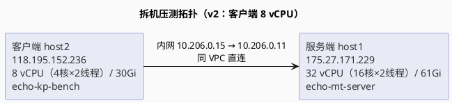
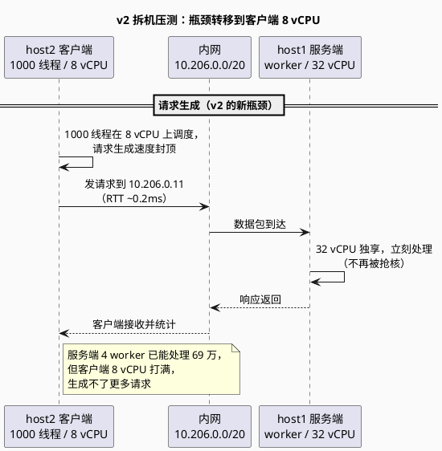

# 拆机实验 v2：客户端与服务端分离（Day 4 延伸）

> 所属阶段：阶段 2 — 从单线程到多线程
> 前置依赖：[拆机实验 v1（同机多线程 epoll）](/demos/echo/day-04/split-experiment-v1.md)
> （2026-08-13，4 核同机压测）
> 更新时间：2026-08-15
> （v2：首次拆机，32 vCPU 服务端 / 8 vCPU 客户端，验证 v1 的"CPU 份额竞争"假说）
> 后续迭代：[拆机实验 v3（客户端升级 32 vCPU）](/demos/echo/day-04/split-experiment-v3.md)
> （2026-08-17，客户端瓶颈消除，暴露协议栈瓶颈）

---

## 一、术语前置

本文独立阅读，术语分两组：**拆机实验 v1 已定义**（沿用）、**本文新增**（拆机场景独有）。

**沿用 v1 的术语**（详见 [v1 术语表](/demos/echo/day-04/split-experiment-v1.md#一术语前置)）：

| 术语 | 全称 | 含义 |
|------|------|------|
| **LT** | Level Triggered | 水平触发：只要 fd 处于"有数据可读"状态，每次 `epoll_wait` 都会返回该事件（反复通知直到读空） |
| **ET** | Edge Triggered | 边缘触发：仅在 fd 状态**发生变化**（从不可读变可读）的边沿通知一次，之后必须循环读直到返回 `EAGAIN` |
| **thread-per-core** | Thread per CPU core | 每核一线程模型：每个 CPU 核跑一个 worker 线程，线程独占自己的 epoll 与连接表，无共享锁 |
| **SO_REUSEPORT** | Socket Option REUSE PORT | 套接字选项，允许多个 socket 绑定到**同一个端口**。内核收到新连接时按四元组哈希，把连接**均匀分发**到其中一个 listen socket |
| **QPS** | Queries Per Second | 每秒完成的请求数，吞吐指标 |
| **P50 / P99** | Percentile 50/99 | 延迟百分位数：50%/99% 的请求在多少微秒内完成，用于刻画延迟分布与长尾 |

**本文新增的术语**：

| 术语 | 全称 | 含义 |
|------|------|------|
| **CVM** | Cloud Virtual Machine | 云虚拟机，本文指腾讯云 CVM |
| **VPC** | Virtual Private Cloud | 虚拟私有云，云上的私有网络隔离域；同 VPC 内网互通 |
| **vCPU** | Virtual Central Processing Unit | 虚拟机看到的逻辑 CPU 数，云厂商按核出售算力 |
| **SMT** | Simultaneous Multi-Threading | 超线程，一个物理核同时运行两个线程；lscpu 中体现为 `Thread(s) per core = 2` |
| **RTT** | Round-Trip Time | 往返时延，一次请求从发出到收到响应的时间 |
| **LT 长连接** | Level Triggered + Keep-Alive | 服务端水平触发 + 客户端连接复用（keep-alive），一次建连多次请求 |
| **短连接** | — | 每次请求都新建 TCP 连接，请求完成后立即关闭 |

> **阅读提示**：**沿用组**（LT/ET/thread-per-core/SO_REUSEPORT）是 v1 定义的机制术语，本文用于对照"拆机是否改变结论"；**新增组**是本轮实验环境的身份信息——CVM/VPC/vCPU/SMT 回答"云上拆机是什么"，RTT 回答"内网直连是否引入延迟"，**LT 长连接/短连接**是 5.2 对比实验的两组自变量。两组分工清晰：前者讲机制、后者讲环境，后续章节出现陌生词可回到本表。

---

## 二、本实验要回答的问题

**承接 v1 的遗留疑点**：v1（同机 4 核压测）发现服务端 4 线程只抢到 ~2 核（4.4：%sys 190%），并留下两个假说交给 v2 验证——"CPU 份额竞争"假说、"最优线程数 = 2 是同机假象"假说（详见 [v1 第十三章](/demos/echo/day-04/split-experiment-v1.md#十三上下文衔接v1-的问题如何在-v2-验证)）。

| # | 问题 | 为什么重要 |
|---|------|-----------|
| D1 | 同机压测时"4 线程只抢到 ~2 核"的瓶颈，**拆机后是否消除？吞吐能涨多少？** | 验证 v1 对瓶颈的判断（CPU 份额竞争），确定下一步优化方向 |
| D2 | 拆机后最优线程数会变吗？32 vCPU 服务端 8/16/32 线程会怎样？ | v1 结论是"最优 = 核数/2"，CPU 不再被抢后规律是否改写 |
| D3 | 拆机后 LT vs ET 的胜负是否还成立？ | v1 同机 4 线程 LT 大胜；CPU 充裕后 ET 的"循环读空"代价是否被掩盖 |

> **三问的结构**：D1 验证 v1 对瓶颈的**判断**（CPU 份额竞争是否真凶），D2 追问该判断被消除后**规律**是否改写（最优线程数），D3 验证受同机干扰的**结论**是否稳定（LT vs ET）。三个问题恰好构成"判断 → 规律 → 结论"的递进链——若 D1 证实但 D2/D3 不变，说明同机干扰只是量的影响；若三者全部改写，说明拆机是质的改变。后文 6.1~6.2 分别对应回答。

---

## 三、实验设计

### 3.1 背景：为什么拆机

v1 同机压测时，压测端（`echo-kp-bench`，1000 个客户端线程）与服务端（`echo-mt-server`）抢同一台 **4 核机器**，4.4 的 CPU 数据显示服务端只抢到 ~2 核（%sys 190%）。为了验证"CPU 份额竞争"是不是第一瓶颈，把客户端与服务端**拆到两台机器**，内网直连。

### 3.2 拓扑

**v2（2026-08-15）**：服务端 32 vCPU / 客户端 8 vCPU —— 客户端成为新瓶颈（QPS 卡在 ~69 万）。



### 3.3 环境与参数

| 项目 | v2（2026-08-15） |
|------|-----------------|
| 服务端 | host1（`VM-0-11-tencentos`）：公网 175.27.171.229，内网 10.206.0.11，**32 vCPU** |
| 客户端 | host2（`VM-0-15-tencentos`）：公网 118.195.152.236，内网 10.206.0.15，**8 vCPU** |
| 网络 | 同 VPC（10.206.0.0/20），内网直连，RTT ~0.2ms |
| 服务端程序 | `echo-mt-server.c`（`-O0 -g`） |
| 压测程序 | `echo-kp-bench`（每连接一个 pthread） |
| 压测参数 | 5.1：LT 长连接 1000 连接 × 1000 轮；5.2：8 线程 × {LT,ET} × {短,长} × {100,1000} |
| 连接方式 | 客户端用**内网 IP** 连服务端（不走公网） |
| 统计口径 | 每配置 **3 轮取中位数** |
| 环境准备 | `sysctl -w net.ipv4.tcp_tw_reuse=1 net.ipv4.tcp_fin_timeout=5`、`ulimit -n 65535` |

> **表读法**：本表是与 v1 对比时唯一要盯住的三处——**客户端 vCPU 从 4 变 8、服务端从 4 变 32、网络从 localhost 变内网 RTT 0.2ms**。程序（`echo-mt-server.c`/`echo-kp-bench`）、触发模式、统计口径（3 轮中位数）与 v1 保持一致，保证"拆机"是唯一变量。`tcp_tw_reuse=1`/`tcp_fin_timeout=5` 是为压测短连接清理 TIME_WAIT，避免建连失败污染数据。

**总控脚本**：`split_main.sh`（host1 通过免密 ssh 驱动 host2 压测，命令记录见[附录 A](#附录-a命令记录)）。

### 3.4 实验环境硬件清单

> 采集命令：`lscpu` / `free -h` / `/etc/os-release` / `uname -r` / `gcc --version`。两台均为腾讯云 CVM（KVM 虚拟化），**同一宿主机规格**：AMD EPYC 9K65（Zen 5 架构、基准主频 2.0GHz）。

| 项目 | host1（服务端） | host2（客户端） |
|------|----------------|----------------|
| 主机名 | VM-0-11-tencentos | VM-0-15-tencentos |
| CPU 型号 | AMD EPYC 9K65 192-Core | AMD EPYC 9K65 192-Core |
| vCPU / 物理核 | **32**（16×2） | **8**（4×2） |
| 主频 | 2.0GHz（基准） | 2.0GHz（基准） |
| Socket / NUMA | 1 / 1 | 1 / 1 |
| 内存 | 61Gi | 30Gi |
| 操作系统 | TencentOS Server 4（4.4） | TencentOS Server 4（4.4） |
| 内核 | 6.6.117-45.11.4.tl4.x86_64 | 6.6.117-45.11.4.tl4.x86_64 |
| 编译器 | gcc 12.3.1 | gcc 12.3.1 |
| 网卡 | eth0（10.206.0.11） | eth0（10.206.0.15） |
| 内核队列参数 | somaxconn 4096 / syn_backlog 8192 / syncookies 1 | — |

> 说明：`Thread(s) per core = 2` 表示 CVM 开启了超线程（SMT），vCPU 为逻辑核数。实验中的"8 线程"指服务端 `echo-mt-server 9988 8 lt` 启动的 **worker 线程数**（第二个参数），与物理核数无一一对应关系。

---

## 四、实验预期

| # | 子实验 | 预期 |
|---|--------|------|
| E5 | 5.1 线程数扩展 | 拆机后 1 线程 QPS 大幅高于同机；天花板变为"客户端 8 vCPU" |
| E6 | 5.2 LT vs ET | CPU 充裕时 ET 的循环读空代价被掩盖，LT/ET 差距缩小甚至反转 |
| E7 | 拆机总收益 | 同机 4 线程 7.2 万 → 拆机翻数倍 |

> **预期的共同前提**：三条预期全部建立在"v1 的 CPU 份额竞争判断正确"之上——E5 预判拆机后客户端反成瓶颈（最关键的**可证伪**预期），E6 预判 CPU 充裕会抹平 LT/ET 差异，E7 预判收益翻数倍。**如果 E5 落空**（比如拆机后仍是服务端瓶颈），v1 的整个判断就要推翻；反之 E5 证实则"同机干扰"被坐实。第七章数据正是用这三条预期当标尺。

---

## 五、实验数据

> **采集信息**：2026-08-15 于 host1（32 vCPU 服务端）/ host2（8 vCPU 客户端）完成。原始数据留档于 host2 `/root/echo-day04/results_split/`。

**5.1 线程数扩展（服务端 worker 线程数 1/2/4/8/16/32，LT 长连接 1000 连接 × 1000 轮，3 轮取中位数）**：

| 线程数 | v2 QPS（客户端8核） | v2 P50(μs) | v2 P99(μs) | 相对 t1 |
|:------:|:-----------------:|:----------:|:----------:|:----------:|
| 1 | 225709 | — | — | 1.00× |
| 2 | 283419 | — | — | 1.26× |
| 4 | 690768 | — | — | 3.06× |
| 8 | 697754 | — | — | 3.09× |
| 16 | 684129 | — | — | 3.03× |
| 32 | 676481 | — | — | 3.00× |

> **说明**：本表"线程数"指服务端 `echo-mt-server 9988 <n> lt` 启动参数中的 **worker 线程数**（第二个参数，与物理核数无一一对应关系）；客户端 `echo-kp-bench` 为**每连接一个 pthread**，1000 连接恒为 1000 个客户端线程，**不随服务端线程数变化**。

> 解读：拆机后 t1 即达 22.6 万（同机 5.3 万的 4.2×）；t4 冲上 69 万后**停平台**——客户端 8 vCPU 打满，生成请求的速度成为新天花板。

**5.2 LT vs ET（8 线程，各 3 轮取中位数）**：

| 场景 | v2 LT QPS | v2 ET QPS | 差距 |
|------|---------:|---------:|:----:|
| 100 连接 长连接 | 536675 | 537583 | ET +0.2% |
| 1000 连接 长连接 | 717618 | 719988 | ET +0.3% |
| 100 连接 短连接 | 171058 | 185000 | ET +8.2% |
| 1000 连接 短连接 | 117195 | 117834 | ET +0.5% |

> 解读：同机 4 线程 LT 大胜（+32~129%）；拆机后 CPU 充裕，ET 反而微弱反超（+0.2~8.2%）——LT/ET 差距坍缩。

**同机 vs 拆机对比（LT 长连接 1000 连接）**：

| 线程数 | 同机 QPS（4 核） | v2 拆机 QPS（客户端8核） |
|:------:|:---------------:|:----------------------:|
| 1 | 53477 | 225709（4.2×） |
| 4 | 72197 | 690768（9.6×） |
| 8 | 65328 | 697754（10.7×） |
| 16 | — | 684129 |
| 32 | — | 676481 |

> **解读**：这张表是"拆机收益"的最直接证据。**1 线程 4.2×**——同一份程序、同一个客户端，只把压测端挪到另一台机器，单线程服务端就多处理了 4.2 倍请求，说明 v1 同机时 4 核被客户端线程严重瓜分；**4 线程 9.6×**（7.2 万 → 69 万）是收益峰值。但注意 16/32 线程与 8 线程持平（68 万平台）——服务端再加线程已无收益，因为客户端 8 vCPU 已到生成能力的上限。**对比要点**：同机列峰值在 2 线程（7.6 万），拆机列峰值在 8 线程（69.8 万）——瓶颈转移的同时，最优线程数也从"核数一半"改写为 4~8（见 6.1）。

---

## 六、实验分析

### 6.1 瓶颈从"CPU 份额"转移到客户端（D1/D2 验证）

**v2 结论**（客户端 8 vCPU）：同机 1 线程只有 5.3 万，是 4 核被 1000+ 客户端线程瓜分所致（服务端只抢到 ~2 核）；拆机后 1 线程 4.2×、4 线程 9.6×，但 t4 之后 QPS 停在 ~69 万平台——**客户端 8 vCPU 打满，生成请求的速度成为新天花板**。最优线程数从同机的 2 变成 4~8。



**为什么 t4 之后停平台？** 客户端 `echo-kp-bench` 是"每连接一个 pthread"，1000 连接 = 1000 个客户端线程，全部挤在 8 vCPU 上调度。服务端再快，客户端也生成不了更多请求——吞吐由**发件方**决定，这是压测场景下最常见的隐藏瓶颈。

### 6.2 LT vs ET：差距坍缩，ET 微弱反超（D3 验证）

同机 4 线程 LT 大胜（+32~129%）；拆机后 8 线程下 ET 全部反超但幅度极小（+0.2~8.2%）。机制：CPU 充裕时，ET 每次事件多付的"循环读到 EAGAIN"代价被空闲算力吸收；LT 的重复通知优势也因 SO_REUSEPORT 摊薄。两者实现差异在充裕 CPU 下坍缩。

### 6.3 网络与延迟：内网 RTT 0.2ms 非瓶颈

同 VPC 内网直连 RTT 仅 ~0.2ms，与 localhost 同量级，网络往返不是瓶颈（v2 未单独采 PPS，v3 补上了——见 [v3 报告](/demos/echo/day-04/split-experiment-v3.md)）。

---

## 七、实验结论

| 维度 | v2 结论（客户端8核） |
|------|---------------------|
| 瓶颈确认 | 同机"服务端抢不到 CPU"被拆机消除（1 线程 4.2×、4 线程 9.6×） |
| 新天花板 | ~69 万 QPS（客户端 8 vCPU 打满） |
| 真实瓶颈 | 客户端生成请求能力 |
| 最优线程数 | 4~8（连接分发充分） |
| LT vs ET | 差距坍缩到 <10%（ET 微弱反超 +0.2~8.2%） |
| 短连接 | 死穴：QPS 为长连接 1/4~1/6 |
| 网络 | RTT 0.2ms，非瓶颈 |

> **表读法**：七行结论按"验证了什么 → 变成了什么"分组——前两行（瓶颈确认、新天花板）回答 D1，第三、四行（真实瓶颈、最优线程数）回答 D2，第五行（LT vs ET）回答 D3，最后两行（短连接、网络）是拆机后新观察到的边界条件。核心要抓住**"新天花板 ~69 万"与"真实瓶颈 = 客户端生成能力"两行的因果**：服务端并非到顶，而是客户端喂不动了——这直接决定了第九章要交给 v3 验证的假说。

> **一句话总结**：拆机验证了 v1 的判断——同机瓶颈是 CPU 份额竞争（拆机后 4 线程 9.6×），但新瓶颈立刻出现：**客户端只有 8 vCPU，1000 个压测线程打满它，QPS 卡在 ~69 万平台**；同时 LT vs ET 的差距在充裕 CPU 下坍缩到 <10%。

---

## 八、回答开头的问题

### D1：同机"4 线程只抢到 ~2 核"的瓶颈拆机后消除了吗？吞吐涨了多少？

> **答**：**彻底消除**。同机 4 线程 72197 → 拆机 690768（**9.6×**）；1 线程也 4.2×。v1 的 4.4 CPU 数据（%sys 190%≈2 核）证明同机瓶颈是 CPU 份额竞争，拆机后用独立 32 vCPU 服务端验证了这个判断。

### D2：拆机后最优线程数会变吗？

> **答**：**会**。同机最优 2 线程（4 核被客户端抢走一半）→ 拆机后 4~8 线程（t4 已达 69 万，之后停平台）。但平台的原因是**客户端 8 vCPU 打满**，不是服务端到顶——这一点直到 [v3](/demos/echo/day-04/split-experiment-v3.md) 把客户端升到 32 vCPU 才被证实。

### D3：拆机后 LT vs ET 的胜负还成立吗？

> **答**：**不成立，差距坍缩**。同机 4 线程 LT 大胜（+32~129%）；拆机 8 线程下 ET 微弱反超（+0.2~8.2%）。根因：LT vs ET 的差异是"CPU 紧张度"的函数——CPU 充裕时，ET 循环读空的代价被吸收。**工程建议：CPU 紧张/短连接选 LT，CPU 充裕随便选**。

---

## 九、上下文衔接：v1 的假说如何被验证、遗留问题如何交给 v3

### 9.1 v1 遗留假说的验证结果

| v1 遗留假说（[v1 第十三章](/demos/echo/day-04/split-experiment-v1.md#十三上下文衔接v1-的问题如何在-v2-验证)） | v2 验证结果 | 结论 |
|----------|-------------|------|
| **"CPU 份额竞争"假说**：拆机后服务端独占 32 vCPU，QPS 大幅上涨 | 5.1：拆机后 1 线程 4.2×、**4 线程 9.6×** | ✅ 假说证实 |
| **"最优线程数 = 2 是同机假象"假说**：拆机后线程扩展恢复 | 5.1：t4→t8→t16 持续上涨（69 万平台），最优线程数变 4~8 | ✅ 假说证实（但受客户端 8 vCPU 封顶） |
| **"LT vs ET 差距坍缩"假说**：CPU 充裕时 ET 反超 | 5.2：拆机 8 线程下 ET 微弱反超（+0.2~8.2%） | ✅ 假说证实 |

> **表读法**：v1 遗留的三个假说在 v2 中**全部证实**——这是本轮实验最重要的意义：v1 的同机观察（~2 核、最优 2、LT 大胜）不是测量噪声，而是真实的 CPU 竞争效应。注意第三列结论的细微差别：第一个假说**干净证实**（9.6× 无附加条件），后两个**证实但带修正**（最优线程数受客户端封顶、LT/ET 差距坍缩而非反转）——"证实但修正"比"干净证实"信息量更大，它精确刻画了拆机的边界条件。

### 9.2 交给 v3 验证的新假说

v2 发现新瓶颈——**客户端 8 vCPU 打满**（1000 个压测线程生成请求的能力封顶），QPS 卡在 ~69 万平台。这产生两个新假说交给 v3：

| v2 新疑点 | v2 的证据 | 交给 v3 验证的假说 | v3 的验证方式（详见 [v3 报告](/demos/echo/day-04/split-experiment-v3.md)） |
|---------|----------|--------------------|--------------------------------------------------------------------------|
| 69 万平台是"客户端生成能力"还是"服务端上限" | 5.1：t4 后停平台，服务端 32 vCPU 远未打满 | **假说**：客户端升级 32 vCPU 后平台消失，吞吐继续上涨 | 5.1：t32 达 **253 万**（t8 即 v2 的 2 倍），假说证实 ✅ |
| 服务端真实上限在哪 | 5.1：t32 = 676481，与 t4 持平 | **假说**：服务端 32 vCPU 的计算能力远未耗尽，瓶颈在别处 | 5.4：服务端 CPU 仅用 **3.6 核**、客户端空闲 77%，瓶颈转移至**网络协议栈** ✅ |

> **表读法**：两个新假说都源自同一个观察——"t4 后停平台但服务端 32 vCPU 远未打满"。第一个假说（平台是否消失）是**对 69 万平台的直接追问**，第二个假说（上限在哪）是**对瓶颈位置的纵深排查**。v3 的验证结果也体现了两个不同的层次：第一个假说干净证实（t32 达 253 万），第二个假说则把瓶颈**定性**到了网络协议栈——这为整个系列画出了"CPU → 客户端 → 协议栈"的下沉路径。

> **一句话总结**：v2 拆机实验验证了 v1 的"CPU 份额竞争"假说（4 线程 9.6×），同时把下一个瓶颈暴露出来——**客户端 8 vCPU 打满，QPS 卡在 69 万**；下一步把客户端升级到 32 vCPU（v3）后，瓶颈将再度转移。

---

## 十、后续迭代方向

v2 拆机实验证实了"CPU 份额竞争"假说，但暴露了**客户端能力**这个新瓶颈：

| 拆机暴露的瓶颈 | 证据 | 后续迭代方向 |
|------|------|------|
| 客户端 8 vCPU 打满（新天花板 69 万） | 5.1：t4 后停平台 | **✅ 已做**：客户端升级 32 vCPU 重测（见 [v3 报告](/demos/echo/day-04/split-experiment-v3.md)）——t32 达 253 万，瓶颈再次转移至网络协议栈 |
| LT vs ET 坍缩后的工程选型 | 5.2：差距 <10% | CPU 紧张/短连接场景直接用 **LT** |
| 短连接死穴（QPS 为长连接 1/4~1/6） | 5.2：短连接 QPS 明显低于长连接 | 连接池化/长连接化；客户端 epoll 化 |

> **表读法**：三行迭代方向的优先级明显不同——第一行（客户端 8 vCPU）是**主线**，已经闭环（v3 完成）；第二、三行是**支线工程建议**（LT 选型、连接池化），短期可落地。读表时注意区分"已验证的结论"（第一行 ✅）与"待实践的工程建议"（后两行）——前者回答"瓶颈是什么"，后者回答"生产怎么改"。

> **一句话总结**：v2 拆机实验验证了"同机瓶颈 = CPU 份额竞争"，同时把下一个瓶颈暴露出来——**客户端 8 vCPU 打满，QPS 卡在 69 万**；下一步把客户端升级到 32 vCPU（v3）后，瓶颈将再度转移。

---

## 附录 A：命令记录

### A.1 总控脚本 `split_main.sh` 用法

```bash
bash split_main.sh <阶段>    # 51=线程数扩展，52=LT/ET，all=全部
```

脚本在 **host1（服务端）** 上运行，通过免密 ssh 驱动 **host2（客户端）** 执行压测：

```bash
# 关键函数（伪代码）
start_server() { pkill -9 -x echo-mt-server; nohup ./echo-mt-server 9988 $1 $2 > /tmp/srv.log 2>&1 & sleep 3; }
bench() { ssh root@10.206.0.15 "cd /root/echo-day04 && ./echo-kp-bench 10.206.0.11 9988 $1 $2 --mode $3 > $RES/$4"; }
```

### A.2 5.1 线程数扩展（LT 长连接 1000 连接 × 1000 轮，每档 3 轮）

```bash
# host1（服务端）
for n in 1 2 4 8 16 32; do
  pkill -9 -x echo-mt-server; sleep 2
  nohup ./echo-mt-server 9988 $n lt > /tmp/srv.log 2>&1 & sleep 3
  for i in 1 2 3; do
    ssh root@10.206.0.15 \
      "cd /root/echo-day04 && ./echo-kp-bench 10.206.0.11 9988 1000 1000 --mode long > $RES/51-t$n-r$i.txt"
  done
done
```

### A.3 环境准备（两端各执行一次）

```bash
sysctl -w net.ipv4.tcp_tw_reuse=1 net.ipv4.tcp_fin_timeout=5
ulimit -n 65535
```
