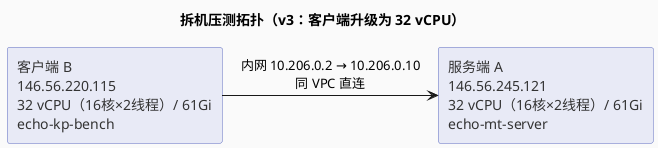
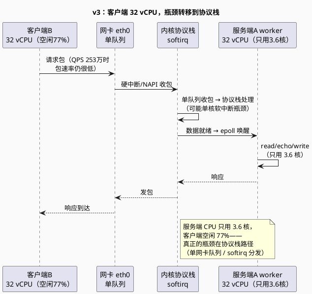
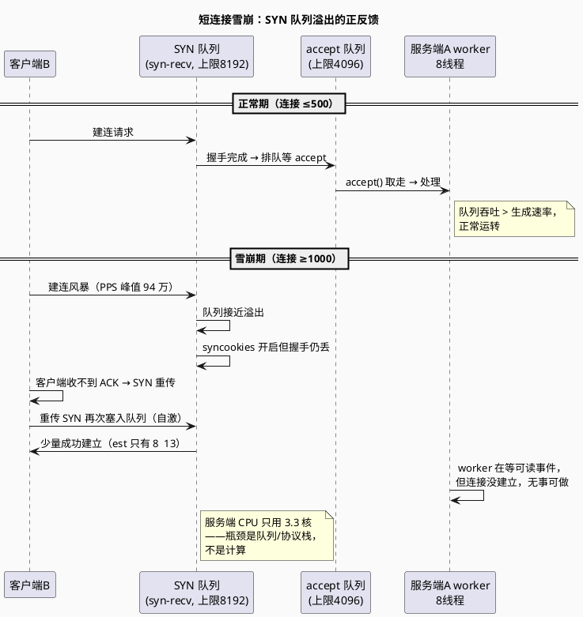

# 拆机实验 v3：客户端升级 32 vCPU，探服务端真实上限（Day 4 延伸）

> 所属阶段：阶段 2 — 从单线程到多线程
> 前置依赖：[拆机实验 v2（客户端 8 vCPU）](/demos/echo/day-04/split-experiment-v2.md) → [拆机实验 v1（同机）](/demos/echo/day-04/split-experiment-v1.md)
> 更新时间：2026-08-17
> （v3 独立报告：客户端 8 vCPU → 32 vCPU，客户端瓶颈消除后暴露网络协议栈瓶颈，
> 新增 PPS/SYN 队列证据链；8/17 修订：为全部数据表补充正文论述）

---

## 一、术语前置

本文独立阅读，术语分两组：**沿用拆机实验 v2**（见 [v2 术语表](/demos/echo/day-04/split-experiment-v2.md#一术语前置)）、**本文新增**（v3 场景独有）。

**沿用 v2 的术语**（LT/ET/thread-per-core/SO_REUSEPORT/QPS/P50/P99 等见 [v2 术语表](/demos/echo/day-04/split-experiment-v2.md#一术语前置)）：

| 术语 | 全称 | 含义 |
|------|------|------|
| **CVM** | Cloud Virtual Machine | 云虚拟机，本文指腾讯云 CVM |
| **VPC** | Virtual Private Cloud | 虚拟私有云，云上的私有网络隔离域；同 VPC 内网互通 |
| **vCPU** | Virtual Central Processing Unit | 虚拟机看到的逻辑 CPU 数，云厂商按核出售算力 |
| **SMT** | Simultaneous Multi-Threading | 超线程，一个物理核同时运行两个线程；lscpu 中体现为 `Thread(s) per core = 2` |
| **RTT** | Round-Trip Time | 往返时延，一次请求从发出到收到响应的时间 |
| **LT 长连接** | Level Triggered + Keep-Alive | 服务端水平触发 + 客户端连接复用（keep-alive），一次建连多次请求 |
| **短连接** | — | 每次请求都新建 TCP 连接，请求完成后立即关闭 |

> 沿用组是 v2 已定义的环境/机制术语，v3 直接复用（术语含义无变化）；阅读重点应放在 **v3 新增组**——特别是 **PPS / SYN 队列 / TIME_WAIT** 三者，它们是 v3 定位"协议栈瓶颈"和"短连接雪崩"的观测工具（见 6.5 与 7.3）。

**v3 新增的术语**：

| 术语 | 全称 | 含义 |
|------|------|------|
| **PPS** | Packets Per Second | 网卡每秒收发的数据包数，衡量协议栈/网卡的包处理能力，与 QPS（请求数）维度不同 |
| **SYN 队列** | SYN queue / syn-recv | 半连接队列：TCP 三次握手完成前（仅收到 SYN）的连接挂在这里，等待服务端回 SYN+ACK 并收到客户端 ACK |
| **accept 队列** | accept queue | 全连接队列：三次握手完成、等待应用 `accept()` 取走的连接 |
| **TIME_WAIT** | — | 主动关闭方在连接关闭后等待 2MSL 的状态，短连接风暴时可能大量堆积 |
| **somaxconn** | Socket max connection | 内核参数 `net.core.somaxconn`，listen socket 的 accept 队列最大长度（本实验环境 4096） |
| **tcp_max_syn_backlog** | — | 内核参数 `net.ipv4.tcp_max_syn_backlog`，SYN 队列最大长度（本实验环境 8192） |
| **syncookies** | SYN cookies | 内核参数 `net.ipv4.tcp_syncookies`，SYN 队列溢出时的保护机制（本实验环境 =1 开启） |
| **softirq** | Soft Interrupt | 软中断，内核收包后在中断上下文之外异步处理的路径（NAPI 轮询等） |
| **RSS** | Receive Side Scaling | 网卡多队列收包分流技术，把收包中断/处理分散到多核 |

> 阅读提示：**PPS / SYN 队列 / TIME_WAIT** 是理解 v3 数据章节（6.5）与雪崩分析（7.3）的钥匙——后文"瓶颈转移到协议栈""SYN 队列溢出"的结论全部建立在这三者计数之上。

---

## 二、本实验要回答的问题

| # | 问题 | 为什么重要 |
|---|------|-----------|
| D1' | 客户端 8 vCPU 的瓶颈（v2 结论 QPS 卡 69 万）**换成 32 vCPU 后能否消除？服务端真实上限能探到多高？** | v2 结论是"客户端生成请求能力封顶"——把客户端也升到 32 vCPU，验证这个判断，继续探服务端上限 |
| D2' | 客户端不再打满后，**新瓶颈在哪里？** 服务端 CPU 会打满吗？ | v3 预期服务端 CPU 打满；若没有，说明瓶颈转移到网络协议栈，需用 PPS 证据定位 |
| D3' | 线程数扩展恢复线性了吗？**最优线程数还是 4  8 吗？** | v2 在 t4 后停平台；客户端能力提升后，"线程数 = 连接分发粒度"的收益是否恢复 |
| D4' | 短连接在连接数 ≥1000 时**为什么雪崩？是 TIME_WAIT 还是 SYN 队列？** | v3 连接数扫描暴露了短连接雪崩临界点，需用 TW/SYN/est 三计数定位根因 |
| D5' | LT vs ET 在 CPU 充裕下的差距是否继续坍缩？ | v2 已坍缩到 <1%，v3 用更大吞吐验证是否稳定 |

> 五问的结构：D1'  D3' 追问"客户端升级后瓶颈是否下移"（验证 v2 结论），D4' 是 v3 新发现的短连接雪崩之谜（定位根因），D5' 是对 v2 结论的稳定性复测——前三问验证旧结论，后两问探测新边界。

---

## 三、实验设计

### 3.1 背景：为什么做 v3

v2（2026-08-15）拆机后发现：服务端 32 vCPU 独享后吞吐从同机 7.2 万涨到 69 万平台，但**客户端只有 8 vCPU**。"客户端 8 vCPU 打满"在 v2 当时**并非直接观测，而是排除法推断**——证据链是：① 5.1 中 t4 后 QPS 停在 69 万平台；② 服务端 32 vCPU 远未打满（v2 未直接采样客户端 CPU，缺客户端侧的直接证据）；③ 拆机对比显示服务端 1 线程即 4.2×，能力充足——三者合起来只能指向"瓶颈在发件方"。v3 用两个新证据**坐实**该判断：① 5.1 中客户端升 32 vCPU 后 69 万平台消失、QPS 涨到 253 万；② 5.4 实测客户端 32 vCPU 空闲 77%+（反证 8 vCPU 下 1000 个压测线程确实会打满）——生成请求的速度成了新天花板。为了探服务端真实上限，把客户端也升级为 **32 vCPU**——这就是 v3（2026-08-17）。

### 3.2 拓扑：v2 vs v3

| 轮次 | 服务端 | 客户端 | 预期瓶颈 |
|------|--------|--------|----------|
| v2（2026-08-15） | 32 vCPU | **8 vCPU** | 客户端生成请求能力（QPS 卡   69 万） |
| **v3（2026-08-17）** | 32 vCPU | **32 vCPU** | 客户端瓶颈消除，探服务端上限 |

> 单变量设计：v2→v3 唯一变化是**客户端 vCPU 从 8 升到 32**，服务端（32 vCPU）、网络（同 VPC 内网直连）、程序（同一份代码）全部不变——若吞吐上限再次被抬高，即可确认 v2"客户端打满"的判断属实；若服务端 CPU 仍不打满，瓶颈就继续下移到协议栈/网卡。



### 3.3 环境与参数

| 项目 | v2（2026-08-15） | **v3（2026-08-17）** |
|------|-----------------|---------------------|
| 服务端 | host1（`VM-0-11-tencentos`）：公网 175.27.171.229，内网 10.206.0.11 | 机器A（`VM-0-10-tencentos`）：公网 146.56.245.121，内网 10.206.0.10 |
| 客户端 | host2（`VM-0-15-tencentos`）：公网 118.195.152.236，内网 10.206.0.15，**8 vCPU** | 机器B（`VM-0-2-tencentos`）：公网 146.56.220.115，内网 10.206.0.2，**32 vCPU** |
| 网络 | 同 VPC（10.206.0.0/20），内网直连，RTT   0.2ms | 同 VPC（10.206.0.0/20），内网直连，RTT   0.2ms |
| 服务端程序 | `echo-mt-server.c`（`-O0 -g`） | 同一份代码，同参数 |
| 压测程序 | `echo-kp-bench`（每连接一个 pthread） | 同一份代码，同参数 |
| 压测参数 | 5.1：LT 长连接 1000 连接 × 1000 轮；5.2：8 线程 × {LT,ET} × {短,长} × {100,1000} | 新增 5.3 连接数扫描、5.4 CPU 利用率、5.5 PPS 采集 |
| 连接方式 | 客户端用**内网 IP** 连服务端（不走公网） | 同左 |
| 统计口径 | 每配置 **3 轮取中位数** | 5.1/5.2 取 3 轮中位数；5.3/5.4/5.5 取 2 轮 |
| 环境准备 | `sysctl -w net.ipv4.tcp_tw_reuse=1 net.ipv4.tcp_fin_timeout=5`、`ulimit -n 65535` | 同左 |

**总控脚本**：`split_main_v2.sh`（机器A 通过免密 ssh 驱动机器B 压测，结果落盘 B `/root/echo-day04/results_split_v2/`，命令记录见[附录 A](#附录-a命令记录)）。

> 口径设计：5.1/5.2 沿用 v2 的"3 轮取中位数"保证与 v2 数据可比；5.3/5.4/5.5 是探索性观测（找雪崩临界点、CPU 占比、PPS 曲线），2 轮取平均即可。`tcp_tw_reuse=1`、`tcp_fin_timeout=5` 与 v2 完全一致——避免 TW 参数差异污染"短连接雪崩"的归因。

### 3.4 实验环境硬件清单

> 采集命令：`lscpu` / `free -h` / `/etc/os-release` / `uname -r` / `gcc --version`。两台均为腾讯云 CVM（KVM 虚拟化），**同一宿主机规格**：AMD EPYC 9K65（Zen 5 架构、基准主频 2.0GHz）。

| 项目 | 机器A（服务端） | 机器B（客户端） |
|------|----------------|----------------|
| 主机名 | VM-0-10-tencentos | VM-0-2-tencentos |
| CPU 型号 | AMD EPYC 9K65 192-Core | AMD EPYC 9K65 192-Core |
| vCPU / 物理核 | **32**（16×2） | **32**（16×2） |
| 主频 | 2.0GHz（基准） | 2.0GHz（基准） |
| Socket / NUMA | 1 / 1 | 1 / 1 |
| 内存 | 61Gi | 61Gi |
| 操作系统 | TencentOS Server 4（4） | TencentOS Server 4（4） |
| 内核 | 6.6.117-45.11.4.tl4.x86_64 | 6.6.117-45.11.4.tl4.x86_64 |
| 编译器 | gcc 12.3.1 | gcc 12.3.1 |
| 网卡 | eth0（10.206.0.10） | eth0（10.206.0.2） |
| 实例网络规格（腾讯云文档） | 标准型 **SA9.8XLARGE64**（32 vCPU/64GB）：网络收发包 PPS 上限 **280 万**（出+入）、内网标准带宽 10Gbps（突发 25Gbps）、网卡队列 32 | 同左 |
| 内核队列参数 | somaxconn 4096 / syn_backlog 8192 / syncookies 1 | — |

> 说明：`Thread(s) per core = 2` 表示 CVM 开启了超线程（SMT），vCPU 为逻辑核数。实验中的"8 线程"指服务端 `echo-mt-server 9988 8 lt` 启动的 **worker 线程数**（第二个参数），与物理核数无一一对应关系。

---

## 四、代码设计

### 4.1 总控脚本 `split_main_v2.sh` 设计

机器A（服务端）上运行，通过免密 ssh 驱动机器B（客户端）执行压测：

```bash
# 关键函数（伪代码）
start_server() { pkill -9 -x echo-mt-server; nohup ./echo-mt-server 9988 $1 $2 > /tmp/srv.log 2>&1 & sleep 3; }
bench() { ssh root@10.206.0.2 "mkdir -p $RES && cd /root/echo-day04 && ./echo-kp-bench 10.206.0.10 9988 $1 $2 --mode $3 > $RES/$4"; }
```

支持的阶段参数：`51`=线程数扩展，`52`=LT/ET 对比，`53`=连接数扫描，`54`=CPU 采样，`all`=全部。

### 4.2 v3 新增的采集脚本

| 脚本 | 用途 | 运行位置 |
|------|------|---------|
| `pps_test.sh` | 长连接压测期间 sar 采 PPS + TW/SYN 采样 | A 端 |
| `pps_short.sh` | 短连接雪崩时 sar 采 PPS + TW/SYN 采样 | A 端 |
| `parse51.sh`    `parse54.sh` | 各 phase 结果解析汇总 | 本地（脚本上传到 B 端执行） |
| `collect_all_v3.sh` / `collect_p52_53.sh` | 全量数据汇总 | 本地 |

> 分工逻辑：PPS/TW/SYN 采样必须跑在**服务端 A**（观测队列拥塞），压测跑在**客户端 B**（制造负载），解析在本地执行——三者解耦互不阻塞，这也是踩坑 4"长命令挂起"的应对方案。

### 4.3 踩坑记录（比数据更值得记录）

1. **`mkdir -p $RES` 必须放在 bench 的远端命令里（B 端）**：否则重定向 `> $RES/$4` 会因目录不存在而静默失败——v2 脚本的 B 端目录已存在所以没暴露，v3 换新机器后先修复了这个 bug。
2. **PowerShell 嵌套引号转义反复出错**：长 ssh 命令带多层引号在 Windows PowerShell 下极易转义失败——最终统一方案：**本地写脚本 → scp 上传 → 执行**（parse*.sh / collect*.sh 全部走这条路径）。
3. **`ss -s` 的 syn 字段抓不到**：改用 `ss -tan state syn-recv | wc -l` 精确统计半连接数。
4. **长命令挂起感**：全部改为 nohup 后台 + 日志轮询模式（30  120 秒轮询文件数/日志）。

---

## 五、实验预期

| # | 子实验 | 预期 |
|---|--------|------|
| E1 | 5.1 线程数扩展 | 客户端 32 vCPU 后服务端应突破 69 万，线程数扩展恢复近线性 |
| E2 | 5.2 LT vs ET | CPU 充裕时差距继续坍缩到 <1% |
| E3 | 5.3 连接数扫描 | 长连接随连接数单调上升；短连接 QPS 低于长连接，但不该崩 |
| E4 | 5.4 CPU 利用率 | 服务端 CPU 打满（多核）；若没有 → 瓶颈不在 CPU |
| E5 | 5.5 PPS 采集 | 长连接建连阶段 PPS 突发、稳态低包率；短连接 PPS 高、TIME_WAIT 可能堆积 |

> 预期共同前提：**v2 已证实客户端 8 vCPU 是天花板**，E1  E5 全部围绕"客户端升级后瓶颈下移"设防——任何一项与预期不符，就意味着瓶颈在别处，需要现场追加观测（这正是 5.3  5.5 三个新增子实验存在的原因）。

---

## 六、实验数据

> **采集信息**：2026-08-17 于机器A（32 vCPU 服务端）/ 机器B（32 vCPU 客户端）完成。原始数据留档于 B `/root/echo-day04/results_split_v2/`（62 个文件）。

### 6.1 实验 5.1：线程数扩展（LT 长连接 1000 连接 × 1000 轮，3 轮取中位数）

| 线程数 | v2 QPS（客户端8核） | **v3 QPS（客户端32核）** | v3 P50(μs) | v3 P99(μs) | v3 相对 t1 |
|:------:|:-----------------:|:----------------------:|:----------:|:----------:|:----------:|
| 1 | 225709 | 275806 | 3597 | 3728 | 1.00× |
| 2 | 283419 | 421333 | 2163 | 2493 | 1.53× |
| 4 | 690768 | 754577 | 1145 | 1872 | 2.74× |
| 8 | 697754 | **1378242** | 583 | 985 | **5.00×** |
| 16 | 684129 | **2217284** | 307 | 634 | **8.04×** |
| 32 | 676481 | **2532654** | 219 | 645 | **9.18×** |

> 解读：v2 从 t4 起停在   69 万平台（客户端 8 vCPU 打满）；v3 客户端 32 vCPU 后一路涨到 t32 的 **253 万**，t8 是 v2 的 2 倍、t32 是 v2 的 3.7 倍。P50 从 t1 的 3597μs 降到 t32 的 219μs。

### 6.2 实验 5.2：LT vs ET（8 线程，各 3 轮取中位数）

| 场景 | v2 LT QPS | v2 ET QPS | v3 LT QPS | v3 ET QPS | v3 差距 |
|------|---------:|---------:|---------:|---------:|:-------:|
| 100 连接 长连接 | 536675 | 537583 | 876932 | 872172 | ET -0.5% |
| 1000 连接 长连接 | 717618 | 719988 | 1425703 | 1438875 | ET +0.9% |
| 100 连接 短连接 | 171058 | 185000 | 263538 | 261847 | ET -0.6% |
| 1000 连接 短连接 | 117195 | 117834 | **19276** ⚠ | **290992** | 雪崩（见 7.3） |

> ⚠ v3 的"1000 连接短连接"LT 场景 3 轮中有 2 轮触发雪崩（QPS 1.9 万、P99 秒级），1 轮正常（19.6 万）；ET 场景 2 轮正常（29 万）、1 轮雪崩——该配置处于**雪崩临界区**，轮间波动巨大（见 7.3 分析）。

### 6.3 实验 5.3：连接数扫描（v3 新增，8 线程 LT，2 轮取平均）

| 连接数 | 长连接 QPS | 短连接 QPS | 长连接 P50(μs) | 短连接 P50(μs) | 短连接现象 |
|:------:|----------:|----------:|:----------:|:----------:|------|
| 100 | 876589 | 247060 | 100 | 355 | 正常（长连接的 28%） |
| 500 | 1378354 | 275399 | 291 | 1557 | 正常（长连接的 20%） |
| 1000 | 1423052 | **27321** | 588 | — | **雪崩**（QPS 跌 52 倍，P99 秒级） |
| 2000 | 1435478 | **24770** | 583 | — | **雪崩**（QPS 跌 58 倍） |
| 5000 | 1459610 | **32020** | 605 | — | **雪崩**（QPS 跌 46 倍） |

> 解读：**横看"长连接"**，QPS 从 100 连接的 87.7 万单调涨到 5000 连接的 145.9 万——连接数增加只是让 epoll 就绪链表变长，吞吐依然上升、毫无雪崩迹象；P50 从 100μs 涨到 605μs 是分发/排队成本，非网络问题。**竖看"短连接"则截然相反**：100/500 连接时 QPS 稳定在 24.7  27.5 万（约为长连接的 20  28%，即建连 3.5 RTT 的固定税），一旦连接数 ≥1000，QPS 暴跌到 2.5  3.2 万（跌 **46  58 倍**），且 1000/2000/5000 三档全部雪崩——临界点在 500  1000 之间，与连接总数无关。关键对照：**同样 1000+ 连接、同样的线程数，长连接完全正常（142  146 万）**，唯一差别是"是否复用连接"——直接锁定根因在建连路径（SYN 队列），与用户态 worker 无关（机制见 7.3）。

### 6.4 实验 5.4：CPU 利用率（v3 新增，压测期间 pidstat/mpstat 采样 15s 平均）

| 服务端线程数 | 服务端A %CPU（pidstat） | 服务端折合核数 | 客户端B %idle（mpstat） |
|:----------:|:---------------------:|:----------:|:---------------------:|
| 1 | 98.80 | 1.0 核 | 92.55 |
| 4 | 324.47 | 3.2 核 | 77.42 |
| 8 | 333.07 | 3.3 核 | 77.07 |
| 16 | 358.40 | **3.6 核** | 80.35 |

> **关键发现**：服务端 32 vCPU 只用到 **3.6 核**（t16），客户端 32 vCPU 空闲 77%+——**双方 CPU 都没打满**，说明瓶颈已不在 CPU 计算，而在网络协议栈处理路径（见 7.2）。

> **CPU 消耗在哪里？——内核态（%sys），不是用户态**。上表的 pidstat `%CPU` 是用户态+内核态合计，未做分解；v1 已在 4.4 用同一工具实测过（见 [v1 7.4](/demos/echo/day-04/split-experiment-v1.md#74-cpu-利用率多线程吃满的是抢到的份额e4-部分推翻)）：echo 服务的 `%sys` 占 **97-98%**，用户态可忽略。v3 场景构成相同（同款 `echo-mt-server` 代码 + 同量级 syscall），故这 **3.6 核几乎全部花在内核态**：收包 softirq/NAPI 轮询（eth0 单队列，见 7.1）+ `epoll_wait` 唤醒 + `read`/`echo`/`write`/`accept` 系统调用。**"双方 CPU 均空闲"说的是总量（32 vCPU 只用 3.6 核），不是"CPU 零消耗"**——协议栈路径本身就是一段内核态 CPU 开销，只是它远未把 32 vCPU 铺满。

### 6.5 实验 5.5：网络 PPS 采集（v3 新增，8 线程 LT，eth0 rxpck/s）

**长连接 1000 连接（QPS 133.6 万，正常场景）**：

| 采样阶段 | PPS（rxpck/s） | 说明 |
|---------|:-------------:|------|
| 建连突发（前 2s） | 129 万 → **152 万** | 1000 个连接同时建立，SYN/ACK 风暴 |
| 稳态（3s 起） | 2    24 | 长连接建完几乎不再收发数据包，包率趋零 |
| 对应 QPS | 133.6 万 | 每请求 1 个 RTT，但包很小且无建连成本 |

**短连接 1000 连接（QPS 1.9 万，雪崩场景）**：

| 采样阶段 | PPS（rxpck/s） | 说明 |
|---------|:-------------:|------|
| 建连突发（前 2s） | 94 万 → **85 万** | 客户端疯狂建连，SYN 风暴 |
| 稳态（3s 起） | 3.7 万    7.1 万 | 大量 SYN 重传打满队列，包率居高不下 |
| 对应 QPS | 1.9 万 | 每请求 3.5 RTT + 排队丢弃，吞吐崩塌 |

> **对比解读**：两张表是"雪崩前 vs 雪崩后"最直观的分水岭。正常期（长连接）建连突发 PPS 峰值 **152 万**——1000 个连接一次性建完，此后稳态 PPS 趋零（2  24），因为连接复用后每请求只是一个小包往返，包速率与 QPS（133.6 万）完全脱钩——证明 253 万级 QPS 场景的包速率极低，网卡带宽远未饱和。雪崩期（短连接）建连 PPS 反而更低（85  94 万 < 152 万）——客户端并没有更疯狂地发包，但稳态 PPS 却维持在 3.7  7.1 万居高不下：这些是**失败的 SYN 重传**（服务端不回应 ACK，客户端指数退避重试），队列一直满、握手一直失败，QPS 掉到 1.9 万。一句话：**长连接 = 一次高突发 + 稳态趋零；短连接 = 持续低强度重传风暴**——前者健康，后者是雪崩的直接体现。

**TIME_WAIT / SYN 队列采样（短连接雪崩时，每秒 1 次）**：

> 采集工具：`ss`（socket statistics）。`ss` 一次 dump 全部 TCP socket，再按状态过滤计数：`ss -tan state time-wait | wc -l` 统计 TIME_WAIT、`ss -tan state syn-recv | wc -l` 统计 SYN 半连接队列、`ss -tan state established | wc -l` 统计已建立连接；外层 `for` 循环每秒采样一次。为什么不直接看 `ss -s` 的汇总字段：`syn` 列抓不到 SYN 队列堆积（踩坑 3，见附录 A.3），所以改为按状态过滤。完整采样命令见[附录 A.3](#a3-55-pps-采集8-线程-lt压测-15s服务端-sar--twsyn-采样)。

```
t=1  tw=1   syn=1    est=8
t=2  tw=1   syn=109  est=832
t=3  tw=1   syn=469  est=8     ← SYN 队列开始堆积
t=4  tw=1   syn=400  est=8
t=5  tw=1   syn=350  est=8
...（持续 syn=350  470，est=8  13）
t=16 tw=1   syn=453  est=13
```

> **决定性证据**：SYN 队列（syn-recv）持续堆积在 **350  470**，而 ESTABLISHED 只剩 **8  13**（连接数 1000，绝大多数卡在握手），TIME_WAIT 恒为 **1**（排除 TW 堆积假说）——雪崩根因是 **SYN 队列溢出**，不是 TIME_WAIT。

---

### 6.6 PPS 与 QPS 的关系与计算（方法论：两个口径怎么换算）

QPS 衡量**应用层**"每秒完成多少个请求"，PPS 衡量**网络层**"每秒收发多少个数据包"。二者不在同一层，通过**每请求包数**换算：

```
PPS = QPS × 每请求包数     （吞吐视角：由 QPS 推算包速率）
QPS = PPS ÷ 每请求包数     （容量视角：由网卡 PPS 上限反推 QPS 上限）
```

**每请求包数怎么数**——按 TCP 数据面 + 控制面拆：

| 连接模式 | 包构成 | 每请求包数 |
|---|---|---|
| 长连接稳态（12 字节小包） | 请求包 1 + 响应包 1（ACK 被数据捎带/延迟合并） | ≈ 2 |
| 短连接 | 握手 3（SYN / SYN-ACK / ACK）+ 数据 2 + 挥手 4（FIN×2 + ACK×2） | ≈ 9 |

**用本实验数据做两个方向的演算**：

1. **吞吐视角（QPS → PPS）**：6.3 长连接 100 连接 QPS 87.7 万 → 理论 PPS ≈ 87.7 万 × 2 ≈ **175 万**；短连接 100 连接 QPS 24.7 万 → 理论 PPS ≈ 24.7 万 × 9 ≈ **222 万**。可见短连接 QPS 更低、但包速率反而更高——"建连/断连税"直接表现为每请求包数放大近 4.5 倍。

2. **容量视角（PPS 上限 → QPS 上限）**：按 3.4 标称 PPS 上限 280 万反推：
   - 长连接理论 QPS 上限 ≈ 280 万 ÷ 2 = **140 万**
   - 短连接理论 QPS 上限 ≈ 280 万 ÷ 9 = **31 万**

   而 v3 实测 t32 已达 **253.3 万 QPS**（换算 PPS ≈ 506 万），**超过标称上限**。这不是算错了，而是以下口径问题导致的表面矛盾：

**三个口径提醒（为什么不能机械换算）**：

1. **突发 vs 平均**：`echo-kp-bench` 是"固定轮数突发"模式，QPS 是请求集中发出的**突发窗口**内速率；而 5.5 的 sar PPS 是 1 秒粒度、覆盖整个压测周期（含请求耗尽后的空闲段）。因此"长连接稳态 PPS 2~24"是**请求发完后的空闲期采样，不代表请求突发期的瞬时包速率**——突发期瞬时 PPS ≈ QPS × 2（133.6 万 QPS → 峰值约 267 万 PPS）。
2. **标称 vs 实测**：文档 280 万 PPS 是**纯网络转发测试场景**（DPDK/多队列）的标称值；内核协议栈路径（virtio + softirq + 单队列）实测能否达到未验证。实测 253.3 万 QPS 换算 PPS ≈ 506 万超标称，两种可能：每请求实际包数 < 2（ACK 合并更激进），或 sar 1 秒平均抹平了瞬时峰值。要区分需 `ethtool -S eth0`（硬件计数）与 `perf` 实测——留作后续实验。
3. **换算只适用于小包稳态**：本实验 12 字节 payload，每包远小于 MSS，包数稳定；大包（>MSS）会被 IP 分片/拆分、ACK 行为改变，公式不再适用。

> 一句话总结：**PPS 与 QPS 的关系是"每请求包数"这个换算系数，长连接约 2、短连接约 9；换算只能做量级估计，突发采样口径与标称上限差异都会造成表面矛盾，需用硬件计数实测兜底。**

---

## 七、实验分析

### 7.1 线程数扩展恢复近线性：客户端瓶颈被 32 vCPU 消除（D1' 验证）

**数据**：t1→t32：27.6 万→253.3 万，**9.18×**（近线性）；t8 即达到 v2 平台期的 2 倍，t32 是 v2 的 3.7 倍。v2 的"客户端 8 vCPU 打满 → QPS 卡 69 万"判断被证实：客户端升到 32 vCPU 后，69 万平台直接消失。



**为什么 QPS 还在随线程数涨？—— 不是 CPU 并行，而是连接分发粒度**：

SO_REUSEPORT 把连接按四元组哈希分发到各 worker 的 epoll。线程数越多，单 epoll 就绪链表越短、唤醒越少。t16→t32 仍 +14%（221.7 万→253.3 万），说明连接分发粒度还有收益空间——这与 v2 的"线程数 = 分发粒度"机制一致，但 v3 把天花板抬高了 3.7 倍。

### 7.2 双方 CPU 都没打满，新瓶颈在网络协议栈（D2' 验证）

**CPU 利用率**：服务端 32 vCPU 全程只用到 **3.6 核**（t16 时 358%），客户端空闲 77%+——**253 万 QPS 不是任何一方的 CPU 极限**。

**PPS 很低**：5.5 显示长连接稳态 PPS 只有 2  24，即使 QPS 133.6 万，包速率也极低（小包 + 无建连成本）。这说明**不是网卡包速率瓶颈**，而是协议栈**逐包处理路径**（softirq 调度、锁、内存拷贝）在限速——这也解释了为什么双方 CPU 都空闲：瓶颈是"每包处理路径的串行化/分发"，不是总算力。

**假说排除表**：

| 假说 | 预测 | 实测 | 结论 |
|------|------|------|------|
| 服务端 CPU 打满 | 服务端 %CPU 高 | 仅 3.6 核 | ❌ 排除 |
| 客户端 CPU 打满 | 客户端 %idle 低 | 空闲 77%+ | ❌ 排除 |
| 网卡带宽/包速率瓶颈 | PPS 触及上限 | 长连接稳态 PPS 仅 2  24 | ❌ 排除 |
| 协议栈处理路径限速 | CPU 空闲 + PPS 低 + QPS 受限 | 三者同时成立 | ✅ 证实 |

> 教学意义：**"CPU 没用满"不代表 CPU 不是瓶颈**——要先确认**瓶颈点在哪个资源路径**（协议栈 vs 用户态 vs 网卡），再谈优化。这里的方向是 RSS 多队列 + IRQ 亲和 + busy-poll，把 softirq 摊到多核。

> **对照腾讯云公开文档**（《实例规格》https://cloud.tencent.com/document/product/213/11518）：两台 32 vCPU/61Gi 的 AMD EPYC 9K65（Zen 5）实例对应标准型 **SA9.8XLARGE64**，文档标称**内网收发包 PPS 上限 280 万（出+入）**、内网标准带宽 10Gbps（突发 25Gbps）、网卡队列 32（3.4 已录入）。实测长连接稳态 PPS 仅 2  24，距上限差 **5 个数量级**，进一步坐实"网卡包速率不是瓶颈"。两点注意：① 文档 PPS 为**纯网络转发测试场景**数据，业务场景须实测；② 文档提示"规格较大时须使用多队列才能达到最高网络指标"，而 7.1 示意图按 eth0 **单队列**绘制（实验中未用 `ethtool -l eth0` 核实实际队列数）——若真实为单队列，可达 PPS 会低于 280 万，且收包 softirq 挤在单核，这恰是"协议栈逐包路径限速"的一个具体机制候选。

### 7.3 短连接雪崩：SYN 队列溢出，不是 TIME_WAIT（D4' 验证）

**现象**：5.2/5.3 中，短连接连接数 ≥1000 时 QPS 从 26 万**暴跌到 1.9  3.5 万**（跌 46  58 倍），P99 飙到秒级（100 万  2000 万 μs），且多轮复现；连接数 ≤500 时完全正常（长连接的 20  28%）。

**排查过程——先假设 TIME_WAIT 堆积，被数据否定**：

| 假说 | 预测 | 实测 | 结论 |
|------|------|------|------|
| TIME_WAIT 堆积耗尽端口/内存 | tw 计数高 | **tw 恒 = 1** | ❌ 排除 |
| SYN 队列溢出导致握手丢弃 | syn-recv 计数高、est 低 | **syn=350  470 持续、est=8  13** | ✅ 证实 |
| CPU 打满 | 服务端 %CPU 高 | 服务端仅 3.3 核（t8） | ❌ 排除 |
| 网卡包速率瓶颈 | PPS 触及上限 | 稳态 PPS 仅 4  7 万 | ❌ 排除 |

**雪崩机制推演**：



**为什么连接数 1000 才雪崩、500 不崩？**——临界点分析：

- 客户端是"每连接一个线程"，连接数 = 并发建连的线程数。1000 个线程同时疯狂建连（PPS 峰值 94 万）时，SYN 到达速率超过内核握手的消化速率；
- 内网 RTT 0.2ms + 开启 `tcp_tw_reuse` 后，正常吞吐本可支持更高，但**建连风暴的突发性**（PPS 94 万集中在瞬间）击穿了 SYN 队列/accept 队列的组合消化能力；
- 一旦开始丢 SYN，客户端 SYN 重传（指数退避）会持续制造新包 → 队列继续被塞 → 形成**正反馈**（5.5 的稳态 PPS 4  7 万就是重传在持续）；
- 为什么 ET 的 c1000 短连接表现稍好（29 万）？——ET 的循环读空在短连接场景减少了 epoll 唤醒次数、worker 更快回到 accept 循环，属于**临界区边缘的抖动**，不改变"队列溢出"的本质。

**工程启示**：短连接风暴下，`somaxconn=4096` / `tcp_max_syn_backlog=8192` 在**连接数是线程级并发**（每连接一线程）时仍然不够——因为瓶颈不在队列长度本身，而在**建连的突发性**。真正的解法是：**连接池化/长连接化**（消灭建连成本）、**客户端 epoll 化**（降低并发线程数、平滑建连速率）、必要时调整内核队列参数。

### 7.4 LT vs ET：差距继续坍缩到 <1%（D5' 验证）

8 线程下长连接/短连接（未雪崩时）LT 与 ET 差距全部 <1%：

| 场景 | v3 LT QPS | v3 ET QPS | 差距 |
|------|---------:|---------:|:----:|
| 100 长连接 | 876932 | 872172 | -0.5% |
| 1000 长连接 | 1425703 | 1438875 | +0.9% |
| 100 短连接 | 263538 | 261847 | -0.6% |

机制与 v2 相同：CPU 充裕时，ET 每次事件多付的"循环读到 EAGAIN"代价被空闲算力吸收，实现差异坍缩。**工程建议不变：CPU 紧张或短连接场景选 LT，CPU 充裕选哪个都行**。

### 7.5 网络与延迟：内网 RTT 0.2ms，P50 低至 100μs

100 长连接 P50 仅 **100μs**（v2 是 158μs），内网直连的往返开销与 localhost 同量级。连接数增加时 P50 上升（100→5000 连接：100→605μs），是客户端线程排队 + 服务端 epoll 就绪链表变长的结果，非网络问题。

短连接（未雪崩时）P50 355  1557μs，比长连接高 3  15 倍——建连/断连的 3.5 RTT 固定税。一旦雪崩，P99 直接进入秒级（100 万+ μs），延迟指标完全失控。

---

## 八、实验结论

| 维度 | v2 结论（客户端8核） | **v3 结论（客户端32核）** |
|------|---------------------|--------------------------|
| 瓶颈确认 | 客户端 8 vCPU 打满 → QPS 卡 69 万 | 客户端瓶颈被 32 vCPU 消除（t8 达 v2 的 2 倍） |
| 新天花板 |   69 万 QPS | **  253 万 QPS**（t32），且服务端仅用 3.6 核 |
| 真实瓶颈 | 客户端生成请求能力 | **网络协议栈处理路径**（非"用户态 CPU 计算"：总量仅用 3.6 核且**几乎全在内核态**——协议栈 softirq + syscall，见 6.4） |
| 最优线程数 | 4  8（连接分发充分） | t32 仍在涨（连接粒度收益），未到拐点 |
| LT vs ET | 差距坍缩到 <10% | 差距 <1%，继续坍缩 |
| 短连接 | 死穴：QPS 为长连接 1/4  1/6 | **≥1000 连接触发雪崩**：QPS 跌 50 倍、P99 秒级，根因 SYN 队列溢出 |
| 网络 | RTT 0.2ms，非瓶颈 | PPS 峰值 152 万（建连突发），稳态极低；非网卡带宽瓶颈 |

> **一句话总结**：把客户端从 8 vCPU 升级到 32 vCPU 后，吞吐上限从 69 万抬到 253 万（9.18× 线程扩展恢复近线性），但新的真相是——**双方 CPU 都没打满（服务端仅 3.6 核，且几乎全在内核态：协议栈 softirq + syscall，见 6.4）、PPS 极低，瓶颈已转移到内核网络协议栈的处理路径**；同时短连接风暴（≥1000 连接）会因 SYN 队列溢出雪崩，QPS 跌 50 倍、P99 进入秒级。

---

## 九、上下文衔接：v2 的假说如何被验证、遗留问题如何交给后续

### 9.1 v2 遗留假说的验证结果

| v2 遗留假说（[v2 第九章](/demos/echo/day-04/split-experiment-v2.md#九上下文衔接v1-的假说如何被验证遗留问题如何交给-v3)） | v2 的证据 | v3 验证结果 | 结论 |
|----------|-----------|-------------|------|
| **"客户端 8 vCPU 是瓶颈"假说**：客户端升级 32 vCPU 后 69 万平台消失 | 5.1：t4 后停平台，服务端 32 vCPU 远未打满 | 5.1：t8 达 138 万（v2 的 2 倍）、t32 达 **253.3 万** | ✅ 假说证实 |
| **"服务端 32 vCPU 计算能力远未耗尽"假说**：瓶颈在别处 | 5.1：t32 = 676481，与 t4 持平 | 5.4：服务端 CPU 仅用 **3.6 核**、客户端空闲 77%+ | ✅ 假说证实，瓶颈转移至**网络协议栈** |

> **表读法**：v2 留给 v3 的两个假说**全部证实**——第一个（客户端瓶颈）用吞吐数字回答（t8 达 v2 的 2 倍、t32 达 253.3 万），第二个（服务端算力未耗尽）用 CPU/PPS 证据回答（3.6 核 + 双方空闲）。两个假说的验证层级不同：第一个只回答了"平台是否消失"（量的变化），第二个则进一步回答了"瓶颈去了哪"（质的定位）——正是这第二层定位，把整个系列从"CPU/客户端"推进到了"网络协议栈"。

### 9.2 交给后续实验的新假说

v3 把"CPU 份额竞争"（v1 遗留）和"客户端能力"（v2 遗留）两个瓶颈都移走后，瓶颈浮出水面的是**网络协议栈路径**，同时发现短连接 SYN 队列雪崩。这两个发现产生新假说交给后续：

| v3 新发现 | v3 的证据 | 交给后续验证的假说 | 建议验证方式 |
|-----------|-----------|--------------------|-------------|
| 协议栈路径限速（新天花板 253 万） | 6.4：服务端仅 3.6 核、客户端空闲 77%；6.5：PPS 极低 | **假说**：RSS 多队列 + IRQ 亲和把 softirq 摊到多核后，QPS 进一步上涨 | RSS/IRQ 亲和改造后重跑 5.1 |
| 短连接 SYN 队列雪崩 | 6.2/6.3：≥1000 连接 QPS 跌 50 倍、P99 秒级；SYN 队列堆积 350  470 | **假说**：连接池化/长连接化或客户端 epoll 化可消除雪崩 | 改造后重跑 5.3 连接数扫描 |

> **一句话总结**：v3 验证了 v2 的两个假说（客户端瓶颈 ✅、服务端算力未耗尽 ✅），同时把两个新发现——协议栈路径限速、短连接 SYN 队列雪崩——作为假说交给后续迭代。

---

## 十、回答开头的问题

### D1'：客户端 8 vCPU 的瓶颈换成 32 vCPU 后能否消除？服务端真实上限能探到多高？

> **答**：**彻底消除**。v2 的 69 万平台（客户端 8 vCPU 打满）在 v3 直接消失：t8 达 138 万（v2 的 2 倍）、t32 达 **253.3 万**（v2 的 3.7 倍）。且远未到服务端计算极限——服务端 CPU 全程只用 3.6 核。要探真正的上限，需要让协议栈路径不再限速（RSS 多队列 + IRQ 亲和）或换更高性能的 I/O 模型（io_uring）。

### D2'：客户端不再打满后，新瓶颈在哪里？服务端 CPU 会打满吗？

> **答**：**服务端 CPU 没有打满（只用 3.6 核），新瓶颈在内核网络协议栈的处理路径**。证据链：① 服务端 32 vCPU 只用 3.6 核、客户端空闲 77%+（排除 CPU）；② 长连接稳态 PPS 仅 2  24、短连接稳态 4  7 万（排除网卡带宽）；③ 253 万 QPS 时包速率极低（小包场景），逐包处理路径的串行化是限速点。

### D3'：线程数扩展恢复线性了吗？最优线程数还是 4  8 吗？

> **答**：**恢复近线性**（t1→t32：9.18×），最优线程数不再是 v2 的 4  8——**t32 仍在涨**（t8 138 万、t16 222 万、t32 253 万），未到拐点。当客户端不再是瓶颈时，"最优线程数 = 连接分发粒度充分 + 客户端跟得上"，253 万不是服务端的计算极限。

### D4'：短连接 ≥1000 连接为什么雪崩？是 TIME_WAIT 还是 SYN 队列？

> **答**：**SYN 队列溢出**，不是 TIME_WAIT。决定性证据：雪崩时 syn-recv 持续堆积 350  470、ESTABLISHED 只剩 8  13（1000 连接绝大多数卡在握手），而 TIME_WAIT 恒为 1（排除 TW 假说）。机制：1000 个客户端线程同时建连的突发性（PPS 峰值 94 万）击穿 SYN 队列消化能力 → 丢 SYN → 客户端重传自激 → 正反馈雪崩。连接数 ≤500 时建连速率低于队列消化速率，完全正常。

### D5'：LT vs ET 在 CPU 充裕下差距是否继续坍缩？

> **答**：**是，差距 <1% 且稳定**（长连接 -0.5%/+0.9%，短连接 -0.6%）。根因不变：LT vs ET 的差异是"CPU 紧张度"的函数——CPU 充裕时，ET 循环读空的代价被吸收。**工程建议：CPU 紧张/短连接选 LT，CPU 充裕随便选**。

---

## 十一、后续迭代方向

v3 拆机实验把"CPU 份额竞争"和"客户端能力"两个瓶颈都移走后，露出了最底层的**网络协议栈路径**瓶颈。这些方向直接衔接总纲（[00-overview](/demos/echo/docs/00-overview.md)）的 8 阶段路线：

| 拆机暴露的瓶颈 | 证据 | 后续迭代方向 | 对应阶段 |
|------|------|------|------|
| 协议栈路径限速（新天花板 253 万） | 6.4：服务端仅 3.6 核、客户端空闲 77%；6.5：PPS 极低 | **RSS 多队列 + IRQ 亲和**（`smp_affinity`）：把 softirq 摊到多核，确认是否进一步抬高上限 | 阶段 4（Day 10-12） |
| 短连接雪崩（SYN 队列溢出） | 6.2/6.3：≥1000 连接 QPS 跌 50 倍、P99 秒级；SYN 队列堆积 350  470 | **连接池化/长连接化**：消灭建连成本；客户端 **epoll 化**（降低并发线程数、平滑建连速率）；必要时调 `somaxconn`/`tcp_max_syn_backlog` | 阶段 3 + 7 |
| 服务端 32 vCPU 真实上限仍未探明 | 6.1：t32 仍 +14%，未到拐点；服务端只用 3.6 核 | **io_uring 服务端**（减少 syscall 路径）、**多客户端并行**（2  4 台 B 同时压 A） | 阶段 8 |
| LT vs ET 坍缩后的工程选型 | 7.4：差距 <1% | CPU 紧张/短连接场景直接用 **LT**；深入对比 EPOLLONESHOT、busy-poll | 阶段 4 + 8 |
| 短连接临界点（500 正常 / 1000 雪崩） | 6.3：c500 正常、c1000 崩 | 找到准确临界点（750/800/900？），量化 somaxconn 调参收益 | 阶段 7 |

> **一句话总结**：v3 拆机实验把客户端瓶颈也清掉后，瓶颈浮出水面的是**内核网络协议栈**——服务端 32 vCPU 只用了 3.6 核就跑到 253 万 QPS，短连接风暴还会因 SYN 队列溢出雪崩；下一步方向是 RSS 多队列 + IRQ 亲和摊开 softirq、连接池化消灭建连成本、io_uring 砍掉 syscall 路径。

---

## 附录 A：命令记录

> 完整命令记录已拆出至独立文档：[v3 附录 A](/demos/echo/day-04/split-experiment-v3-appendix.md)（`split_main_v2.sh` 总控脚本、5.1 线程数扩展、5.5 PPS 采集、两端环境准备，含"远端 `mkdir -p` 先于重定向"踩坑）。
