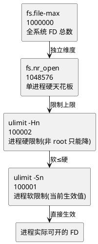
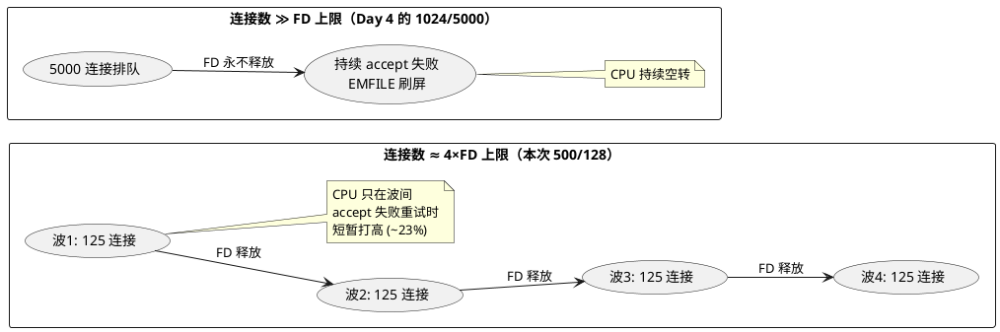

# FD 机制实测（Day 5 主线实验）：六~八 实验分析、结论与回到问题

> 所属实验：[FD 机制实测（Day 5 主线实验）](/demos/echo/day-05/fd-mechanism-experiment.md) · 更新时间：2026-08-21（从主线拆出，内容零丢失）
> 上一篇：[实验数据（五）](/demos/echo/day-05/fd-mechanism-data.md)
> 下一篇：无（系列结束，回到 [Day 5 首页](/demos/echo/day-05/)）

---

## 六、实验分析

### 6.1 三层漏斗：谁是天花板



1. **当前机器进程级最紧**：`100001(soft)` 远低于 `1048576(nr_open)` 与 `1000000(file-max)`——日常瓶颈必然先撞进程级，这与 Day 4 撞墙点（连接数 2000）吻合；
2. **`ulimit -n` 调不上去的两种原因**：超过 `-Hn`（`Operation not permitted`），或超过 `fs.nr_open`（即使 root 也失败）；实测 5.2 演示了第一种；
3. **`fs.file-nr` 的已分配数（1728）** 反映全系统压力，当前占用率 0.17%——系统层非常宽松；
4. **Day 6 调参的完整链条**：`ulimit -n`（进程）→ `limits.conf`（持久）→ `fs.nr_open`（单进程天花板）→ `fs.file-max`（系统总数）——四层都要抬，只改一层会"改了不生效"。

### 6.2 软/硬限制：`ulimit -n 1024` 一步锁死的机制

`setrlimit()` 的内核规则（man 2 getrlimit 与 `kernel/sys.c`）：
- 非 root：**硬限制只能降、不能抬**；软限制可在 0~硬限制之间任意调；
- root：两者均可抬（但硬限制仍不能超过 `fs.nr_open`）；
- **bash 内建 `ulimit -n` 不带 `-S`/`-H` 时，默认同时修改软限制和硬限制**（POSIX 未强制，但 bash/dash 均如此实现）。

这就是 5.2 第四行的真相：`ulimit -n 1024` 把 **hard 也从 100002 降到了 1024**，之后 `ulimit -n 100002` 因"超过硬限制"被拒（rc=1），**当前进程被永久锁死在 1024**——子 shell（新起的 bash）继承的也是 1024，除非退出登录重新应用 limits.conf（恢复 100001/100002）或以 root 重设。

> 教学点：**调试时千万不要裸用 `ulimit -n <小值>`**——要降软限制请写 `ulimit -Sn`，否则会把 hard 一起降下去，当前进程再也抬不回来。这也是"改完 ulimit 不生效/不可逆"的标准成因之一（另一个成因是 6.1 的会话级覆盖）。

### 6.3 E3：撞墙的 CPU 代价是"脉冲"而非"持续 100%"

5.3 与 P3 预期不符，但更有教学价值：
- **FD 峰值精确 128**：卡墙行为与 Day 4 完全一致（机制没变）；
- **CPU 峰值 23% 一闪而过**：因为 500 连接 / 128 FD 只够 4 波，每波 ~125 连接跑完 50 rounds 就释放 FD、下一波补位，空转窗口太短，`pidstat 1s` 只采到 2~3 个非零采样点；
- 若要复现"持续空转"，需要 **连接数 ≫ FD 上限**（如 5000 连接 / 128 FD，Day 4 的 1024/5000 组就呈现了长时间撞墙 + EMFILE 1305 次），让排队永不消化。



> 机制链条不变：LT 下 listen 恒可读 → accept EMFILE → break → epoll_wait 立即返回 → 再试。**差别只在排队深度**——排队消化得快，CPU 是脉冲；排队消化不掉，CPU 就是持续空转。

### 6.4 FD 守恒与 TIME_WAIT 的区分

E4 两组对照的结论：**FD 数 ≠ 连接数 ≠ 端口数**。
- **正常关闭（A 组）**：服务端 fd 每轮回到 5（连接关闭即释放 FD，无泄漏）；但 TW **单调 +200/轮**（701→1501）——每个关闭的连接在客户端侧进 TIME_WAIT，端口被占 ≠ FD 被占；
- **客户端强杀（B 组）**：fd 同样回到 5；TW 先升后落（2101→1402）——强杀产生 RST，连接不经历完整四次挥手，服务端 TW 更少且随 60s 超时自然回收；
- 若某轮后 fd 数**单调不减**，才是真泄漏（如服务端没 close、epoll 忘 del）——两组均未出现。

---

## 七、实验结论

1. **FD 是三层漏斗，当前进程级最紧**：实测 `soft=100001 < hard=100002 ≪ nr_open=1048576 / file-max=1000000`，`fs.file-nr` 已分配仅 1728（0.17%）——日常瓶颈必然先撞进程级，Day 6 冲 10K 需同步抬系统层；
2. **软/硬限制机制**：非 root 只能降 hard、在 soft≤hard 间自由调 soft；超过 hard 报 `Operation not permitted`（实测 rc=1，值不变）；
3. **`ulimit -n` 裸用会同时降 soft+hard 并锁死进程**：实测降到 1024 后无法抬回（rc=1），子 shell 继承的也是 1024——这是"改完 ulimit 不生效/不可逆"的机制根源，调试必须用 `-Sn`/`-Hn` 显式指定；
4. **FD 耗尽时 CPU 代价是"脉冲"而非"持续 100%"**：500 连接/128 FD 场景 CPU 峰值 23% 一闪而过，撞墙形态与 Day 4 一致（FD 峰值精确 128、fail=0、QPS 20062.9）；持续空转需连接数 ≫ FD 上限；
5. **1 连接 = 1 FD 守恒**：正常关闭/强杀后服务端 fd 均回落至基线 5，无泄漏；TW 是端口级状态（A 组单调累积、B 组先升后落），与 FD 占用是两个维度。

---

## 八、回到问题

| # | 问题 | 答案 |
|---|------|------|
| Q1 | 三层限制真实值？哪层最紧？ | soft=100001 / hard=100002 / nr_open=1048576 / file-max=1000000 / file-nr=1728；进程级当前最紧，但距系统级有 10 倍余量 |
| Q2 | 软/硬限制机制？ | 非 root：hard 只能降不能抬，soft 可在 hard 内自由调；超过 hard → `Operation not permitted`；**裸 `ulimit -n` 会同时降 soft+hard，一步锁死** |
| Q3 | FD 耗尽时 CPU 行为？ | 短窗口场景为瞬时脉冲（本次峰值 23%）；连接数 ≫ FD 上限时才持续空转（Day 4 的 1024/5000 组 EMFILE 1305 次） |
| Q4 | 1 连接 = 1 FD 守恒？ | 是。正常关闭/RST 后 FD 均回落到基线 5，无泄漏；TW 与 FD 是两个维度，泄漏特征是 FD 曲线单调增长 |

---

## 附录：复现

```bash
# 1. 环境（与 Day 4 同一台机器）
#    124.221.142.185, CentOS 7 / 内核 3.10 / 4 核 EPYC
#    工具: /home/chzhuo/fd-experiment/{echo-epoll-lt-server,echo-kp-bench}

# 2. E1+E2: 三层基线 + 软硬机制（目标值动态取 hard）
bash exp51_52.sh

# 3. E3: EMFILE 行为（srv 降档 128, 客户端 500 连接）
#    后台起服务 → pidstat -t -p <pid> 1 抓 CPU → 起 bench → 结束后 grep EMFILE
bash exp34.sh        # E3+E4 合并, nohup 后台跑防断连

# 4. E4: FD 守恒（A 正常关闭 / B 客户端强杀, 各 200 连接 × 5 轮）
#    已在 exp34.sh 中, 每轮输出 fd/est/tw

# 5. 原始数据存放
#    服务器: /tmp/exp51_52.out (E1/E2), /tmp/exp34.out + /tmp/day5_e34/ (E3/E4)
```

> **一句话总结**：三层漏斗当前进程级最紧（100001 ≪ 系统级 10 倍余量）；非 root 只能降 hard、裸 `ulimit -n` 一步锁死进程是"改完不生效"的机制根源；撞墙 CPU 是脉冲而非持续 100%（持续空转需连接数 ≫ FD 上限，见[补刀实验](/demos/echo/day-05/sustained-spin-experiment.md)）；1 连接 = 1 FD 守恒成立，TW 与 FD 是两个维度。
