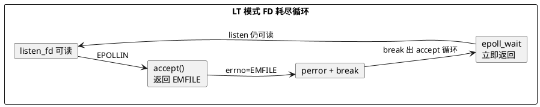

# FD 机制实测：三层限制、软/硬限制与 EMFILE 空转（Day 5 主线实验）

> 所属阶段：阶段 2 — 多线程扩展与 FD 上限
> 定位：Day 5 的**主线实验**——Day 4 的 [FD 墙实测](/demos/echo/day-04/fd-wall-experiment.md) 撞了墙（现象），本文拆开墙看机制（原理）：三层限制各自由谁定、软/硬限制如何互相约束、FD 耗尽时 CPU 到底在干什么。
> 前置依赖：[Day 4 FD 墙实测](/demos/echo/day-04/fd-wall-experiment.md)（现象数据来自同机 124.221.142.185）
> 更新时间：2026-08-18（2026-08-21 按"问题→设计→数据→分析"拆分为三篇，本文为主线一~四）
> 下一篇：[实验数据（五）](/demos/echo/day-05/fd-mechanism-data.md)
> 一句话总结：FD 不是"一个数"，而是进程(ulimit)→会话(limits.conf)→系统(fs.*)三层漏斗；软限制可上下浮动、硬限制只能降不能升；**bash 内建 `ulimit -n` 裸用会同时改写 soft+hard**，一次降档就把进程锁死在低值抬不回来——这是"改完 ulimit 不生效/不可逆"的机制根源。

> **阅读路线**：本文（一~四：问题/设计/代码/预期）→ [五、实验数据](/demos/echo/day-05/fd-mechanism-data.md) → [六~八、实验分析/结论/回到问题](/demos/echo/day-05/fd-mechanism-analysis.md)

---

## 一、本实验要回答的问题

| # | 问题 | 为什么重要 |
|---|------|-----------|
| Q1 | 三层限制各自的真实值是多少？哪一层是当前最紧的瓶颈？ | Day 4 撞墙只用了进程级 `ulimit -n`；不改系统级参数，即使 `ulimit -n` 调上天也可能被 `fs.nr_open` 拦腰砍断 |
| Q2 | 软/硬限制的机制是什么？为什么"软限制可以随意改、硬限制不能抬"？ | 这是 `ulimit` 行为怪异的根源：非 root 用户想调大 nofile 时报 `Operation not permitted` 的真相 |
| Q3 | FD 耗尽时 CPU 到底在干什么？EMFILE 不处理的代价有多大？ | Day 4 只观察到"EMFILE 刷屏"，没量过 CPU；这是生产上"FD 打满 → CPU 白转"故障的机制根因 |
| Q4 | 1 连接 = 1 FD 是守恒的吗？泄漏长什么样？ | Day 6/阶段 6 要冲 10K/百万连接，必须先验证"连接数 ↔ FD 数"一一对应，否则万连接阶段会误判泄漏 |

---

## 二、实验设计

### 2.1 背景

Day 4 [FD 墙实测](/demos/echo/day-04/fd-wall-experiment.md) 已经用 `ulimit -n` 降档撞墙，验证了：
- FD 峰值**精确**等于 ulimit 值（1024），撞墙点连接数 2000；
- 撞墙代价是吞吐 -50%、P999 尾部延迟 +2.6 倍，但 `fail=0`。

但撞墙背后还有三个未拆的机制：**三层漏斗哪层是天花板**、**软/硬限制的边界行为**、**FD 耗尽时进程在做什么（CPU 视角）**。本文补上这三块，让 Day 4 的"现象"变成可解释的"机制"。

### 2.2 复用同一把尺子

| 角色 | 工具 | 说明 |
|------|------|------|
| 服务端 | `/home/chzhuo/fd-experiment/echo-epoll-lt-server` | Day 4 同款，LT 水平触发，监听 9988，**EMFILE 时 `perror` 一次后 break，不主动退避** |
| 客户端 | `/home/chzhuo/fd-experiment/echo-kp-bench` | Day 4 同款长连接压测，`--mode long` |
| 封装 | [day-04/fd-scan.sh](/demos/echo/day-04/fd-scan.sh) | 档位切换 + 0.2s 采样复用 |
| 观测 | `pidstat -t -p <pid> 1` | 线程级 CPU（Day 4 没测的维度） |

### 2.3 实验矩阵

| 实验 | 内容 | 自变量 | 观测 |
|------|------|--------|------|
| E1 三层基线 | 逐层读取进程/会话/系统限制 | 无（只读） | `ulimit -Sn/-Hn`、`limits.conf`、`fs.file-max/nr_open/file-nr` |
| E2 软/硬机制 | 在 soft 与 hard 之间上下调 | 目标值（>hard / =hard / &lt;hard） | 每次调用的 `rc` 与当前值 |
| E3 EMFILE 行为 | 服务端 `ulimit -n 128`，客户端 500 连接 | 服务端 FD 上限 | `pidstat` CPU%、EMFILE 次数、QPS、FD 峰值 |
| E4 FD 守恒 | 正常关闭 vs 客户端强杀（RST），各 200 连接 × 5 轮 | 关闭方式 | `/proc/<pid>/fd`、`ss` 计数 |

> E3 的关键关注点：现有服务端 `accept()` EMFILE 后 break 出 accept 循环，但 **LT 模式下 listen fd 一直可读 → `epoll_wait` 立即返回 → 反复重试**——`pidstat` 应能看到该线程的 CPU 行为。

---

## 三、代码设计

### 3.1 E1/E2 采集脚本（`exp51_52.sh`）

```bash
#!/bin/bash
# E1: 三层限制基线
echo "soft=$(ulimit -Sn) hard=$(ulimit -Hn)"
echo "file-max=$(cat /proc/sys/fs/file-max)"
echo "nr_open=$(cat /proc/sys/fs/nr_open)"
echo "file-nr=$(cat /proc/sys/fs/file-nr)"
grep -vE '^#|^$' /etc/security/limits.conf

# E2: 软/硬限制机制（非 root, HARD 动态取实际硬限制）
HARD=$(ulimit -Hn)
ulimit -n $((HARD+10000)); echo "rc=$? now=$(ulimit -n)"   # >hard 应失败
ulimit -n "$HARD";          echo "rc=$? now=$(ulimit -n)"   # =hard 应成功
ulimit -n 1024;             echo "rc=$? now=$(ulimit -n)"   # <hard 应成功
ulimit -n "$HARD";          echo "rc=$? now=$(ulimit -n)"   # 再抬回 hard
bash -c 'echo child-soft=$(ulimit -Sn) child-hard=$(ulimit -Hn)'  # 继承验证
```

> 设计要点：E2 的目标值**动态取自实际 hard 限制**（本机 hard=100002，不是常见的 65535/1048576），避免硬编码与机器配置脱节。

### 3.2 E3 实验封装（复用 fd-scan.sh 模式）

```bash
( ulimit -n 128; exec ./echo-epoll-lt-server > srv.log 2>&1 ) & SRV=$!
# 双线采样：FD 数(0.2s) + 线程 CPU(1s)
( while kill -0 $SRV 2>/dev/null; do
    echo "$(date +%s.%N) srvfd=$(ls /proc/$SRV/fd|wc -l)"; sleep 0.2; done ) > sample.log &
pidstat -t -p $SRV 1 > cpu.log 2>&1 &
( ulimit -n 65535; exec ./echo-kp-bench 127.0.0.1 9988 500 50 --mode long ) > bench.txt 2>&1
```

### 3.3 E4 泄漏实验设计

```bash
# A 组(正常关闭)与 B 组(客户端强杀)各 5 轮，每轮 200 连接 × 50 rounds：
#   每轮结束 sleep 3 后读 服务端 fd / est / tw，观察 FD 是否回落、TW 是否累积
for r in 1 2 3 4 5; do
  start_srv; bench 200; sleep 3
  echo "round=$r fd=$(ls /proc/$SRV/fd|wc -l) est=$(ss -tan state established|wc -l) tw=$(ss -tan state time-wait|wc -l)"
  kill_srv
done
# B 组差异：bench 启动 5s 后 pkill -9 客户端（连接变 RST）
```

> 设计要点：E4 用 **循环 + 曲线**而非单次快照——泄漏是"每轮多 1~2 个 FD"级别的慢信号，必须跑足够轮次才能与噪声区分；TW 计数用于区分"端口占用"与"FD 占用"两个维度。

---

## 四、实验预期

| # | 预期 | 依据 |
|---|------|------|
| P1 | 三层值关系：`ulimit -Hn ≤ fs.nr_open ≤ fs.file-max`，进程级当前最紧 | 三层漏斗，最内层最紧 |
| P2 | 非 root 把 `ulimit -n` 抬到 hard 之上 → `Operation not permitted`；在 soft~hard 之间自由升降 → 成功 | Linux `setrlimit()` 权限规则：普通用户只能降 hard、可在 soft≤hard 内自由调 soft |
| P3 | E3 中服务端线程 CPU 高企、EMFILE 刷屏、QPS 低（连接全排队） | LT 下 listen 恒可读 → accept EMFILE → 忙循环 |
| P4 | 正常关闭组 FD 曲线平；强杀组 FD 曲线在 TIME_WAIT 窗口内短暂高企后回落，不单调增长 | 1 连接 = 1 FD，连接关闭后 FD 释放；RST 组差异来自 TIME_WAIT 而非泄漏 |



---

> **一句话总结**：本文设计了一个"只读基线 + 上下调档 + 降档撞墙 + 双组对照"的四实验矩阵，全部复用 Day 4 的同一把尺子（LT 服务端 + kp-bench + fd-scan.sh），回答"三层漏斗谁最紧 / 软硬限制边界 / EMFILE 时 CPU 在干嘛 / 连接与 FD 是否守恒"四个问题——答案与预期是否一致，见 [实验数据](/demos/echo/day-05/fd-mechanism-data.md)。
