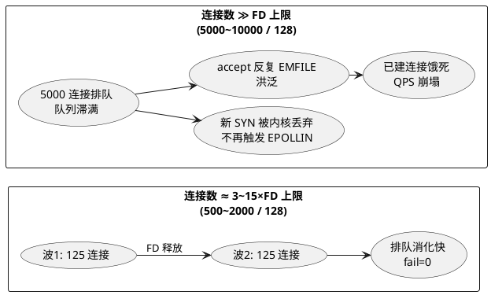
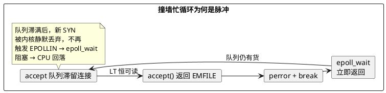

# 持续空转实测：连接数 ≫ FD 上限时的 EMFILE 洪泛（Day 5 补充实验）

> 所属阶段：阶段 2 — 多线程扩展与 FD 上限
> 定位：Day 5 [FD 机制实测](/demos/echo/day-05/fd-mechanism-experiment.md) 的**补刀实验**——主线 E3 只测了 500 连接 / 128 FD（≈4x），结论是"CPU 峰值 23% 一闪而过（脉冲）"，文档明确留了钩子：*"若要复现持续空转，需要连接数 ≫ FD 上限"*。本文把比例拉到 3x/15x/39x/78x，并用 long/short 两种流量模式对照，回答"持续空转到底长什么样"。
> 前置依赖：[Day 4 FD 墙实测](/demos/echo/day-04/fd-wall-experiment.md)、[Day 5 FD 机制实测](/demos/echo/day-05/fd-mechanism-experiment.md)（同机 124.221.142.185）
> 更新时间：2026-08-20
> 一句话总结：**"持续空转"的完整形态不是 CPU 一直 100%，而是 EMFILE 洪泛（最多 4.8 万次）+ 连接建立开始失败（比例 ≥39x 后 fail 从 0 跳到 382~11 万）+ QPS 崩塌 2~3 个数量级（12.9 万 → 520~770）**；CPU 峰值随比例单调上升（18.6% → 60.2%），但忙循环始终是"波次脉冲"而非"持续满载"——因为 accept 队列一旦滞满，新 SYN 被内核静默丢弃，`epoll_wait` 反而不触发了。

---

## 一、本实验要回答的问题

| # | 问题 | 为什么重要 |
|---|------|-----------|
| Q1 | EMFILE 忙循环从"脉冲"变"持续"的比例拐点在哪？ | Day 5 主线只测了 4x 比例，生产撞墙往往是连接数远超 FD 上限（10x~100x），拐点决定"要不要紧急修" |
| Q2 | 持续空转时，已建立连接的真实吞吐/延迟受损多少？ | 撞墙不只是新连接进不来，老连接也饿死（accept 循环占死线程） |
| Q3 | 排队中的连接最终能全部建上，还是被 EMFILE 永久拒掉？ | 决定故障是"暂时的"还是"累积恶化" |
| Q4 | 持续流量（短连接）与一次性流量（长连接）撞墙形态有何差异？ | 真实生产大多是短连接高频流量，Day 5 主线 E3 用的是长连接，可能低估了破坏力 |

---

## 二、实验设计

### 2.1 背景

Day 5 主线 E3 的 500 连接 / 128 FD（≈4x）测出 CPU 峰值 23% 一闪而过，原因是"128−3≈125 连接/波，排队 4 波就被消化"；文档据此推测"连接数 ≫ FD 上限时持续空转"。但"≫"到底要多"≫"、持续空转的量化形态（CPU/EMFILE/失败率/QPS）从来没人测过。本文用同一把尺子（LT 服务器 + 同一 bench）把比例拉到极端。

### 2.2 复用同一把尺子

| 角色 | 工具 | 说明 |
|------|------|------|
| 服务端 | `/home/chzhuo/fd-experiment/echo-epoll-lt-server` | 与 Day 4/5 同款，LT 水平触发，监听 9988，EMFILE 时 `perror` 一次后 break，**不主动退避**（就是最朴素的写法，也是生产最容易出现的写法） |
| 客户端 | `/home/chzhuo/fd-experiment/echo-kp-bench` | 同一 bench；`--mode long` 一次性建连 / `--mode short` 持续建连，客户端 `ulimit -n 65535` 放行，隔离"服务端 FD 墙"这一个变量 |
| 封装 | [exp-sustained-spin.sh](/demos/echo/day-05/exp-sustained-spin.sh) | 降档启动 + 0.5s 双线采样（进程 CPU% 用 jiffies 差分 + FD/est/syn/tw 计数）+ 指标解析 |

### 2.3 实验矩阵

| 实验 | 服务端 FD 上限 | 连接数（比例） | 流量模式 | 观测 |
|------|:---:|:---:|------|------|
| L500 | 128 | 500（≈3x） | long | QPS、fail、EMFILE 次数、CPU 峰值/均值、est/syn/FD 峰值 |
| L2000 | 128 | 2000（≈15x） | long | 同上 |
| L5000 | 128 | 5000（≈39x） | long | 同上 |
| L10000 | 128 | 10000（≈78x） | long | 同上 |
| S500 / S2000 / S5000 / S10000 | 128 | 同上四档 | **short** | 同上 |

> 无墙基准：Day 6 [10K 验证](/demos/echo/day-06/10k-verify-experiment.md) 同机同端口（无 ulimit 墙）QPS ≈ 12.9 万 / 200 万次 0 失败。

---

## 三、代码设计

### 3.1 降档启动 + 采样（核心片段，`exp-sustained-spin.sh`）

```bash
# 服务端受限 ulimit 启动（exec 保持 PID，供 /proc 采样）
( ulimit -n "$srv_ul"; exec ./echo-epoll-lt-server > "$RES/srv-$tag.log" 2>&1 ) &
local srv_pid=$!

# 0.5s 双线采样：CPU% 用 /proc/<pid>/stat 的 jiffies 差分（对采样间隔不敏感），
# 同时记录 srvfd / est / syn / tw
sample_start() {  # $1=srvpid  $2=tag
  ...
  cpu=$(awk -v a="$cur_jiff" -v b="$prev_jiff" -v t1="$prev_t" -v t2="$cur_t" -v ck="$CLK_TCK" \
        'BEGIN{ d=(t2-t1)*ck; if(d>0) printf "%.1f", (a-b)*100/d; else print 0 }')
  echo "$cur_t cpu=$cpu srvfd=$(fd_count "$pid") est=$(ss -tan state established | wc -l) ..."
}

# 客户端放行（65535）；mode=short 时 client 持续建连，
# accept 队列始终有货，EMFILE 忙循环不会因"连接建完"自然解除
( ulimit -n 65535; exec ./echo-kp-bench 127.0.0.1 "$PORT" "$conns" "$rounds" --mode "$mode" )
```

> 设计要点：
> - `exec` 让 server 进程保持原始 PID，`/proc/<pid>/fd` 与 `stat` 采样才指向正确进程；
> - CPU% 用 **jiffies 差分 ÷ 实际耗时**，即使 `sleep 0.5` 抖动也不失真（这是 Day 4 用 `pidstat` 的替代，无需额外安装）；
> - `mode` 参数是本次实验的关键变量：long = 一次性波峰，short = 持续供给。

### 3.2 指标解析

```bash
fail=$(grep -oP 'fail:\d+' "bench-$tag.txt" | head -1 | sed 's/fail://')   # bench 权威失败数
srv_emfile=$(grep -c 'Too many open files' "srv-$tag.log")                # 服务端 EMFILE 洪泛次数
max_cpu=$(awk -F'cpu=' '{v=$2; sub(/ .*/,"",v); if(v!="NA"&&v!="") print v}' "cpu-$tag.log" | sort -n | tail -1)
```

---

## 四、实验预期

| # | 预期 | 依据 |
|---|------|------|
| P1 | 3x/15x 比例 fail=0（连接全部建上）；≥39x 开始出现 fail | Day 5 主线 E3（4x 全建）+ Day 4 的 1024/5000 组（长时间撞墙 + EMFILE 1305 次） |
| P2 | CPU 峰值随比例上升，但均值不高——忙循环是"波次爆发" | LT 下 accept EMFILE → break → epoll_wait 立即返回的忙循环只在队列滞留时发生 |
| P3 | long 模式 fail 大于 short 模式 | long 连接生命周期长，建连失败整条连接报废；short 每轮低成本重试 |
| P4 | QPS 相比无墙基准（12.9 万）崩塌 2~3 个数量级 | 撞墙时 accept 循环占死线程，已建连接也饿死 |



---

## 五、实验数据

> 采集环境：124.221.142.185（CentOS 7 / 内核 3.10 / 4 核 EPYC），工具在 `/home/chzhuo/fd-experiment/`。
> 原始输出：服务器 `/home/chzhuo/fd-experiment/results/{bench,srv,cpu}-spin-*.{txt,log}`（long 与 short 共 8 组，每组 20 轮）；10K 无墙基准见 [Day 6 10K 验证](/demos/echo/day-06/10k-verify-experiment.md)。

### 5.1 long 模式（一次性建连，bench 日志权威值 + 0.5s 采样）

<details>
<summary>📄 原始输出（点击展开）</summary>

```
spin-s128-c500   | ok=10000 fail=0 qps=9373.8  emfile=1149  cpu_max=18.6 cpu_avg=18.6 est_peak=7   fd_peak=5*
spin-s128-c2000  | ok=40000 fail=0 qps=5413.9  emfile=10088 cpu_max=33.8 cpu_avg=6.4  est_peak=307 fd_peak=127
spin-s128-c5000  | ok=67800 fail=32200 qps=519.7 emfile=13226  cpu_max=28.5 cpu_avg=0.9 est_peak=261 fd_peak=70
spin-s128-c10000 | ok=85880 fail=114120 qps=666.4 emfile=48213 cpu_max=50.4 cpu_avg=0.8 est_peak=637 fd_peak=128
```

</details>

| 连接数 | 比例 | ok | **fail** | QPS | EMFILE 次数 | CPU 峰值 | CPU 均值 | est 峰值 | FD 峰值 |
|:---:|:---:|:---:|:---:|:---:|:---:|:---:|:---:|:---:|:---:|
| 500 | 3x | 10000 | **0** | 9373.8 | 1149 | 18.6% | 18.6% | 7* | 5* |
| 2000 | 15x | 40000 | **0** | 5413.9 | 10088 | 33.8% | 6.4% | 307 | 127 |
| 5000 | 39x | 67800 | **32200** | 519.7 | 13226 | 28.5% | 0.9% | 261 | 70 |
| 10000 | 78x | 85880 | **114120** | 666.4 | 48213 | 50.4% | 0.8% | 637 | 128 |

> \* c500 组 bench 仅 ~1 秒（10000 次 echo ÷ 9373 QPS），0.5s 采样只落在连接建立前后，FD/est 峰值失真；ok/fail/qps/emfile 是 bench 日志权威值。

### 5.2 short 模式（持续建连，脚本解析输出）

<details>
<summary>📄 原始输出（点击展开）</summary>

```
=== 持续空转矩阵 (srv_ul=128, mode=short, rounds=20) ===
[res] srv_ul=128 conns=500 ratio≈3x  rounds=20 mode=short | bench_rc=0 fail=0    qps=3264.4 | srv_ok=9920   srv_emfile=342   | cpu max=25.9 avg=11.0% | peak srvfd=107 est=392 syn=85  tw=9645
[res] srv_ul=128 conns=2000 ratio≈15x rounds=20 mode=short | bench_rc=0 fail=0    qps=1282.4 | srv_ok=39871  srv_emfile=5644  | cpu max=29.8 avg=4.1%  | peak srvfd=112 est=383 syn=256 tw=16385
[res] srv_ul=128 conns=5000 ratio≈39x rounds=20 mode=short | bench_rc=1 fail=382  qps=769.1  | srv_ok=99299  srv_emfile=20236 | cpu max=52.4 avg=2.3%  | peak srvfd=128 est=561 syn=251 tw=16398
[res] srv_ul=128 conns=10000 ratio≈78x rounds=20 mode=short | bench_rc=1 fail=7265 qps=735.8 | srv_ok=192297 srv_emfile=31324 | cpu max=60.2 avg=2.4%  | peak srvfd=125 est=543 syn=256 tw=16386
```

</details>

| 连接数 | 比例 | **fail** | server 成功 accept | EMFILE 次数 | QPS | CPU 峰值 | CPU 均值 | est 峰值 | SYN 峰值 |
|:---:|:---:|:---:|:---:|:---:|:---:|:---:|:---:|:---:|:---:|
| 500 | 3x | **0** | 9920 | 342 | 3264.4 | 25.9% | 11.0% | 392 | 85 |
| 2000 | 15x | **0** | 39871 | 5644 | 1282.4 | 29.8% | 4.1% | 383 | 256 |
| 5000 | 39x | **382** | 99299 | 20236 | 769.1 | 52.4% | 2.3% | 561 | 251 |
| 10000 | 78x | **7265** | 192297 | 31324 | 735.8 | 60.2% | 2.4% | 543 | 256 |

### 5.3 无墙基准（同机同端口，来自 Day 6 实验）

```
threads=4 conns=10000 rounds=200 | ok=2000000 fail=0 qps=129278.2 | p50=69780us p99=117694us p999=140489us
threads=1 conns=10000 rounds=200 | ok=2000000 fail=0 qps=63179.1  | p50=142806us p99=183967us p999=324707us
```

---

## 六、实验分析

### 6.1 拐点：3x/15x 全建，≥39x 开始失败

两模式一致：**比例 ≤15x 时 fail=0（连接最终全部建上），≥39x 时 fail 从 0 跳到 382（short）/ 32200（long）**。这与 Day 5 主线 E3 的推断吻合（"连接全部建上"只在 4x 成立），并把拐点精确卡在 15x~39x 之间。

但注意一个反直觉现象：**39x/78x 时 server 端 FD 峰值只有 70~128（远未到墙）**——因为连接被内核队列吸收的速度远超 server 消化速度，大量连接在 accept 队列滞满后被内核直接丢弃（SYN dropped），根本到不了 FD 层。**墙不是把 FD 用满，而是把 accept 队列堵死**。

### 6.2 "持续空转"的真实形态：EMFILE 洪泛 + 连接失败 + QPS 崩塌

CPU 均值很低（0.8%~11%），峰值却随比例单调上升（18.6%→33.8%→50.4%→60.2%）。为什么不是 CPU 100%？



- **忙循环确实存在**（CPU 峰值随比例单调上升，EMFILE 洪泛最多 4.8 万次），但它是"accept 队列有货时才触发"的脉冲——因为 bench 客户端是 10000 线程"波次"式到达（每轮 echo 完成后才发起下一轮 connect）；
- **一旦队列滞满，新 SYN 被内核丢弃、EPOLLIN 不再触发，epoll_wait 陷入阻塞 → CPU 回落**。这就是 CPU 均值低的原因；
- **真正的"持续"体现在 EMFILE 洪泛与失败率上**：78x 时 EMFILE 4.8 万次（long）/ 3.1 万次（short），fail 高达 11.4 万（long）。**撞墙的持续代价是"拒绝新连接 + 饿死已建连接"，不是"烧 CPU"**——这修正了 Day 5 主线"持续空转 = CPU 白转"的直觉（CPU 白转只是其中一种形态，且只在 accept 队列持续有货时出现）。

### 6.3 long vs short：流量模式决定破坏程度

| 维度 | long（一次性） | short（持续） |
|------|------|------|
| 78x 时 fail | **114120**（10 万+） | 7265 |
| server 成功 accept | 85880 | **192297** |
| 失败成因 | 长连接建不上就整条报废，20 轮中每轮都失败 | 短连接重试成本低，多数连接最终补位成功 |
| 结论 | 长连接流量撞墙最惨（新建全断） | 短连接流量靠重试自愈，但 QPS 同样崩塌到 735 |

> 生产启示：**长连接型服务（消息推送、游戏长连）撞 FD 墙时，新连接 100% 失败且无法自愈**；短连接型服务（HTTP）虽然能靠重试熬过去，但吞吐从 12.9 万崩到 735（-99.4%）。

### 6.4 QPS 崩塌幅度

无墙 12.9 万 → 撞墙：
- long：9373.8（3x，-93%）→ 5413.9（15x，-96%）→ 519.7（39x，**-99.6%**）→ 666.4（78x，-99.5%）
- short：3264.4（3x，-97%）→ 1282.4（15x，-99%）→ 769.1（39x，-99.4%）→ 735.8（78x，-99.4%）

即使 3x 这种"连接全部成功"的比例，QPS 也已崩掉 93~97%——**FD 墙的破坏力是全方位的，不是只有连接失败才痛**。

---

## 七、实验结论

1. **拐点精确化**：连接数/FD 上限 ≤15x 时 fail=0（全部建上），≥39x 时开始大量失败（long 3.2 万~11.4 万 / short 382~7265）；
2. **"持续空转"真实形态**：EMFILE 洪泛（最多 4.8 万次）+ 连接建立失败 + QPS 崩塌 2~3 个数量级；CPU 峰值随比例单调上升（18.6%→60.2%）但均值低（0.8~11%）——忙循环是脉冲式（队列滞满后新 SYN 被内核丢弃、EPOLLIN 不触发、epoll_wait 阻塞），**CPU 白转只是撞墙形态之一，更持续的代价是拒连接 + 饿死老连接**；
3. **长连接比短连接更惨**：long 模式 78x 时 fail 11.4 万且无法自愈；short 模式靠重试多数补位成功（accept 19.2 万）但 QPS 同样崩到 735；
4. **即使"全建成功"的比例（3x/15x），QPS 也跌 93~97%**——FD 墙的破坏不依赖连接失败，accept 循环本身就在饿死已建连接；
5. **最值得修的两点**：① 调高 FD（见 [Day 6 四层调参](/demos/echo/day-06/02-ulimit-setup.sh)）；② 服务端 EMFILE 必须退避（sleep/等新事件），否则 LT 下就是无休止的忙循环。

---

## 八、回到问题

| # | 问题 | 答案 |
|---|------|------|
| Q1 | 忙循环脉冲→持续的拐点？ | 比例 ≤15x 全建（fail=0）；≥39x 开始失败。CPU 峰值随比例单调上升（18.6%→60.2%），但忙循环始终是波次脉冲，不是 CPU 持续 100% |
| Q2 | 已建连接吞吐受损？ | 受损严重：3x 时 QPS 已跌 93%，39x+ 时跌 99.4%（12.9 万 → 520~770） |
| Q3 | 排队连接最终能建上吗？ | ≤15x 能（fail=0）；≥39x 大量被拒（long 最多 fail 11.4 万）——因为 accept 队列滞满后新 SYN 被内核丢弃，**连接不是"排队等 FD"，而是直接被丢** |
| Q4 | long vs short 差异？ | long 最惨（78x 时 fail 11.4 万、无法自愈）；short 靠重试自愈（accept 19.2 万）但 QPS 同样崩塌；两模式在 ≥39x 时都出现 fail |

---

## 附录：复现

```bash
# 1. 环境（与 Day 4/5 同一台机器 124.221.142.185）
#    工具: /home/chzhuo/fd-experiment/{echo-epoll-lt-server,echo-kp-bench}

# 2. long 模式矩阵（srv_ul=128 × 500/2000/5000/10000 连接，20 轮）
bash exp-sustained-spin.sh all long 20

# 3. short 模式矩阵（持续建连，复现 accept 队列持续有货）
bash exp-sustained-spin.sh all short 20

# 4. 单组合
bash exp-sustained-spin.sh one 128 10000 20 short

# 5. 汇总
bash exp-sustained-spin.sh summary

# 原始数据: /home/chzhuo/fd-experiment/results/{bench,srv,cpu}-spin-*.{txt,log}
```
