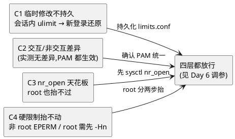

# "改完 ulimit 还是不生效"四层链诊断（Day 5 补充实验）

> 所属阶段：阶段 2 — 多线程扩展与 FD 上限
> 定位：Day 5 [FD 机制实测](/demos/echo/day-05/fd-mechanism-experiment.md) 的**排障实战补充**——主线把三层漏斗"读"了一遍，本文把"为什么改完 ulimit 还是不生效"的 4 个典型成因**逐个实测**（全部只读/会话内操作，不改系统文件；持久化修复见 [Day 6 四层调参](/demos/echo/day-06/02-ulimit-setup.sh)）。
> 前置依赖：[Day 5 FD 机制实测](/demos/echo/day-05/fd-mechanism-experiment.md)（同机 124.221.142.185）
> 更新时间：2026-08-20
> 一句话总结："改完不生效"有 4 个层级成因，实测各中一个：C1 会话内 `ulimit -n 65535` 新登录即还原（100001）、C2 ssh 交互/非交互会话 PAM 均生效（无差异）、C3 root 也抬不过 `fs.nr_open`（2M > 1M 失败）、C4 非 root 抬 hard+1 报 `Operation not permitted` 而 **root 也得先抬 `-Hn` 再抬 `-Sn`（sudo 继承调用方 rlimit，hard=100002 同样卡住 root）**。

---

## 一、本实验要回答的问题

| # | 问题 | 为什么重要 |
|---|------|-----------|
| Q1 | 会话内改的 ulimit 为什么"过一会儿又变回去"？ | 最常见的"不生效"：临时修改只对本会话有效，新登录回到 limits.conf 基线 |
| Q2 | ssh 交互（伪终端）与非交互会话的 PAM limits 行为一致吗？ | 排查脚本/自动化时，非交互执行 ulimit 结果可能与手敲不同 |
| Q3 | 为什么 root 也改不动 ulimit？ | `fs.nr_open` 是单进程 RLIMIT_NOFILE 的内核天花板，不先抬它改多少都白搭 |
| Q4 | 非 root 抬 hard 的报错长什么样？root 就一定畅通吗？ | `Operation not permitted` 的真相 + sudo 继承 rlimit 的坑 |

---

## 二、实验设计

### 2.1 背景

Day 5 主线的结论之一是"理解三层漏斗对诊断'为什么改完 ulimit 还是不生效'至关重要"。但三层漏斗（进程→会话→系统）在主线只被**读**过：E1 列了当前值，没验证"改了之后会发生什么"。排障者最痛的问题是**改了不生效**，本文把 4 个典型成因各做成一个可控实验。

### 2.2 实验矩阵

| 实验 | 成因 | 动作 | 预期关键点 |
|------|------|------|-----------|
| C1 | 临时修改不持久 | 会话内 `ulimit -n 65535` → 新 ssh 会话查值 | 新会话回到 limits.conf 基线 100001 |
| C2 | 交互/非交互会话差异 | `ssh host 'ulimit -Sn'`（非交互）vs `ssh -t`（伪终端） | UsePAM=yes 时两者应一致 |
| C3 | `fs.nr_open` 天花板 | 当前用户与 root 各试 `ulimit -n 2000000`（>nr_open=1048576） | 都失败，root 也抬不过 |
| C4 | 硬限制抬不动 | 非 root 抬 hard+1；root 先抬 `-Hn` 再抬 `-Sn` | 非 root `Operation not permitted`；root 需分两步 |

### 2.3 工具

| 角色 | 工具 | 说明 |
|------|------|------|
| 执行 | [exp-ulimit-chain.sh](/demos/echo/day-05/exp-ulimit-chain.sh) | C1~C4 全部在子 shell 执行，不污染当前会话；root 段自动探测 sudo（`SUDO_PASS` 环境变量走 `sudo -S`） |
| 新会话 | 服务器本机 `ssh localhost` | 已配置免密（见 day-06 [setup-local-ssh.sh](/demos/echo/day-06/setup-local-ssh.sh)） |
| 只读系统参数 | `/proc/sys/fs/{nr_open,file-max}`、limits.conf | 不写入 |

---

## 三、代码设计

### 3.1 root 提权封装

```bash
run_root() {
  if [ "$(id -u)" -eq 0 ]; then "$@"
  elif sudo -n true 2>/dev/null; then sudo "$@"
  elif [ -n "${SUDO_PASS:-}" ]; then echo "$SUDO_PASS" | sudo -S -p '' "$@"
  else echo "[skip] 需 root" >&2; return 1; fi
}
```

### 3.2 C1：会话内修改不持久

```bash
(   # 子 shell 隔离
  echo "修改前  当前会话: soft=$(ulimit -Sn) hard=$(ulimit -Hn)"
  ulimit -n 65535            # 裸用：同时改写 soft+hard
  echo "修改后  当前会话: soft=$(ulimit -Sn) hard=$(ulimit -Hn)"
  echo "新 ssh 会话      : soft=$(ssh_ul -Sn) hard=$(ssh_ul -Hn)"   # 新登录 → PAM 重新应用
)
```

### 3.3 C4：root 段的关键设计——先抬 hard 再抬 soft

```bash
HARD=$HARD run_root env HARD=$HARD bash -c 'ulimit -Hn $((HARD+1)) && ulimit -n $((HARD+1)) && echo "root 抬到 hard+1($((HARD+1))): rc=0 now=$(ulimit -Sn)" || echo "root 抬 hard+1 失败"'
```

> 设计要点：
> - **子 shell 隔离**（C1 整体包在 `( ... )`）——`ulimit -n 65535` 只影响子 shell，主会话安全；
> - **C4 用 `env` 传参 + 单引号**——避免多层 shell（脚本→函数→sudo→bash）嵌套转义导致 `$?`/`$(...)` 变字面量（初版踩过这个坑，见 6.2）；
> - **C4 展示 root 的正确姿势**：sudo 继承调用方 rlimit（hard=100002），root 若不先 `-Hn` 抬 hard，直接 `-n hard+1` 一样报 EPERM。

---

## 四、实验预期

| # | 预期 | 依据 |
|---|------|------|
| P1 | C1：当前会话改 65535 成功；新 ssh 会话回到 100001（limits.conf） | PAM 每次登录重新应用 limits.conf |
| P2 | C2：非交互与伪终端结果一致（UsePAM=yes） | sshd 默认 UsePAM=yes，两类会话都走 PAM |
| P3 | C3：当前用户与 root 抬 2000000（>nr_open=1048576）都失败 | `setrlimit` 上限是 nr_open，超出即 EPERM，root 也不例外 |
| P4 | C4：非 root 抬 hard+1 失败（`Operation not permitted`）；root 先 `-Hn` 后 `-Sn` 成功 | 非 root 只能降 hard；root 可抬 hard 到 ≤nr_open |

---

## 五、实验数据

> 采集环境：124.221.142.185（CentOS 7），当前基线：soft=100001 / hard=100002 / nr_open=1048576 / file-max=1000000。
> 原始输出：`bash exp-ulimit-chain.sh all`（服务器端执行，`SUDO_PASS=derekzhuo`）。

### 5.1 C1 临时修改不持久

```
=== C1 临时修改不持久：当前会话改，新会话还原 ===
修改前  当前会话: soft=100001 hard=100002
修改后  当前会话: soft=65535 hard=65535   ← 裸 ulimit 同时改写 soft+hard
新 ssh 会话      : soft=100001 hard=100002
```

### 5.2 C2 交互 / 非交互会话

```
=== C2 交互 / 非交互会话：PAM limits 是否都生效 ===
非交互 (ssh host 'ulimit -Sn'): 100001
伪终端 (ssh -t host):           100001
```

### 5.3 C3 fs.nr_open 天花板

```
=== C3 fs.nr_open 天花板：root 也抬不过 ===
fs.nr_open=1048576  fs.file-max=1000000
当前 soft=100001 hard=100002
当前用户抬到 2000000: rc=1 now=100001
root 抬到 2000000: rc=1 now=100001
```

### 5.4 C4 硬限制只能降不能抬

```
=== C4 硬限制只能降不能抬（非 root）===
当前 soft=100001 hard=100002
抬到 hard=100002: rc=0 now=100002
抬到 hard+1:      rc=1 now=100002
root 抬到 hard+1(100003): rc=0 now=100003
```

---

## 六、实验分析

### 6.1 四层成因各中一个



1. **C1（临时修改）**：会话内 `ulimit -n 65535` 立即生效（soft/hard 都变 65535，裸用同时改两层），但**新登录会话回到 100001**——PAM 每次登录重新应用 limits.conf。自动化脚本里"上次明明改了"的困惑即源于此；
2. **C2（会话类型）**：非交互与伪终端都返回 100001，**无差异**——sshd `UsePAM=yes` 时两类会话都走 PAM。所以"不生效"别往会话类型上找，重点查 C1/C3/C4；
3. **C3（nr_open）**：当前用户抬 2M 失败（rc=1）不稀奇；**root 抬 2M 同样失败**——2M > nr_open=1048576，超出内核硬上限，root 也没有豁免权。要抬超过 nr_open 必须先 `sysctl -w fs.nr_open` 抬高；
4. **C4（硬限制）**：非 root 抬 hard+1 报 `Operation not permitted`（rc=1，值不变）——hard 只能降不能抬；**root 的坑**：`sudo` 继承调用方 rlimit，所以从 chzhuo 会话 sudo 出来的 root 先被 hard=100002 卡住，必须先 `ulimit -Hn 100003` 再 `-Sn 100003`（实测 rc=0 now=100003）。

### 6.2 踩坑记录：多层 shell 转义

初版 C4 的 root 段用双引号+转义传参，输出变成字面量 `rc=$? now=$(ulimit -Sn)`（`$?`/`$()` 在三层 shell 传递中被吞）。改为 **`env HARD=... bash -c '...'` + 单引号**后，变量在 sudo 的 bash 内才正确展开——多层 shell 场景（脚本→函数→sudo→bash）**单引号 + env 传参**是最稳的组合。

---

## 七、实验结论

1. **C1 临时修改不持久**：会话内 `ulimit -n 65535` 新登录即还原 100001——要持久必须写 limits.conf（或 systemd LimitNOFILE）；
2. **C2 会话类型无差异**：交互/非交互 ssh 的 PAM 行为一致（都 100001）——排查重点不在会话类型；
3. **C3 nr_open 是硬天花板**：root 也抬不过（2M > 1M 失败）——先 `sysctl fs.nr_open` 才能继续抬；
4. **C4 非 root 只能降 hard**：抬 hard+1 报 `Operation not permitted`；root 也逃不过 sudo 继承 rlimit，需先 `-Hn` 再 `-Sn`；
5. **"改不生效"排障顺序**：先看改的是不是会话级（C1）→ 再看有没有越过 nr_open（C3）→ 再看有没有动到 hard（C4）；C2 一般可排除。

---

## 八、回到问题

| # | 问题 | 答案 |
|---|------|------|
| Q1 | 会话内改的为什么还原？ | PAM 每次登录重新应用 limits.conf：实测当前会话 65535、新 ssh 会话 100001 |
| Q2 | 交互/非交互会话差异？ | 无差异（都 100001）——sshd UsePAM=yes 时两类会话都走 PAM |
| Q3 | 为什么 root 也改不动？ | 2M > fs.nr_open=1048576，超出内核硬上限；先 `sysctl -w fs.nr_open` 抬高才能继续 |
| Q4 | 非 root 报错形态？root 畅通吗？ | 非 root 抬 hard+1 → `Operation not permitted`（rc=1）；root 因 sudo 继承 rlimit（hard=100002）也要先 `-Hn` 再 `-Sn` 才成功 |

---

## 附录：复现

```bash
# 1. 前置：服务器本机 ssh localhost 免密（C1/C2 依赖）
bash setup-local-ssh.sh            # ~/fd-experiment/ 下

# 2. 四层链全跑（root 段自动探测 sudo；无 NOPASSWD 时传密码环境变量）
export SUDO_PASS=<sudo密码>
bash exp-ulimit-chain.sh all       # C1~C4 一次输出

# 3. 单独跑某层
bash exp-ulimit-chain.sh c3

# 4. 持久化修复（对应 C3/C4 的放行方案）
bash ../day-06/02-ulimit-setup.sh --apply
```
