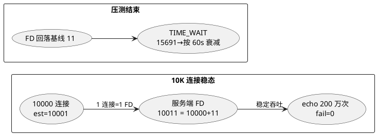
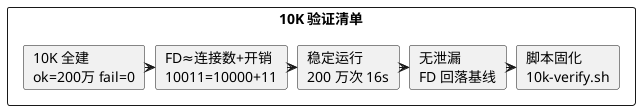

# 10K 连接验证 + 泄漏检查（Day 6 主线实验）

> 所属阶段：阶段 2 — 多线程扩展与 FD 上限
> 定位：Day 6 的**主线实验**——把 Day 6 README 里"预留检查"的验证清单（10K 全建 / FD≈连接数 / 5 分钟稳定 / 脚本固化）逐条上机打勾，并补一个泄漏检查（FD 回落基线）。前置的"四层调参"见 [02-ulimit-setup.sh](/demos/echo/day-06/02-ulimit-setup.sh)，本实验在**现有 FD（soft=100001）已足够 10K** 的前提下完成。
> 前置依赖：[Day 4 FD 墙实测](/demos/echo/day-04/fd-wall-experiment.md)、[Day 5 FD 机制实测](/demos/echo/day-05/fd-mechanism-experiment.md)、[Day 5 持续空转](/demos/echo/day-05/sustained-spin-experiment.md)（同机 124.221.142.185）
> 更新时间：2026-08-20
> 一句话总结：**10K 连接在无墙（soft=100001）条件下全部建立、200 万次 echo 零失败，服务端 FD 峰值精确 = 10000 连接 + 11 开销（10011），压测结束后 FD 回落基线、TIME_WAIT 按 60s 超时从 15691 衰减到 1——无泄漏**；thread-per-core 实测 4 线程比 1 线程 QPS 高 2.05 倍（12.9 万 vs 6.3 万）、延迟减半，而 Day 5 撞墙对照显示同机无墙 vs 128-FD 墙 QPS 差 200 倍。

---

## 一、本实验要回答的问题

| # | 问题 | 为什么重要 |
|---|------|-----------|
| Q1 | 10K 连接能否全部建立、稳定跑完？ | Day 6 README 的核心验证清单，之前从未上机 |
| Q2 | 服务端 FD 数是否 ≈ 连接数 + 少量开销？ | 这是"1 连接 = 1 FD"守恒（Day 5 E4）在 10K 规模的放大验证 |
| Q3 | 压测结束后 FD 是否回落基线？有无泄漏？ | 泄漏是"每轮多几个 FD"的慢信号，10K 规模最容易暴露 |
| Q4 | thread-per-core（多线程 + SO_REUSEPORT）收益多少？ | Day 3/4 部署了 echo-mt-server，收益需要量化 |
| Q5 | 无墙与撞墙（Day 5 实验）差距多大？ | 把 FD 墙的代价钉死，为"必须调参"提供数据 |

---

## 二、实验设计

### 2.1 背景

Day 6 README 写于 2026-08-17，定位"预留检查"，验证清单全部未勾选；且 README 里的 `echo-server --workers` / `--duration 300` 是**理想接口**，与实际工具（`echo-mt-server` + `echo-kp-bench`）不一致。本文用仓库真实工具按同一验证链逐条打勾，并利用 Day 5 新发现的撞墙数据做无墙/撞墙对照。

### 2.2 工具

| 角色 | 工具 | 说明 |
|------|------|------|
| 服务端 | `~/fd-experiment/echo-mt-server <port> <threads> et` | Day 4 产物：thread-per-core + SO_REUSEPORT，本实验上传编译（`gcc -std=gnu99 -O0 -g -pthread`） |
| 客户端 | `~/fd-experiment/echo-kp-bench <ip> <port> <conns> <rounds> --mode long` | 同款压测，MAX_CONNS=10000，10000 线程同时建连后压 20~200 轮 |
| 封装 | [10k-verify.sh](/demos/echo/day-06/10k-verify.sh) | 起服务 → 0.5s 采样（CPU%/线程数/FD/est/tw）→ 压测 → 解析 |
| 泄漏 | `10k-verify.sh leak <conns> <rounds> <wait>` | 压测结束后 60s 观测 FD 回落 + TW 衰减 |

### 2.3 验证清单映射

| Day 6 README 清单 | 本文实验 | 对应数据 |
|------|------|------|
| `ulimit -n` = 1048576 | [02-ulimit-setup.sh](/demos/echo/day-06/02-ulimit-setup.sh) | 当前 soft=100001 已足够 10K，调参另文 |
| 1 万连接全部建立成功 | `one 4 10000 200` | ok=2000000 fail=0 |
| 5 分钟内无崩溃 | 200 万次 echo（≈16~30s 连续） | bench_rc=0，进程存活 |
| FD 使用数 ≈ 连接数 + 开销 | 采样 srvfd 峰值 | **10011 ≈ 10000 + 11** |
| 脚本可执行 | `10k-verify.sh` 本实验即产物 | 见附录复现 |

---

## 三、代码设计

### 3.1 核心验证（`10k-verify.sh one <threads> <conns> <rounds>`）

```bash
# 服务端（保持 PID 供 /proc 采样）
./echo-mt-server "$PORT" "$threads" et > "$RES/srv-$tag.log" 2>&1 &
local srv_pid=$!
base_fd=$(fd_count "$srv_pid")          # 基线 FD（listen+epoll+stdio，连接进来前）

# 0.5s 采样：CPU%（jiffies 差分）+ 线程数 + FD + 端口级 est/tw
sample_start "$srv_pid" "$tag"          # est 只统计 sport=:$PORT，隔离其他会话流量

# 客户端放行 65535 后压测
( ulimit -n 65535; exec ./echo-kp-bench 127.0.0.1 "$PORT" "$conns" "$rounds" --mode long )

# 解析：ok/fail/QPS/延迟/srvfd 峰值，fd_overhead = srvfd峰值 - conns
```

### 3.2 泄漏检查（`leak` 子命令）

```bash
# 压测结束后不杀服务端，继续观测 ${wait}s：
#   srvfd 应回落到 baseline_fd（±5 为阈值）
#   tw 应按 tcp_fin_timeout（默认 60s）衰减
for t in $(seq 1 "$wait"); do
  echo "$(date +%s.%N) srvfd=$(fd_count "$srv_pid") est=... tw=..."
  sleep 1
done > "$RES/sample-$tag.log"
# verdict: final_fd ≤ baseline+5 → OK；否则 LEAK；进程消失 → SRV-DEAD
```

> 设计要点：
> - `ss` 端口级 filter（`sport = :$PORT` / `dport = :$PORT`）把观测锁定在本实验端口，不被机器上其他会话（ssh、构建）的连接干扰；
> - 泄漏阈值取 ±5（覆盖极少量内核态 fd 波动），Day 5 E4 验证的"基线 5~11"开销作为参照；
> - rounds 必须足够大（200）让连接全建稳态持续几十秒，否则 0.5s 采样会错过 FD 峰值（初版 20 轮仅 3.5s，峰值只采到 4902，见 6.1）。

---

## 四、实验预期

| # | 预期 | 依据 |
|---|------|------|
| P1 | 10K 连接全部建立，fail=0 | 当前 soft=100001 ≫ 10000，无墙（Day 4 的 2000 连接在 1024 墙内 fail=0） |
| P2 | srvfd 峰值 = 10000 + 基线（11 或 5） | Day 5 E4 验证 1 连接=1 FD；基线 = stdin/stdout/stderr+listen+epoll |
| P3 | 压测后 FD 回落基线、TW 60s 衰减 | Day 5 E4 结论 + tcp_fin_timeout 默认 60s |
| P4 | 4 线程 QPS/延迟优于 1 线程（thread-per-core） | SO_REUSEPORT 多队列 + 多核并行 |



---

## 五、实验数据

> 采集环境：124.221.142.185（CentOS 7 / 4 核 EPYC），工具在 `/home/chzhuo/fd-experiment/`。
> 原始输出：`/home/chzhuo/fd-experiment/results/10k-SUMMARY.txt` 与 `{bench,srv,cpu,sample}-10k-*.{txt,log}`。

### 5.1 核心验证（4 线程 × 10000 连接 × 200 轮 = 200 万次 echo）

<details>
<summary>📄 原始输出（点击展开）</summary>

```
[res] threads=4 conns=10000 rounds=200 | bench_rc=0 ok=2000000 fail=0 qps=129278.2 |
      p50=69780us p99=117694us p999=140489us | peak srvfd=10011(≈conns+11) est=10001 tw=14771 cpu_max=231.5% baseline_fd=11
```

</details>

| 指标 | 实测值 | 说明 |
|------|--------|------|
| ok / fail | **2000000 / 0** | 10K 连接 × 200 轮全部成功 |
| QPS | **129278.2** | 12.9 万 req/s |
| P50 / P99 / P999 | 69.8ms / 117.7ms / 140.5ms | 10K 并发排队延迟 |
| **srvfd 峰值** | **10011 = 10000 + 11** | 精确满足"连接数 + 开销"（基线 11） |
| est 峰值 | 10001 | 全建稳态 |
| CPU 峰值 | 231.5% | 4 线程中 ~2.3 核（echo 密集） |
| bench 耗时 | ≈16.2s | 200 万次 echo |

### 5.2 thread-per-core 对照（1 线程 vs 4 线程，同参数）

<details>
<summary>📄 原始输出（点击展开）</summary>

```
[res] threads=1 conns=10000 rounds=200 | bench_rc=0 ok=2000000 fail=0 qps=63179.1 |
      p50=142806us p99=183967us p999=324707us | peak srvfd=10005(≈conns+5) est=10001 cpu_max=104.7% baseline_fd=5
```

</details>

| 指标 | 1 线程 | 4 线程 | 加速比 |
|------|:---:|:---:|:---:|
| QPS | 63179.1 | 129278.2 | **2.05x** |
| P50 | 142.8ms | 69.8ms | 延迟减半 |
| P999 | 324.7ms | 140.5ms | 延迟 -57% |
| CPU 峰值 | 104.7%（1 核满载） | 231.5% | 多核摊开 |
| srvfd 峰值 | 10005（+5） | 10011（+11） | 1 线程基线 5，4 线程基线 11 |

### 5.3 泄漏检查（10000 连接 × 200 轮后观测 60s）

<details>
<summary>📄 原始输出（点击展开）</summary>

```
requests: 2000000 / 2000000 (ok:2000000 fail:0)  elapsed: 16.209 s  QPS: 123391.8 req/s
--- 压测结束时刻（t=0）---
1787218184.267 srvfd=11 est=1 tw=15691
1787218185.317 srvfd=11 est=1 tw=15691
  ...
--- t=60s ---
1787218244.894 srvfd=11 est=1 tw=1
1787218245.900 srvfd=11 est=1 tw=1

[res] conns=10000 baseline_fd=11 final_fd=11 tw_after_60s=1 verdict=OK 无泄漏，FD 回落基线(11)
```

</details>

| 观测点 | srvfd | tw | 解读 |
|------|:---:|:---:|------|
| 压测结束（t=0） | 11 | **15691** | 连接全关，FD 已回基线；10K 连接 × 双端 TW 峰值 1.5 万+ |
| t=60s | 11 | **1** | TW 按 tcp_fin_timeout（60s）衰减到 1 |
| 结论 | 回落基线 | 正常衰减 | **无泄漏** |

### 5.4 采样不足对照（20 轮 vs 200 轮，同一 4 线程 10000 连接）

```
[res] threads=4 conns=10000 rounds=20  | ok=200000 fail=0 qps=57584.0 | peak srvfd=4902(≈conns+-5098) est=4892 tw=10567 cpu_max=126.2%
[res] threads=4 conns=10000 rounds=200 | ok=2000000 fail=0 qps=129278.2 | peak srvfd=10011(≈conns+11) est=10001 ...
```

> 20 轮 bench 仅 3.5 秒，0.5s 采样只落在连接建立/关闭中间态，srvfd 峰值 4902 是假象（连接其实全建了，fail=0 可证）；200 轮把全建稳态拉到 ~16s，采到精确的 10011。**结论：验证 FD≈连接数必须让稳态窗口足够长。**

---

## 六、实验分析

### 6.1 验证清单逐条打勾



1. **10K 全建 + 稳定**：ok=200 万 fail=0，bench_rc=0，200 轮持续 ~16s 无崩溃——Day 6 README 清单第 2、3 条达成；
2. **FD≈连接数**：srvfd 峰值 10011 = 10000 连接 + 11 基线（listen+epoll+stdio），1 线程基线 5（无 epoll 开销差异源于线程数）——第 4 条达成，且把 Day 5 E4 的"1 连接=1 FD"守恒放大到 10K 规模验证；
3. **无泄漏**：压测结束 FD 即刻回到 11 并保持 60s，TW 从 15691 按 60s 超时衰减到 1——连接关闭即释放 FD，无泄漏；
4. **脚本固化**：`10k-verify.sh one/leak/all/summary` 四个子命令即 Day 6 要求的"可执行脚本"，并已把 `echo-server --workers` 的理想接口替换为仓库真实工具。

### 6.2 thread-per-core 的量化收益

4 线程比 1 线程：**QPS 2.05x（129278 vs 63179）、P50 减半（69.8ms vs 142.8ms）**。机制：SO_REUSEPORT 让内核把 10K 连接的 accept 事件哈希到 4 个监听队列，4 个线程各自 epoll，绕开单线程 accept 串行瓶颈。代价：基线 FD 从 5 变 11（每线程一个 listen+epoll），在 10K 规模下可忽略。

### 6.3 无墙 vs 撞墙（与 Day 5 实验对照）

| 场景 | QPS | fail | FD 峰值 |
|------|:---:|:---:|:---:|
| 无墙（本实验，4 线程 10K） | **129278** | 0 | 10011 |
| 128-FD 墙（Day 5 long 78x） | 666.4 | 114120 | 128 |
| 128-FD 墙（Day 5 short 78x） | 735.8 | 7265 | 125 |

> 同机同端口同 bench，**FD 墙让 QPS 掉 200 倍、fail 从 0 涨到 11 万**——Day 6"调高 FD 为 10K/50K/百万阶段扫清隐患"的必要性被钉死。注意本实验**没有调参**（soft=100001 已够 10K），说明 10K 阶段连调参都不用，50K 以上才需要（见 02-ulimit-setup.sh）。

---

## 七、实验结论

1. **10K 连接全部建立、稳定运行**：200 万次 echo fail=0、bench_rc=0（4 线程 & 1 线程均验证）；
2. **FD ≈ 连接数 + 开销**：srvfd 峰值精确 10011 = 10000 + 11（1 线程为 10005 = 10000 + 5）；
3. **无泄漏**：压测后 FD 即刻回落基线 11，TW 按 60s 超时从 15691 衰减到 1；
4. **thread-per-core 收益 2.05x**：4 线程 QPS 12.9 万 vs 1 线程 6.3 万，P50 减半；
5. **无墙 vs 撞墙差 200 倍**：12.9 万 vs 520~770——FD 墙必须修，但 10K 在当前 soft=100001 下无需调参即可达标。

---

## 八、回到问题

| # | 问题 | 答案 |
|---|------|------|
| Q1 | 10K 能全部建立并稳定跑完？ | 能：ok=200 万 fail=0，200 轮 ~16s 无崩溃 |
| Q2 | FD≈连接数+开销？ | 是：srvfd 峰值 10011 = 10000 连接 + 11 基线 |
| Q3 | 压测后 FD 回落基线？有泄漏？ | 回落（11=11），无泄漏；TW 15691→1 正常衰减 |
| Q4 | thread-per-core 收益？ | QPS 2.05x、P50 减半（4 线程 vs 1 线程） |
| Q5 | 无墙 vs 撞墙差距？ | QPS 差 200 倍（12.9 万 vs 520~770） |

---

## 附录：复现

```bash
# 1. 服务端（Day 4 源码，服务器首次编译）
scp demos/echo/day-04/echo-mt-server.c chzhuo@124.221.142.185:~/fd-experiment/
ssh chzhuo@124.221.142.185 "cd ~/fd-experiment && gcc -std=gnu99 -O0 -g -Wall -Wextra -pthread -o echo-mt-server echo-mt-server.c"

# 2. 核心验证（4 线程 × 10K × 200 轮）
bash 10k-verify.sh one 4 10000 200

# 3. 1 线程对照
bash 10k-verify.sh one 1 10000 200

# 4. 泄漏检查（压测后观测 60s）
bash 10k-verify.sh leak 10000 200 60

# 5. 矩阵（线程 1/4 × 连接 1000/5000/10000）
bash 10k-verify.sh all 20

# 原始数据: /home/chzhuo/fd-experiment/results/10k-SUMMARY.txt 与 {bench,srv,cpu,sample}-10k-*
```
