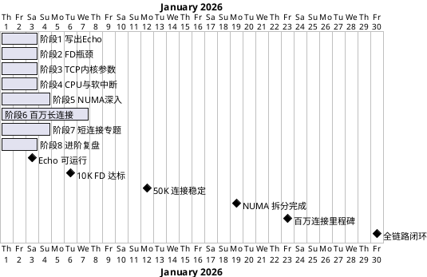

# Echo 项目总纲 — 从零到百万连接

> **核心理念**：不预设优化、不提前调参。先写出能跑的代码，再在压测中逐个撞上瓶颈，每个瓶颈都是一次诊断—定位—修复的完整闭环。

> **当前进度**：✅ 阶段 1（Day 1-3）与阶段 2（Day 4-6）已完成，阶段 3-8 处于规划中，下方路线表以状态列标注。本文档为**整体路线蓝图**，具体进度请以各阶段小结与当日文档为准。

## 一、学习目标

| 序号 | 目标 | 验收标准 |
|:--:|------|------|
| 1 | 从零写出 TCP Echo 服务 | C 语言实现多进程 + epoll + SO_REUSEPORT，可编译运行 |
| 2 | 单机承载百万 TCP 长连接 | 100 万连接稳定保持 10 分钟以上 |
| 3 | 理解并解决每个性能瓶颈 | 每个瓶颈有观测数据、有根因分析、有修复验证 |
| 4 | 掌握 NUMA 架构优化 | 双 NUMA 拆分 + IRQ 对齐，吞吐翻倍 |

## 二、学习路线（8 阶段 × 30 天）

| 阶段 | 天数 | 核心问题 | 状态 | 详情 |
|------|:--:|------|:--:|------|
| 1. 写出 Echo 服务 | Day 1-3 | TCP socket/epoll 编程，从 localhost 到云主机 | ✅ 已完成 | [→](/demos/echo/docs/01-phase1-from-scratch.md) · [阶段小结](/demos/echo/docs/01b-phase1-summary.md) |
| 2. 多线程扩展与 FD 上限 | Day 4-6 | 单线程 epoll 触顶 → 多线程扩展；FD 上限因预置 ulimit 未触发 | ✅ 已完成 | [→](/demos/echo/docs/02-phase2-fd-bottleneck.md) · [阶段小结](/demos/echo/docs/02b-phase2-summary.md) |
| 3. TCP 内核参数 | Day 7-9 | 建连超时、端口不够、缓冲区不足 | ⏳ 规划中 | [→](/demos/echo/docs/03-phase3-tcp-kernel.md) |
| 4. CPU 与软中断 | Day 10-12 | 流量上来后单 CPU 打满，%soft 飙升 | ⏳ 规划中 | [→](/demos/echo/docs/04-phase4-cpu-softirq.md) |
| 5. NUMA 深入 | Day 13-16 | CPU 分布不均衡 → 发现 NUMA 架构 → 优化 | ⏳ 规划中 | [→](/demos/echo/docs/05-phase5-numa-deep.md) |
| 6. 百万长连接 | Day 17-23 | 20→50→100→500→1000K 逐级爬升 | ⏳ 规划中 | [→](/demos/echo/docs/06-phase6-million-conn.md) |
| 7. 短连接专题 | Day 24-27 | TIME_WAIT 爆炸、端口耗尽、SYN 队列溢出 | ⏳ 规划中 | [→](/demos/echo/docs/07-phase7-short-conn.md) |
| 8. 进阶与复盘 | Day 28-30 | L2 计算 echo、L3 流式 echo、全链路复盘 | ⏳ 规划中 | [→](/demos/echo/docs/08-phase8-advanced-review.md) |

## 三、问题驱动 vs 预设优化

传统做法是先花一周把系统参数全部调优，再跑代码。但这样你会**不知道为什么需要这些参数**。

本项目的原则是：

| | 传统做法（预设优化） | 本项目（问题驱动） |
|------|------|------|
| **FD 限制** | Day 1 就调 ulimit -n 1048576 | 先跑代码，撞上 "Too many open files" 才调（本项目为保证压测数据干净，Day 4 起预置 65535，FD 未实际触发——见 [阶段 2](/demos/echo/docs/02-phase2-fd-bottleneck.md)）|
| **TCP 参数** | 上来就配好 tcp_tw_reuse/somaxconn | 压测出超时/丢包后才逐项定位调整 |
| **网卡 RSS** | 先配好 8 队列 + IRQ 绑定 | 先观测到单 CPU 打满，再诊断软中断 |
| **NUMA 绑定** | 直接按最优拓扑部署 | 先观测到 CPU 分布不均，再逐层优化 |

每个配置都有"为什么需要它"的亲眼见证。

## 四、硬件环境

- 机型：腾讯云 C6 8核32G（按量计费）
- CPU：Intel Xeon Cascade Lake，2 NUMA 节点（每节点 4 核）
- 网卡：8 个 RSS（Receive-Side Scaling，接收端缩放）队列，内网带宽 9Gbps，PPS（Packets Per Second，每秒数据包数）上限约 160 万
- 不绑定弹性公网 IP（Elastic IP，EIP），开机 IP 变动无需关注
- 月度费用约 181 元

## 五、每日标准操作流程（SOP）

1. 开机 → SSH 登录
2. 跑今日目标压测/操作
3. 记录关键指标（连接数/QPS/P99/内存/CPU/软中断）
4. 遇到问题 → 诊断 → 定位根因 → 修复验证
5. 关机，写当日复盘笔记

## 六、关键指标速查

| 指标 | 观测工具 | 健康范围 |
|------|------|------|
| 连接数 | `ss -s` / `/proc/sys/fs/file-nr` | ≤ 100 万 |
| PPS | `sar -n DEV 1` | ≤ 160 万 |
| %soft | `mpstat -P ALL 1` | ≤ 20% 单核 |
| numa_miss | `numastat -p <pid>` | ≈ 0 |
| TIME_WAIT | `ss -s` | ≤ 5 万（短连接场景） |
| FD 使用量 | `ls /proc/<pid>/fd \| wc -l` | ≤ ulimit -n |

> **一句话总结**：8 阶段 × 30 天，问题驱动的学习路径——每个优化都来自亲眼所见的瓶颈，先撞墙再找路，从 TCP socket 编程到百万长连接全链路闭环。
