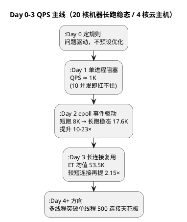
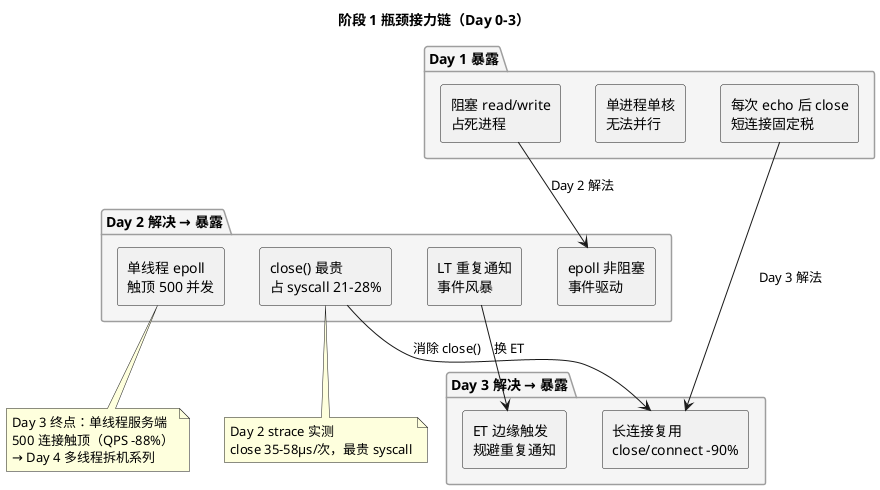

# 阶段 1 小结（Day 0-3）：从规划到连接资产化 — 四天瓶颈接力复盘

> 所属阶段：阶段 1 — 从零写出 Echo 服务 | **状态：已完成**
> 更新时间：2026-08-21
> 覆盖范围：[Day 0 总纲与规划](/demos/echo/docs/00-overview.md) → [Day 1 从零编码](/demos/echo/day-01/) → [Day 2 基线验证](/demos/echo/day-02/) → [Day 3 长连接](/demos/echo/day-03/)

---

## 一、本小结要回答的问题

阶段 1 的四天（Day 0 规划 → Day 3 长连接）是整个 Echo 项目的第一段主线。在进入多线程拆机系列（Day 4）之前，值得停下来盘一盘账：

| # | 问题 | 为什么重要 |
|---|------|-----------|
| Q1 | 四天各自解决了什么问题、产出了什么？ | 建立"每个 Day 都有独立价值"的阶段画像 |
| Q2 | 性能主线如何走通的？QPS 从 ~1K 到 53K 的每一跳靠什么？ | 看清每个数量级提升的"功臣"是谁 |
| Q3 | 消除一个瓶颈后，下一个瓶颈是谁？ | 理解"瓶颈接力"是本项目的核心方法论 |
| Q4 | 四天沉淀了哪些可复用的实验方法论？ | 这些方法在 Day 4+ 与后续 7 个阶段全部复用 |

> 一句话先导：Day 0 定规则、Day 1 立基准、Day 2 找瓶颈、Day 3 拆瓶颈——四天构成了一个完整的"问题驱动"闭环，而这个闭环将在整个 30 天项目中不断重演。

---

## 二、四天速览

### 2.1 每日画像

| Day | 主题 | 一句话定位 | 核心动作 | 关键产出 |
|:--:|------|-----------|---------|---------|
| **0** | 总纲与规划 | **定规则**：不预设优化、问题驱动 | 8 阶段 × 30 天路线图、硬件确认、每日 SOP | [路线图](/demos/echo/docs/00-overview.md)、[阶段 1 规划](/demos/echo/docs/01-phase1-from-scratch.md) |
| **1** | 从零写 Echo | **立基准**：最差对照 | 单进程阻塞七步拳，先能跑 | `server.c` / `client.c`，QPS ~1K |
| **2** | 基线验证 | **找瓶颈**：量化"慢在哪" | LT/ET/MP 三服务端 + 双压测工具，五层归因 | `echo-epoll-*`、`echo-mp-server`、`echo-bench`、`bench.sh`，QPS 10-23× |
| **3** | 长连接 | **拆瓶颈**：消除 close() | `--mode short/long` 双模式对照 | `echo-kp-bench`，ET 2.15×、close/connect -90% |

### 2.2 性能主线：QPS 的每一跳

| 跃迁 | 起点 | 终点 | 倍数 | 功臣 |
|------|:---:|:---:|:---:|------|
| Day 1 → Day 2 | ~1K（阻塞） | 8K-17.6K（epoll） | **10-23×** | 事件驱动消除 accept 阻塞等待 + 单线程复用消除线程切换 |
| Day 2 → Day 3 | 24915（ET 短连接） | 53528（ET 长连接） | **2.15×** | 消除 connect/close（-90% syscall）+ 省 2 RTT 协议税 |

> **注意两条线的口径**：Day 2 的 17.6K 是 20 核共享 VM 的串行长跑稳态；Day 3 的 53.5K 是 4 核云主机的并行长连接。两者绝对数值不可直接对比，但"每一跳的提升倍数"和"瓶颈归属"结论是自洽的——Day 2 证明 epoll 是第一个数量级，Day 3 证明连接复用是第二个数量级。

---

## 三、瓶颈接力：四天的主线叙事

整个阶段 1 可以用一张"瓶颈接力图"概括——**每天的工作都是"发现瓶颈 → 归因 → 消除 → 暴露下一层"**：

### 3.1 逐环拆解

| 环节 | 谁暴露的 | 证据 | 谁解决/缓解的 | 结果 |
|------|---------|------|--------------|------|
| 阻塞 I/O 占死进程 | Day 1 单进程阻塞 | 10 并发即排队 | Day 2 epoll | QPS 10-23× |
| 单进程单核 | Day 1/2 架构对比 | 20 核机器单核跑不满 | Day 2 SO_REUSEPORT 多进程 | 短连接下无明显收益（负载依赖）|
| close() 最贵 | Day 2 strace | 占 syscall 总耗时 21-28% | Day 3 长连接 | close/connect 调用 -90% |
| 单线程触顶 | Day 3 连接扫描 | 500 并发 QPS 掉 88% | **未解决** → Day 4 | thread-per-core + 拆机 v1-v3 |
| LT 重复通知 | Day 3 长连接对比 | LT 1.48× vs ET 2.15× | Day 3 换 ET | LT/ET 差距 37.2% |

### 3.2 关键认知：每个瓶颈的消除都会暴露下一层

- Day 1 消除了"能不能跑"（最差对照 ~1K），Day 2 才能量出"epoll 值多少钱"（10-23×）；
- Day 2 消除了"阻塞等待"，才暴露出 **close() 最贵**（21-28%）和 **单线程天花板**；
- Day 3 消除了 close()，才暴露出 **LT 重复通知**（37.2% 差距）和 **500 连接触顶**——这两个正是 Day 4 拆机系列要对付的敌人。

> **一句话**：优化不是"把 X 调快"，而是"拆掉一层瓶颈，看下一层瓶颈长什么样"。Day 3 的终点（单线程触顶）就是 Day 4 的起点。

---

## 四、数据汇总表（一句话版）

| Day | QPS 画像 | 关键数据 | 新瓶颈 | 一句话结论 |
|:--:|---------|---------|--------|-----------|
| 0 | 规划日 | 8 阶段 × 30 天 | 无 | 不预设优化，问题驱动 |
| 1 | ~1K | 10 并发扛不住 | 阻塞串行 | 先能跑，立最差基准 |
| 2 | 8K-17.6K | 提升 10-23×；close() 21-28% | close()、单线程触顶 | epoll 是第一个数量级 |
| 3 | 53.5K（ET） | 2.15×；close/connect -90%；500 连接拐点 | LT 重复通知、RTT 硬下限 | 连接是长期资产 |

---

## 五、方法论沉淀（Day 4+ 全程复用）

### 5.1 四把尺子

| 尺子 | 来源 | 用途 | 典型指标 |
|------|------|------|---------|
| 串行压测 `echo-bench` | Day 2 | 单流延迟上限 | P50/P90/P99/P999 |
| 并发压测 `bench.sh` | Day 2 | 并发容量下限 | 近似 QPS、失败率 |
| 双模式 `echo-kp-bench` | Day 3 | 隔离变量（短/长连接） | 同代码两策略 |
| `strace -c` | Day 2/3 | syscall 级归因 | close/connect 次数与耗时 |

### 5.2 四条原则

1. **控制变量**：同机器、同 payload、同压测工具，只改一个变量（Day 3 的 short/long 是标准示范）；
2. **同一把尺子**：跨网络对比时工具解释器开销会污染绝对值，但相对增量（远程 − localhost）依然可靠；
3. **双机对照**：20 核 vs 4 核机器剥离"核数相关"结论（Day 2 §7.6 全量对照）；
4. **显式分离首跑与稳态**：Run 1 单独记录，Run 2+ 取均值，避免把冷启动噪声归因到代码。

> **一句话**：Day 2-3 建立起来的"双工具 + 双机 + 显式变量"实验框架，是整个 30 天项目所有后续实验的模板。

---

## 六、承上启下：Day 4 的入场券

| Day 3 遗留瓶颈 | Day 4 的解法 | 对应文档 |
|---------------|-------------|---------|
| 单线程 epoll 500 连接触顶 | thread-per-core + SO_REUSEPORT 多线程 | [拆机实验 v1](/demos/echo/day-04/split-experiment-v1.md) |
| LT 重复通知（长连接 37.2% 差距） | 换 ET；CPU 充裕后差距坍缩的再验证 | [拆机 v2/v3](/demos/echo/day-04/split-experiment-v2.md) |
| 5000 短连接崩盘（QPS 387 + fail 248） | TIME_WAIT 治理 + 连接池化 | [拆机 v3 SYN 雪崩](/demos/echo/day-04/split-experiment-v3.md) |
| 跨网络 RTT 硬下限（9.1ms） | 长连接 + 多连接复用 | 阶段 6（百万长连接）|

---

## 七、回答开头的问题

### Q1：四天各自解决了什么问题、产出了什么？

> **答**：Day 0 定规则（问题驱动、8 阶段路线）；Day 1 立基准（单进程阻塞 ~1K，最差对照）；Day 2 找瓶颈（epoll 提升 10-23×，strace 定位 close() 最贵）；Day 3 拆瓶颈（长连接消除 close()，ET 再提 2.15×）。产出：1 个总纲 + 2 个基础代码 + 3 个服务端 + 3 个压测工具 + 4 份报告。

### Q2：性能主线如何走通的？

> **答**：两步跃迁——**阻塞→epoll**（~1K → 17.6K，10-23×，功臣是事件驱动），**短连接→长连接**（24.9K → 53.5K，2.15×，功臣是连接复用消除协议税）。每一步都来自前一步实测暴露的瓶颈，不是预设优化。

### Q3：消除一个瓶颈后，下一个瓶颈是谁？

> **答**：阻塞等待 → close()（21-28%）→ LT 重复通知（37.2%）+ 单线程触顶（500 连接）。瓶颈是层层嵌套的，Day 3 的终点（单线程天花板）直接指向 Day 4 的多线程拆机系列。

### Q4：四天沉淀了哪些方法论？

> **答**：双压测工具（串行测延迟上限 / 并发测容量下限）、双机对照（剥离核数变量）、双模式隔离（short/long）、syscall 级归因（strace -c）、显式分离首跑与稳态——这套框架在 Day 4+ 与后续 7 个阶段全程复用。

---

> **一句话总结**：Day 0-3 是"问题驱动方法论"的第一轮完整演示——定规则、立基准、找瓶颈、拆瓶颈，QPS 从 ~1K 走到 53.5K，而每一步提升都只是"为看清下一层瓶颈所付的过路费"，这个接力赛在 Day 4 拆机系列中继续。
