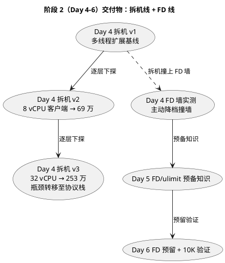
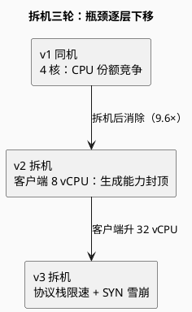
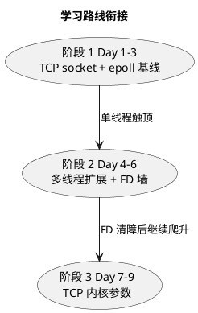

# 阶段 2 阶段性小结：从单线程触顶到撞上 FD 墙（Day 4-6）

> 所属阶段：阶段 2 — 多线程扩展与 FD 上限（已完成，进入阶段小结）
> 更新时间：2026-08-17

## 本阶段回答的问题

阶段 2 原计划只有一句话——"扩大连接数，直到撞上 FD 上限"。实际推进中，问题被不断重写，最终落成三条主线：

| # | 原问题 | 被现实改写成 | 答案 |
|:--:|------|------|------|
| 1 | 单线程 epoll 触顶怎么办？ | 多线程（thread-per-core + SO_REUSEPORT）能否突破单线程天花板、量化收益 | 能，且 v1→v3 三轮拆机逐层下探（详见 [v3](/demos/echo/day-04/split-experiment-v3.md)） |
| 2 | 撞 FD 上限会怎样？ | 环境预置 `ulimit -n 65535`，FD 一度未触发；主动降档能否复现 | 能，[FD 墙实测](/demos/echo/day-04/fd-wall-experiment.md) 精确撞墙（QPS -50%、P999 588ms） |
| 3 | 为什么有些组 fail 却无损？ | 长连接客户端的阻塞 `read()` 如何掩盖 FD 墙 | 波次串行 accept（5000 连接切约 5 波），fail=0 但吞吐腰斩 |

## 阶段 2 交付物地图

| 文档 | 一句话定位 | 状态 |
|------|-----------|:--:|
| [v1 多线程扩展基线](/demos/echo/day-04/split-experiment-v1.md) | 单线程触顶 → 多线程突破，同机基线（最优线程数 2）；Day 4 的拆机线与 FD 线共同起点 | ✅ |
| [FD 墙实测](/demos/echo/day-04/fd-wall-experiment.md) | 主动降档 `ulimit -n` 第一次真实撞 FD 墙（FD 线） | ✅ |
| [v2 拆机实验](/demos/echo/day-04/split-experiment-v2.md) | 客户端/服务端分离，8 vCPU → 69 万，验证 v1 假说（拆机线） | ✅ |
| [v3 拆机实验](/demos/echo/day-04/split-experiment-v3.md) | 32 vCPU → 253 万，瓶颈转移至网络协议栈，SYN 队列雪崩 | ✅ |
| [Day 5 FD/ulimit](/demos/echo/day-05/) | FD 三层限制模型：`ulimit -n`/`fs.file-max`/`fs.nr_open` 预备知识（[机制实测](/demos/echo/day-05/fd-mechanism-experiment.md) + [持续空转实测](/demos/echo/day-05/sustained-spin-experiment.md) + [四层链诊断](/demos/echo/day-05/ulimit-chain-experiment.md)） | ✅ |
| [Day 6 FD 预留 + 10K](/demos/echo/day-06/) | 四层调参脚本幂等固化，10K 验证全过：fail=0、FD=10000+11、无泄漏（[10K 验证](/demos/echo/day-06/10k-verify-experiment.md)） | ✅ |

## 拆机实验：瓶颈三层递进（v1 → v2 → v3）

阶段 2 的核心方法论是**拆机**——把同机压测的"CPU 份额竞争"一步步剥离，让真正的瓶颈浮出水面。三轮拆机逐层下探，**每一层的瓶颈消失后，下一层瓶颈立刻暴露**，形成完整的证据链：

| 轮次 | 场景 | 关键数字 | 暴露的瓶颈 | 交给下一轮的问题 |
|------|------|---------|-----------|----------------|
| [v1 同机基线](/demos/echo/day-04/split-experiment-v1.md) | 4 核同机压测 | 触顶 500 → 2000+；4 线程只抢到 ~2 核 | **CPU 份额竞争**（压测端同机抢核） | 拆机后瓶颈是否消除？ |
| [v2 拆机](/demos/echo/day-04/split-experiment-v2.md) | 服务端 32 / 客户端 8 vCPU | 4 线程 9.6×；QPS 卡 69 万平台 | **客户端 8 vCPU 打满**（生成请求能力封顶） | 客户端升级 32 vCPU 后平台是否消失？ |
| [v3 拆机](/demos/echo/day-04/split-experiment-v3.md) | 服务端 32 / 客户端 32 vCPU | t32 253 万（9.18×）；服务端仅用 3.6 核 | **内核协议栈路径限速** + SYN 队列雪崩 | RSS 多队列 / 连接池化怎么改？ |

### 第 1 层：v1 同机——"单线程触顶"是 epoll 的锅，多线程突破

**现象**：单线程 epoll 在 500 并发触顶（Day 3）；thread-per-core + SO_REUSEPORT 后拐点推到 2000+，5000 短连接从 fail 248 → fail 0。

**证据**：1→2 线程 +43%、2→4 线程 **-6%**（不升反降）；CPU 采样显示 1 线程打满 1 核、4 线程也只有 ~190%（约 2 核）——**4 核被 1000 个客户端线程瓜分**。%sys 97-98% 说明 CPU 几乎全花在内核态（syscall）。

**反直觉点**：最优线程数不是 4（核数）而是 **2**——多线程吃满的是"抢到的份额"而非核数本身；LT vs ET 的胜负随架构反转（单线程 ET 高 37% → 4 线程 LT 高 32~129%）。

### 第 2 层：v2 拆机——瓶颈不在服务端，在客户端

**现象**：拆机后（服务端 32 vCPU 独享 / 客户端 8 vCPU），同机 1 线程 5.3 万 → 22.6 万（**4.2×**）、4 线程 7.2 万 → 69 万（**9.6×**）——v1"CPU 份额竞争"假说证实。

**证据**：t4 后 QPS 停在 69 万平台，服务端 32 vCPU 远未打满；客户端 `echo-kp-bench` 每连接一个 pthread（1000 线程），全部挤在 8 vCPU 上——**吞吐由发件方决定**。

**反直觉点**：服务端不是到顶了，是"客户端喂不动"——压测场景最常见的隐藏瓶颈。最优线程数从同机的 2 改写为 4~8（受客户端封顶，并非服务端规律）。

### 第 3 层：v3 拆机——双方 CPU 都没打满，瓶颈在协议栈

**现象**：客户端升 32 vCPU 后 69 万平台消失，t32 达 **253 万**（t1→t32 9.18×，恢复近线性扩展）。

**证据**：服务端 32 vCPU 全程只用 **3.6 核**、客户端空闲 77%+；长连接稳态 PPS 仅 2~24、距网卡标称上限差 5 个数量级——CPU、网卡、客户端全部排除，**瓶颈在"逐包处理路径"**（softirq 单队列 / 协议栈串行化）。同时短连接 ≥1000 连接因 **SYN 队列溢出**雪崩（QPS 跌 50 倍、P99 秒级；syn-recv 堆积 350~470 而 TIME_WAIT 恒为 1，排除 TW 假说）。

**反直觉点**：CPU 没用满不代表 CPU 不是瓶颈——先定位瓶颈在**哪个资源路径**（协议栈 vs 用户态 vs 网卡），再谈优化。

### 三层递进的工程启示

| 层 | 瓶颈 | 解法方向 | 对应阶段 |
|:--:|------|---------|---------|
| 1 | CPU 份额竞争（同机） | 拆机压测；线程数 ≤ 核数/2 | 阶段 2（已闭环） |
| 2 | 客户端生成能力 | 客户端升级 / 减少压测线程 | 阶段 2（已闭环） |
| 3 | 内核协议栈路径 | RSS 多队列 + IRQ 亲和、busy-poll | 阶段 4（Day 10-12） |
| 3' | SYN 队列溢出（短连接） | 连接池化/长连接化、客户端 epoll 化 | 阶段 3 + 7 |

> 方法论沉淀：**"连接数放大 → 瓶颈逐层暴露"**——每消除一层瓶颈，下一层立刻浮出水面（CPU → 客户端 → 协议栈）。这条方法论正是阶段 3 把连接数推到 3 万、5 万继续爬升的指导思想。

## 阶段 2 的关键结论

### 1. 单线程触顶不是 FD 的锅，是 epoll 的锅

连接数扫描全程 `fail = 0`——`ulimit -n 65535` 预置让 FD 从未真正拦住我们。真正的拐点是单线程 epoll 在 500 并发触顶，多线程（thread-per-core + SO_REUSEPORT）把拐点推高后，瓶颈才逐层暴露：CPU 份额竞争 → 客户端 vCPU → 内核协议栈（三轮逐层下探的完整分析见上文「拆机实验：瓶颈三层递进」一节）。

### 2. FD 墙一旦撞上，代价是"延迟爆炸"而非"连接失败"

主动降档后（[FD 墙实测](/demos/echo/day-04/fd-wall-experiment.md)），5000 连接下：

| 指标 | srv=1024 撞墙 | srv=8192/65535 不撞 |
|------|:---:|:---:|
| QPS | **3942.8** | 7935.1 / 7928.6 |
| P999 | **588ms** | 224ms / 232ms |
| fail | 0 | 0 |
| FD 峰值 | **1024（卡死）** | 1088 / 2453 |

机制是**波次串行 accept**：FD 墙把 5000 并发切成约 5 波（每波 ~1020 连接），长连接客户端的阻塞 `read()` 掩盖了墙——**fail=0 不代表没撞墙**，这是本阶段最反直觉的收获。

### 3. TIME_WAIT 端口墙 ≠ FD 墙，两条诊断路径要分清

8192-5000 组首跑 `fail=13450/127s` 曾一度被误读为 FD 墙，实为 **TIME_WAIT 端口墙**（tw 峰值 12735 > 端口池 2.8 万冲突），`tcp_tw_reuse=1` 后 fail 归零。诊断时要先分清：`Too many open files`（FD 墙）vs `connect() 超时`（端口/队列墙）。

## 与阶段 1、阶段 3 的关系

阶段 2 的产出为阶段 3 埋了两颗雷，也扫了一个雷：

- **已扫**：`ulimit -n` 上调到 1048576 并脚本化（[Day 6](/demos/echo/day-06/)），10K/50K/百万连接阶段不会先撞进程级 FD 墙；
- **待引爆**：连接数继续爬升（阶段 3 跑到 3 万）时，默认 TCP 内核参数会成为下一堵墙——`ip_local_port_range` 端口池、`tcp_rmem/tcp_wmem` 缓冲区、`somaxconn` 队列长度。

## 下一步方向（阶段 3：TCP 内核参数瓶颈）

FD 只是第一关。阶段 2 已验证"连接数放大 → 瓶颈逐层暴露"的方法论，阶段 3 沿同一思路把连接数推到 3 万、5 万，撞第二堵墙——**内核 TCP 参数**：

1. **端口耗尽**（Day 7）：`ip_local_port_range` 默认 32768-60999（约 2.8 万端口），3 万连接时 `connect()` 超时；
2. **缓冲区不足**（Day 8）：`tcp_rmem/tcp_wmem` 默认 128KB，5 万连接时吞吐受限；
3. **队列积压**（Day 9）：`somaxconn` 默认 128，高并发建连时 SYN 队列溢出。

## 阶段 2 完工验证清单

- [x] 单线程 epoll 触顶 → 多线程突破，收益量化（v1→v3 三轮）
- [x] FD 墙主动撞墙复现，EMFILE 诊断路径验证（QPS -50%、P999 588ms）
- [x] TW 端口墙与 FD 墙诊断路径分离（`tcp_tw_reuse` 对照）
- [x] FD/ulimit 三层限制模型沉淀为预备知识（Day 5）
- [x] `ulimit -n` 上调脚本化，10K 连接验证稳定（Day 6）

> **一句话总结**：阶段 2 用"主动降档 + 拆机"把两个原本可能被预置环境掩盖的问题（单线程 epoll 触顶、FD 墙）逼到台前实测，验证了"连接数放大 → 瓶颈逐层暴露"的方法论；FD 清障后，下一堵墙是默认 TCP 内核参数——阶段 3 将沿同一路径继续爬升。
