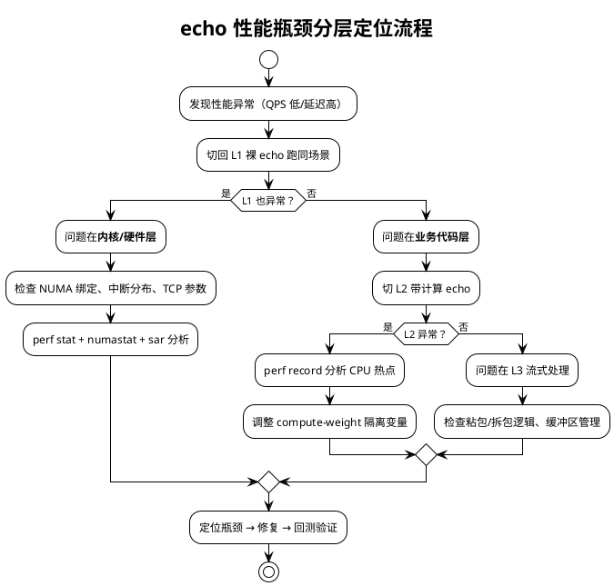

# echo — 性能分析指南

> ⚠️ **本文档是 v1.0 目标蓝图**：其中 L2/L3 分层定位与部分命令（`compute-server`/`stream-server`、`connection-bench`）依赖尚未实现的代码，阶段 1/2 实际可用的是 L1 裸 echo 相关命令。阅读时请结合当前进度理解，命令示例以各阶段实际运行结果为准。

> 本文档提供 echo 服务三层架构（L1/L2/L3）的性能分析方法和常用命令组合，覆盖 CPU 微架构、内存、网络和 NUMA 四大维度。基础用法见 [Day 1 README](/demos/echo/day-01/)。

## 分析框架：分层定位法

echo 的三层架构天然支持"分层定位"——当你看到性能异常时，逐层切换服务版本就能排除变量：



## 监控采集 SOP（Standard Operating Procedure，标准作业程序）

每次性能实验统一按以下步骤采集：

```bash
# 1. 启动监控（后台持续采集）
bash src/scripts/monitor-collect.sh 5

# 2. 启动服务（按需绑核）
numactl --cpunodebind=0 --membind=0 ./bin/compute-server --port 9090 --workers 4 &
SERVER_PID=$!

# 3. 运行压测
./bin/connection-bench --server 127.0.0.1 --port 9090 --conn 1000 --duration 30 --mode long

# 4. 采集 perf（与压测并行）
perf stat -e cycles,instructions,cache-misses,cache-references,branches,branch-misses \
    -p $SERVER_PID -- sleep 30

# 5. 采集 NUMA 统计
numastat -p $SERVER_PID

# 6. 停止监控
bash src/scripts/monitor-stop.sh
```

## 场景 1：连接数瓶颈分析

### 目标

定位"为什么连接数上不去"——是 FD 上限、内存不足，还是内核参数限制。

### 排查命令序列

```bash
# Step 1: 确认当前连接数
ss -tan state established | wc -l

# Step 2: 检查 FD 使用量（格式：已分配/未使用/上限）
cat /proc/sys/fs/file-nr
# 如果第一列接近第三列 → FD 打满

# Step 3: 检查进程 FD 上限
cat /proc/<pid>/limits | grep "open files"

# Step 4: 检查内存
free -h
cat /proc/meminfo | grep -E "Slab|KernelStack|PageTables"

# Step 5: 检查 TCP 内存限制
cat /proc/sys/net/ipv4/tcp_mem
# 三列：low / pressure / high（单位：页，4KB/page）

# Step 6: 诊断脚本一键输出
bash src/scripts/diag-tcp.sh
```

### 典型问题对照

| 现象 | 根因 | 修复 |
|------|------|------|
| 连接数卡在 1024 | `ulimit -n` 未生效 | `bash scripts/02-ulimit-setup.sh` + reboot |
| 连接数卡在几万 | `fs.file-max` 系统上限 | 增大 `fs.file-max` 和 `fs.nr_open` |
| 连接缓慢失败 + 内存高 | `tcp_mem` 触发 pressure | 增大 `tcp_mem` 或降低连接数 |
| accept() 返回 EMFILE | 进程级 FD 上限 | `ulimit -n 1048576` + systemd LimitNOFILE |

## 场景 2：延迟/吞吐瓶颈分析

### 目标

定位高延迟或低 QPS 的根因——是 CPU 瓶颈、NUMA 错配、还是软中断分布不均。

### 分层对比法（核心方法）

```bash
# 基线：L1 裸 echo，不做任何绑核
./bin/echo-server --port 9090 --workers 8 &
perf stat -e cycles,instructions,LLC-load-misses -p $! -- sleep 30
# 记录 IPC = instructions/cycles

# 实验 A：L1 + NUMA 绑核
numactl --cpunodebind=0 --membind=0 ./bin/echo-server --port 9091 --workers 4 &
perf stat -e cycles,instructions,LLC-load-misses -p $! -- sleep 30
# IPC 应上升，LLC-load-misses 应下降

# 实验 B：L2 + 同配置
numactl --cpunodebind=0 --membind=0 ./bin/compute-server --port 9092 --workers 4 --compute-weight 5000 &
perf stat -e cycles,instructions,LLC-load-misses -p $! -- sleep 30
# IPC 因业务计算可能变化，但 LLC miss 应与 A 接近

# 如果 B 的 LLC miss 明显高于 A → 业务代码有非预期的内存访问模式
```

### 关键指标解读

| 指标 | 正常范围 | 告警阈值 | 排查方向 |
|------|----------|----------|------|
| IPC | 1.5-3.5 | < 1.0 | `perf record` 分析热点，可能是大量 LLC miss 或分支预测失败 |
| LLC-load-misses | 按场景 | 相比基线 > 2x | NUMA 错配 / 内存随机访问 / cache 行失效 |
| %soft (si) | < 10% 每核 | 某核 > 80% | 中断绑定不均 / `scripts/04-nic-tuning.sh` 修复 |
| numa_miss/s | < 100 | > 1000 | 进程绑核错误 + `numastat -p <pid>` 确认 |

### perf record 热点分析

```bash
# 采样 30 秒，频率 99Hz
perf record -F 99 -g -p <pid> -- sleep 30
perf report --stdio | head -50

# 重点看：
# - 内核函数占比：tcp_sendmsg / tcp_recvmsg → 网络栈瓶颈
# - 内存拷贝占比：__memcpy / copy_user → 数据拷贝开销
# - 锁占比：__mutex_lock → 锁争抢
```

## 场景 3：软中断瓶颈分析

### 目标

判断网卡软中断是否成为瓶颈，以及是否均匀分布在多核上。

### 诊断命令

```bash
# 1. 各 CPU 软中断分布
mpstat -P ALL 1
# 重点关注 %soft 列

# 2. 软中断计数
cat /proc/softirqs | grep -E "NET_RX|NET_TX"
# 如果某 CPU 的计数远高于其他 → 中断绑定不均

# 3. 网卡中断分布
cat /proc/interrupts | grep eth0
# 如果多队列中断集中在同一 CPU → 需要重新绑定

# 4. 修复（将中断均匀绑到各 CPU）
bash src/scripts/04-nic-tuning.sh

# 5. 手工绑定（如需精确控制）
for i in $(seq 0 7); do
    irq=$(ls /sys/class/net/eth0/device/msi_irqs/ | sed -n "$((i+1))p")
    echo $i > /proc/irq/$irq/smp_affinity_list
done
```

### 软中断现象速查

| mpstat 现象 | 根因 | 影响 |
|-------------|------|------|
| CPU0 si > 80%, 其他核 si < 5% | 中断全部绑在 CPU0 | 单核软中断打满，QPS 上不去 |
| si 分布均匀但总 si 高 | PPS 接近网卡上限 | 需要扩容或减少发包 |
| si 分布均匀 + CPU 用户态低 | 中断处理效率正常 | 瓶颈可能是应用层处理速度 |

## 场景 4：NUMA 错配诊断

### 核心检查

```bash
# 1. 确认进程 NUMA 亲和
numastat -p <pid>
# 关注：numa_miss（本节点 CPU 访问远端内存次数）
#       numa_foreign（远端 CPU 访问本节点内存次数）

# 2. 确认 CPU 亲和
taskset -cp <pid>

# 3. 确认网卡中断绑定
cat /proc/interrupts | grep eth0 | head -8

# 4. 一键 NUMA 检查
bash src/scripts/numa-check.sh <pid>
```

### NUMA 错配判定表

| 检查项 | 正确 | 错误 | 影响 |
|--------|------|------|------|
| 进程 CPU → 内存节点 | 一致 | `numa_miss` 升高 | P99 延迟 ~1.5-2x |
| 中断绑核 → 服务所在 NUMA | 一致 | Node0 中断 + Node1 服务 | `%soft` 高 + 跨 NUMA 数据包 |
| `numa_balancing` | 0 | 1 | 周期性性能抖动 |

## 场景 5：短连接 TIME_WAIT/端口分析

```bash
# 1. 连接状态分布
ss -tan | awk '{print $1}' | sort | uniq -c | sort -rn

# 2. TIME_WAIT 数量
ss -tan state time-wait | wc -l

# 3. 端口使用情况
ss -s
cat /proc/net/sockstat

# 4. 队列溢出检查
netstat -s | grep -i "listen"
cat /proc/net/netstat | grep Listen

# 5. 如果 TW 数量过高
sysctl -w net.ipv4.tcp_tw_reuse=1
sysctl -w net.ipv4.tcp_fin_timeout=15

# 6. 如果出现 EADDRNOTAVAIL
sysctl net.ipv4.ip_local_port_range  # 确认端口范围
```

## 常用命令速查表

| 我想知道... | 命令 |
|-------------|------|
| 系统整体瓶颈 | `bash src/scripts/diag-tcp.sh` |
| CPU 微架构效率 | `perf stat -d -p <pid> -- sleep 30` |
| 函数级热点 | `perf record -F 99 -g -p <pid> -- sleep 30 && perf report` |
| NUMA 内存分布 | `numastat -p <pid>; bash src/scripts/numa-check.sh <pid>` |
| 软中断分布 | `mpstat -P ALL 1; cat /proc/softirqs` |
| 连接数 + FD | `ss -s; cat /proc/sys/fs/file-nr` |
| 内存详情 | `free -h; slabtop -o \| head -20` |
| 网络吞吐 | `sar -n DEV 1` |
| 上下文切换 | `pidstat -w -p <pid> 1` |
| TCP 计数器 | `cat /proc/net/snmp; cat /proc/net/netstat` |

> **一句话总结**：echo 性能分析的核心理念是"分层排除法"——先用 L1 裸 echo 排除业务噪音定位内核/硬件瓶颈，再用 L2 带计算 echo 引入 CPU 变量、L3 流式 echo 引入缓冲区变量，perf/numastat/sar 三件套覆盖 CPU+NUMA+网络三大维度，`diag-tcp.sh` 一键输出全量快照。
