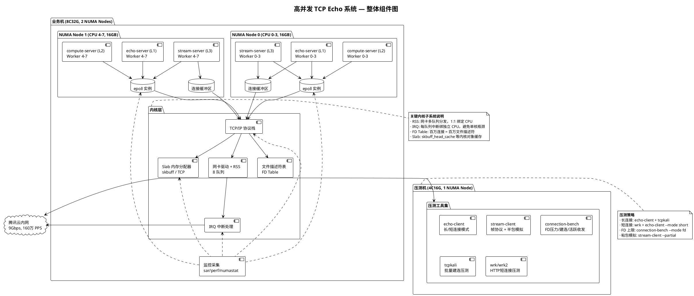
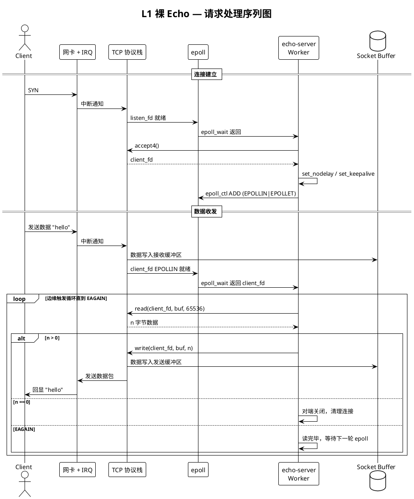
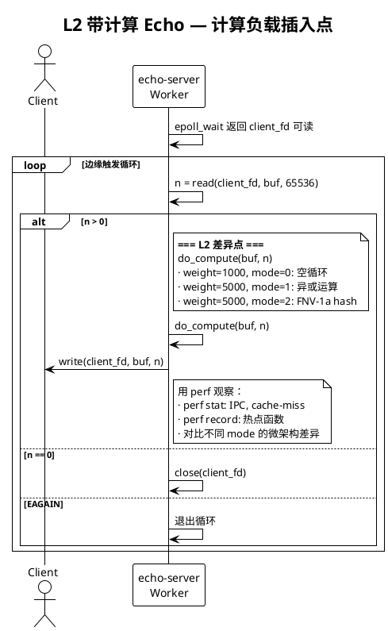
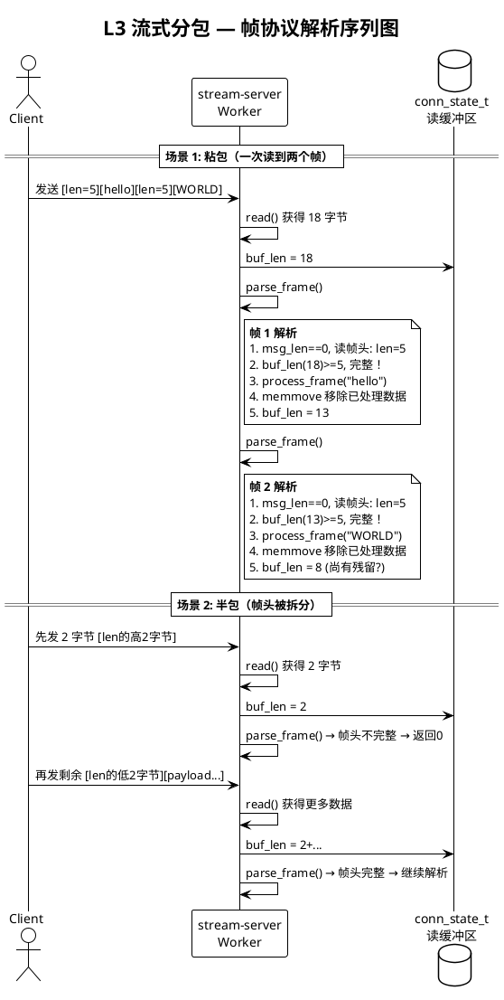
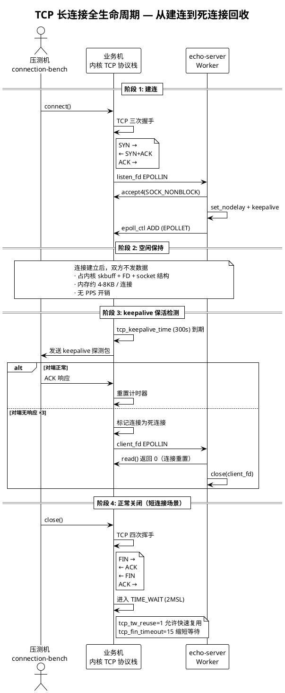

# 高并发 TCP Echo 系统架构设计

> ⚠️ **本文档是 v1.0 目标蓝图，描述的是**最终形态**（含 L2/L3 与完整 NUMA 部署），并非当前已实现的代码。**当前进度**：阶段 1/2 已完成，代码以 L1 裸 echo（多进程/multi-thread + epoll）为主，L2/L3 尚未编码。建议读到此处时带着"终点长什么样"的视角，具体实现细节以各阶段文档为准；阶段 8 完成后可回到本文对照复盘。

## 一、设计起点：从零开始构建的学习型系统

### 1.1 问题定义

本项目的核心命题是：**在一台 8 核 32GB 的云虚拟机上，稳定承载 100 万 TCP（Transmission Control Protocol，传输控制协议）并发长连接，并系统性掌握从应用层到内核层的全链路性能调优方法**。

这不是一个"能用就行"的业务项目，而是一个刻意设计的性能教学系统——它的价值不在于功能丰富，而在于它能让你**隔离变量、逐层逼近瓶颈、用数据验证直觉**。

### 1.2 核心设计约束

设计一套高性能 TCP 服务系统面临的核心矛盾是：**真实业务逻辑会引入噪音，混淆你对底层性能现象的判断**。

举一个具体的例子：如果你在 echo 服务中加入了 JSON 解析、磁盘读写或加密解密，当延迟从 100μs 上升到 300μs 时，你无法知道原因到底是：

- 内核 TCP 协议栈的某个参数配置不当？
- NUMA（Non-Uniform Memory Access，非一致性内存访问）跨节点内存访问？
- JSON 解析器的一次内存重分配？
- 磁盘 I/O（Input/Output，输入/输出）的页缓存抖动？

正是为了解决这一根本矛盾，我们引入了"三层递进"的代码架构设计。

### 1.3 三层递进架构的设计哲学

我们将整个系统设计为三个**相互独立但配置兼容**的服务层级：

| 层级 | 名称 | 核心逻辑 | 引入的变量 |
|------|------|----------|-----------|
| **L1** | 裸 echo 服务 | 接收字节 → 原样返回 | 无（只有系统调用和协议栈） |
| **L2** | 带计算的 echo 服务 | 接收字节 → 可调 CPU 运算 → 返回 | CPU 计算开销 |
| **L3** | 流式分包服务 | 接收字节流 → 帧协议拆包 → hash 返回 | 粘包/拆包/缓冲区管理 |

三层之间是**正交独立**的，你可以单独运行 L1 做连接数实验，也可以单独运行 L3 学习粘包处理。但它们共享同一套底层工具库（`common/socket_utils`），代码风格一致，参数风格一致。

这种设计让你始终拥有"干净的对照组"——当你在 L2 上看到性能指标变化时，立刻切回 L1 跑同场景实验，如果 L1 也变了那问题在内核/硬件层，如果只有 L2 变了那问题在业务代码。

---

## 二、整体组件架构

### 2.1 组件图

下图展示了完整的系统组件拓扑，包括两台 CVM（Cloud Virtual Machine，云虚拟机）的物理部署、进程模型、以及内核层的关键子系统。



### 2.2 组件说明

#### 业务机（8C32G）

业务机上运行三类 echo 服务，每种服务都采用**多进程模型**：主进程 `fork()` 出 N 个 Worker 进程，每个 Worker 拥有独立的 `epoll`（Linux 内核事件通知机制）实例。

在最终优化状态下（阶段 3 之后），8 个 Worker 进程被**均匀拆分到两个 NUMA 节点**——Node0 上 4 个进程绑定 CPU 0-3，Node1 上 4 个进程绑定 CPU 4-7。每个进程通过 `SO_REUSEPORT`（Socket 选项，允许端口复用）共享同一监听端口，内核自动将新连接哈希分配到不同 Worker。

#### 压测机（4C16G）

压测机独立部署，通过内网向业务机发起流量。工具矩阵覆盖了所有测试场景：

- **`echo-client`**：支持长连接（`--mode long`，建连后定时收发）和短连接（`--mode short`，每次请求独立的建连-收发-关闭周期）
- **`connection-bench`**：专注连接数压力测试，支持三种子模式：FD 上限测试（`--mode fd`，用 `socketpair` 占满描述符）、TCP 建连爬坡（逐步增加到目标连接数）、活跃收发（在已建连接上循环收发）
- **`tcpkali`**：第三方高性能建连工具，适合批量拉起百万连接
- **`wrk/wrk2`**：HTTP 短连接压测工具，用于 TIME_WAIT 相关实验

#### 网络层

两台机器部署在同一可用区，通过腾讯云内网互联。网络带宽上限为 9Gbps（吉比特每秒），整机 PPS（Packets Per Second，每秒数据包数）上限为 160 万。内网通信不产生流量费用。

对于 100 万长连接的空闲保持场景，数据包极少，160 万 PPS 远不是瓶颈。但当 100 万连接中 10 万条进入活跃收发状态时，PPS 可能达到数万至数十万，此时需要关注软中断分布。

---

## 三、进程与 IO 模型

### 3.1 多进程 + epoll + EPOLLET 模型

三个 echo 服务器都采用相同的 IO（Input/Output，输入/输出）模型：

```bash
主进程 fork() N 个子进程
  ├── 每个子进程独立创建 epoll 实例
  ├── 每个子进程监听同一端口（SO_REUSEPORT）
  ├── 每个子进程可选绑定到特定 CPU 核心
  └── 每个子进程独立运行事件循环
```

选择多进程而非多线程的原因：

1. **隔离性强**：进程崩溃不影响其他 Worker
2. **NUMA 亲和直观**：每个进程独立地址空间，`numactl --membind` 的效果清晰可见
3. **无需锁**：每个进程独立 epoll 和独立连接集合，不存在锁争抢
4. **学习价值**：`fork()` + CPU 亲和性 + NUMA 绑定是理解内核调度机制的绝佳案例

选择 `epoll` + `EPOLLET`（边缘触发模式）的原因：

- 边缘触发强制你**一次读完所有就绪数据**，不依赖内核帮你缓存事件状态
- 这在百万连接场景下尤为重要——如果一个连接的数据分多次才读完，在水平触发下会反复收到通知，浪费 CPU

### 3.2 事件循环的通用流程

```bash
┌─────────────────────────────────────────┐
│  Worker 事件循环                          │
│                                          │
│  epoll_wait() ← 阻塞等待事件              │
│       │                                  │
│       ├── listen_fd 就绪 → accept4()     │
│       │       │                          │
│       │       └── 设置 nodelay/keepalive │
│       │           加入 epoll (EPOLLET)    │
│       │                                  │
│       └── client_fd 就绪                 │
│              │                           │
│              ├── EPOLLIN → 循环 read()   │
│              │     直到 EAGAIN           │
│              │       │                   │
│              │       ├── L1: 直接 write  │
│              │       ├── L2: 先计算再写  │
│              │       └── L3: 装帧解析    │
│              │                           │
│              ├── read() 返回 0           │
│              │      → 对端关闭           │
│              │      → epoll_ctl DEL      │
│              │      → close()            │
│              │                           │
│              └── read() 返回 -1          │
│                     → 异常，断开连接      │
└─────────────────────────────────────────┘
```

---

## 四、三层服务的差异化设计

### 4.1 L1 — 裸 echo

L1 是最纯粹的形式，它只做一件事：**`read()` 多少字节，`write()` 多少字节**。没有任何额外的 CPU 运算、没有内存分配（除了栈上的临时缓冲区）、没有协议解析。

**设计意图**：L1 的所有性能波动都可以归因到内核/硬件层——系统调用开销、TCP 协议栈效率、中断分布、NUMA 延迟。它是后续所有对比实验的基线。



### 4.2 L2 — 带轻量计算的 echo

L2 在 L1 的收发路径中插入了一个可配置的计算步骤 `do_compute()`。这个步骤的关键特征是**参数化可控**：

- **`--compute-weight N`**：每次请求执行的计算循环次数，`N=0` 时退化为 L1，`N=5000` 时产生可观的 CPU 开销
- **`--compute-mode M`**：三类计算模式产生不同的 CPU 微架构特征
  - Mode 0：纯空循环（`asm volatile`），IPC 极高，适合观测纯算力瓶颈
  - Mode 1：异或运算，有数据依赖链，适合观测 IPC 和内存延迟
  - Mode 2：FNV-1a 哈希（Fowler-Noll-Vo-1a，一种非加密哈希算法），有分支，适合观测分支预测失败（branch misprediction）

**设计意图**：L2 模拟了真实的网关或消息服务——"接收一个请求 → 做一点简单计算 → 返回响应"。通过调节 `compute-weight` 和 `compute-mode`，你可以自如地在"网络瓶颈"和"CPU 瓶颈"之间切换，练习分层定位能力。



### 4.3 L3 — 流式分包 echo

L3 引入了**自定义帧协议**，这是从"玩具 echo"迈向"真实网络服务"的关键一步。帧格式为：

```bash
[4 字节大端序 payload 长度][payload 数据]
```

这带来了三个 L1/L2 完全不涉及的新问题：

1. **粘包**：一次 `read()` 可能读到多个帧的数据，需要循环解析直到缓冲区不足一个完整帧
2. **拆包/半包**：一个帧可能被 TCP 分多次传输，一次 `read()` 只读到帧头的一部分或 payload 的一部分
3. **缓冲区管理**：每个连接需要维护独立的应用层读缓冲区（`conn_state_t`），在 `realloc()` 和处理完已解析数据后的 `memmove()` 之间做平衡

L3 通过 `conn_state_t` 结构为每个连接维护完整状态：

```bash
conn_state_t:
  buf      → 动态增长的读缓冲区
  buf_len  → 当前已缓冲的字节数
  msg_len  → 正在解析的消息负载长度（0 = 等待帧头）
  buf_cap  → 缓冲区容量
```

`parse_frame()` 函数实现了一个**两阶段解析器**：阶段一等待 4 字节帧头、阶段二等待 `msg_len` 字节 payload。配合边缘触发下的循环读取，可以正确处理任意复杂的粘包/拆包组合。



---

## 五、NUMA 亲和性架构

### 5.1 NUMA 拓扑

业务机的 8 核 32GB 被虚拟化为两个 NUMA 节点：

```bash
NUMA Node 0: CPU 0-3 + 16GB 本地内存
NUMA Node 1: CPU 4-7 + 16GB 本地内存
```

### 5.2 最优配置下的 NUMA 绑定策略

在阶段 3 完成优化后，最终的目标拓扑如下：

```plantuml
@startuml component
!theme plain

title "最优 NUMA 绑定拓扑"

package "NUMA Node 0" as n0 {
    [CPU 0] as cpu0
    [CPU 1] as cpu1
    [CPU 2] as cpu2
    [CPU 3] as cpu3
    [网卡队列 0 IRQ] as irq0
    [网卡队列 1 IRQ] as irq1
    [网卡队列 2 IRQ] as irq2
    [网卡队列 3 IRQ] as irq3
    [Worker 0] as w0
    [Worker 1] as w1
    [Worker 2] as w2
    [Worker 3] as w3
}

package "NUMA Node 1" as n1 {
    [CPU 4] as cpu4
    [CPU 5] as cpu5
    [CPU 6] as cpu6
    [CPU 7] as cpu7
    [网卡队列 4 IRQ] as irq4
    [网卡队列 5 IRQ] as irq5
    [网卡队列 6 IRQ] as irq6
    [网卡队列 7 IRQ] as irq7
    [Worker 4] as w4
    [Worker 5] as w5
    [Worker 6] as w6
    [Worker 7] as w7
}

' 中断绑定
irq0 --> cpu0
irq1 --> cpu1
irq2 --> cpu2
irq3 --> cpu3
irq4 --> cpu4
irq5 --> cpu5
irq6 --> cpu6
irq7 --> cpu7

' Worker 绑定
w0 --> cpu0
w1 --> cpu1
w2 --> cpu2
w3 --> cpu3
w4 --> cpu4
w5 --> cpu5
w6 --> cpu6
w7 --> cpu7

note bottom of n0
  Node0 本地内存 16GB
  每个 Worker 的 skbuff 在本地 DMA
  0 跨 NUMA 访问
end note

note bottom of n1
  Node1 本地内存 16GB
  每个 Worker 的 skbuff 在本地 DMA
  0 跨 NUMA 访问
end note

note right of n1
  <b>关键原则</b>
  1. 网卡队列中断 ↔ CPU ↔ Worker 进程
     三者绑定在同一 NUMA 节点
  2. 数据包 DMA 到网卡所在 NUMA 的本地内存
  3. Worker 进程从本地内存读取数据
  4. 零跨 NUMA 内存访问
end note

@enduml
```



### 5.3 四种 NUMA 配置对比

| 场景 | CPU 绑定 | 内存绑定 | 中断绑定 | NUMA miss | 延迟 |
|------|---------|---------|---------|-----------|------|
| 无绑定（基线） | 无 | 无 | 默认 | 中等 | 中等，抖动大 |
| 同节点绑定 | Node0 | Node0 | Node0 | 接近 0 | 最低最稳 |
| 跨节点错配 | Node0 | Node1 | Node0 | **极高** | 1.5x-2x |
| IRQ 错配 | Node1 | Node1 | Node0 | 高 | 恶化 |
| 双节点拆分 | 各 4 | 各 4 | 各 4 | 接近 0 | 最低，吞吐翻倍 |

---

## 六、连接管理全生命周期

### 6.1 长连接完整生命周期



### 6.2 短连接特有的 TIME_WAIT 问题

短连接与长连接最大的区别在于**每次请求都是一次完整的建连→收发→关闭周期**。在每秒数千甚至上万次的短连接场景下，大量连接同时关闭会产生两个独有问题：

1. **TIME_WAIT 堆积**：每个主动关闭方进入 TIME_WAIT 状态持续 2 倍 MSL（Maximum Segment Lifetime，最大报文生存时间），默认 60 秒。大量 TIME_WAIT socket 占用内存和端口资源。
2. **端口耗尽**：客户端可用的临时端口范围有限（默认约 2.8 万个），短连接高频创建使端口快速耗尽，新 `connect()` 返回 `EADDRNOTAVAIL`（Cannot assign requested address）。

解决策略：`tcp_tw_reuse=1` 允许复用 TIME_WAIT 连接 + `ip_local_port_range=1024-65535` 扩大端口池 + `tcp_fin_timeout=15` 缩短等待时间。

---

## 七、内存架构

### 7.1 百万连接的内存分布

100 万 TCP 连接的内存开销来自多个内核子系统：

| 开销来源 | 单连接 | 100 万总计 | 观测方式 |
|----------|--------|-----------|----------|
| Socket 结构 | ~1.2KB | ~1.15GB | — |
| sk_buff（接收 + 发送） | ~2.3KB | ~2.2GB | `slabtop` → `skbuff_head_cache` |
| 文件描述符 | ~0.5KB | ~0.5GB | `cat /proc/sys/fs/file-nr` |
| 内核栈 | ~0.5KB | ~0.5GB | `cat /proc/meminfo \| grep KernelStack` |
| 页表 | ~0.5KB | ~0.5GB | `cat /proc/meminfo \| grep PageTables` |
| TCP 控制块 | ~1.5KB | ~1.4GB | `slabtop` → `TCP` |
| **总计** | **~6.5KB** | **~6.2GB** | `free -h` |

在 32GB 总内存下，100 万连接的内存开销约 6.2GB，剩余约 26GB 留给操作系统和其他进程，空间充裕。

### 7.2 Slab 分配器的行为观测

Linux 内核使用 Slab 分配器管理内核对象缓存。运行以下命令可以实时观察：

```bash
# 观察 TCP 相关 slab 缓存大小
slabtop -o | head -20

# 跟踪 TCP socket 数量对 slab 的影响
watch -n1 "cat /proc/slabinfo | grep -E 'TCP|sock|skbuff'"
```

关键观测指标：`skbuff_head_cache`（Socket Buffer 头缓存）和 `TCP` 缓存的 `active_objs` 应随连接数线性增长。如果增长速度超过预期，则可能存在连接泄漏。

---

## 八、监控与可观测性架构

### 8.1 监控矩阵

| 维度 | 工具 | 关键指标 | 采集频率 |
|------|------|----------|----------|
| CPU | `sar -u` / `mpstat -P ALL` | %usr, %sys, %soft, %idle | 每秒 |
| 网络 | `sar -n DEV` | rxpck/s, txpck/s（PPS） | 每秒 |
| 中断 | `sar -I ALL` / `cat /proc/interrupts` | 各 CPU 中断计数 | 每秒 |
| 内存 | `free -h` / `cat /proc/meminfo` | Slab, KernelStack, PageTables | 每 5 秒 |
| FD | `cat /proc/sys/fs/file-nr` | 已分配 / 未使用 / 上限 | 每 5 秒 |
| NUMA | `numastat -p <pid>` | numa_miss, numa_foreign | 每 5 秒 |
| TCP | `ss -s` / `ss -tan` | 各状态连接数 | 每 5 秒 |
| 微架构 | `perf stat -d` | IPC, cache-miss, branch-miss | 按需采样 |
| 内核对象 | `slabtop -o` | 各 slab 缓存使用量 | 按需 |

### 8.2 实验时的多终端布局建议

```bash
┌──────────────────┬──────────────────┐
│ 终端 1: 服务端    │ 终端 2: 客户端    │
│ ./echo-server    │ ./connection-bench│
│                  │                  │
├──────────────────┼──────────────────┤
│ 终端 3: 连接数    │ 终端 4: 内存      │
│ watch ss -tan    │ watch free -h    │
│       | wc -l    │ cat file-nr      │
├──────────────────┼──────────────────┤
│ 终端 5: CPU/中断  │ 终端 6: NUMA     │
│ mpstat -P ALL 1  │ watch numastat   │
│ sar -I ALL 1     │       -p <pid>   │
└──────────────────┴──────────────────┘
```

---

## 九、代码目录结构

```bash
src/
├── common/                     # 公共库（三层共享）
│   ├── socket_utils.h          # Socket API 封装、日志宏
│   └── socket_utils.c          # listen/connect/epoll/CPU绑定 实现
├── echo/                       # L1 裸 echo
│   ├── server.c                # 多进程 + epoll EPOLLET 边缘触发
│   └── client.c                # 长连接/短连接双模式客户端
├── compute/                    # L2 带计算 echo
│   └── server.c                # 继承 L1 + do_compute() 可调负载
├── stream/                     # L3 流式分包
│   ├── server.c                # conn_state_t + 粘包/拆包解析器
│   └── client.c                # 帧协议客户端，支持 --partial 半包
├── tools/                      # 压测与诊断
│   └── connection_bench.c      # FD 上限 / TCP 建连 / 活跃收发
├── scripts/                    # 系统调优脚本集
│   ├── 01-init-system.sh       # 系统初始化
│   ├── 02-ulimit-setup.sh      # 句柄上限
│   ├── 03-tcp-kernel-params.sh # TCP 内核参数
│   ├── 04-nic-tuning.sh        # 网卡 RSS + IRQ 绑定
│   ├── 05-numa-setup.sh        # NUMA 基础配置
│   ├── 06-restore-all.sh       # 一键恢复全部配置
│   ├── numa-bind-server.sh     # 单 NUMA 绑核启动服务
│   ├── numa-split-server.sh    # 双 NUMA 拆分启动服务
│   ├── numa-benchmark.sh       # NUMA 跑分对比
│   ├── numa-check.sh           # NUMA 状态一键检查
│   ├── monitor-collect.sh      # 启动监控采集
│   ├── monitor-stop.sh         # 停止监控采集
│   └── diag-tcp.sh             # TCP 一键诊断
├── Makefile                    # 统一构建规则
└── README.md                   # 代码使用说明
```

---

## 十、设计决策总结

| 决策 | 选择 | 理由 |
|------|------|------|
| 开发语言 | C（GCC，GNU Compiler Collection，GNU 编译器套装） | 零依赖，直接贴合 Linux 系统调用，perf 火焰图无语言运行时干扰 |
| 并发模型 | 多进程（fork）+ epoll | 隔离性强，NUMA 亲和直观，无锁 |
| IO 触发模式 | EPOLLET（边缘触发） | 强制一次读完，避免 epoll 事件风暴 |
| 连接分配 | SO_REUSEPORT | 内核级连接分发，每 Worker 独立 listen |
| 协议分层 | 三层独立服务（L1/L2/L3） | 变量隔离，按需使用，渐进式学习 |
| 应用层协议 | 自定义帧协议（4 字节长度头 + payload） | 简单可控，手动处理粘包/拆包 |
| 内存管理 | per-connection 动态缓冲区（L3） | 模拟真实服务的缓冲区管理 |
| 构建系统 | 纯 Makefile | 零外部构建依赖 |

---

## 十一、迭代方向（v0.1 → v1.0）

当前基础框架 v0.1 已经覆盖了核心的三层服务模型、完整的压测工具集和系统调优脚本。后续迭代方向包括：

1. **io_uring 版本**：用 Linux io_uring 替代 epoll，对比两种 IO 模型的性能差异
2. **内置延迟统计**：在服务端代码中嵌入 P50/P99/P999 延迟直方图
3. **EPOLLEXCLUSIVE**：解决多进程 `SO_REUSEPORT` 下的惊群效应
4. **多线程模型对比**：每线程独立 epoll 替代多进程，对比上下文切换开销
5. **零拷贝**：`sendfile()` / `splice()` 支持，减少用户态/内核态数据拷贝
6. **应用层协议抽象**：插件式协议层，可切换不同帧格式

> **一句话总结**：三层递进架构（裸 echo → 带计算 echo → 流式分包）通过变量隔离实现了"干净对照组"——多进程 + epoll EPOLLET + SO_REUSEPORT 的组合让每层独立可测，C 语言零依赖保证 perf 火焰图无噪音，自定义帧协议既教学了粘包/拆包又模拟了真实网关的内存管理模型。

